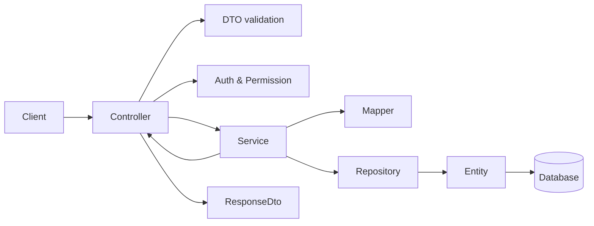

# NestJS Overall Architecture

## Objectives & Feature Module Directory Layout

Each feature module encapsulates HTTP APIs, data contracts, business rules, persistence logic, mapping profiles, and automated tests for a single bounded context.

```text
src/modules/<feature>/
├── <feature>.module.ts
├── controllers/
├── services/
│   └── _tests/
├── entities/
│   └── index.ts
├── dtos/
│   ├── requests/
│   │   └── index.ts
│   └── responses/
│       └── index.ts
├── profiles/
│   └── index.ts
├── enums/
│   └── index.ts
├── types/
│   └── index.ts
└── helpers/
    ├── _tests/
    └── index.ts
```

## Request Processing Flow



## Guidelines & Rules

- ✅ **Project Evidence & ORM Adaptation**: Identify existing ORM and persistence patterns before applying conventions. Only inspect `mikro-orm.md` and `mikro-orm-migration.md` when the project utilizes MikroORM; for TypeORM or alternative stacks, adhere to established project patterns.
- ✅ **Barrel Exports (`index.ts`)**: Every supporting subdirectory (`entities`, `enums`, `helpers`, `types`, `dtos/requests`, `dtos/responses`) MUST provide an `index.ts` re-exporting internal symbols. Cross-module imports must target directory barrels rather than deep individual files (e.g., `import { FeatureEntity } from '../entities'`).
- ✅ **Clean Separation of Concerns**: Controllers manage HTTP transport, routing, auth guards, and OpenAPI docs; Services encapsulate all business workflows; Entities enforce persistence schemas and database constraints.
- ✅ **Feature Implementation Order**:
  1. Define domain aggregate, entity relations, required permissions, and REST routes.
  2. Implement Entity definitions, database constraints, and indexes.
  3. Declare Enums and pure Helper functions if needed.
  4. Implement Request DTOs and Response DTOs.
  5. Implement AutoMapper Profiles.
  6. Implement Service business logic, error handling, and transaction boundaries.
  7. Implement Controllers with Auth/Permission decorators and Swagger metadata.
  8. Register module components and import into parent modules or `AppModule`.
  9. Author unit tests and verify linting, typechecking, and formatting.
- ❌ **Anti-Patterns to Avoid**:
  - Never access Repositories or `EntityManager` directly from Controllers.
  - Never return raw database Entities over HTTP responses (always map to Response DTOs).
  - Never create circular mapping references between DTOs.
  - Avoid hard deletion by default unless explicitly designed (prefer soft delete filters).
  - Never overwrite existing values with `undefined` during PATCH operations.
  - Never pass unsanitized sort query parameters directly into ORM queries without an allowlist.
