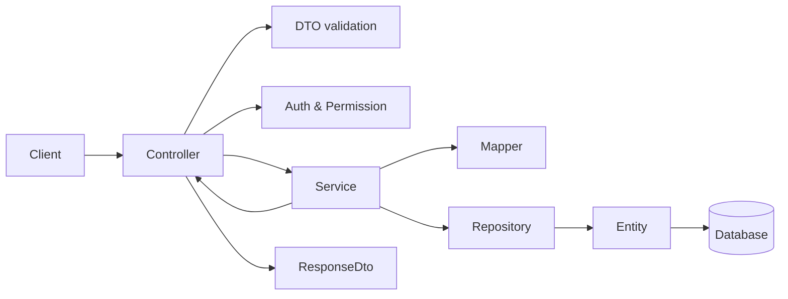

# Kiến trúc NestJS tổng quan

## Mục tiêu & Cấu trúc Feature Module

Mỗi feature module gom gọn HTTP API, contract, business rule, persistence, mapping và unit test của một bounded context.

```text
src/modules/<feature>/
├── <feature>.module.ts
├── controllers/
├── services/
│   └── _tests/
├── entities/
│   └── index.ts
├── dtos/
│   ├── requests/
│   │   └── index.ts
│   └── responses/
│       └── index.ts
├── profiles/
│   └── index.ts
├── enums/
│   └── index.ts
├── types/
│   └── index.ts
└── helpers/
    ├── _tests/
    └── index.ts
```

## Luồng xử lý Request



## Quy chuẩn thực thi (Guidelines & Rules)

- ✅ **Project evidence & ORM**: Xác định ORM và persistence convention hiện hữu trước khi áp dụng mẫu. Chỉ đọc/áp dụng `mikro-orm.md` và `mikro-orm-migration.md` khi project dùng MikroORM; với TypeORM hoặc stack khác, ưu tiên pattern đã có trong project.
- ✅ **Barrel Export (`index.ts`)**: Mỗi thư mục hỗ trợ (`entities`, `enums`, `helpers`, `types`/`interfaces`, `dtos/requests`, `dtos/responses`,...) BẮT BUỘC phải có file `index.ts` để re-export toàn bộ thành phần bên trong. Khi import từ các module/file khác, bắt buộc import từ folder thay vì import trực tiếp file lẻ (ví dụ: `import { FeatureEntity } from '../entities'`).
- ✅ **Phân tách trách nhiệm**: Controller chỉ xử lý HTTP/Auth/Swagger; Service chứa toàn bộ business rule; Entity phụ trách ORM mapping & constraints.
- ✅ **Thứ tự dựng feature**:
  1. Xác định aggregate, relation, permission và route design.
  2. Tạo Entity, DB constraints và indexes.
  3. Định nghĩa Enum/Helper nếu có.
  4. Tạo Request DTO và Response DTO.
  5. Tạo AutoMapper Profile.
  6. Viết Service logic và error handling.
  7. Tạo Controller, gắn Auth/Permission và Swagger annotations.
  8. Khai báo Module wiring và import vào parent module / AppModule.
  9. Viết unit test và kiểm tra lint/typecheck.
- ❌ **Anti-patterns cần tránh**:
  - Không gọi trực tiếp Repository/EntityManager từ Controller.
  - Không trả thô Entity qua HTTP response (bắt buộc map sang Response DTO).
  - Không tạo mapper tham chiếu vòng giữa DTOs.
  - Không hard delete mặc định (dùng soft delete nếu được cấu hình).
  - Không dùng `undefined` để ghi đè dữ liệu khi PATCH request.
  - Không truyền trực tiếp sort query parameter từ client vào ORM mà không qua allowlist.
