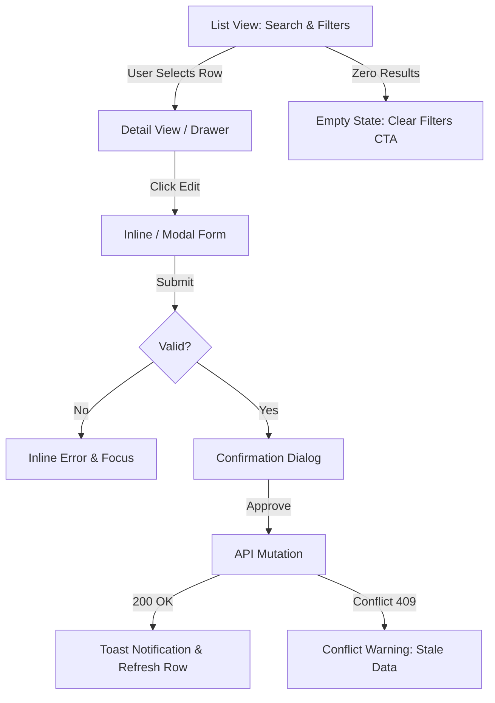
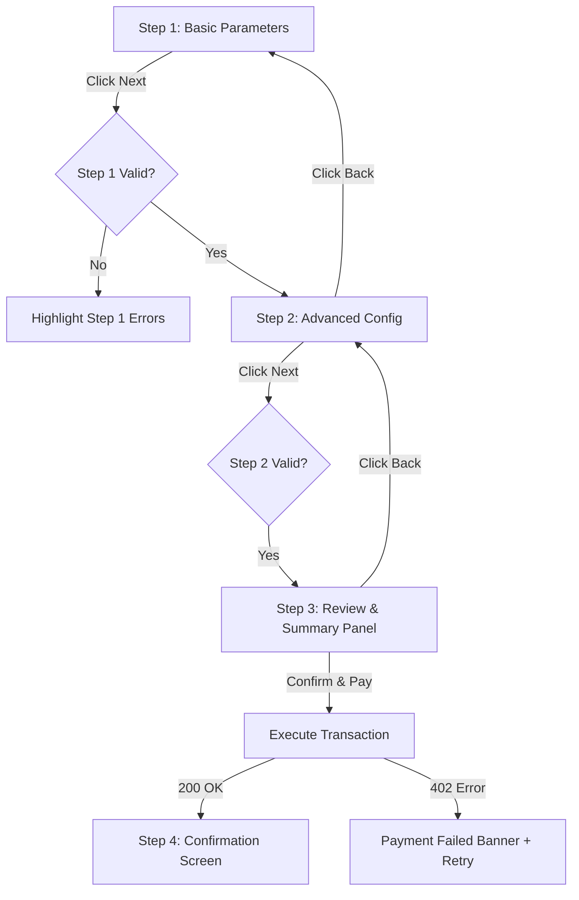
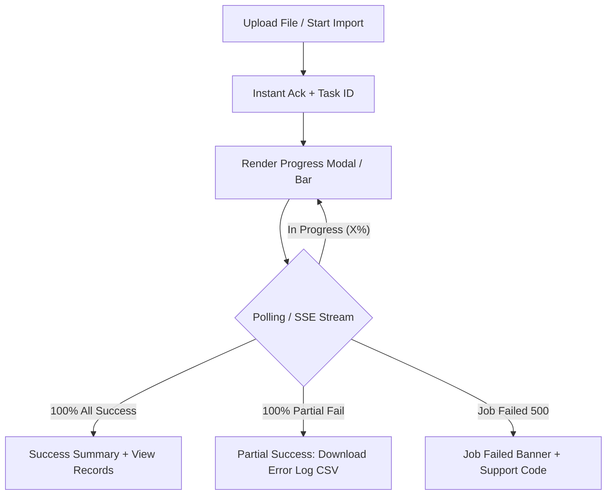
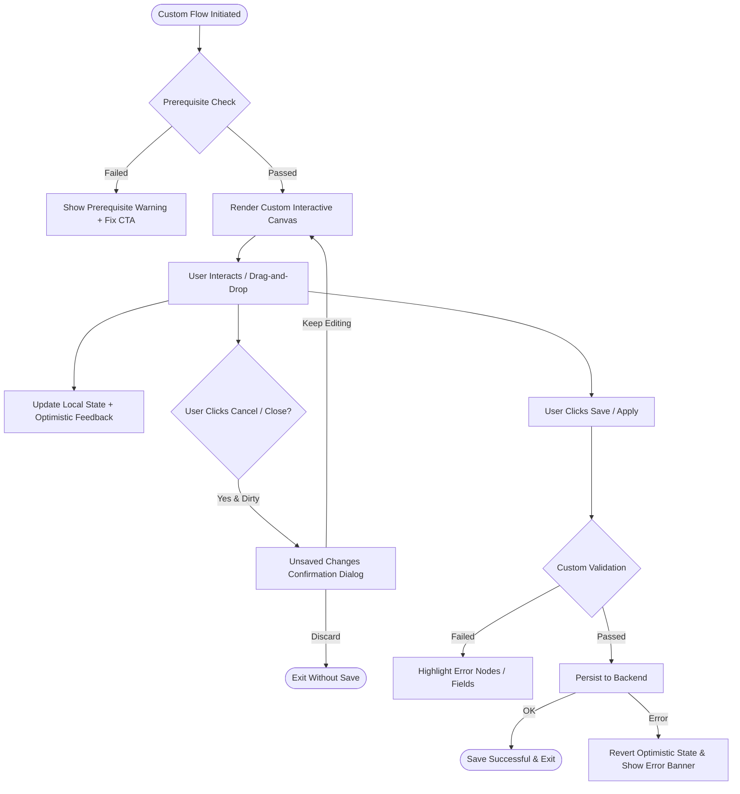

# UX Flow Designer & Standardized UI Flow Archetypes Skill

## Overview

Use this skill when designing user journeys, mapping UI interactions, creating Mermaid flowcharts, establishing wireframes, and enforcing strict UI/UX standards (`DESIGN.md`).

> [!CAUTION]
> **MANDATE: USE-CASE UI FLOW STANDARDIZATION**
> UX is not merely visual styling or loading indicators—it is the structural flow of user decisions. Agents MUST NOT invent ad-hoc, random UI steps. All feature flows MUST strictly adhere to established **UI Flow Archetypes** corresponding to the business use-case, complete with validation gates, navigation loops, and error handling.

---

## 5 Standardized UI Flow Archetypes (Mẫu Luồng Giao Diện Theo Use-Case)

### Archetype 1: Master-Detail & Data Management Flow (CRUD & Table Views)

Use for managing lists, entities, tables, and administrative records.

```text
[ List / Table View ] ---> (Click Row/Action) ---> [ Detail Drawer / Modal ]
       |                                                    |
       +--- (Search/Filter/Paginate)                        +---> (Edit Mode / Save)
       |                                                    |           |
       v                                                    v           v
[ Filtered Query Params ]                           [ Confirm Dialog ] [ Success Toast ]
```

#### Mandatory Flow Rules:
1. **URL State Synchronization:** Search keywords, filters, sort order, and page numbers MUST sync with URL Query Parameters (`?q=tech&page=2&status=active`) to allow deep-linking and browser back/forward navigation.
2. **List View:** Must feature search debouncing ($300\text{ms}$), active filter chips with a `"Clear All Filters"` button, and row count metrics.
3. **Detail View:** Prefer non-destructive Side Drawers or Modals for quick context inspection over full page redirects.
4. **Mutations:** Edits must require explicit Confirmation Dialogs for destructive actions (`Delete`, `Deactivate`), optimistic UI updates where appropriate, and instant Toast notifications.



---

### Archetype 2: Multi-Step Wizard & Stepper Flow (Complex Registration / Checkout / Setup)

Use for multi-step onboarding, checkout processes, or complex resource creation.

```text
[ Step 1: Basic Info ] ---> [ Step 2: Configuration ] ---> [ Step 3: Review & Pay ] ---> [ Step 4: Success ]
         ^                            ^                           ^
         | (Back Navigation)          | (Back Navigation)         | (Draft Auto-Saved)
```

#### Mandatory Flow Rules:
1. **Step Validation Gate:** Users CANNOT advance to Step $N+1$ without passing all validation checks for Step $N$.
2. **Backward Navigation Preservation:** Navigating back to previous steps MUST preserve all previously entered form data.
3. **Persistent Draft / Auto-Save:** For processes with $>3$ steps, state MUST auto-save to `localStorage` or backend draft entity to prevent data loss on page refresh.
4. **Summary & Review Step:** The final step before submission MUST display a consolidated summary of all choices made across previous steps.



---

### Archetype 3: Asynchronous Batch Job & Long-Running Operations

Use for CSV imports, PDF report generation, data migrations, or AI processing.

```text
[ Trigger Action / Upload ] ---> [ Immediate Ack + Task ID ] ---> [ Async Progress View ]
                                                                             |
                                     +---------------------------------------+
                                     |
                                     v
                        +--------------------------+
                        | Complete (100%)          |
                        | - Success Summary        |
                        | - Download Asset Link    |
                        | - Row Error Log Table    |
                        +--------------------------+
```

#### Mandatory Flow Rules:
1. **Immediate Acknowledgment:** The UI MUST respond instantly ($<200\text{ms}$) acknowledging request acceptance and providing a unique Job/Task ID.
2. **Progress Streaming / Polling:** Display a dynamic Progress Bar ($0\% \rightarrow 100\%$) powered by WebSockets, Server-Sent Events (SSE), or short polling ($2\text{s}$ interval).
3. **Partial Failure Table:** If batch processing encounters row-level errors (e.g. 95/100 records imported), the UI MUST render an Error Breakdown Table allowing users to download a CSV of failed rows with error reasons.



---

### Archetype 4: Instant Search, Filter & Facet Discovery Flow

Use for e-commerce catalog search, documentation discovery, and log viewers.

#### Mandatory Flow Rules:
1. **Debounced Search:** Input changes trigger API requests only after a $300\text{ms}$ debounce pause.
2. **Instant Search Overlay:** As user types, display an overlay dropdown showing quick suggestions and recent searches.
3. **Faceted Filtering:** Multi-select checkboxes (e.g. Categories, Price Range, Tags) must dynamically update counts next to unselected facets.

---

### Archetype 5: Authentication, Authorization & Session Recovery Flow

Use for login, sign-up, password reset, 2FA/MFA, and session timeouts.

#### Mandatory Flow Rules:
1. **Session Timeout Overlay:** When JWT/Session expires, present a Session Renewal Modal over current view preserving user work, rather than hard-redirecting and wiping local form state.
2. **2FA / MFA Flow:** Auto-advance input focus as user types digits into 6-digit verification code boxes.

---

## Fallback Protocol for Custom UI Flows (Khi Use-Case Không Thuộc Archetype Trực Tiếp)

If a feature is novel or custom (e.g., interactive canvas, drag-and-drop builder, real-time collaborative tool, custom audio/video controls) and does NOT fall directly into Archetypes 1–5, the Agent **MUST FOLLOW THIS 4-STEP PROTOCOL**:

### Step 1: First-Principles Flow Decomposition
Deconstruct the custom feature into 4 foundational components:
1. **Entry Point & Initial Context:** Where does the user come from and what is the starting UI state?
2. **Core Interaction Triggers:** What explicit user actions change state?
3. **Validation & State Gates:** What conditions must be met before allowing state transition?
4. **Terminal State & Exit:** How does the user save, cancel, or complete the custom flow?

### Step 2: Mandatory Mermaid Diagramming Before Code
The Agent **MUST** construct a Mermaid `flowchart TD` or `sequenceDiagram` mapping out **every single decision branch, error branch, and cancellation path** BEFORE generating UI code or mockups.



### Step 3: Non-Negotiable CoreUX Enforcement
Even custom UI flows MUST strictly abide by the 4 Core UX Foundations:
- **5-State Matrix:** Implement Idle, Loading Skeleton, Success, Error (with Retry CTA), and Empty State.
- **Anti-Double Submission:** Action buttons MUST enter loading + disabled state during async operations.
- **WCAG Accessibility:** Touch targets $\ge 44\times44\text{px}$, keyboard accessibility (`Tab`/`Esc`/`Enter`), focus management.
- **Design System Tokens (`DESIGN.md`):** 4px/8px spacing grid, contrast ratios $\ge 4.5:1$.

### Step 4: Proposal & Confirmation
Present the proposed custom flow diagram and ASCII wireframe to the user/reviewer for approval before starting code implementation.

---

## 5-State Component Matrix (Mandatory Enforcement)

EVERY component view MUST implement all 5 states:

| State | Visual & Behavior Rules |
| --- | --- |
| **1. Idle** | Default interactive view with accessible touch targets ($\ge 44\times 44\text{px}$). |
| **2. Loading** | **Skeleton Loaders** matching layout shape. Text `"Loading..."` or blank screens are BANNED. Submit buttons disabled (`isSubmitting=true`). |
| **3. Success** | Instant feedback via Toast, banner, or smooth transition. |
| **4. Error** | Human-readable error message + **Actionable Recovery Button** (e.g. `[ Retry ]`), NOT raw HTTP status codes. |
| **5. Empty** | Contextual illustration/icon, friendly explanation, and primary Action CTA (e.g. `[ Create Item ]`). |

---

## Design System Tokens (`DESIGN.md`)

1. **Spacing:** Strict 4px/8px base grid (`gap-2` = 8px, `gap-4` = 16px, `p-4` = 16px). Arbitrary pixel offsets (e.g. `mt-[13px]`) are BANNED.
2. **Contrast & Themes:** WCAG AA $\ge 4.5:1$ contrast ratio. Dark mode uses slate/gray surfaces (`#0F172A`, `#1E293B`) instead of pure black.
3. **Form Submissions:** Anti-double submission guard on all action buttons. Inline error messages attached via `aria-describedby`.
