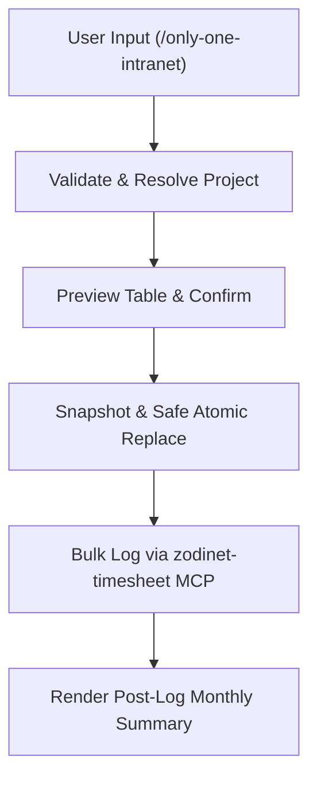

# Archive: Workflow and Skill `only-one-intranet` with `zodinet-timesheet` MCP

## 1. Problem & Core Value
- **Problem**: Lack of standardized automation for internal Intranet Timesheet logging via the `zodinet-timesheet` MCP server, requiring manual entry and lacking month-end summary reports.
- **Core Value**:
  - Implemented `/only-one-intranet` workflow and `only-one-intranet-skill`.
  - Added atomic safe replacement (snapshot existing entries, delete, bulk log, rollback on failure).
  - Automatically queries `get_my_timesheet_summary` to render post-log monthly summary metrics.

## 2. Key Architecture & Decisions
- **13-Step Skill Protocol**: Validate input $\rightarrow$ resolve project against `list_my_projects` $\rightarrow$ preview $\rightarrow$ safe snapshot & replace $\rightarrow$ bulk log $\rightarrow$ render post-log monthly payroll summary.
- **Weekend Auto-shift**: Automatically skips Saturday and Sunday, shifting tasks to Monday.
- **Inference & MCP Registry**: Automatically infers `zodinet-timesheet` MCP server when `only-one-intranet-skill` is selected.

## 3. Scope & Key Changes
- **Workflow & Skill Assets**:
  - [`assets/workflows/only-one-intranet.md`](file:///Users/kiem/Sources/Personal/only-one-cli/assets/workflows/only-one-intranet.md)
  - `assets/skills/only-one-intranet-skill/` (`SKILL.md`, `references/task-format.md`, `references/validation-rules.md`)
- **MCP & Combos Registry**:
  - [`assets/mcps/index.ts`](file:///Users/kiem/Sources/Personal/only-one-cli/assets/mcps/index.ts) registered `zodinet-timesheet` MCP server (`mcp-remote`).
  - [`assets/combos/index.ts`](file:///Users/kiem/Sources/Personal/only-one-cli/assets/combos/index.ts) added `git-intranet-flow`.
- **Core Templates & Command Generation**:
  - [`src/core/templates/agent-workflows.ts`](file:///Users/kiem/Sources/Personal/only-one-cli/src/core/templates/agent-workflows.ts) added Intranet command builders.
  - [`src/core/combo/index.ts`](file:///Users/kiem/Sources/Personal/only-one-cli/src/core/combo/index.ts) added MCP inference.

## 4. Verification Evidence
- **Unit Tests**: 180 passing tests (`test/core/agent-workflows.test.ts`).
- **Build & Format**: Clean build to `dist/` with Prettier formatting.
