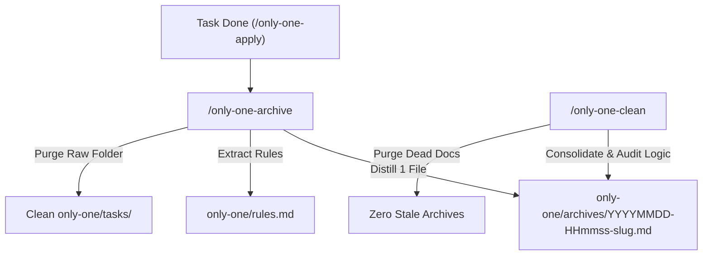

# Archive: Task Lifecycle Management, Archive Distillation & Maintenance Workflows

## 1. Problem & Core Value
- **Problem**: Completed task directories (`concept.md`, `plan.md`, `walkthrough.md`) accumulated inside `only-one/tasks/`, causing workspace clutter. Rules paths were scattered in nested folders, and there was no mechanism to distill lessons learned or audit/consolidate historical archives against ground-truth codebase logic.
- **Core Value**:
  - Implemented `/only-one-archive` to distill completed tasks into a single lightweight markdown file, update negative rules in `only-one/rules.md`, and clean up raw working task folders.
  - Implemented `/only-one-clean` to consolidate domain archives, conduct deep logic codebase verification (files, contracts, flows), and ruthlessly purge stale/dead documentation.
  - Unified negative constraints in a single root file `only-one/rules.md` and integrated 5 SDLC skills from `addyosmani/agent-skills`.

## 2. Key Architecture & Decisions
- **Distillation over Raw Folder Moving**: Archive stores only 1 synthesized markdown record per task; raw task directories in `only-one/tasks/` are safely purged.
- **Deep Logic Verification**: `/only-one-clean` groups by domain *first*, audits code logic *second*, and purges obsolete documents.
- **Single File Rules**: Root-level `only-one/rules.md` containing `[NEVER]` / `[AVOID]` / `[ALWAYS]` rules loaded at Step 1b across all workflows.

## 3. Scope & Key Changes
- **New Workflows**:
  - [`assets/workflows/only-one-archive.md`](file:///Users/kiem/Sources/Personal/only-one-cli/assets/workflows/only-one-archive.md)
  - [`assets/workflows/only-one-clean.md`](file:///Users/kiem/Sources/Personal/only-one-cli/assets/workflows/only-one-clean.md)
- **Manifest & Skills**:
  - [`assets/workflows/index.ts`](file:///Users/kiem/Sources/Personal/only-one-cli/assets/workflows/index.ts) updated with `only-one-archive` and `only-one-clean`.
- **Workflows Synchronized**:
  - Updated `only-one-idea.md`, `only-one-plan.md`, `only-one-apply.md`, `only-one-debug.md`, `only-one-pr-git.md`.
- **Rules File**:
  - Created [`only-one/rules.md`](file:///Users/kiem/Sources/Personal/only-one-cli/only-one/rules.md).
- **Unit Tests**:
  - [`test/commands/workflow.test.ts`](file:///Users/kiem/Sources/Personal/only-one-cli/test/commands/workflow.test.ts) updated and verified (190 passing tests).

## 4. Verification Evidence & PR
- **Unit Tests**: 100% Passed (`vitest run test/commands/workflow.test.ts`).
- **Build**: Passed with Prettier code style formatting (`npm run build`).
- **Package Published Locally**: `only-one@0.0.7` installed globally.
