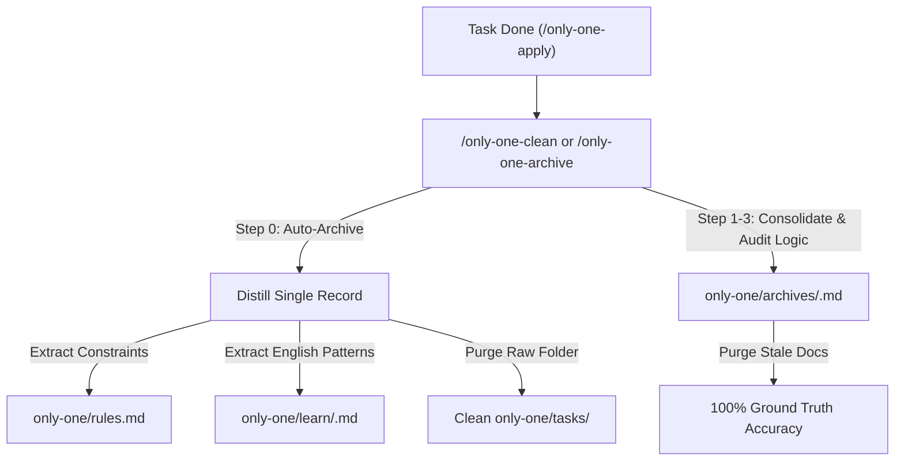

# Archive: Task Lifecycle Management, Auto-Archiving, Clean Verification & Thematic English Learning

## 1. Problem & Core Value
- **Problem**: Completed task directories (`concept.md`, `plan.md`, `walkthrough.md`) accumulated inside `only-one/tasks/`, causing workspace clutter. Rules were scattered, running clean bypassed pending completed tasks, and valuable technical English expressions were lost upon task deletion.
- **Core Value**:
  - Implemented `/only-one-archive` to distill completed tasks into a single lightweight markdown file, update negative constraints in `only-one/rules.md`, extract technical English patterns into `only-one/learn/`, and clean up raw working task folders.
  - Implemented `/only-one-clean` with **Step 0 — Pre-Clean Auto-Archive** to automatically detect and archive completed tasks before consolidating domain archives, auditing codebase logic, and purging stale records.
  - Established a 5-topic English learning system (`architecture-and-design`, `debugging-and-troubleshooting`, `code-review-and-refactoring`, `workflow-and-automation`, `general-engineering`) with Vietnamese explanations and real engineering examples.

## 2. Key Architecture & Decisions
- **Pre-Clean Auto-Archive (Step 0)**: `/only-one-clean` scans `only-one/tasks/*/plan.md` for `status: done` and runs auto-archiving prior to clean. Safely ignores in-progress and planned tasks.
- **Distillation over Raw Retention**: Distills completed tasks into a single concise record (< 100 lines) and safely purges `only-one/tasks/<slug>/`.
- **Integrated Learning Loop**: Automatically extracts 2–5 high-signal technical English structures per task, deduplicates, and appends them to thematic topics in `only-one/learn/`.
- **Centralized Negative Constraints**: Unified negative rules and anti-patterns maintained in a single root file `only-one/rules.md`, loaded at Step 1b across all workflows.
- **Deep Logic Verification**: `/only-one-clean` verifies active file paths, symbols, and behaviors against codebase ground truth before purging or consolidating.

## 3. Scope & Key Changes
- **Workflow Assets**:
  - [`assets/workflows/only-one-archive.md`](file:///Users/kiem/Sources/Personal/only-one-cli/assets/workflows/only-one-archive.md) & [`.agents/workflows/only-one-archive.md`](file:///Users/kiem/Sources/Personal/only-one-cli/.agents/workflows/only-one-archive.md)
  - [`assets/workflows/only-one-clean.md`](file:///Users/kiem/Sources/Personal/only-one-cli/assets/workflows/only-one-clean.md) & [`.agents/workflows/only-one-clean.md`](file:///Users/kiem/Sources/Personal/only-one-cli/.agents/workflows/only-one-clean.md)
- **Thematic Learning Topics**:
  - [`only-one/learn/architecture-and-design.md`](file:///Users/kiem/Sources/Personal/only-one-cli/only-one/learn/architecture-and-design.md)
  - [`only-one/learn/debugging-and-troubleshooting.md`](file:///Users/kiem/Sources/Personal/only-one-cli/only-one/learn/debugging-and-troubleshooting.md)
  - [`only-one/learn/code-review-and-refactoring.md`](file:///Users/kiem/Sources/Personal/only-one-cli/only-one/learn/code-review-and-refactoring.md)
  - [`only-one/learn/workflow-and-automation.md`](file:///Users/kiem/Sources/Personal/only-one-cli/only-one/learn/workflow-and-automation.md)
  - [`only-one/learn/general-engineering.md`](file:///Users/kiem/Sources/Personal/only-one-cli/only-one/learn/general-engineering.md)
- **Negative Constraints**:
  - [`only-one/rules.md`](file:///Users/kiem/Sources/Personal/only-one-cli/only-one/rules.md)
- **Unit & Integration Tests**:
  - [`test/commands/workflow.test.ts`](file:///Users/kiem/Sources/Personal/only-one-cli/test/commands/workflow.test.ts)

## 4. Verification Evidence
- **Unit Tests**: 100% Passed (190 passing tests across 47 test suites).
- **Build**: Clean build to `dist/` with Prettier code style validation.
