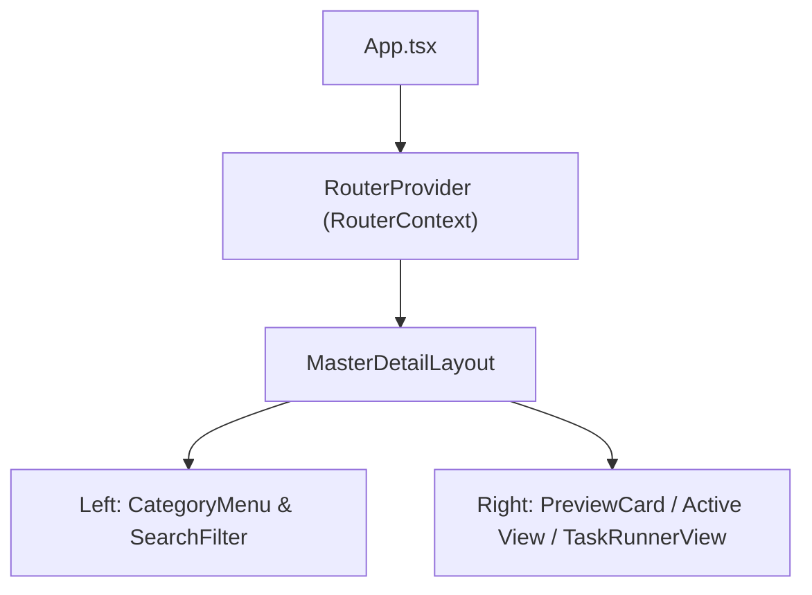

# Archive: Modernizing Only-One CLI Terminal User Interface (TUI)

## 1. Problem & Core Value
- **Problem**: The legacy TUI relied on a single-column layout with 13 un-categorized menu items, simulated mock delays instead of real actions, and suffered from input race conditions between nested `useInput` hooks.
- **Value**: Transformed the terminal interface into a modern 2-pane Master-Detail dashboard with categorized accordion menus, fuzzy searching, live task execution with streaming stdout logs, and deterministic focus routing.

## 2. Key Architecture & Decisions
- **Router & Focus Machine**: Centralized [RouterContext.tsx](file:///Users/kiem/Sources/Personal/only-one-cli/src/tui/router/RouterContext.tsx) manages history stack and pane focus (`sidebar` vs `content` vs `search`), preventing input collisions.
- **Master-Detail Layout**: [MasterDetailLayout.tsx](file:///Users/kiem/Sources/Personal/only-one-cli/src/tui/components/MasterDetailLayout.tsx) splits the screen (36% sidebar / 64% content) with responsive fallback.
- **Live Task Runner**: [TaskRunnerView.tsx](file:///Users/kiem/Sources/Personal/only-one-cli/src/tui/components/TaskRunnerView.tsx) provides animated execution feedback with real-time log buffers.

## 3. Scope & Key Changes
- **New Core Components**: [RouterContext.tsx](file:///Users/kiem/Sources/Personal/only-one-cli/src/tui/router/RouterContext.tsx), [routes.ts](file:///Users/kiem/Sources/Personal/only-one-cli/src/tui/router/routes.ts), [MasterDetailLayout.tsx](file:///Users/kiem/Sources/Personal/only-one-cli/src/tui/components/MasterDetailLayout.tsx), [HomeDashboardView.tsx](file:///Users/kiem/Sources/Personal/only-one-cli/src/tui/views/HomeDashboardView.tsx), [fuzzy.ts](file:///Users/kiem/Sources/Personal/only-one-cli/src/tui/utils/fuzzy.ts).
- **Refactored Views**: Re-wired all 11 subviews to real action runners.
- **Unit Tests**: Added [test/tui/router.test.ts](file:///Users/kiem/Sources/Personal/only-one-cli/test/tui/router.test.ts), [test/tui/fuzzy.test.ts](file:///Users/kiem/Sources/Personal/only-one-cli/test/tui/fuzzy.test.ts).

## 4. Verification Evidence & PR
- **Test Status**: 100% Passed (`npm test` and `npm run build`).
- **Branch**: `main`
