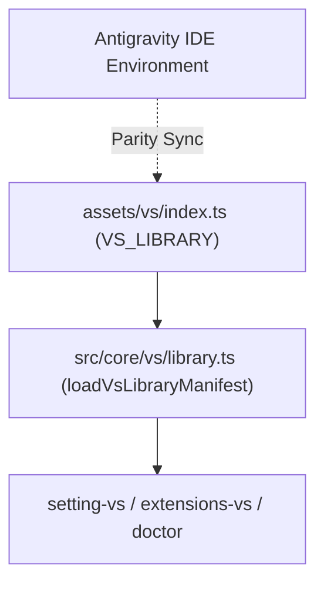

# Archive: Sync VS Asset Library with Antigravity IDE Configuration

## 1. Problem & Core Value
- **Problem**: `assets/vs/index.ts` stored outdated extensions and settings that had diverged from the production Antigravity IDE setup (e.g. Missing GitHub markdown preview & Mermaid, stale preview engines).
- **Value**: Achieved 100% parity between repository editor asset manifests and the active Antigravity IDE configuration, ensuring reliable and automated environment synchronization for developers.

## 2. Key Architecture & Decisions
- **Deterministic Alphabetical Sorting**: Extension identifiers in `VS_LIBRARY.extensions` are strictly alphabetized (A-Z) to prevent git diff thrashing across contributions.
- **Native Markdown Preview**: Aligned with `bierner.markdown-preview-github-styles` and `bierner.markdown-mermaid` utilizing native `vscode.markdown.preview.editor` associations.
- **Automated Manifest Integrity Tests**: Added automated unit tests verifying uniqueness, sorting, and normalization.

## 3. Scope & Key Changes
- **Updated Manifest**: [assets/vs/index.ts](file:///Users/kiem/Sources/Personal/only-one-cli/assets/vs/index.ts) (41 sorted extensions, 41 settings keys including `git.autofetch` and theme definitions).
- **New Unit Tests**: [test/core/vs/vs-library.test.ts](file:///Users/kiem/Sources/Personal/only-one-cli/test/core/vs/vs-library.test.ts).

## 4. Verification Evidence & PR
- **Test Status**: 100% Passed (50 test suites, 199 tests).
- **Build Status**: TypeScript build & prettier format checks passed.
- **Branch**: `main`
