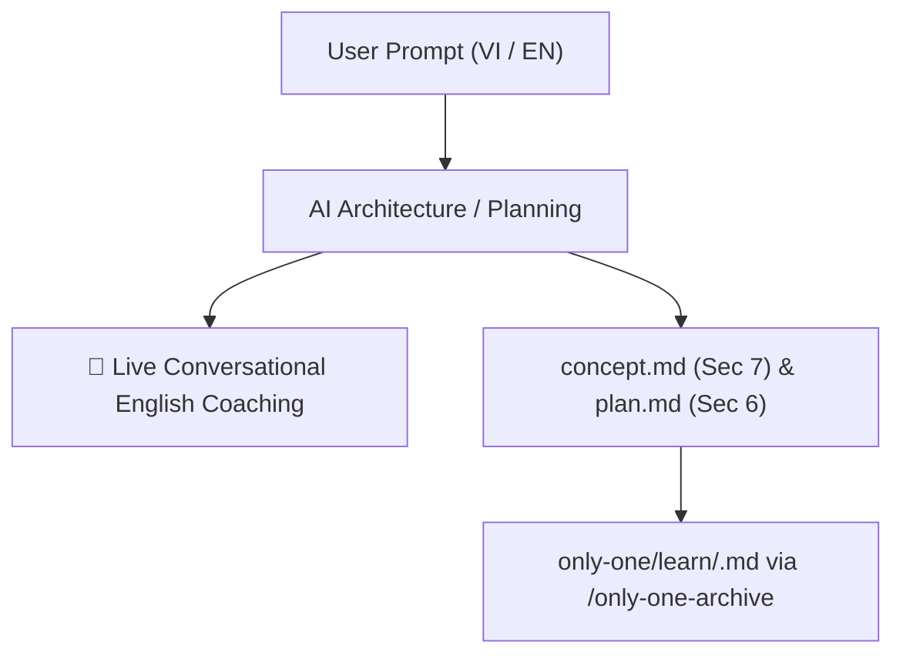

# Archive: Interactive Conversational English Coaching & Structured Workflow Pattern Sections

## 1. Problem & Core Value
- **Problem**: Technical English learning was confined solely to post-mortem task archiving (`/only-one-archive`), missing continuous learning opportunities during high-engagement ideation (`/only-one-idea`) and planning (`/only-one-plan`) conversations.
- **Value**: Integrated live conversational coaching into chat turns (rephrasing user inputs into natural technical English and explaining idioms) and standardized dedicated technical English pattern sections in `concept.md` (Section 7) and `plan.md` (Section 6).

## 2. Key Architecture & Decisions
- **Dual-Track Approach**:
  - **Conversational Track**: Assistant includes a footer callout `💬 English Expression Coaching` on interactive turns.
  - **Artifact Track**: `concept.md` captures architectural scoping patterns; `plan.md` captures invariant, contract, and execution patterns.
- **Synchronized Workflow Mirrors**: Updated both `assets/workflows/` (distribution templates) and `.agents/workflows/` (active IDE runtime).

## 3. Scope & Key Changes
- **Idea Workflow**: [assets/workflows/only-one-idea.md](file:///Users/kiem/Sources/Personal/only-one-cli/assets/workflows/only-one-idea.md) & [`.agents/workflows/only-one-idea.md`](file:///Users/kiem/Sources/Personal/only-one-cli/.agents/workflows/only-one-idea.md).
- **Plan Workflow**: [assets/workflows/only-one-plan.md](file:///Users/kiem/Sources/Personal/only-one-cli/assets/workflows/only-one-plan.md) & [`.agents/workflows/only-one-plan.md`](file:///Users/kiem/Sources/Personal/only-one-cli/.agents/workflows/only-one-plan.md).
- **Automated Tests**: [test/commands/workflow.test.ts](file:///Users/kiem/Sources/Personal/only-one-cli/test/commands/workflow.test.ts).

## 4. Verification Evidence & PR
- **Test Status**: 100% Passed (50 test suites, 200 tests).
- **Build Status**: `prettier --check` and `tsc` TypeScript compilation passed.
- **Branch**: `main`
