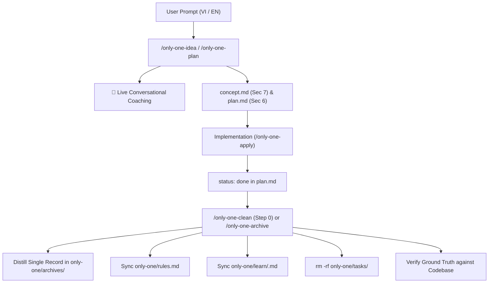

# Archive: Task Lifecycle Management, Auto-Archiving, Clean Verification & Thematic English Learning

## 1. Problem & Core Value
- **Problem**: Raw task artifacts (`concept.md`, `plan.md`, `walkthrough.md`) accumulated inside `only-one/tasks/`, cluttering the workspace. In addition, valuable architectural constraints and technical English expressions were either lost upon task deletion or confined strictly to post-mortem archives without live conversational practice.
- **Core Value**:
  - **Task Lifecycle Automation**: Standardized `/only-one-archive` to distill completed tasks into single lightweight records (< 100 lines), sync negative rules in `only-one/rules.md`, extract technical English patterns into `only-one/learn/`, and safely purge raw working task folders.
  - **Step 0 Pre-Clean Auto-Archive**: Empowered `/only-one-clean` to detect completed tasks (`status: done`) and archive them before consolidating domain records and verifying codebase ground truth.
  - **Dual-Track English Learning**: Combined live conversational coaching callouts (`💬 English Expression Coaching`) during interactive turns with structured pattern capture in `concept.md` (Section 7), `plan.md` (Section 6), and 5 thematic topics in `only-one/learn/`.

## 2. Key Architecture & Decisions
- **Distillation over Raw Retention**: Distills completed tasks into a single record and purges `only-one/tasks/<slug>/`.
- **Pre-Clean Auto-Archive (Step 0)**: `/only-one-clean` automatically triggers archiving for completed tasks while safely preserving `status: in-progress` or `status: planned` tasks.
- **Centralized Negative Constraints**: Unified negative rules and anti-patterns maintained in `only-one/rules.md`, loaded at Step 1b across all workflows.
- **Dual-Track English Learning Protocol**:
  - *Conversational Track*: AI provides inline coaching callouts rephrasing user inputs into natural technical English and explaining idioms.
  - *Thematic Repository Track*: High-signal patterns are classified into 5 core topics (`architecture-and-design`, `debugging-and-troubleshooting`, `code-review-and-refactoring`, `workflow-and-automation`, `general-engineering`) with Vietnamese explanations and production examples.
- **Ground Truth Verification**: Periodic clean runs verify file paths, symbols, and behaviors against the active codebase.

## 3. Scope & Key Changes
- **Workflow Assets & Mirrors**:
  - `assets/workflows/only-one-archive.md` & `.agents/workflows/only-one-archive.md`
  - `assets/workflows/only-one-clean.md` & `.agents/workflows/only-one-clean.md`
  - `assets/workflows/only-one-idea.md` & `.agents/workflows/only-one-idea.md`
  - `assets/workflows/only-one-plan.md` & `.agents/workflows/only-one-plan.md`
- **Thematic Learning Knowledge Base**:
  - `only-one/learn/architecture-and-design.md`
  - `only-one/learn/debugging-and-troubleshooting.md`
  - `only-one/learn/code-review-and-refactoring.md`
  - `only-one/learn/workflow-and-automation.md`
  - `only-one/learn/general-engineering.md`
- **Centralized Negative Rules**:
  - `only-one/rules.md`
- **Unit & Integration Tests**:
  - `test/commands/workflow.test.ts`

## 4. Verification Evidence & PR
- **Unit Tests**: 100% Passed (50 test suites, 200 passing tests).
- **Build & Quality**: TypeScript compilation (`tsc`) and formatting (`prettier`) verified clean.
