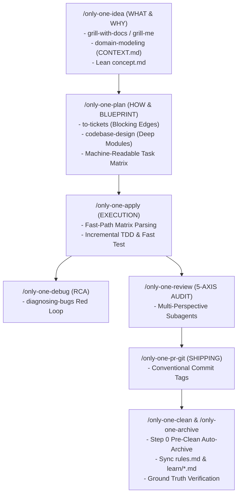

# Archive: Unified Architecture of Workflows, Skills Catalog, Dual-Layer Blueprints & Task Lifecycle

## 1. Problem & Core Value
- **Problem**: 
  - Workflow and skill definitions were fragmented, with duplicate steps (e.g. `/only-one-idea` performing heavy code tracing belonging to `/only-one-plan`), missing dependency blocking edges, unaligned skill manifests, and monolingual english friction for human developers.
  - Raw task artifacts (`concept.md`, `plan.md`, `walkthrough.md`) cluttered `only-one/tasks/` without automated consolidation or persistent learning extraction.
- **Core Value**:
  - **Tiered 5-Phase Skills Model**: Organized 29 skills across Define, Plan, Build, Verify/Debug, and Review/Ship phases, registering targeted Matt Pocock & Addy Osmani skills.
  - **Lean WHAT vs HOW Separation**: Streamlined `/only-one-idea` to 2 steps (Focus strictly on WHAT & WHY, Root Need, In/Out Scope, and `CONTEXT.md` / ADRs) while delegating deep codebase tracing and architecture to `/only-one-plan`.
  - **Dual-Layer Architecture**: Formatted documents with a human-friendly narrative layer (Bilingual Hybrid) and a machine-readable execution layer (**Section 3.1 Machine-Readable Task Matrix** with `Order`, `Status`, `Action`, `File Path`, `Target Symbols`, `Depends On`, `Fast Test Command`).
  - **Task Lifecycle & Thematic Learning**: Automated Pre-Clean auto-archiving (Step 0) in `/only-one-clean`, centralized negative constraints in `only-one/rules.md`, and categorized technical English patterns into 5 `only-one/learn/*.md` topics.

## 2. Key Architecture & Decisions
- **5-Phase Skills Classification**:
  1. *Define & Discovery*: `grill-with-docs`, `grill-me`, `interview-me`, `idea-refine`, `domain-modeling`, `wait-what`.
  2. *Plan & Architecture*: `to-tickets`, `codebase-design`, `api-and-interface-design`, `doubt-driven-development`, `c4-diagrams`, `gherkin-authoring`.
  3. *Build & Execute*: `incremental-implementation`, `test-driven-development`, `context-engineering`.
  4. *Verify & Debug*: `diagnosing-bugs`, `resolving-merge-conflicts`, `handoff`.
  5. *Review & Ship*: `code-review-and-quality`, `code-simplification`, `security-and-hardening`, `performance-optimization`, `only-one-pr-git-skill`, `only-one-clockify-skill`, `only-one-intranet-skill`.
- **Machine-Readable Task Matrix Contract**:
  - Every `plan.md` outputs a strict task matrix table in Section 3 allowing agents to parse implementation steps in milliseconds and execute fast-test commands sequentially.
- **Continuous Manifest Parity**:
  - Maintained 100% parity across `assets/skills/index.ts`, `assets/workflows/index.ts`, and `.agents/workflows/*.md`.

## 3. Scope & Key Changes
- **Skills Registry & Manifests**:
  - [`assets/skills/index.ts`](file:///Users/kiem/Sources/Personal/only-one-cli/assets/skills/index.ts): Registered 29 skills with strict typing and remote GitHub / local sources.
- **Workflow Protocols & Dual-Layer Definitions**:
  - [`assets/workflows/`](file:///Users/kiem/Sources/Personal/only-one-cli/assets/workflows) & [`.agents/workflows/`](file:///Users/kiem/Sources/Personal/only-one-cli/.agents/workflows): 12 standardized workflow protocols.
  - Expanded PR Git tags to full Conventional Commits suite (`feat`, `fix`, `refactor`, `style`, `chore`, `docs`, `test`, `perf`, `ci`, `build`) in [`src/core/templates/agent-workflows.ts`](file:///Users/kiem/Sources/Personal/only-one-cli/src/core/templates/agent-workflows.ts).
- **Knowledge Systems & Repository Memory**:
  - [`only-one/rules.md`](file:///Users/kiem/Sources/Personal/only-one-cli/only-one/rules.md): Centralized negative constraints.
  - [`only-one/learn/`](file:///Users/kiem/Sources/Personal/only-one-cli/only-one/learn): 5 thematic English learning knowledge files.

## 4. Verification Evidence & PR
- **Test Suites**: 50 test suites passed, 100% test pass rate (`test/core/skill-registry.test.ts`, `test/core/workflow-registry.test.ts`, `test/core/agent-workflows.test.ts`).
- **Compilation & Formatting**: Prettier checks and TypeScript build pass with 0 errors.
