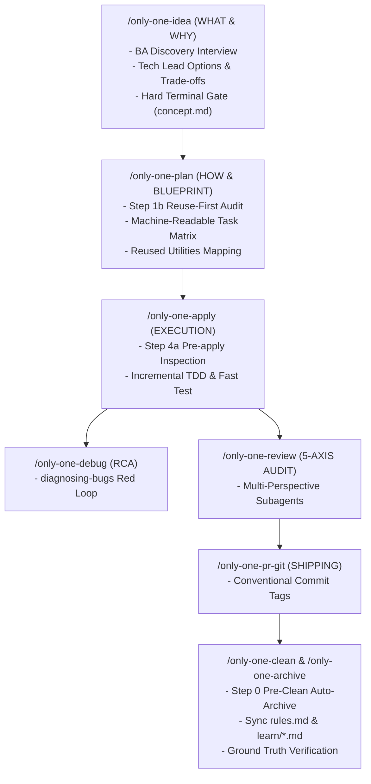

# Archive: Unified Architecture of Workflows, Skills Catalog, Dual-Layer Blueprints, Reuse Guardrails & Task Lifecycle

## 1. Problem & Core Value
- **Problem**: 
  - Workflow and skill definitions previously suffered from duplicate steps, unaligned skill manifests, monolingual English friction, and a lack of anti-reinvention guardrails leading agents to generate duplicate helpers/utilities instead of reusing existing project abstractions.
  - Agents previously had a tendency to skip lifecycle boundaries (e.g. modifying project source code prematurely during `/only-one-idea`).
- **Core Value**:
  - **Tiered 5-Phase Skills Model**: Organized skills across Define, Plan, Build, Verify/Debug, and Review/Ship phases, registering targeted Matt Pocock & Addy Osmani skills.
  - **3-Phase Collaboration & Lifecycle Isolation in `/only-one-idea`**: Structured `/only-one-idea` as **Senior BA** (Discovery & Clarification via 1-question interview) $\rightarrow$ **Technical Lead** (2–3 Options with Trade-off Comparison & ASCII UI Mockups) $\rightarrow$ **Project Manager / PO** (Consensus & Decision Gate), enforcing a hard stop before code modification.
  - **3-Layer Defense-in-Depth for Code Reuse**:
    1. *Skills Layer (`only-one-nestjs-development`, `only-one-nextjs-development`)*: Enforced `0. Mandatory Reuse-First Invariant` requiring active scans of shared folders (`src/utils`, `src/helpers`, `src/hooks`, `src/common`, `src/components`) and forbidding duplicate utility creation.
    2. *Planning Layer (`only-one-plan.md`)*: Enforced `Step 1b: Mandatory Reuse-First Audit` and standardizing Section 3.1 Task Matrix with a dedicated `Reused Existing Utilities / Helpers` column.
    3. *Execution Layer (`only-one-apply.md`)*: Enforced `Step 4a: Pre-apply Context & Existing Imports Inspection` before modifying target files.
  - **Dual-Layer Architecture**: Formatted documents with a human-friendly narrative layer (Bilingual Hybrid) and a machine-readable execution layer (**Section 3.1 Machine-Readable Task Matrix** with `Order`, `Status`, `Action`, `File Path`, `Target Symbols`, `Depends On`, `Fast Test Command`).
  - **Task Lifecycle & Thematic Learning**: Automated Pre-Clean auto-archiving (Step 0) in `/only-one-clean`, centralized negative constraints in `only-one/rules.md`, and categorized technical English patterns into `only-one/learn/*.md` topics.

## 2. Key Architecture & Decisions
- **5-Phase Skills Classification**:
  1. *Define & Discovery*: `grill-with-docs`, `grill-me`, `interview-me`, `idea-refine`, `domain-modeling`, `wait-what`.
  2. *Plan & Architecture*: `to-tickets`, `codebase-design`, `api-and-interface-design`, `doubt-driven-development`, `c4-diagrams`, `gherkin-authoring`.
  3. *Build & Execute*: `incremental-implementation`, `test-driven-development`, `context-engineering`.
  4. *Verify & Debug*: `diagnosing-bugs`, `resolving-merge-conflicts`, `handoff`.
  5. *Review & Ship*: `code-review-and-quality`, `code-simplification`, `security-and-hardening`, `performance-optimization`, `only-one-pr-git-skill`, `only-one-clockify-skill`, `only-one-intranet-skill`.
- **Machine-Readable Task Matrix Contract**:
  - Every `plan.md` outputs a strict task matrix table in Section 3 allowing agents to parse implementation steps in milliseconds and execute fast-test commands sequentially.
- **Continuous Manifest Parity**:
  - Maintained 100% parity across `assets/skills/index.ts`, `assets/workflows/index.ts`, and `.agents/workflows/*.md`.

## 3. Scope & Key Changes
- **Skills Registry & Manifests**:
  - [`assets/skills/index.ts`](file:///Users/kiem/Sources/Personal/only-one-cli/assets/skills/index.ts): Registered 29 skills with strict typing and remote GitHub / local sources.
  - [`assets/skills/only-one-nestjs-development/SKILL.md`](file:///Users/kiem/Sources/Personal/only-one-cli/assets/skills/only-one-nestjs-development/SKILL.md) & [`assets/skills/only-one-nextjs-development/SKILL.md`](file:///Users/kiem/Sources/Personal/only-one-cli/assets/skills/only-one-nextjs-development/SKILL.md): Added Section 0 Reuse-First Invariant.
- **Workflow Protocols & Dual-Layer Definitions**:
  - [`assets/workflows/`](file:///Users/kiem/Sources/Personal/only-one-cli/assets/workflows) & [`.agents/workflows/`](file:///Users/kiem/Sources/Personal/only-one-cli/.agents/workflows): 12 standardized workflow protocols including `/only-one-idea`, `/only-one-plan`, `/only-one-apply`.
  - Expanded PR Git tags to full Conventional Commits suite (`feat`, `fix`, `refactor`, `style`, `chore`, `docs`, `test`, `perf`, `ci`, `build`) in [`src/core/templates/agent-workflows.ts`](file:///Users/kiem/Sources/Personal/only-one-cli/src/core/templates/agent-workflows.ts).
- **Knowledge Systems & Repository Memory**:
  - [`only-one/rules.md`](file:///Users/kiem/Sources/Personal/only-one-cli/only-one/rules.md): Centralized negative constraints.
  - [`only-one/learn/`](file:///Users/kiem/Sources/Personal/only-one-cli/only-one/learn): 5 thematic English learning knowledge files.

## 4. Verification Evidence
- **Test Suites**: 50 test suites passed, 201 tests passed (100% pass rate).
- **TypeScript & Linter**: Clean compilation and formatting with 0 errors.
