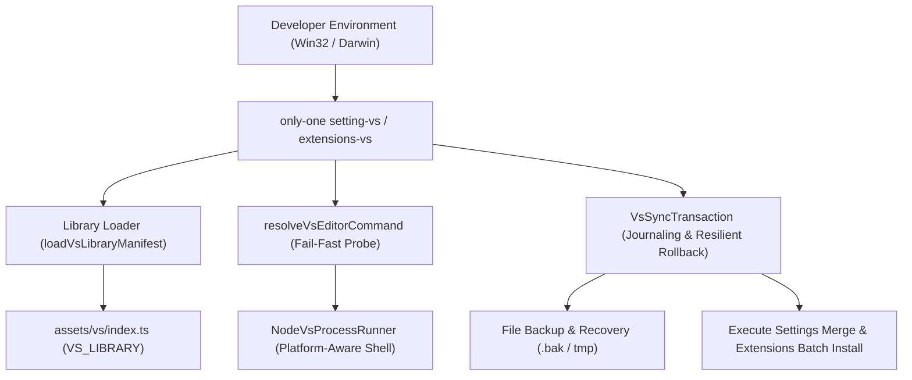

# Archive: Unified Architecture of VS Editor Configurations, Asset Libraries, Multi-Platform Process Runners & Resilient Transactions

## 1. Problem & Core Value (Bài toán & Giá trị Cốt lõi)
- **Vấn đề (Problem)**:
  1. Thiếu tính đồng nhất giữa cấu hình asset library (`assets/vs/index.ts`) và môi trường Antigravity IDE thực tế.
  2. Lỗi crash `spawn ENOENT` trên Windows khi thực thi các lệnh CLI của editor dạng `.cmd`/`.bat` (như `antigravity-ide.cmd`, `code.cmd`, `cursor.cmd`).
  3. Lỗi rollback transaction bị đứt gãy và che giấu lỗi cài đặt gốc (*Error Masking*) khi gặp các extension độc quyền không tồn tại trên Marketplace.
- **Giá trị Cốt lõi (Core Value)**:
  - Đạt được sự đồng bộ hoàn hảo (100% parity) giữa cấu hình editor chuẩn và các môi trường IDE (Antigravity IDE, VS Code, Cursor).
  - Đảm bảo khả năng thực thi độc lập nền tảng (*Platform-Agnostic Process Spawning*) trên cả Windows và macOS/Linux.
  - Quản lý đồng bộ có tính giao dịch (*Transactional Integrity*) với cơ chế rollback kiên cường (*Resilient Rollback*) và tự phục hồi an toàn (*Crash Recovery*).

## 2. Key Architecture & Decisions (Kiến trúc & Quyết định Then chốt)

### 2.1. Cấu trúc Đồng bộ 3 Tầng (Three-Tier Synchronization Architecture)

### 2.2. Các Quyết định Kỹ thuật Chính
1. **Deterministic Alphabetical Sorting**: Danh mục extension trong `VS_LIBRARY.extensions` được sắp xếp thứ tự A-Z và loại bỏ các extension độc quyền không cài đặt được qua Marketplace (như `anysphere.cursorpyright`).
2. **Platform-Aware Shell Execution**: `NodeVsProcessRunner` kích hoạt `{ shell: process.platform === 'win32', windowsHide: true }` cho phép Windows tự động phân giải các tệp batch script trong `PATH`.
3. **Fail-Fast & Actionable Command Resolution**: `resolveVsEditorCommand` kiểm tra tính hợp lệ của từng candidate command; nếu không tìm thấy executable nào sẽ ném ngoại lệ rõ ràng kèm hướng dẫn cấu hình biến môi trường `PATH`.
4. **Resilient Rollback & Error Preservation**: `VsSyncTransaction.rollback()` tự động bỏ qua các lỗi lành tính (như extension đã không còn tồn tại) để dọn dẹp triệt để journal/backup files, đồng thời bảo toàn exception nguyên bản của bước install.

## 3. Scope & Key Modules (Phạm vi & Các Module Chính)
- **Asset Manifest**: [`assets/vs/index.ts`](file:///Users/kiem/Sources/PERSONAL/only-one-cli/assets/vs/index.ts) (Cấu hình chuẩn 40 extensions và 41 settings keys).
- **Core Sync Engines**:
  - [`src/core/vs/extensions-sync.ts`](file:///Users/kiem/Sources/PERSONAL/only-one-cli/src/core/vs/extensions-sync.ts) (Đồng bộ extensions, lọc cảnh báo stderr, xử lý giao dịch).
  - [`src/core/vs/settings-sync.ts`](file:///Users/kiem/Sources/PERSONAL/only-one-cli/src/core/vs/settings-sync.ts) (Merge settings sâu, atomic file write).
- **Runtime & Process Runner**: [`src/core/vs/runtime.ts`](file:///Users/kiem/Sources/PERSONAL/only-one-cli/src/core/vs/runtime.ts) (`NodeVsProcessRunner` & `nodeVsFileSystem`).
- **Transaction Manager**: [`src/core/vs/transaction.ts`](file:///Users/kiem/Sources/PERSONAL/only-one-cli/src/core/vs/transaction.ts) (`VsSyncTransaction` & journal crash recovery).
- **Editors Registry**: [`src/core/vs/editors.ts`](file:///Users/kiem/Sources/PERSONAL/only-one-cli/src/core/vs/editors.ts) (Hỗ trợ VS Code, Cursor, Antigravity).
- **Unit & Integration Tests**:
  - [`test/core/vs/vs-core.test.ts`](file:///Users/kiem/Sources/PERSONAL/only-one-cli/test/core/vs/vs-core.test.ts) (13 tests giao dịch, merge settings, resolution và rollback).
  - [`test/core/vs/vs-library.test.ts`](file:///Users/kiem/Sources/PERSONAL/only-one-cli/test/core/vs/vs-library.test.ts) (Kiểm tra tính toàn vẹn, sắp xếp A-Z).
  - [`test/commands/vs/vs-commands.test.ts`](file:///Users/kiem/Sources/PERSONAL/only-one-cli/test/commands/vs/vs-commands.test.ts) (7 tests kiểm thử CLI command).

## 4. Verification Evidence & PR (Bằng chứng Nghiệm thu & PR)
- **Test Status**: 100% Passed (22/22 unit tests trong domain VS Sync).
- **Build Status**: TypeScript compilation & Prettier formatting passed.
- **Live Verification**: Đồng bộ và cài đặt thành công 12 extensions trên Antigravity IDE (Windows).
- **Branch**: `main`
