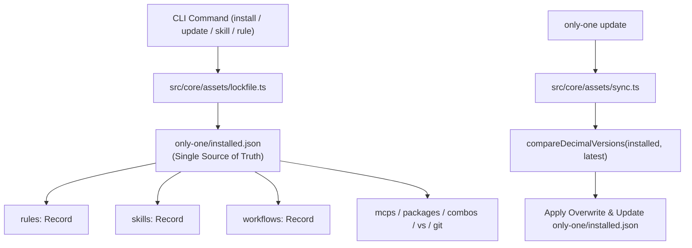

# Archive: Architecture of Independent Asset Versioning, Decimal Rollover, Unified Lockfile, and Synchronization

## 1. Problem & Core Value (Bài toán & Giá trị Cốt lõi)
- **Vấn đề (Problem)**:
  1. **Thiếu cơ chế định danh phiên bản độc lập**: Trước đây các asset manifests (`RuleManifest`, `SkillManifest`, `WorkflowManifest`, `McpManifest`, `VsLibraryManifest`, `PackageManifest`, `ComboManifest`, `GitAssetManifest`) hoàn toàn không có trường `version`. Cập nhật asset bị ghép cặp chặt (tightly coupled) với phiên bản CLI tổng thể (`cliVersion`), buộc phải cập nhật toàn bộ hoặc không thể phát hiện asset nào thực sự thay đổi.
  2. **Phân mảnh Lockfile**: Trạng thái cài đặt bị lưu trữ phân tán ở thư mục ẩn `.only-one/installed.json` và file riêng `only-one/skills-lock.json` cho remote GitHub skills.
  3. **Rủi ro Lockfile Drift & Bypass CI**: Không có công cụ tự động tăng phiên bản và chốt chặn CI để đảm bảo khi template asset thay đổi thì version tương ứng bắt buộc phải được bump.
- **Giá trị Cốt lõi (Core Value)**:
  - **100% Manifest Version Coverage**: Bổ sung `version: string` chuẩn hóa cơ số 10 (`X.Y.Z`) cho toàn bộ 65+ manifests trong danh mục `assets/`.
  - **Decimal Rollover Engine**: Triển khai thuật toán tăng phiên bản cơ số 10 (`0.0.1` -> `0.0.9` -> `0.1.0` -> `0.9.9` -> `1.0.0`).
  - **Unified Asset Lockfile (`only-one/installed.json`)**: Áp dụng triệt để chính sách Hard Cutover, loại bỏ thư mục ẩn `.only-one/` và hợp nhất hoàn toàn `skills-lock.json` vào `only-one/installed.json`.
  - **Reconciliation & Synchronization Engine**: Lệnh `only-one update` tự động đối soát version đã cài với upstream, chỉ cập nhật những asset thực sự outdated.
  - **Developer Tooling & Zero-Bypass CI Gate**: Cung cấp `scripts/bump-asset.ts` (`pnpm asset:bump <type> <id>`) và bài test `test/core/assets/version-gate.test.ts` chặn commit vi phạm.

## 2. Key Architecture & Decisions (Kiến trúc & Quyết định Then chốt)

### 2.1. Cấu trúc Quản lý Trạng thái Tài nguyên Hợp nhất (Unified State Architecture)

### 2.2. Các Quyết định Kỹ thuật Chính
1. **Decimal Rollover Arithmetic ([src/core/assets/version.ts](file:///Users/kiem/Sources/PERSONAL/only-one-cli/src/core/assets/version.ts))**: Hàm thuần túy kiểm tra định dạng `^\d+\.\d+\.\d+$`, cuộn vòng từ 9 về 0 và tăng chữ số liền trước.
2. **Hard Cutover Single Source of Truth ([src/core/assets/lockfile.ts](file:///Users/kiem/Sources/PERSONAL/only-one-cli/src/core/assets/lockfile.ts))**: Hàm `resolveInstalledLockfilePath` trỏ trực tiếp đến `join(projectDir, 'only-one', 'installed.json')`, loại bỏ toàn bộ code path dự phòng của thư mục `.only-one/`.
3. **Unified Remote Skill Schema ([src/core/assets/types.ts](file:///Users/kiem/Sources/PERSONAL/only-one-cli/src/core/assets/types.ts) & [src/core/skill/remote/lockfile.ts](file:///Users/kiem/Sources/PERSONAL/only-one-cli/src/core/skill/remote/lockfile.ts))**:
   - `InstalledAssetRecord` được mở rộng với `remote?: RemoteSkillLockMeta`.
   - `saveSkillToLockfile` và `readSkillsLockfile` đóng vai trò adapter layer tương thích ngược, thao tác trực tiếp trên `only-one/installed.json` và ngừng tạo `skills-lock.json`.
4. **Non-Destructive Safe Sync ([src/core/assets/sync.ts](file:///Users/kiem/Sources/PERSONAL/only-one-cli/src/core/assets/sync.ts))**: Chỉ ghi đè asset khi upstream version > installed version. Cập nhật lockfile nguyên tử ngay sau mỗi thao tác ghi thành công.

## 3. Scope & Key Modules (Phạm vi & Các Module Chính)
- **Asset Types & Manifests**:
  - [`assets/types.ts`](file:///Users/kiem/Sources/PERSONAL/only-one-cli/assets/types.ts): Bổ sung `version: string` cho tất cả manifest interfaces.
  - Manifest registries: [`assets/rules/index.ts`](file:///Users/kiem/Sources/PERSONAL/only-one-cli/assets/rules/index.ts), [`assets/packages/index.ts`](file:///Users/kiem/Sources/PERSONAL/only-one-cli/assets/packages/index.ts), [`assets/mcps/index.ts`](file:///Users/kiem/Sources/PERSONAL/only-one-cli/assets/mcps/index.ts), [`assets/vs/index.ts`](file:///Users/kiem/Sources/PERSONAL/only-one-cli/assets/vs/index.ts), [`assets/skills/index.ts`](file:///Users/kiem/Sources/PERSONAL/only-one-cli/assets/skills/index.ts), [`assets/workflows/index.ts`](file:///Users/kiem/Sources/PERSONAL/only-one-cli/assets/workflows/index.ts), [`assets/combos/index.ts`](file:///Users/kiem/Sources/PERSONAL/only-one-cli/assets/combos/index.ts), [`assets/git/index.ts`](file:///Users/kiem/Sources/PERSONAL/only-one-cli/assets/git/index.ts).
- **Core Versioning & Lockfile**:
  - [`src/core/assets/version.ts`](file:///Users/kiem/Sources/PERSONAL/only-one-cli/src/core/assets/version.ts): Thuật toán decimal rollover arithmetic.
  - [`src/core/assets/types.ts`](file:///Users/kiem/Sources/PERSONAL/only-one-cli/src/core/assets/types.ts): Khai báo `InstalledAssetRecord`, `RemoteSkillLockMeta`, `OnlyOneInstalledState`.
  - [`src/core/assets/lockfile.ts`](file:///Users/kiem/Sources/PERSONAL/only-one-cli/src/core/assets/lockfile.ts): Đọc/ghi `only-one/installed.json` atomic.
  - [`src/core/skill/remote/lockfile.ts`](file:///Users/kiem/Sources/PERSONAL/only-one-cli/src/core/skill/remote/lockfile.ts): Adapter layer cho GitHub remote skills lưu vào `installed.json`.
  - [`src/core/assets/sync.ts`](file:///Users/kiem/Sources/PERSONAL/only-one-cli/src/core/assets/sync.ts): Engine đồng bộ và phát hiện cập nhật.
- **Developer Tooling & CI Gate**:
  - [`src/core/assets/bump.ts`](file:///Users/kiem/Sources/PERSONAL/only-one-cli/src/core/assets/bump.ts) & [`scripts/bump-asset.ts`](file:///Users/kiem/Sources/PERSONAL/only-one-cli/scripts/bump-asset.ts): Tự động bump version.
  - [`src/core/assets/gate.ts`](file:///Users/kiem/Sources/PERSONAL/only-one-cli/src/core/assets/gate.ts): Zero-bypass gate kiểm tra coverage và version bumps.
- **Installers & Update Command Integration**:
  - [`src/commands/update/actions/step-2-update-artifacts.ts`](file:///Users/kiem/Sources/PERSONAL/only-one-cli/src/commands/update/actions/step-2-update-artifacts.ts)
  - [`src/core/workflow/index.ts`](file:///Users/kiem/Sources/PERSONAL/only-one-cli/src/core/workflow/index.ts)
  - [`src/core/rule/index.ts`](file:///Users/kiem/Sources/PERSONAL/only-one-cli/src/core/rule/index.ts)
  - [`src/core/skill/index.ts`](file:///Users/kiem/Sources/PERSONAL/only-one-cli/src/core/skill/index.ts)

## 4. Verification Evidence (Bằng chứng Kiểm thử)
- **Unit & Integration Tests**:
  - `test/core/assets/version.test.ts` (9 tests passed)
  - `test/core/assets/lockfile.test.ts` (4 tests passed)
  - `test/core/assets/version-gate.test.ts` (2 tests passed)
  - `test/core/assets/sync.test.ts` (2 tests passed)
  - `test/core/skill-lockfile.test.ts` (5 tests passed)
  - `test/commands/skill/skill.test.ts` (2 tests passed)
- **Full Test Suite**: 54 test files passed, 221 tests passed (100% pass rate).
- **TypeScript & Build**: `tsc --noEmit` clean (0 errors), `npm run build` đóng gói `dist/` thành công.
