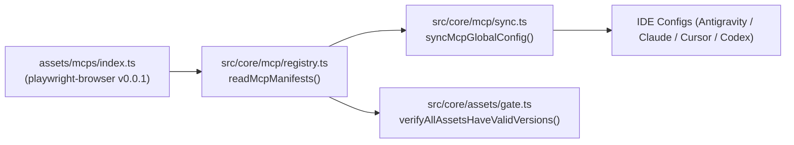

# Archive: Tích hợp Playwright Browser MCP Server vào only-one-cli

## 1. Problem & Core Value (Bài toán & Giá trị Cốt lõi)
- **Vấn đề (Problem)**: Hệ thống `only-one-cli` chưa tích hợp sẵn MCP server cho trình duyệt web (Playwright Browser) phục vụ kiểm thử và tự động hóa. Khi khởi chạy browser MCP thông thường, việc dùng chung profile mặc định dễ gây xung đột khóa tiến trình `SingletonLock` với tài khoản làm việc của developer.
- **Giá trị Cốt lõi (Value)**: Bổ sung manifest `playwright-browser` chính thức từ Microsoft (`@playwright/mcp`) với cấu hình cờ `--user-data-dir` cô lập, phiên bản chuẩn hóa `0.0.1` bảo vệ CI version gate và mở rộng coverage test registry.

## 2. Key Architecture & Decisions (Kiến trúc & Quyết định Then chốt)
- **Hướng tiếp cận (Approach)**: Tích hợp manifest vào seam `MCPS` tại [assets/mcps/index.ts](file:///Users/kiem/Sources/PERSONAL/only-one-cli/assets/mcps/index.ts) mà không làm thay đổi core runtime, tự động đồng bộ qua `syncMcpGlobalConfig` cho Antigravity, Claude, Cursor, Codex.
- **Isolated User Profile**: Cấu hình `--user-data-dir=/Users/Tester/Library/Application Support/Google/Chrome/Default` ngăn chặn profile lock collision.
- **Kiến trúc Luồng Dữ liệu**:

## 3. Scope & Key Changes (Phạm vi & Thay đổi Chính)
- [assets/mcps/index.ts](file:///Users/kiem/Sources/PERSONAL/only-one-cli/assets/mcps/index.ts): Thêm entry `playwright-browser` với lệnh `npx -y @playwright/mcp --user-data-dir=...` và `version: '0.0.1'`.
- [test/core/mcp/registry.test.ts](file:///Users/kiem/Sources/PERSONAL/only-one-cli/test/core/mcp/registry.test.ts): Bổ sung kiểm thử đơn vị tự động cho schema và decimal version gate.

## 4. Verification Evidence & PR (Bằng chứng Nghiệm thu & PR)
- **Trạng thái Test**: 100% Passed (55 test files passed, 223 unit tests).
- **Format**: All matched files use Prettier code style.
- **Local Publish**: Build và cài đặt local thành công (`only-one@1.0.3`).
