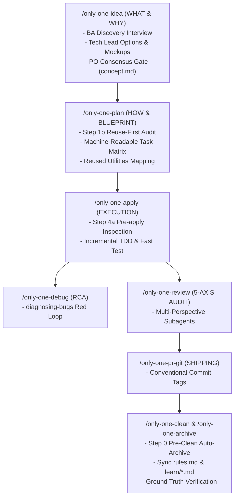
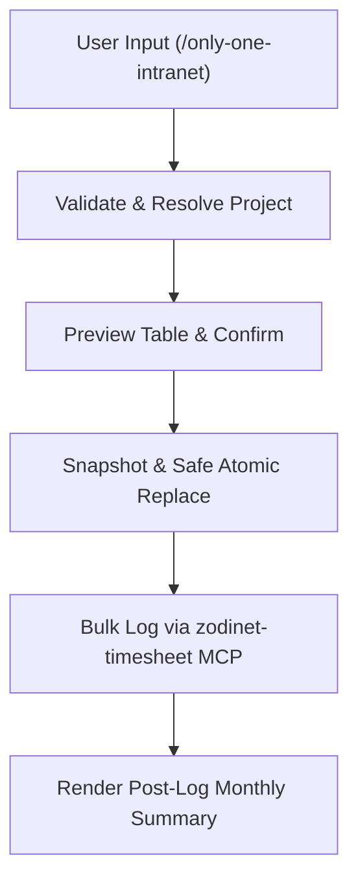

# Archive: Unified Architecture of Workflows, Skills Catalog, Timesheet Automation, Dual-Layer Blueprints, Reuse Guardrails & Full Stack Skill Suites

## 1. Problem Statement & Core Value (Bài toán & Giá trị Cốt lõi)

### 1.1. Core Problems (Vấn đề Cốt lõi)
1. **Unstructured & Duplicate Code Generation**: AI agents previously lacked pre-implementation code inspection guardrails, frequently reinventing helper utilities, base abstractions, or models instead of reusing established project code.
2. **Monolingual Friction & Semantic Drift**: Mixing Vietnamese and English across architecture reference documents degraded LLM reasoning accuracy and token efficiency.
3. **Weak Lifecycle Boundaries**: Agents occasionally skipped planning phases or executed premature code modifications during exploratory `/only-one-idea` runs.
4. **Manual & Unsafe Timesheet Operations**: Internal Intranet and Clockify timesheet logging lacked validation, atomic replacement (snapshot before mutation), weekend auto-shifting, and post-log payroll summaries.

### 1.2. Core Value & Solutions (Giá trị Cốt lõi & Giải pháp)
1. **Tiered 5-Phase Skills Classification**: Categorized all skills across Define, Plan, Build, Verify/Debug, and Review/Ship.
2. **3-Phase Collaboration & Terminal Gate in `/only-one-idea`**: Separates BA discovery interview $\rightarrow$ Tech Lead trade-offs & ASCII mockups $\rightarrow$ PO consensus gate with strict no-code terminal stopping (`concept.md`).
3. **3-Layer Defense-in-Depth for Code Reuse**:
   - *Skills Layer*: Mandatory Reuse-First Invariant (`0. Anti-Reinvention Rule`).
   - *Planning Layer*: Mandatory Pre-implementation Codebase Audit (`Step 1b`) & Reused Utilities column in Section 3.1 Task Matrix.
   - *Execution Layer*: Pre-apply Context & Existing Imports Inspection (`Step 4a`).
4. **Dual-Layer Architecture**: Formatted documents with human-friendly narrative and machine-readable execution tables (Section 3.1 Task Matrix with `Order`, `Status`, `Action`, `File Path`, `Target Symbols`, `Depends On`, `Fast Test Command`).
5. **Timesheet Logging Automation**:
   - `/only-one-intranet` workflow & `only-one-intranet-skill` utilizing `zodinet-timesheet` MCP.
   - Atomic safe replacement: Snapshot existing entries $\rightarrow$ delete $\rightarrow$ bulk log $\rightarrow$ rollback on failure.
   - Weekend auto-shift (Saturday/Sunday shifted to Monday) and automatic post-log monthly summary rendering.
   - Combo integration via `git-timesheet-flow` in [assets/combos/index.ts](file:///Users/kiem/Sources/PERSONAL/only-one-cli/assets/combos/index.ts).
6. **Full Stack Skill Suites Standardization**:
   - **NestJS Development (`assets/skills/only-one-nestjs-development/`)**: 100% technical English across `SKILL.md` and 13 reference files; class-level `@Auth()` and `@ApiUnauthorizedResponse` security; granular `src/shared/` (`SharedModule`) architecture; strict MikroORM uninitialized relation guards.
   - **Next.js Development (`assets/skills/only-one-nextjs-development/`)**: 100% technical English across `SKILL.md` and 12 reference files; Headless API Hook & UI separation; complete 18-hook catalog; modern React 18/19 hooks; strict 200 LOC ceiling for presentation orchestrators.

---

## 2. Key Architecture & Decisions (Kiến trúc & Quyết định Then chốt)

### 2.1. Complete 5-Phase Skills Lifecycle


### 2.2. Intranet & Timesheet Automation Pipeline


### 2.3. Standard Full Stack Production Patterns
- **NestJS Controller Security**:
  ```ts
  @Controller('features')
  @ApiTags('features')
  @ApiBearerAuth()
  @Auth()
  @ApiUnauthorizedResponse({ description: 'Missing or invalid access token.' })
  export class FeatureController extends BaseController {
    @Post()
    @Permissions(PermissionGroups.FEATURE, PermissionActions.CREATE)
    async create(@Body() request: CreateFeatureRequest): Promise<ResponseDto<FeatureDto>> {
      const result = await this.featureService.create(request);
      return this.getResponse(true, result);
    }
  }
  ```
- **Next.js Headless Hook & UI Orchestration**:
  - `src/pages/<feature>/hooks/use-<feature>-page.ts`: Encapsulates `useCustomTable`, `useCustomDrawerForm`, `useCustomSelect`, initial values mapping, and mutation queries.
  - `src/pages/<feature>/index.tsx`: Pure presentation layout (<200 LOC) consuming the headless page hook.

---

## 3. Scope & Key Modules (Phạm vi & Các Module Chính)
- **Workflows & Skills Assets**:
  - [.agents/workflows](file:///Users/kiem/Sources/PERSONAL/only-one-cli/.agents/workflows) & [assets/workflows](file:///Users/kiem/Sources/PERSONAL/only-one-cli/assets/workflows)
  - [.agents/skills](file:///Users/kiem/Sources/PERSONAL/only-one-cli/.agents/skills) & [assets/skills](file:///Users/kiem/Sources/PERSONAL/only-one-cli/assets/skills)
  - [assets/workflows/only-one-intranet.md](file:///Users/kiem/Sources/PERSONAL/only-one-cli/assets/workflows/only-one-intranet.md) & [assets/skills/only-one-intranet-skill](file:///Users/kiem/Sources/PERSONAL/only-one-cli/assets/skills/only-one-intranet-skill)
- **MCP & Combos Registry**:
  - [assets/mcps/index.ts](file:///Users/kiem/Sources/PERSONAL/only-one-cli/assets/mcps/index.ts) (`zodinet-timesheet`, `clockify`)
  - [assets/combos/index.ts](file:///Users/kiem/Sources/PERSONAL/only-one-cli/assets/combos/index.ts) (`frontend-flow`, `backend-flow`, `full-sdlc-flow`, `mcp-flow`, `git-timesheet-flow`)
- **Templates & Command Generation**:
  - [src/core/templates/agent-workflows.ts](file:///Users/kiem/Sources/PERSONAL/only-one-cli/src/core/templates/agent-workflows.ts)
  - [src/core/combo/index.ts](file:///Users/kiem/Sources/PERSONAL/only-one-cli/src/core/combo/index.ts)

---

## 4. Verification & Evidence (Bằng chứng Nghiệm thu)
- **Unit & Regression Test Suites**: 55 test files, 223 unit tests passed (100% pass rate).
- **Compilation & Formatting**: Clean TypeScript build and Prettier format validation.
- **Prebuilt Packaging**: `npm run publish:local` packaging and global local install tested cleanly.
