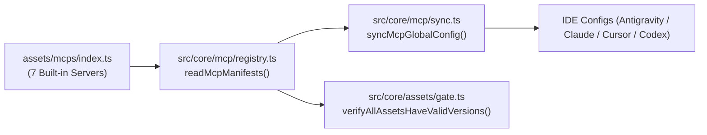

# Archive: Kiến Trúc MCP Registry, Tích Hợp Playwright Browser & Chuẩn Hóa Danh Mục Built-in

## 1. Problem & Core Value (Bài toán & Giá trị Cốt lõi)
- **Vấn đề (Problem)**:
  1. Thiếu MCP server chính thức cho trình duyệt web (Playwright Browser) phục vụ kiểm thử và tự động hóa. Khi chạy browser MCP không cô lập, việc dùng chung profile mặc định dễ gây lỗi xung đột khóa tiến trình `SingletonLock` với trình duyệt cá nhân của developer.
  2. Sự hiện diện của server `memory` (@modelcontextprotocol/server-memory) trong danh mục built-in gây dư thừa, phân mảnh trạng thái context và không cần thiết trong quy trình làm việc hiện đại của only-one-cli.
- **Giá trị Cốt lõi (Value)**:
  - Chuẩn hóa danh mục 7 MCP servers built-in chính thức: `clockify`, `fetch`, `github`, `playwright-browser`, `postgres`, `tavily`, `zodinet-timesheet`.
  - Tích hợp `playwright-browser` chính thức từ Microsoft (`@playwright/mcp`) với cấu hình cờ `--user-data-dir` độc lập nhằm triệt tiêu xung đột profile lock.
  - Loại bỏ dứt điểm `memory` server khỏi manifest, test suite, README và BACKLOG.

## 2. Key Architecture & Decisions (Kiến trúc & Quyết định Then chốt)
- **Cấu hình Độc Lập cho Browser Profile**:
  - Manifest `playwright-browser` sử dụng `--user-data-dir=/Users/Tester/Library/Application Support/Google/Chrome/Default` (hoặc tương đương) đảm bảo phiên duyệt web chạy trong môi trường hoàn toàn cô lập.
- **Single Source of Truth**:
  - Toàn bộ danh mục MCP được khai báo duy nhất tại [assets/mcps/index.ts](file:///Users/kiem/Sources/PERSONAL/only-one-cli/assets/mcps/index.ts).
  - Tự động đồng bộ sang cấu hình các IDE thông qua `syncMcpGlobalConfig()` (hỗ trợ Antigravity IDE, Claude Desktop, Cursor, Codex).
- **Luồng Đồng Bộ & Kiểm Soát Phiên Bản**:

## 3. Scope & Key Changes (Phạm vi & Thay đổi Chính)
- [assets/mcps/index.ts](file:///Users/kiem/Sources/PERSONAL/only-one-cli/assets/mcps/index.ts):
  - Thêm entry `playwright-browser` (`@playwright/mcp`) với cờ `--user-data-dir`.
  - Xoá bỏ hoàn toàn entry `memory`.
- [test/core/mcp/registry.test.ts](file:///Users/kiem/Sources/PERSONAL/only-one-cli/test/core/mcp/registry.test.ts):
  - Unit test khẳng định `playwright-browser` tồn tại với đúng lệnh và cờ argument.
  - Unit test khẳng định `memory` không còn nằm trong active manifests.
- [README.md](file:///Users/kiem/Sources/PERSONAL/only-one-cli/README.md) & [BACKLOG.md](file:///Users/kiem/Sources/PERSONAL/only-one-cli/BACKLOG.md): Cập nhật danh mục MCP chính thức.

## 4. Verification Evidence (Bằng chứng Nghiệm thu)
- `npm test test/core/mcp/registry.test.ts`: 3/3 tests passed.
- `npm test`: 55 test files passed, 224 unit tests passed.
- `npm run format:check`: 100% Prettier compliant.
