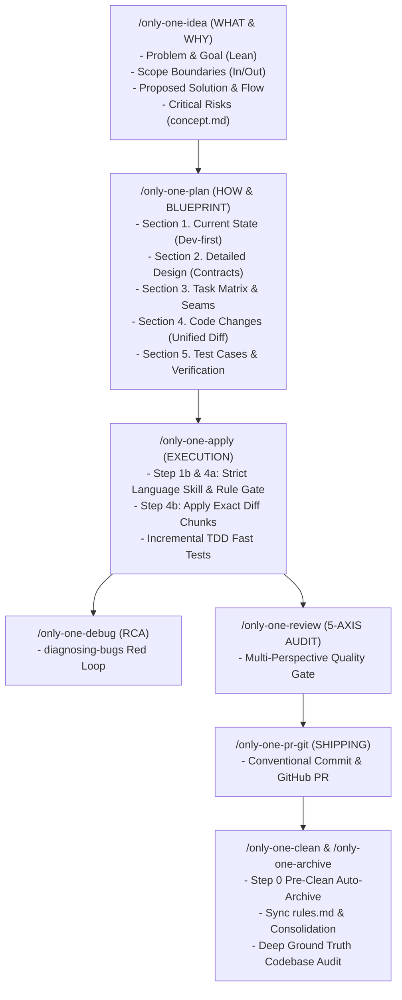

# Archive: Kiến Trúc Hợp Nhất của Hệ Thống Workflows, Skills Catalog, Lean Diff-Centric Planning & Chốt Chặn Tuân Thủ Quy Chuẩn

## 1. Problem Statement & Core Value (Bài toán & Giá trị Cốt lõi)

### 1.1. Core Problems (Vấn đề Cốt lõi)
1. **Bệnh béo phì tài liệu (Documentation Bloat)**: Các quy trình trước đây (`idea` -> `plan` -> `apply`) ép buộc sinh các bản kế hoạch 6 sections dài dòng, nhồi nhét lý thuyết sáo rỗng và ghi chú tiếng Anh vào file task khiến người dùng bỏ qua hơn 60% nội dung.
2. **Thiếu góc nhìn Unified Diff**: Phần code changes trong plan trước đây dùng code snippet dài rời rạc kèm comment `// [TARGET SEAM]`, rất khó nhận diện dòng thêm (`+`), xoá (`-`), sửa (`~`).
3. **Hiện tượng Agent Drift**: Khi thực thi apply code, AI agent có xu hướng tự ý viết code theo thói quen hoặc thiên kiến mặc định của LLM thay vì tuân thủ nghiêm ngặt các tiêu chuẩn kỹ thuật trong skills ngôn ngữ (`nestjs-development`, strict typing...) và `rules.md`.
4. **Trùng lặp & Tái phát minh logic (Reinventing the wheel)**: AI thiếu cơ chế bắt buộc đối soát thư mục dùng chung (`src/utils`, `src/helpers`, `src/hooks`) trước khi code mới.
5. **Thao tác Timesheet thủ công & thiếu an toàn**: Chấm công Intranet/Clockify trước đây thiếu snapshot sao lưu, cơ chế rollback nguyên tử và báo cáo tổng hợp sau khi log.

### 1.2. Core Value & Solutions (Giá trị Cốt lõi & Giải pháp)
1. **Mô hình Lean & Diff-Centric Planning**:
   - Tinh giản `concept.md` còn 4 mục cốt lõi: Problem & Goal, Scope Boundaries, Proposed Solution & Flow, Critical Risks.
   - Chuẩn hóa `plan.md` thành 5 sections súc tích: Current State, Detailed Design, Task Matrix, Code Changes (Unified Diff), Test Cases & Verification.
   - Trực quan hóa 100% thay đổi code bằng block ` ```diff ` chuẩn Git (`-` và `+`), cho phép review trong 5 giây.
   - Chuyển việc trích xuất học tiếng Anh ra footer tin nhắn chat (`conversational-english-coaching`), giữ tài liệu dự án sạch sẽ 100%.
2. **Strict Language Skill & Rule Adherence Gate**:
   - Chốt chặn nghiêm ngặt ở Step 1b, Step 4a và Guardrails của `only-one-apply`: Code áp dụng bắt buộc phải tuân thủ 100% quy chuẩn trong skills ngôn ngữ và `rules.md`, triệt tiêu hoàn toàn agent drift.
3. **Hệ thống Phòng vệ 3 Lớp Chống Trùng Lặp (Reuse-First Invariant)**:
   - *Skills Layer*: Anti-Reinvention Rule trong toàn bộ skills.
   - *Planning Layer*: Pre-implementation Codebase Audit (`Step 1b`) & Reused Utilities mapping trong Task Matrix.
   - *Execution Layer*: Pre-apply Context & Existing Imports Inspection (`Step 4a`).
4. **Tự động hóa Timesheet & Báo cáo Lương**:
   - `/only-one-intranet` & `only-one-intranet-skill` tích hợp `zodinet-timesheet` MCP.
   - Thay thế an toàn nguyên tử (Snapshot $\rightarrow$ Delete $\rightarrow$ Bulk Log $\rightarrow$ Rollback khi lỗi).
   - Tự động dịch chuyển ngày cuối tuần và kết xuất bảng tổng hợp công cả tháng.
5. **Chuẩn hóa Full Stack Skill Suites**:
   - **NestJS Development**: Tiếng Anh kỹ thuật 100%, bảo mật tầng class `@Auth()`, kiến trúc `src/shared/` độc lập, guard chống quan hệ uninitialized trong MikroORM.
   - **Next.js Development**: Phân tách Headless API Hook và UI layout, catalog 18 hooks, trần 200 LOC cho presentation view.

---

## 2. Key Architecture & Decisions (Kiến trúc & Quyết định Then chốt)

### 2.1. Vòng Đời Tinh Gọn 5 Pha của Workflow & Skills


### 2.2. Cấu trúc Chuẩn của Plan Mới (Dev-First & Diff-Centric)
- **Section 1. Current State**: 2-3 gạch đầu dòng phân tích luồng cũ, bottleneck và invariants cần giữ. Dùng tên file ngắn gọn.
- **Section 2. Detailed Design**: Cơ chế vận hành mới, DTOs, contracts và seams thay đổi.
- **Section 3. Task Matrix & Dependency Graph**: Bảng thứ tự task, action (`[NEW]`/`[MODIFY]`/`[DELETE]`), seams, fast test command.
- **Section 4. Code Changes (Unified Diff)**:
  ```diff
  @@ line N @@
  - const oldLogic = false;
  + const newLogic = true;
  ```
- **Section 5. Test Cases & Verification**: Lệnh test tự động và lint cụ thể.

---

## 3. Scope & Key Modules (Phạm vi & Các Module Chính)
- **Workflows Template & Manifest**:
  - [assets/workflows/index.ts](file:///Users/kiem/Sources/PERSONAL/only-one-cli/assets/workflows/index.ts): Khai báo manifests, versioning chuẩn cơ số 10 (`0.0.2` cho `idea`, `plan`, `apply`).
  - [assets/workflows/only-one-plan.md](file:///Users/kiem/Sources/PERSONAL/only-one-cli/assets/workflows/only-one-plan.md) & [.agents/workflows/only-one-plan.md](file:///Users/kiem/Sources/PERSONAL/only-one-cli/.agents/workflows/only-one-plan.md)
  - [assets/workflows/only-one-idea.md](file:///Users/kiem/Sources/PERSONAL/only-one-cli/assets/workflows/only-one-idea.md) & [.agents/workflows/only-one-idea.md](file:///Users/kiem/Sources/PERSONAL/only-one-cli/.agents/workflows/only-one-idea.md)
  - [assets/workflows/only-one-apply.md](file:///Users/kiem/Sources/PERSONAL/only-one-cli/assets/workflows/only-one-apply.md) & [.agents/workflows/only-one-apply.md](file:///Users/kiem/Sources/PERSONAL/only-one-cli/.agents/workflows/only-one-apply.md)
  - [assets/workflows/only-one-intranet.md](file:///Users/kiem/Sources/PERSONAL/only-one-cli/assets/workflows/only-one-intranet.md) & [assets/skills/only-one-intranet-skill](file:///Users/kiem/Sources/PERSONAL/only-one-cli/assets/skills/only-one-intranet-skill)
- **Skills Catalog**:
  - [assets/skills/index.ts](file:///Users/kiem/Sources/PERSONAL/only-one-cli/assets/skills/index.ts): Khai báo 22 core & domain skills.
  - [assets/skills/only-one-nestjs-development](file:///Users/kiem/Sources/PERSONAL/only-one-cli/assets/skills/only-one-nestjs-development) & [assets/skills/only-one-nextjs-development](file:///Users/kiem/Sources/PERSONAL/only-one-cli/assets/skills/only-one-nextjs-development)
- **Governance & Negative Rules**:
  - [only-one/rules.md](file:///Users/kiem/Sources/PERSONAL/only-one-cli/only-one/rules.md): Cập nhật negative rules về Anti-Agent-Drift và Lean Diff-Centric Planning.

---

## 4. Verification Evidence (Bằng chứng Nghiệm thu)
- **Workflow Registry Integrity**: `npm test test/core/workflow-registry.test.ts` (Passed).
- **Version Gate Integrity**: `npm test test/core/assets/version-gate.test.ts` (Passed).
- **Asset Updates & Sync**: `npm test test/core/assets/sync.test.ts` (Passed).
- **Full Test Suite Execution**: 55 test files passed, 224 unit tests passed.
- **Code Style & Formatting**: 100% Prettier compliant.
