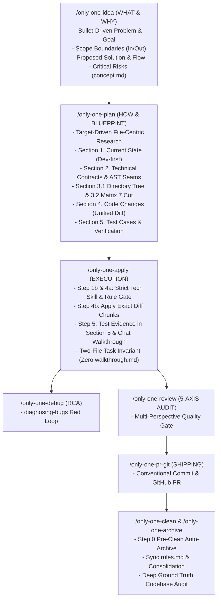

# Archive: Kiến Trúc Hợp Nhất của Hệ Thống Workflows, Skills Catalog, File-Centric Planning, Task Matrix 7 Cột & Chốt Chặn Tuân Thủ Quy Chuẩn

## 1. Problem Statement & Core Value (Bài toán & Giá trị Cốt lõi)

### 1.1. Core Problems (Vấn đề Cốt lõi)
1. **Bệnh béo phì tài liệu & Phân mảnh nguồn chân lý (Documentation Bloat & Fragmented Truth)**:
   - Các quy trình trước đây sinh tài liệu rườm rà, nhồi nhét văn xuôi lý thuyết vào `concept.md` và `plan.md`.
   - Section 2 trong `plan.md` chép lại 80–90% cơ chế từ `concept.md`.
   - File riêng biệt `walkthrough.md` trên đĩa trùng lặp hơn 80% với `plan.md`.
   - Các AI IDE (như Antigravity) tự sinh thêm `implementation_plan.md` nội bộ, tạo ra 2 bản plan song song gây rác workspace.
2. **Tràn bảng Task Matrix**: Cột `Reused Existing Utilities / Helpers` (8 cột) làm bảng bị tràn ngang và vỡ giao diện trên split editor của IDE.
3. **Thiếu quy trình nghiên cứu có mục tiêu (Unfocused Research)**: Agent thường nạp tràn lan rules/skills hoặc thiếu các quy chuẩn cần thiết trước khi lập diff.
4. **Hiện tượng Agent Drift**: Khi thực thi apply, AI agent tự ý viết code theo thói quen mặc định của LLM thay vì tuân thủ nghiêm ngặt các tiêu chuẩn kỹ thuật trong skills ngôn ngữ (`nestjs-development`, strict typing...) và `rules.md`.
5. **Trùng lặp logic & Thao tác Timesheet thủ công**: AI thiếu chốt chặn đối soát thư mục dùng chung (`src/utils`, `src/helpers`, `src/hooks`) trước khi code mới.

### 1.2. Core Value & Solutions (Giá trị Cốt lõi & Giải pháp)
1. **Mô hình Lean, Diff-Centric & Two-File Task Invariant**:
   - **`concept.md`**: Cấu trúc phân cấp gạch đầu dòng rõ ràng (Symptom, Root Cause, Impact, Outcome, Acceptance Criteria). Là Single Source of Truth cho WHAT & WHY.
   - **`plan.md`**: 5 sections tinh gọn:
     + `Section 1. Current State`: Phân tích luồng cũ và invariants.
     + `Section 2. Technical Contracts & AST Seams`: Áp dụng guardrail `🛑 Anti-Concept-Duplication` — kế thừa 100% cơ chế từ `concept.md`, chỉ định nghĩa type contracts, DTOs và AST seams.
     + `Section 3. Directory Structure & Task Matrix`: Sơ đồ cây `3.1 Directory Structure Changes` (`[NEW]`, `[MODIFY]`, `[DELETE]`, `[RENAME]`) và bảng `3.2 Task Matrix` 7 cột chuẩn.
     + `Section 4. Code Changes (Unified Diff)`: Trực quan hóa 100% thay đổi bằng Git Unified Diff (` ```diff `).
     + `Section 5. Test Cases & Verification`: Bằng chứng nghiệm thu trực tiếp.
   - **Strict Two-File Task Invariant**: Mỗi thư mục task chỉ duy trì duy nhất `concept.md` và `plan.md`. Triệt tiêu hoàn toàn `walkthrough.md` (kết quả báo cáo qua chat) và cấm tạo `implementation_plan.md` của IDE.
2. **Quy trình Nghiên cứu File-Centric / Target-Driven**:
   - Định vị danh sách file mục tiêu trước $\rightarrow$ Chỉ nạp rules/skills và archives liên quan trực tiếp $\rightarrow$ Đối soát mã nguồn qua Pre-Diff Compliance Gate.
3. **Strict Language Skill & Rule Adherence Gate**:
   - Chốt chặn nghiêm ngặt ở Step 1b, Step 4a và Guardrails của `only-one-apply`: Code áp dụng bắt buộc phải tuân thủ 100% quy chuẩn trong skills ngôn ngữ và `rules.md`, triệt tiêu hoàn toàn agent drift.
4. **Hệ thống Phòng vệ Chống Trùng Lặp (Reuse-First Invariant)**:
   - Kiểm tra mã nguồn dùng chung ở Step 1b và kiểm tra imports ở Step 4a.
5. **Tự động hóa Timesheet & Báo cáo Lương**:
   - `/only-one-intranet` & `only-one-intranet-skill` tích hợp `zodinet-timesheet` MCP với thay thế an toàn nguyên tử (Snapshot $\rightarrow$ Delete $\rightarrow$ Bulk Log $\rightarrow$ Rollback khi lỗi).
6. **Chuẩn hóa Full Stack Skill Suites**:
   - **NestJS Development**: Tiếng Anh kỹ thuật 100%, bảo mật tầng class `@Auth()`, kiến trúc `src/shared/` độc lập, guard chống quan hệ uninitialized trong MikroORM.
   - **Next.js Development**: Phân tách Headless API Hook và UI layout, catalog 18 hooks, trần 200 LOC cho presentation view.

---

## 2. Key Architecture & Decisions (Kiến trúc & Quyết định Then chốt)

### 2.1. Vòng Đời Tinh Gọn 5 Pha của Workflow & Skills


### 2.2. Chuẩn Hóa Ma Trận 7 Cột & Không Trùng Lặp
```text
| Order | Status | Action | File Path | Target Symbols / AST Seams | Depends On | Fast Test Command |
```
- Loại bỏ cột `Reused Existing Utilities / Helpers` khỏi bảng Section 3.2 để tránh vỡ giao diện trên màn hình chia đôi (split screen), chuyển việc kiểm tra tái sử dụng sang Step 1b và Step 4a.

---

## 3. Scope & Key Modules (Phạm vi & Các Module Chính)
- **Workflows Template & Manifest**:
  - [assets/workflows/index.ts](file:///Users/kiem/Sources/PERSONAL/only-one-cli/assets/workflows/index.ts): Versioning chuẩn cơ số 10 (`idea`: 0.0.4, `plan`: 0.0.5, `apply`: 0.0.4, `archive`: 0.0.3).
  - [assets/workflows/only-one-idea.md](file:///Users/kiem/Sources/PERSONAL/only-one-cli/assets/workflows/only-one-idea.md) & [.agents/workflows/only-one-idea.md](file:///Users/kiem/Sources/PERSONAL/only-one-cli/.agents/workflows/only-one-idea.md)
  - [assets/workflows/only-one-plan.md](file:///Users/kiem/Sources/PERSONAL/only-one-cli/assets/workflows/only-one-plan.md) & [.agents/workflows/only-one-plan.md](file:///Users/kiem/Sources/PERSONAL/only-one-cli/.agents/workflows/only-one-plan.md)
  - [assets/workflows/only-one-apply.md](file:///Users/kiem/Sources/PERSONAL/only-one-cli/assets/workflows/only-one-apply.md) & [.agents/workflows/only-one-apply.md](file:///Users/kiem/Sources/PERSONAL/only-one-cli/.agents/workflows/only-one-apply.md)
  - [assets/workflows/only-one-archive.md](file:///Users/kiem/Sources/PERSONAL/only-one-cli/assets/workflows/only-one-archive.md) & [.agents/workflows/only-one-archive.md](file:///Users/kiem/Sources/PERSONAL/only-one-cli/.agents/workflows/only-one-archive.md)
  - [assets/workflows/only-one-clean.md](file:///Users/kiem/Sources/PERSONAL/only-one-cli/assets/workflows/only-one-clean.md) & [.agents/workflows/only-one-clean.md](file:///Users/kiem/Sources/PERSONAL/only-one-cli/.agents/workflows/only-one-clean.md)
- **Skills Catalog**:
  - [assets/skills/index.ts](file:///Users/kiem/Sources/PERSONAL/only-one-cli/assets/skills/index.ts): Khai báo 20 core & domain skills.
  - [assets/skills/only-one-nestjs-development](file:///Users/kiem/Sources/PERSONAL/only-one-cli/assets/skills/only-one-nestjs-development) & [assets/skills/only-one-nextjs-development](file:///Users/kiem/Sources/PERSONAL/only-one-cli/assets/skills/only-one-nextjs-development)
- **Governance & Negative Rules**:
  - [only-one/rules.md](file:///Users/kiem/Sources/PERSONAL/only-one-cli/only-one/rules.md): Cập nhật negative rules về Anti-Agent-Drift, Two-File Invariant, Anti-Concept-Duplication và Lean Diff-Centric Planning.

---

## 4. Verification Evidence (Bằng chứng Nghiệm thu)
- **Workflow Registry Integrity**: `npm test test/commands/workflow.test.ts` (Passed 4/4 tests).
- **Asset Version Gate**: `npm test test/core/assets/version-gate.test.ts` (Passed 2/2 tests).
- **Rule Adapters**: `npm test test/core/rule-adapters.test.ts` (Passed 3/3 tests).
- **Full Test Suite Execution**: 56 test files passed, 229 unit tests passed.
- **Workflow Synchronization**: `diff -u` giữa `assets/workflows/` và `.agents/workflows/` đạt 100% khớp (0 diff).
