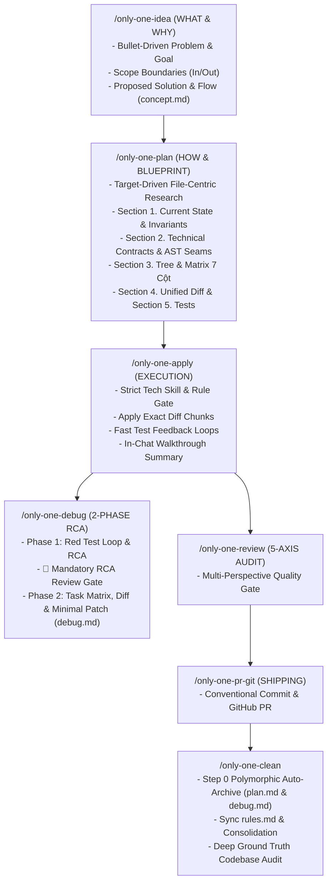

# Archive: Kiến Trúc Hợp Nhất của Hệ Thống Workflows, Skills Catalog, 2-Phase Debug RCA, Polymorphic Task Auto-Archive & Governance

## 1. Problem Statement & Core Value (Bài toán & Giá trị Cốt lõi)

### 1.1. Core Problems (Vấn đề Cốt lõi)
1. **Bệnh béo phì tài liệu & Phân mảnh nguồn chân lý (Documentation Bloat & Fragmented Truth)**:
   - Các quy trình trước đây sinh tài liệu rườm rà, nhồi nhét văn xuôi lý thuyết vào `concept.md` và `plan.md`.
   - Section 2 trong `plan.md` chép lại 80–90% cơ chế từ `concept.md`.
   - File riêng biệt `walkthrough.md` trên đĩa trùng lặp hơn 80% với `plan.md`.
   - Các AI IDE tự sinh thêm `implementation_plan.md` nội bộ, tạo ra 2 bản plan song song gây rác workspace.
2. **Quy trình Debug thiếu kiểm soát và thiếu vết lưu trữ (Uncontrolled & Ephemeral Debugging)**:
   - `/only-one-debug` trước đây chỉ in báo cáo tóm tắt ra chat, không lưu vết artifact điều tra và tự ý sửa code mà không có điểm dừng review nguyên nhân gốc rễ (RCA) với người dùng.
3. **Bỏ sót Task Debug khi Dọn dẹp (Orphaned Debug Tasks in Clean)**:
   - `only-one-clean` và `task-lifecycle-resolution` trước đây chỉ quét tệp `plan.md`, bỏ sót toàn bộ các task `debug.md` (`status: fixed`), khiến thư mục `only-one/tasks/` bị tồn đọng và thất lạc bài học kinh nghiệm.
4. **Dangling References từ Workflow lỗi thời**:
   - `only-one-handoff` và skill `handoff` cũ gây thừa thãi khi chuyển sang mô hình Two-File Task Invariant.

### 1.2. Core Value & Solutions (Giá trị Cốt lõi & Giải pháp)
1. **Mô hình Lean, Diff-Centric & Two-File Task Invariant**:
   - **`concept.md`**: Single Source of Truth cho WHAT & WHY (Symptom, Root Cause, Impact, Outcome, Acceptance Criteria).
   - **`plan.md`**: 5 sections tinh gọn:
     + `Section 1. Current State`: Phân tích luồng cũ và invariants.
     + `Section 2. Technical Contracts & AST Seams`: Áp dụng guardrail `🛑 Anti-Concept-Duplication` — kế thừa 100% cơ chế từ `concept.md`, chỉ định nghĩa type contracts, DTOs và AST seams.
     + `Section 3. Directory Structure & Task Matrix`: Sơ đồ cây `3.1 Directory Structure Changes` và bảng `3.2 Task Matrix` 7 cột chuẩn.
     + `Section 4. Code Changes (Unified Diff)`: Trực quan hóa 100% thay đổi bằng Git Unified Diff (` ```diff `).
     + `Section 5. Test Cases & Verification`: Bằng chứng nghiệm thu trực tiếp.
   - **Strict Two-File Task Invariant**: Mỗi thư mục task chỉ duy trì duy nhất `concept.md` và `plan.md`. Triệt tiêu hoàn toàn `walkthrough.md` trên đĩa và cấm tạo `implementation_plan.md` của IDE.
2. **Quy trình Debug 2 Pha với Cổng Review Bắt buộc (2-Phase Debug & RCA Review Gate)**:
   - **Phase 1 (Diagnosis & RCA)**: Xây dựng Red feedback loop, thu thập bằng chứng instrumentation $\rightarrow$ Ghi Section 1 (Symptom) & Section 2 (RCA) vào `debug.md` (`status: diagnosing`).
   - **🛑 RCA Review Gate**: Dừng lại bắt buộc để người dùng kiểm tra và duyệt giả thuyết nguyên nhân gốc rễ trước khi can thiệp mã nguồn.
   - **Phase 2 (Surgical Patch & Verification)**: Lập Task Matrix (Section 3), Unified Diff (Section 4), áp dụng bản vá tối giản, chạy test GREEN, ghi Section 5 và cập nhật `status: fixed`.
3. **Quét Task Đa hình trong Auto-Archive (Polymorphic Task Lifecycle Resolution)**:
   - Step 0 của `only-one-clean` tự động nhận diện cả `plan.md` (`status: done`) và `debug.md` (`status: fixed`) để chắt lọc negative rules vào `only-one/rules.md`, sinh archive chuẩn và xóa raw task folder; đồng thời bảo vệ các active tasks (`in-progress`, `planned`, `diagnosing`, `planning`).
4. **Loại bỏ Hoàn toàn `only-one-handoff` & Skill `handoff`**:
   - Gỡ bỏ sạch sẽ khỏi manifests `WORKFLOWS`, `SKILLS`, `COMBOS` và cập nhật test suite.

---

## 2. Key Architecture & Decisions (Kiến trúc & Quyết định Then chốt)

### 2.1. Vòng Đời Tinh Gọn của Hệ Thống Workflows


### 2.2. Chuẩn Hóa Ma Trận 7 Cột & Song Ngữ Kỹ Thuật
- Toàn bộ hướng dẫn trong file workflow `.md` được viết bằng **English chuẩn**.
- Các tài liệu lưu vết (`concept.md`, `plan.md`, `debug.md`, `archives/*.md`, `Summary Report`) sử dụng format **Bilingual Hybrid** (diễn giải tiếng Việt kèm thuật ngữ kỹ thuật tiếng Anh).

---

## 3. Scope & Key Modules (Phạm vi & Các Module Chính)
- **Workflows Catalog (10 Core Workflows)**:
  - [assets/workflows/index.ts](file:///Users/kiem/Sources/PERSONAL/only-one-cli/assets/workflows/index.ts) & [.agents/workflows/](file:///Users/kiem/Sources/PERSONAL/only-one-cli/.agents/workflows):
    - `only-one-idea` (0.0.4)
    - `only-one-plan` (0.0.5)
    - `only-one-apply` (0.0.4)
    - `only-one-debug` (0.0.2)
    - `only-one-review` (0.0.1)
    - `only-one-conflict` (0.0.1)
    - `only-one-clockify` (0.0.1)
    - `only-one-intranet` (0.0.1)
    - `only-one-pr-git` (0.0.1)
    - `only-one-clean` (0.0.4)
- **Skills Catalog**:
  - [assets/skills/index.ts](file:///Users/kiem/Sources/PERSONAL/only-one-cli/assets/skills/index.ts) & [.agents/skills/](file:///Users/kiem/Sources/PERSONAL/only-one-cli/.agents/skills)
  - Bao gồm `task-lifecycle-resolution` (0.0.2), `diagnosing-bugs`, `test-driven-development`, `code-simplification`, `context-engineering`, v.v.
- **Governance & Negative Rules**:
  - [only-one/rules.md](file:///Users/kiem/Sources/PERSONAL/only-one-cli/only-one/rules.md): Lưu trữ tập trung các quy tắc `[NEVER]`, `[ALWAYS]`, `[AVOID]`.

---

## 4. Verification Evidence (Bằng chứng Nghiệm thu)
- **Workflow & Skill Registries**: Toàn bộ 10 workflows và 25 skills được kiểm thử nghiêm ngặt.
- **Full Test Suite Execution**: 55 test files passed, 230 unit tests passed 100%.
- **Workflow Synchronization**: `assets/workflows/` và `.agents/workflows/` đồng bộ 100% khớp (0 diff).
- **Format & Build**: Prettier formatting và TypeScript compile hoàn toàn sạch lỗi.
