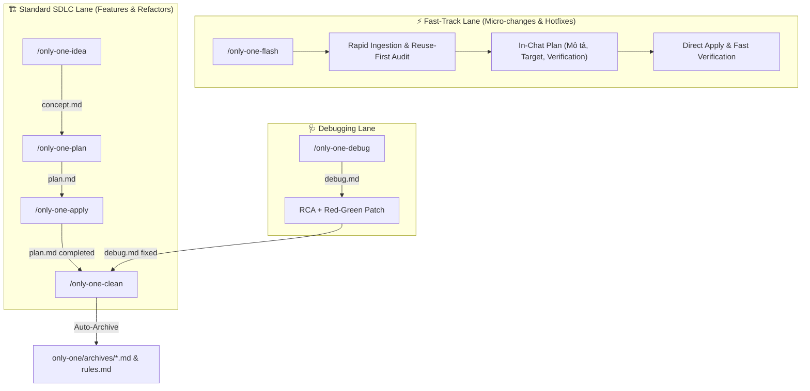

# Archive: Kiến Trúc Hợp Nhất của Hệ Thống Workflows, SDLC Fast-Track (Flash), 2-Phase Debug RCA & Governance

## 1. Problem Statement & Core Value (Bài toán & Giá trị Cốt lõi)

### 1.1. Core Problems (Vấn đề Cốt lõi)
1. **Bệnh béo phì tài liệu & Phân mảnh nguồn chân lý (Documentation Bloat & Fragmented Truth)**:
   - Các quy trình trước đây sinh tài liệu rườm rà, nhồi nhét văn xuôi lý thuyết vào `concept.md` và `plan.md`.
   - File riêng biệt `walkthrough.md` trên đĩa trùng lặp hơn 80% với `plan.md`.
2. **Chi phí thời gian và disk footprint lớn cho Quick Tasks**:
   - Các tác vụ nhỏ, hotfixes hoặc tinh chỉnh 1–2 file bị bắt buộc phải chạy qua 3 giai đoạn độc lập (`/only-one-idea` $\rightarrow$ `/only-one-plan` $\rightarrow$ `/only-one-apply`), sinh các file markdown dài và folder `only-one/tasks/` không cần thiết.
3. **Quy trình Debug thiếu kiểm soát và thiếu vết lưu trữ**:
   - `/only-one-debug` trước đây chỉ in báo cáo tóm tắt ra chat, không lưu vết artifact điều tra và tự ý sửa code mà không có điểm dừng review nguyên nhân gốc rễ (RCA) với người dùng.
4. **Bỏ sót Task Debug khi Dọn dẹp**:
   - `only-one-clean` trước đây chỉ quét `plan.md`, bỏ sót các task `debug.md` (`status: fixed`).

### 1.2. Core Value & Solutions (Giá trị Cốt lõi & Giải pháp)
1. **Phân cấp 2 Làn Thực Thi SDLC (Standard Lane vs Fast-Track Lane)**:
   - **Standard Lane (Medium/Large Features & Refactor)**: Quy trình 3 bước chuẩn:
     + `/only-one-idea`: Single Source of Truth cho WHAT & WHY (`concept.md`).
     + `/only-one-plan`: 5 sections tinh gọn (`plan.md` với Task Matrix & Unified Diff, không duplicate concept).
     + `/only-one-apply`: Thực thi từng file theo dependency order và test verification.
     + **Strict Two-File Task Invariant**: Mỗi thư mục task chỉ duy trì duy nhất `concept.md` và `plan.md`. Triệt tiêu hoàn toàn `walkthrough.md` trên đĩa.
   - **Fast-Track Lane (`/only-one-flash` cho Quick Tasks & Hotfixes)**:
     + Thực thi trọn gói trong 1 turn duy nhất (Autonomous One-Shot Execution).
     + **Zero Disk Plan Footprint**: Không sinh thư mục `only-one/tasks/` hay tệp markdown trên đĩa.
     + **Ultra-Clean In-Chat Plan**: Chỉ hiển thị 3 trường cốt lõi (**Mô tả**, **Target** cấu trúc source kèm mô tả vai trò từng file, và **Verification** lệnh test/build).
     + Nạp ngầm `only-one/rules.md`, `only-one/archives/*.md`, `only-one/CONTEXT.md` và tech skills tương ứng để đảm bảo 100% chuẩn mực code.
2. **Quy trình Debug Khép Kín & Hỗ trợ Đa Tài liệu trong Apply**:
   - `only-one-debug`: Tự động chẩn đoán qua Red feedback loop, ghi Section 1 & 2 (`debug.md`), áp dụng bản vá tối giản và kiểm thử (Green).
   - `only-one-apply`: Tự động nhận diện và thực thi cả `plan.md` (`status: planned` $\rightarrow$ `completed`) và `debug.md` (`status: planning`/`diagnosing` $\rightarrow$ `fixed`).
3. **Quét Task Đa hình trong Auto-Archive (`task-lifecycle-resolution`)**:
   - Step 0 của `only-one-clean` tự động nhận diện cả `plan.md` (`status: completed`/`done`) và `debug.md` (`status: fixed`), chắt lọc negative rules vào `only-one/rules.md`, sinh archive chuẩn và xóa raw task folder; đồng thời bảo vệ các active tasks (`in-progress`, `planned`, `diagnosing`, `planning`).

---

## 2. Key Architecture & Decisions (Kiến trúc & Quyết định Then chốt)

### 2.1. Ma trận Phân loại Workflow SDLC

| Workflow | Mục đích | Output Artifacts | Vòng lặp Kiểm thử |
| :--- | :--- | :--- | :--- |
| **`/only-one-idea`** | Khảo sát nhu cầu, mô hình hóa domain, chốt phạm vi | `only-one/tasks/<slug>/concept.md` | Non-code (Review Gate) |
| **`/only-one-plan`** | Thiết kế kỹ thuật, Task Matrix, Unified Diff | `only-one/tasks/<slug>/plan.md` | Non-code (Review Gate) |
| **`/only-one-apply`** | Áp dụng plan/debug theo Task Matrix | Cập nhật Section 5 `plan.md` / `debug.md` | Fast Test Command từng file |
| **`/only-one-flash`** | Sửa đổi nhỏ, hotfix nhanh trong 1 turn | In-Chat Plan (Zero Disk Doc) | Fast Test / Build Command |
| **`/only-one-debug`** | Phân tích RCA và vá lỗi khép kín | `only-one/tasks/<slug>/debug.md` | Red-Green Test Loop |
| **`/only-one-clean`** | Auto-archive task, đối soát codebase, dọn dẹp | `only-one/archives/<domain>.md` | Source-Driven Audit |

### 2.2. Sơ đồ Vận hành Tổng thể

---

## 3. Scope & Key Changes (Phạm vi & Thay đổi Chính)

- [assets/workflows/index.ts](file:///Users/kiem/Sources/PERSONAL/only-one-cli/assets/workflows/index.ts): Đăng ký đầy đủ 11 workflows chuẩn (`only-one-idea`, `only-one-plan`, `only-one-apply`, `only-one-flash`, `only-one-debug`, `only-one-review`, `only-one-conflict`, `only-one-clockify`, `only-one-intranet`, `only-one-pr-git`, `only-one-clean`).
- [assets/combos/index.ts](file:///Users/kiem/Sources/PERSONAL/only-one-cli/assets/combos/index.ts): Tích hợp `only-one-flash` vào toàn bộ các combo `frontend-flow`, `backend-flow`, `full-sdlc-flow`.
- [assets/workflows/only-one-flash.md](file:///Users/kiem/Sources/PERSONAL/only-one-cli/assets/workflows/only-one-flash.md) & [.agents/workflows/only-one-flash.md](file:///Users/kiem/Sources/PERSONAL/only-one-cli/.agents/workflows/only-one-flash.md): Định nghĩa workflow fast-track.
- [assets/workflows/only-one-debug.md](file:///Users/kiem/Sources/PERSONAL/only-one-cli/assets/workflows/only-one-debug.md): Quy trình RCA khép kín.
- [assets/workflows/only-one-apply.md](file:///Users/kiem/Sources/PERSONAL/only-one-cli/assets/workflows/only-one-apply.md): Hỗ trợ thực thi đa tài liệu (`plan.md` và `debug.md`).
- [only-one/rules.md](file:///Users/kiem/Sources/PERSONAL/only-one-cli/only-one/rules.md): Cập nhật negative rules cho `only-one-flash` và anti-concept-duplication.

---

## 4. Verification Evidence (Bằng chứng Nghiệm thu)

- **Trạng thái Test**:
  - `npm test`: 100% Passed.
  - `npm run format:check && npm run build`: 0 errors.
