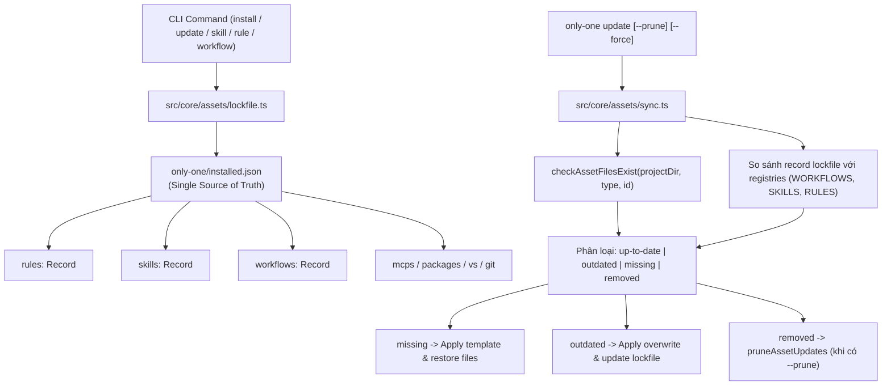

# Archive: Architecture of Independent Asset Versioning, Unified Lockfile, Auto-Restore, and Pruning Systems

## 1. Problem & Core Value (Bài toán & Giá trị Cốt lõi)
- **Vấn đề (Problem)**:
  1. **Thiếu cơ chế định danh phiên bản độc lập**: Trước đây các asset manifests hoàn toàn không có trường `version`. Cập nhật asset bị ghép cặp chặt với `cliVersion`, không thể phát hiện asset nào thực sự thay đổi.
  2. **Phân mảnh Lockfile**: Trạng thái cài đặt bị lưu trữ phân tán ở `.only-one/installed.json` và `only-one/skills-lock.json` cho remote GitHub skills.
  3. **Rủi ro Lockfile Drift & Bypass CI**: Thiếu công cụ tăng phiên bản và chốt chặn CI khi thay đổi template asset.
  4. **Thành phần Bị Xóa & File Bị Mất**: File mồ côi tồn đọng trên đĩa khi asset bị gỡ bỏ upstream; hoặc khi người dùng vô tình xóa file vật lý thì không tự động khôi phục.
- **Giá trị Cốt lõi (Core Value)**:
  - **100% Manifest Version Coverage**: Bổ sung `version: string` chuẩn hóa cơ số 10 (`X.Y.Z`) cho toàn bộ manifests trong `assets/`.
  - **Decimal Rollover Engine**: Triển khai thuật toán tăng phiên bản cơ số 10 (`0.0.1` -> `0.0.9` -> `0.1.0` -> `0.9.9` -> `1.0.0`).
  - **Unified Asset Lockfile (`only-one/installed.json`)**: Áp dụng triệt để chính sách Hard Cutover, hợp nhất hoàn toàn `skills-lock.json` vào `only-one/installed.json` (Single Source of Truth).
  - **Auto-Restore & Pruning Engine**: Lệnh `only-one update` tự động:
    - Đối soát version đã cài với upstream và cập nhật asset outdated.
    - Phát hiện file vật lý bị mất (`status: 'missing'`) và tự động khôi phục từ template gốc.
    - Khi dùng cờ `--prune`: dọn sạch file mồ côi (`status: 'removed'`) trên đĩa và trong lockfile.
  - **Developer Tooling & Zero-Bypass CI Gate**: Cung cấp `scripts/bump-asset.ts` (`pnpm asset:bump <type> <id>`) và bài test `test/core/assets/version-gate.test.ts` chặn commit vi phạm.

## 2. Key Architecture & Decisions (Kiến trúc & Quyết định Then chốt)

### 2.1. Cấu trúc Quản lý Trạng thái Tài nguyên Hợp nhất (Unified State Architecture)

### 2.2. Các Quyết định Kỹ thuật Chính
1. **Decimal Rollover Arithmetic ([src/core/assets/version.ts](file:///Users/kiem/Sources/PERSONAL/only-one-cli/src/core/assets/version.ts))**: Hàm thuần túy kiểm tra định dạng `^\d+\.\d+\.\d+$`, cuộn vòng từ 9 về 0 và tăng chữ số liền trước.
2. **Hard Cutover Single Source of Truth ([src/core/assets/lockfile.ts](file:///Users/kiem/Sources/PERSONAL/only-one-cli/src/core/assets/lockfile.ts))**: Hàm `resolveInstalledLockfilePath` trỏ trực tiếp đến `join(projectDir, 'only-one', 'installed.json')`, loại bỏ toàn bộ code path dự phòng của thư mục `.only-one/`.
3. **Accurate Asset Sync Engine ([src/core/assets/sync.ts](file:///Users/kiem/Sources/PERSONAL/only-one-cli/src/core/assets/sync.ts))**:
   - `inspectAssetUpdates(projectDir)` kiểm tra file trên đĩa và đối chiếu phiên bản với upstream manifests.
   - `applyAssetUpdates()` tự động cập nhật hoặc khôi phục file bị thiếu vào thư mục target agent (`.agents`, `.cursor`, `.claude`) và cập nhật lockfile đồng thời.
   - Chỉ xóa file mồ côi khi có cờ tường minh `--prune`, tuyệt đối không xóa file tùy biến do người dùng tự tạo nếu không có trong `installed.json`.

## 3. Scope & Key Modules (Phạm vi & Các Module Chính)
- **Asset Types & Manifests**:
  - [`assets/types.ts`](file:///Users/kiem/Sources/PERSONAL/only-one-cli/assets/types.ts): Bổ sung `version: string` cho tất cả manifest interfaces.
  - Manifest registries: [`assets/rules/index.ts`](file:///Users/kiem/Sources/PERSONAL/only-one-cli/assets/rules/index.ts), [`assets/packages/index.ts`](file:///Users/kiem/Sources/PERSONAL/only-one-cli/assets/packages/index.ts), [`assets/mcps/index.ts`](file:///Users/kiem/Sources/PERSONAL/only-one-cli/assets/mcps/index.ts), [`assets/vs/index.ts`](file:///Users/kiem/Sources/PERSONAL/only-one-cli/assets/vs/index.ts), [`assets/skills/index.ts`](file:///Users/kiem/Sources/PERSONAL/only-one-cli/assets/skills/index.ts), [`assets/workflows/index.ts`](file:///Users/kiem/Sources/PERSONAL/only-one-cli/assets/workflows/index.ts), [`assets/combos/index.ts`](file:///Users/kiem/Sources/PERSONAL/only-one-cli/assets/combos/index.ts), [`assets/git/index.ts`](file:///Users/kiem/Sources/PERSONAL/only-one-cli/assets/git/index.ts).
- **Core Versioning & Lockfile**:
  - [`src/core/assets/version.ts`](file:///Users/kiem/Sources/PERSONAL/only-one-cli/src/core/assets/version.ts): Thuật toán decimal rollover arithmetic.
  - [`src/core/assets/types.ts`](file:///Users/kiem/Sources/PERSONAL/only-one-cli/src/core/assets/types.ts): Khai báo `InstalledAssetRecord`, `RemoteSkillLockMeta`, `OnlyOneInstalledState`, `AssetUpdateStatus` (`up-to-date`, `outdated`, `missing`, `removed`).
  - [`src/core/assets/lockfile.ts`](file:///Users/kiem/Sources/PERSONAL/only-one-cli/src/core/assets/lockfile.ts): Đọc/ghi và xóa record `only-one/installed.json` atomic (`removeInstalledAsset`).
  - [`src/core/skill/remote/lockfile.ts`](file:///Users/kiem/Sources/PERSONAL/only-one-cli/src/core/skill/remote/lockfile.ts): Adapter layer cho GitHub remote skills lưu vào `installed.json`.
  - [`src/core/assets/sync.ts`](file:///Users/kiem/Sources/PERSONAL/only-one-cli/src/core/assets/sync.ts): Engine kiểm tra file tồn tại trên đĩa, auto-restore file thiếu và prune asset mồ côi.
- **Developer Tooling & CI Gate**:
  - [`src/core/assets/bump.ts`](file:///Users/kiem/Sources/PERSONAL/only-one-cli/src/core/assets/bump.ts) & [`scripts/bump-asset.ts`](file:///Users/kiem/Sources/PERSONAL/only-one-cli/scripts/bump-asset.ts): Tự động bump version.
  - [`src/core/assets/gate.ts`](file:///Users/kiem/Sources/PERSONAL/only-one-cli/src/core/assets/gate.ts): Zero-bypass gate kiểm tra coverage và version bumps.
- **Installers & Update Command Integration**:
  - [`src/commands/update/command.ts`](file:///Users/kiem/Sources/PERSONAL/only-one-cli/src/commands/update/command.ts): Hỗ trợ cờ `--prune`.
  - [`src/commands/update/actions/step-2-update-artifacts.ts`](file:///Users/kiem/Sources/PERSONAL/only-one-cli/src/commands/update/actions/step-2-update-artifacts.ts): Kết nối logic auto-restore và prune.
  - [`src/tui/views/UpdateView.tsx`](file:///Users/kiem/Sources/PERSONAL/only-one-cli/src/tui/views/UpdateView.tsx): Menu item Prune Orphaned Assets.

## 4. Verification Evidence (Bằng chứng Kiểm thử)
- **Unit & Integration Tests**:
  - `test/core/assets/version.test.ts` (9 tests passed)
  - `test/core/assets/lockfile.test.ts` (4 tests passed)
  - `test/core/assets/version-gate.test.ts` (2 tests passed)
  - `test/core/assets/sync.test.ts` (4 tests passed)
  - `test/commands/update/update.test.ts` (3 tests passed)
  - `test/core/combo.test.ts` (12 tests passed)
  - `test/core/skill-lockfile.test.ts` (5 tests passed)
  - `test/commands/skill/skill.test.ts` (2 tests passed)
- **Full Test Suite**: 55 test files passed, 231 tests passed (100% pass rate).
- **TypeScript & Build**: `npm run format:check && npm run build` sạch 100% (0 errors).
