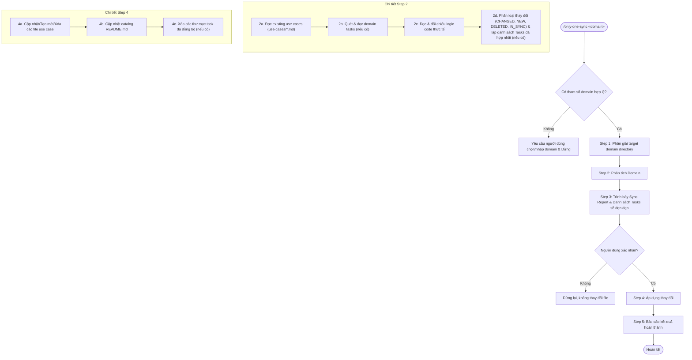

# Kế hoạch nâng cấp workflow /only-one-sync: Bắt buộc chỉ định Domain, Tích hợp đọc Tasks (tùy chọn), quét Code, cập nhật Use Cases và dọn dẹp Tasks đã đồng bộ

## Section 1. Current state

### Hiện trạng luồng `/only-one-sync`
Workflow `/only-one-sync` hiện tại được định nghĩa tại [assets/workflows/only-one-sync.md](file:///Users/kiem/Sources/Personal/only-one-cli/assets/workflows/only-one-sync.md) và được phân phối tới `.agents/workflows/only-one-sync.md` trong các project sử dụng `only-one-cli`.

Luồng làm việc hiện tại:
- **Cú pháp gọi**: `/only-one-sync [<domain>]` (domain là tùy chọn).
- Nếu không có domain: Agent hỏi người dùng có muốn sync toàn bộ domains không (`Sync all`).
- **Phân tích**: Chỉ đọc existing use cases và quét codebase, không đọc các `tasks` trong domain.
- **Không dọn dẹp tasks**: Sau khi sync use cases xong, thư mục task cũ vẫn tích tụ trong `only-one/domains/<domain>/tasks/`.

### Vấn đề và yêu cầu cải tiến
1. **Bắt buộc khai báo domain**: Cú pháp bắt buộc `/only-one-sync <domain>`. Nếu thiếu domain, dừng lại yêu cầu người dùng chọn domain cụ thể.
2. **Kiểm tra tasks trong domain (Không bắt buộc/Tùy chọn)**: Quét thư mục `only-one/domains/<domain>/tasks/`. Nếu có tasks, đọc `plan.md` và `walkthrough.md` để trích xuất ngữ cảnh nghiệp vụ và acceptance criteria. **Nếu không có task nào (thư mục rỗng hoặc chưa từng tạo task)**: Không báo lỗi, tự động bỏ qua bước đọc task và chuyển thẳng sang quét code thực tế.
3. **Đọc và đối chiếu logic code hiện tại**: Quét code thực tế của domain (controllers, services, entities, DTOs, tests) để đối chiếu logic.
4. **Viết lại / Cập nhật tài liệu Use Cases**: Hợp nhất tri thức từ task (nếu có) + code + existing use cases thành bộ use cases chuẩn mực (GIVEN / WHEN / THEN, Preconditions, USE / WHEN statement).
5. **Báo cáo và chờ người dùng xác nhận**: Hiển thị rõ các use cases thay đổi và danh sách task folders sẽ bị dọn dẹp (nếu có).
6. **Dọn dẹp tasks sau khi xác nhận**: Sau khi áp dụng thành công use cases, xóa các task folder tương ứng trong `only-one/domains/<domain>/tasks/` (nếu có task được xử lý).

### Bằng chứng và tệp tham chiếu
- File workflow nguồn: [assets/workflows/only-one-sync.md](file:///Users/kiem/Sources/Personal/only-one-cli/assets/workflows/only-one-sync.md#L1-L216)
- File workflow runtime local: [.agents/workflows/only-one-sync.md](file:///Users/kiem/Sources/Personal/only-one-cli/.agents/workflows/only-one-sync.md#L1-L216)
- Manifest workflow: [assets/workflows/index.ts](file:///Users/kiem/Sources/Personal/only-one-cli/assets/workflows/index.ts#L3-L8)
- Quy trình tạo task/plan liên quan: [assets/workflows/only-one-ag-plan.md](file:///Users/kiem/Sources/Personal/only-one-cli/assets/workflows/only-one-ag-plan.md#L83-L105)
- Quy trình thực thi task liên quan: [assets/workflows/only-one-apply.md](file:///Users/kiem/Sources/Personal/only-one-cli/assets/workflows/only-one-apply.md#L30-L70)

---

## Section 2. Design

### Cú pháp và Quy tắc đầu vào (Strict Input)
- Cú pháp chuẩn:
  ```text
  /only-one-sync <domain>
  ```
- **Bắt buộc có `<domain>`**:
  - Nếu người dùng chạy `/only-one-sync` mà không truyền tham số `<domain>`, Agent **dừng lại ngay lập tức** và yêu cầu người dùng cung cấp tên domain cụ thể (liệt kê danh sách các domain hiện có trong `only-one/domains/` để người dùng chọn).
  - Không tự động sync tất cả domains (`sync all` bị loại bỏ).

### Cơ chế xử lý Tasks mềm dẻo (Optional Task Inspection)
- Khi quét `only-one/domains/<domain>/tasks/`:
  - **Trường hợp có tasks**: Đọc toàn bộ `plan.md` và `walkthrough.md` của các thư mục con trong `tasks/`, đưa vào tập dữ liệu phân tích và đánh dấu các thư mục này vào danh sách dọn dẹp sau khi xác nhận.
  - **Trường hợp KHÔNG có tasks**: Ghi nhận `Tasks: None` và chuyển tiếp mượt mà sang bước đọc code thực tế, không gây lỗi hay gián đoạn luồng làm việc.

### Quy trình 5 bước hoàn chỉnh



---

## Section 3. Implementation architecture

### Cấu trúc tệp thay đổi

```text
[MODIFY] assets/workflows/only-one-sync.md
[MODIFY] .agents/workflows/only-one-sync.md
[MODIFY] assets/workflows/index.ts
```

### Trách nhiệm các tệp:
- `assets/workflows/only-one-sync.md`: Định nghĩa workflow chuẩn trong asset template của CLI, cập nhật cú pháp bắt buộc `<domain>`, quy trình đọc tasks (optional), quét code, đối chiếu, review gate và xóa tasks (nếu có).
- `.agents/workflows/only-one-sync.md`: Bản sao đồng bộ runtime để sử dụng ngay trong workspace.
- `assets/workflows/index.ts`: Cập nhật mô tả tóm tắt của workflow trong manifest.

---

## Section 4. Implementation code examples

### [MODIFY] `assets/workflows/only-one-sync.md`
**Overview:** Cập nhật tài liệu workflow `only-one-sync` với quy chuẩn bắt buộc `<domain>`, tích hợp phân tích tasks (không bắt buộc), quét code logic, cập nhật use cases, hiển thị review gate và dọn dẹp task folders (nếu có).

**Các phần thay đổi chính trong tài liệu:**

#### 1. Input & Validation
```text
## Input

```text
/only-one-sync <domain>
```

- **`<domain>` (Bắt buộc)**: Tên của domain cần đồng bộ (ví dụ: `auth`, `billing`, `washing-machine`).
- **Nếu không truyền domain**: Hiển thị danh sách các domain hiện có trong `only-one/domains/` và yêu cầu người dùng chọn một domain cụ thể trước khi thực hiện. Không hỗ trợ sync hàng loạt toàn bộ domains.
```

#### 2. Step 1 — Resolve target domain
- Kiểm tra sự tồn tại của `only-one/domains/<domain>/`.
- Nếu chưa có: Tự động khởi tạo cấu trúc thư mục `only-one/domains/<domain>/use-cases/` và `only-one/domains/<domain>/tasks/`.

#### 3. Step 2 — Analyze domain
- **2a. Read existing use cases**: Đọc toàn bộ file `.md` trong `only-one/domains/<domain>/use-cases/`.
- **2b. Scan and read domain tasks (Optional)**:
  - Kiểm tra xem thư mục `only-one/domains/<domain>/tasks/` có chứa các thư mục task con hay không.
  - **Nếu có tasks**: Đọc `plan.md` và `walkthrough.md` để trích xuất ngữ cảnh nghiệp vụ, quyết định thiết kế và acceptance criteria đã triển khai.
  - **Nếu không có tasks hoặc thư mục trống**: Bỏ qua bước này và tiếp tục sang bước 2c, ghi nhận không có task nào.
- **2c. Scan codebase for current domain behaviors**: Đọc các file code liên quan trực tiếp đến domain (controllers, services, handlers, entities, DTOs, tests) để kiểm chứng hiện trạng code thực tế.
- **2d. Classify & consolidate**:
  - Phân loại use case: `CHANGED`, `NEW`, `DELETED`, `IN_SYNC`.
  - Liệt kê danh sách `Consolidated Tasks`: Các task folders đã được trích xuất (nếu có).

#### 4. Step 3 — Present sync report & Review Gate
- Định dạng báo cáo rõ ràng:
  - ✏️ CHANGED (`<n>`)
  - 🆕 NEW (`<n>`)
  - 🗑️ DELETED (`<n>`)
  - ✅ IN SYNC (`<n>`)
  - 🧹 TASKS TO CLEAN UP (`<n>` hoặc `None`) - Danh sách đường dẫn thư mục task sẽ được xóa (nếu có).
- Đặt câu hỏi xác nhận:
  - Nếu có tasks cần xóa: `Bạn có muốn áp dụng các thay đổi use case và xóa danh sách task đã đồng bộ ở trên không?`.
  - Nếu không có task nào: `Bạn có muốn áp dụng các thay đổi use case ở trên không?`.
- **Tuyệt đối không thay đổi bất kỳ file nào trước khi có xác nhận.**

#### 5. Step 4 — Apply sync (on user confirmation only)
- Xử lý các use cases DELETED, CHANGED, NEW.
- Cập nhật mục lục `only-one/domains/<domain>/use-cases/README.md`.
- Dọn dẹp thư mục tasks: Nếu có task folders trong danh sách dọn dẹp, tiến hành xóa: `rm -rf only-one/domains/<domain>/tasks/<folder_name>`. Nếu không có thì bỏ qua.

#### 6. Step 5 — Report completion
- Xuất báo cáo tổng kết chi tiết số lượng use cases đã cập nhật/tạo mới/xóa và số lượng thư mục task đã dọn dẹp (nếu có).

### [MODIFY] `.agents/workflows/only-one-sync.md`
**Overview:** Đồng bộ toàn bộ nội dung từ `assets/workflows/only-one-sync.md`.

### [MODIFY] `assets/workflows/index.ts`
**Overview:** Cập nhật description cho `only-one-sync` trong manifest:

```ts
export const WORKFLOWS: WorkflowManifest[] = [
    {
        name: 'only-one-sync',
        description:
            'Sync domain use cases from tasks (if present) and current codebase for a specific domain, then clean up consolidated tasks.',
    },
    // ...
];
```

---

## Section 5. Test cases

### Kịch bản kiểm thử

#### 1. Kiểm thử trường hợp có tasks và không có tasks
- **Objective:** Đảm bảo workflow hoạt động đúng đắn trong cả 2 trường hợp: domain có chứa tasks cũ cần dọn dẹp, và domain hoàn toàn không có task nào.
- **Setup:**
  - Case A: `only-one/domains/<domain>/tasks/` có chứa 2 task folders.
  - Case B: `only-one/domains/<domain>/tasks/` rỗng hoặc không có folder nào.
- **Action:** Kiểm tra logic xử lý Step 2b, Step 3, Step 4c.
- **Expected result:**
  - Case A: Đọc đầy đủ task logic, hiển thị 2 folders trong mục dọn dẹp và xóa sau khi xác nhận.
  - Case B: Chuyển thẳng sang đọc codebase, mục dọn dẹp ghi None, không bị lỗi và chỉ cập nhật use cases.

#### 2. Kiểm thử ràng buộc đầu vào (Mandatory Domain Validation)
- **Objective:** Đảm bảo workflow không cho phép chạy nếu thiếu tham số domain.
- **Setup:** Giả lập gọi `/only-one-sync` không có đối số.
- **Action:** Kiểm tra hành vi phản hồi theo Step 1.
- **Expected result:** Workflow dừng lại, liệt kê các domain hiện có trong `only-one/domains/` và yêu cầu người dùng chỉ định domain.

#### 3. Kiểm thử CLI Build & Test
- **Objective:** Đảm bảo các thay đổi trong assets không làm hỏng build hoặc tests của `only-one-cli`.
- **Precondition:** Thay đổi code/assets hoàn tất.
- **Action:** Chạy `npm run test` và `npm run build`.
- **Expected result:** Toàn bộ test suite pass, biên dịch TypeScript thành công.

### Lệnh kiểm chứng
```bash
npm run test
npm run build
```
