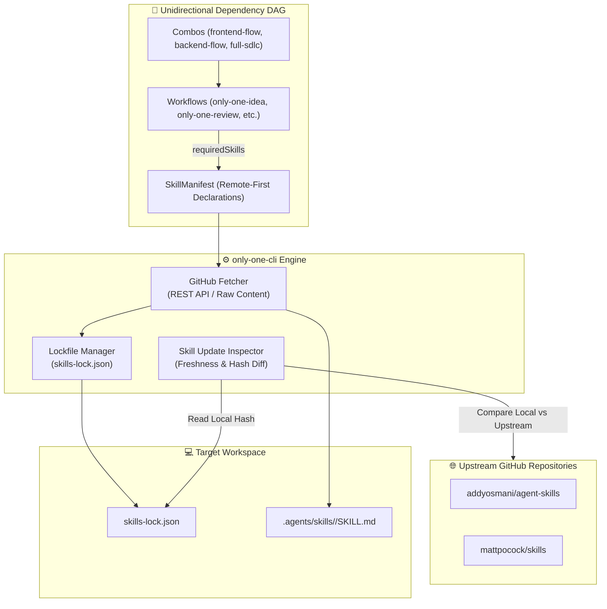

# Kế hoạch Tái cấu trúc Luồng Skills Remote-First, Phụ thuộc 1 chiều (`Workflows -> Skills`) & Thành phần Kiểm định Cập nhật (Skill Update Inspector)

## Section 1. Current state

### 1.1. Luồng thực thi hiện tại
Hệ sinh thái `only-one-cli` quản lý các thực thể Agent theo cấu trúc manifest:
1. **Phụ thuộc ngược (Skill -> Workflow)**: `SkillManifest` hiện đang có trường `associatedWorkflows?: string[]`. Khi cài đặt một skill, CLI ([step-5-execute-and-report.ts](file:///Users/kiem/Sources/Personal/only-one-cli/src/commands/skill/actions/step-5-execute-and-report.ts#L71-L96)) và planner engine ([service-planners.ts](file:///Users/kiem/Sources/Personal/only-one-cli/src/core/agent/service-planners.ts#L90-L122)) mở rộng phụ thuộc ngược để gợi ý cài đặt workflow.
2. **Lưu trữ tĩnh trong mã nguồn**: Các skills bên thứ 3 đang lưu static files trong [assets/skills/](file:///Users/kiem/Sources/Personal/only-one-cli/assets/skills/).
3. **Thiếu cơ chế kiểm tra cập nhật (Outdated Check)**: File [skills-lock.json](file:///Users/kiem/Sources/Personal/only-one-cli/skills-lock.json) lưu cấu trúc mã băm (`computedHash`) và nguồn (`source`), nhưng chưa có engine đối chiếu với GitHub remote để phát hiện skill có bản cập nhật mới hay chưa.

### 1.2. Các file và biểu tượng tham gia
- [assets/types.ts](file:///Users/kiem/Sources/Personal/only-one-cli/assets/types.ts#L49-L60): Khai báo `SkillManifest` (có `associatedWorkflows`) và `WorkflowManifest` (chưa có `requiredSkills`).
- [assets/skills/index.ts](file:///Users/kiem/Sources/Personal/only-one-cli/assets/skills/index.ts#L1-L45): Khai báo danh mục `SKILLS`.
- [assets/workflows/index.ts](file:///Users/kiem/Sources/Personal/only-one-cli/assets/workflows/index.ts#L1-L29): Khai báo `WORKFLOWS`.
- [assets/combos/index.ts](file:///Users/kiem/Sources/Personal/only-one-cli/assets/combos/index.ts#L1-L35): Khai báo `COMBOS`.
- [src/core/agent/service-planners.ts](file:///Users/kiem/Sources/Personal/only-one-cli/src/core/agent/service-planners.ts#L90-L122): Mở rộng phụ thuộc `associatedWorkflows`.
- [src/core/doctor/checks.ts](file:///Users/kiem/Sources/Personal/only-one-cli/src/core/doctor/checks.ts#L1-L60): Các hạng mục kiểm tra sức khỏe hệ thống của `only-one doctor`.
- [skills-lock.json](file:///Users/kiem/Sources/Personal/only-one-cli/skills-lock.json#L1-L12): Lockfile lưu trữ metadata skill.

### 1.3. Vấn đề và định hướng tái cấu trúc
1. **Loại bỏ phụ thuộc ngược**: Xóa bỏ hoàn toàn `associatedWorkflows` trong `SkillManifest`.
2. **Chuẩn hóa phụ thuộc 1 chiều (`Workflows -> Skills`)**: Thêm `requiredSkills?: string[]` vào `WorkflowManifest` để Workflow tự điều phối các Skills cần thiết.
3. **Cơ chế Remote-First**: Không lưu static `SKILL.md` bên thứ 3 trong repo CLI; fetch trực tiếp từ GitHub upstream và quản lý hash qua `skills-lock.json`.
4. **Bổ sung Thành phần Kiểm định Cập nhật (Skill Update Inspector)**: Cung cấp API và lệnh CLI (`only-one skill outdated`, tích hợp `only-one doctor`) đối chiếu SHA-256 hash giữa local lockfile và GitHub upstream để nhận biết skill đã có bản cập nhật mới hay chưa.
5. **Bổ sung Workflow Tiền trạm Ý tưởng (`/only-one-idea`)**: Khám phá và làm rõ ý tưởng thô trước khi bước vào lập plan chi tiết.

### 1.4. Hành vi bắt buộc giữ nguyên
- Giữ nguyên cơ chế tương thích với các IDE/Agent targets (`.agents/skills/`, `.cursor/skills/`, `.claude/skills/`).
- Giữ nguyên cấu trúc 5 phần của `plan.md` trong `/only-one-ag-plan` và luồng DDD `only-one/domains/<domain>/tasks/`.
- Giữ nguyên hoạt động của các lệnh CLI `only-one combo`, `only-one init`.

---

## Section 2. Design

### Kiến trúc Hệ thống Tổng thể



### Chi tiết các khối thiết kế:

#### 1. Chuẩn hóa Manifest Types (`assets/types.ts`)
- **Xóa `associatedWorkflows`** trong `SkillManifest`.
- **Thêm `requiredSkills?: string[]`** vào `WorkflowManifest`.
- **Thêm `source`, `sourceType: 'github' | 'local'`, `skillPath`** vào `SkillManifest`.

#### 2. Skill Update Inspector (`src/core/skill/remote/inspector.ts`)
Module kiểm tra tính mới của skills:
- Đọc `skills-lock.json` để lấy `computedHash` của từng skill đang cài.
- Gửi HTTP request lấy SHA-256 hash của `SKILL.md` mới nhất trên GitHub upstream.
- Phân loại trạng thái:
  - `up-to-date`: Hash trùng khớp hoàn toàn.
  - `update-available`: Upstream có commit mới (hash khác biệt).
  - `local-modified`: File local bị sửa đổi thủ công.
  - `offline`: Không có mạng để đối chiếu.

#### 3. CLI Commands mở rộng
- `only-one skill outdated`: Liệt kê bảng trạng thái các skills đã cài (Local Hash vs Remote Hash, trạng thái `[Up to date]` hoặc `[Update Available]`).
- `only-one skill update [name]`: Tự động tải bản mới nhất từ upstream và cập nhật `skills-lock.json`.
- `only-one doctor`: Tích hợp bước kiểm tra độ mới của Skills (`checkSkillsFreshness`).

#### 4. Workflow Khám phá Ý tưởng (`/only-one-idea`) & Combo Updates
- Bổ sung `only-one-idea.md`: Phỏng vấn 1 câu/lần đến khi đạt ~95% confidence, xuất ra `concept.md`.
- Cập nhật các Combo `frontend-flow`, `backend-flow`, `full-sdlc-flow` để tự động kéo trọn bộ workflows và skills.

---

## Section 3. Implementation architecture

### Cây thư mục dự kiến

```text
assets/
├── combos/
│   └── index.ts                              [MODIFY]
├── skills/
│   └── index.ts                              [MODIFY]
├── types.ts                                  [MODIFY]
├── workflows/
│   ├── only-one-ag-plan.md                   [MODIFY]
│   ├── only-one-apply.md                     [MODIFY]
│   ├── only-one-debug.md                     [NEW]
│   ├── only-one-idea.md                      [NEW]
│   ├── only-one-review.md                    [NEW]
│   └── index.ts                              [MODIFY]
src/
├── commands/
│   ├── skill/
│   │   ├── actions/
│   │   │   ├── step-1-load-manifests.ts      [MODIFY]
│   │   │   ├── step-5-execute-and-report.ts  [MODIFY]
│   │   │   └── step-outdated-report.ts       [NEW]
│   │   └── command.ts                        [MODIFY]
│   └── workflow/
│       ├── actions/
│       │   ├── step-execute-and-report.ts    [MODIFY]
│       │   └── index.ts                      [MODIFY]
│       └── command.ts                        [MODIFY]
└── core/
    ├── agent/
    │   └── service-planners.ts               [MODIFY]
    ├── doctor/
    │   └── checks.ts                         [MODIFY]
    └── skill/
        ├── remote/
        │   ├── github-fetcher.ts             [NEW]
        │   ├── inspector.ts                  [NEW]
        │   ├── lockfile.ts                   [NEW]
        │   └── types.ts                      [NEW]
        └── index.ts                          [MODIFY]
```

### Danh sách thay đổi chi tiết

- `[MODIFY]` [assets/types.ts](file:///Users/kiem/Sources/Personal/only-one-cli/assets/types.ts): Xóa `associatedWorkflows`, thêm `requiredSkills` vào `WorkflowManifest`, thêm `source`, `sourceType`, `skillPath` vào `SkillManifest`.
- `[MODIFY]` [assets/skills/index.ts](file:///Users/kiem/Sources/Personal/only-one-cli/assets/skills/index.ts): Khai báo danh mục Skills Remote-First trỏ về `addyosmani/agent-skills`, `mattpocock/skills`.
- `[MODIFY]` [assets/workflows/index.ts](file:///Users/kiem/Sources/Personal/only-one-cli/assets/workflows/index.ts): Khai báo `requiredSkills` cho `only-one-idea`, `only-one-review`, `only-one-debug`, `only-one-clockify`, `only-one-pr-git`.
- `[MODIFY]` [assets/combos/index.ts](file:///Users/kiem/Sources/Personal/only-one-cli/assets/combos/index.ts): Cập nhật các Combo bundles.
- `[NEW]` `src/core/skill/remote/types.ts`: Định nghĩa kiểu dữ liệu `RemoteSkillMeta`, `SkillsLockfile`, `SkillStatusReport`.
- `[NEW]` `src/core/skill/remote/inspector.ts`: Engine kiểm tra độ mới của Skills so với GitHub.
- `[NEW]` `src/core/skill/remote/github-fetcher.ts`: Tải nội dung từ GitHub REST API / Raw Content và tính SHA-256.
- `[NEW]` `src/core/skill/remote/lockfile.ts`: Quản lý đọc, ghi và cập nhật `skills-lock.json`.
- `[MODIFY]` `src/core/skill/index.ts`: Nâng cấp hàm `installSkills` hỗ trợ fetch động từ remote.
- `[MODIFY]` `src/core/doctor/checks.ts`: Thêm hàm `checkSkillsFreshness` vào báo cáo Doctor.
- `[MODIFY]` `src/commands/skill/command.ts`: Thêm lệnh `only-one skill outdated` và `only-one skill update`.
- `[NEW]` [assets/workflows/only-one-idea.md](file:///Users/kiem/Sources/Personal/only-one-cli/assets/workflows/only-one-idea.md): Workflow khám phá ý tưởng trước khi lập plan.
- `[NEW]` [assets/workflows/only-one-debug.md](file:///Users/kiem/Sources/Personal/only-one-cli/assets/workflows/only-one-debug.md): Workflow sửa lỗi RCA nhanh.
- `[NEW]` [assets/workflows/only-one-review.md](file:///Users/kiem/Sources/Personal/only-one-cli/assets/workflows/only-one-review.md): Workflow 5-axis code review.
- `[MODIFY]` [assets/workflows/only-one-ag-plan.md](file:///Users/kiem/Sources/Personal/only-one-cli/assets/workflows/only-one-ag-plan.md) và [assets/workflows/only-one-apply.md](file:///Users/kiem/Sources/Personal/only-one-cli/assets/workflows/only-one-apply.md).

---

## Section 4. Implementation code examples

#### [MODIFY] `assets/types.ts`
**Overview:** Cập nhật các kiểu dữ liệu Manifest.

```typescript
export interface SkillManifest {
    name: string;
    description: string;
    source?: string;
    sourceType?: 'github' | 'local';
    skillPath?: string;
}

export interface WorkflowManifest {
    name: string;
    description: string;
    requiredSkills?: string[];
    requiredMcps?: string[];
}
```

#### [NEW] `src/core/skill/remote/types.ts`
**Overview:** Định nghĩa kiểu dữ liệu cho remote skill registry, lockfile và inspector report.

```typescript
export type SkillSyncState = 'up-to-date' | 'update-available' | 'local-modified' | 'not-installed' | 'offline';

export interface RemoteSkillMeta {
    name: string;
    description?: string;
    source: string;
    sourceType: 'github';
    branch?: string;
    skillPath: string;
    computedHash: string;
    installedAt?: string;
    updatedAt?: string;
}

export interface SkillsLockfile {
    version: number;
    skills: Record<string, RemoteSkillMeta>;
}

export interface SkillStatusReport {
    skillName: string;
    source: string;
    currentHash: string;
    remoteHash?: string;
    state: SkillSyncState;
    lastUpdated?: string;
}
```

#### [NEW] `src/core/skill/remote/inspector.ts`
**Overview:** Thành phần kiểm định cập nhật (Skill Update Inspector) đối chiếu local hash và GitHub remote hash.

```typescript
import { readSkillsLockfile } from './lockfile.js';
import { fetchSkillContentFromGitHub } from './github-fetcher.js';
import type { SkillStatusReport } from './types.js';

export async function checkSkillFreshness(projectDir: string, skillName: string): Promise<SkillStatusReport> {
    const lock = await readSkillsLockfile(projectDir);
    const meta = lock.skills[skillName];

    if (!meta) {
        return {
            skillName,
            source: 'unknown',
            currentHash: '',
            state: 'not-installed',
        };
    }

    try {
        const { hash: remoteHash } = await fetchSkillContentFromGitHub(meta.source, meta.skillPath, meta.branch || 'main');
        const state = meta.computedHash === remoteHash ? 'up-to-date' : 'update-available';

        return {
            skillName,
            source: meta.source,
            currentHash: meta.computedHash,
            remoteHash,
            state,
            lastUpdated: meta.updatedAt || meta.installedAt,
        };
    } catch {
        return {
            skillName,
            source: meta.source,
            currentHash: meta.computedHash,
            state: 'offline',
            lastUpdated: meta.updatedAt || meta.installedAt,
        };
    }
}

export async function checkAllSkillsFreshness(projectDir: string): Promise<SkillStatusReport[]> {
    const lock = await readSkillsLockfile(projectDir);
    const names = Object.keys(lock.skills);
    return Promise.all(names.map((name) => checkSkillFreshness(projectDir, name)));
}
```

#### [NEW] `src/core/skill/remote/github-fetcher.ts`
**Overview:** Tải nội dung file từ GitHub và tính SHA-256 hash.

```typescript
import { createHash } from 'node:crypto';

export async function fetchSkillContentFromGitHub(source: string, skillPath: string, branch = 'main'): Promise<{ content: string; hash: string }> {
    const rawUrl = `https://raw.githubusercontent.com/${source}/${branch}/${skillPath}`;
    const headers: Record<string, string> = {
        'User-Agent': 'only-one-cli',
    };
    if (process.env.GITHUB_TOKEN) {
        headers.Authorization = `Bearer ${process.env.GITHUB_TOKEN}`;
    }

    const res = await fetch(rawUrl, { headers });
    if (!res.ok) {
        throw new Error(`Failed to fetch skill from ${rawUrl}: ${res.statusText}`);
    }

    const content = await res.text();
    const hash = createHash('sha256').update(content, 'utf-8').digest('hex');
    return { content, hash };
}
```

#### [MODIFY] `src/core/doctor/checks.ts`
**Overview:** Tích hợp kiểm tra độ mới của Skills vào `only-one doctor`.

```typescript
import { checkAllSkillsFreshness } from '@/core/skill/remote/inspector.js';

export async function checkSkillsFreshness(projectDir: string): Promise<CheckResult> {
    try {
        const reports = await checkAllSkillsFreshness(projectDir);
        const outdated = reports.filter((r) => r.state === 'update-available');
        
        if (outdated.length > 0) {
            return {
                name: 'skills-freshness',
                ok: true,
                detail: `${outdated.length} skill(s) have updates available (${outdated.map((s) => s.skillName).join(', ')})`,
                required: false,
                remediation: `Run 'only-one skill update' to update to latest versions`,
            };
        }
        return {
            name: 'skills-freshness',
            ok: true,
            detail: 'All installed skills are up-to-date',
            required: false,
        };
    } catch {
        return {
            name: 'skills-freshness',
            ok: true,
            detail: 'Skipped skill freshness check (offline or no lockfile)',
            required: false,
        };
    }
}
```

---

## Section 5. Test cases

### 5.1. Test cases toàn diện
1. **TC-INSPECTOR-001: Detect Up-to-Date vs Outdated Skill**
   - **Objective:** Xác minh `checkSkillFreshness` phát hiện chính xác khi remote hash thay đổi.
   - **Action:** Mock fetch GitHub với 2 mã hash (1 khớp, 1 lệch).
   - **Expected Result:** Trả về `up-to-date` khi khớp và `update-available` khi lệch.

2. **TC-DAG-002: Workflow to Skills Dependency Resolution**
   - **Objective:** Đảm bảo khi cài đặt `only-one-review`, hệ thống tự động nhận diện `requiredSkills: ['security-audit', 'code-simplify', 'webperf']`.
   - **Expected Result:** Cài đặt đầy đủ 3 skills mà không cần `associatedWorkflows` trong SkillManifest.

3. **TC-UPDATE-CMD-003: Update Outdated Skill via CLI**
   - **Objective:** Chạy `only-one skill update` để cập nhật skill có trạng thái `update-available`.
   - **Expected Result:** File `SKILL.md` được ghi đè bằng nội dung mới và `skills-lock.json` cập nhật `computedHash` mới.

### 5.2. Verified Repository Commands
```bash
npm run format:check
npm run build
npm test
```
