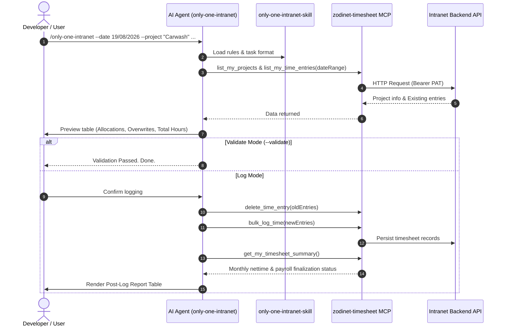
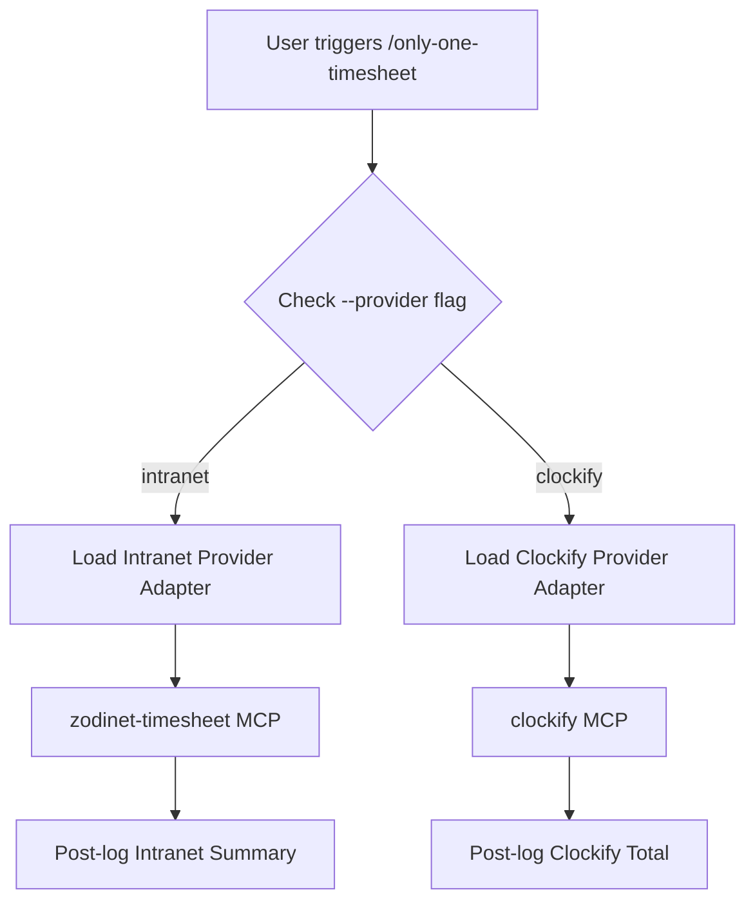

# Technical Proposal: Workflow & Skill `only-one-intranet` with Post-Log Reporting

## 1. Problem Statement & Core Concept

- **Core Business Problem**: 
  Employees currently need to log daily work tasks either manually via the Intranet Web UI or through ad-hoc MCP tool invocations without standardization. While `only-one-cli` already supports automated time-tracking via `only-one-clockify`, there is no built-in, first-class workflow for the company's internal **Timesheet MCP Server** (`zodinet-timesheet`). Furthermore, users need an automated post-log summary report (monthly net time, total logged hours, and payroll finalization status) to ensure their timesheet conforms to payroll policies without having to check the UI manually.

- **Core Value & Target Audience**: 
  - **Target Audience**: Developers, team leads, and internal employees using Antigravity, Cursor, Claude Code, Codex, or Claude Desktop.
  - **Core Value**: Enables one-shot task parsing, date slot allocation, duplicate replacement, atomic logging via MCP tools (`bulk_log_time` / `log_time`), and immediate monthly timesheet balance reporting.

- **Success Metrics (Definition of Done)**:
  - 100% automated workflow via `/only-one-intranet` command.
  - Validation-only mode (`--validate`) performs zero mutations on the server.
  - Automatic weekend skipping (shifts Saturday/Sunday to Monday).
  - Safe replacement lifecycle: snapshot old entries $\rightarrow$ delete $\rightarrow$ create new entries $\rightarrow$ rollback on failure.
  - Automatic post-log reporting: immediately queries and renders `get_my_timesheet_summary` table after successful logging.
  - Full compatibility with `only-one` CLI init, combos, templates, and MCP syncing.

- **Scope Boundaries**:
  - **In-Scope**:
    - Workflow specification: [assets/workflows/only-one-intranet.md](file:///Users/kiem/Sources/Personal/only-one-cli/assets/workflows/only-one-intranet.md)
    - Skill package: [assets/skills/only-one-intranet-skill/SKILL.md](file:///Users/kiem/Sources/Personal/only-one-cli/assets/skills/only-one-intranet-skill/SKILL.md), [task-format.md](file:///Users/kiem/Sources/Personal/only-one-cli/assets/skills/only-one-intranet-skill/references/task-format.md), [validation-rules.md](file:///Users/kiem/Sources/Personal/only-one-cli/assets/skills/only-one-intranet-skill/references/validation-rules.md)
    - MCP Manifest registration: [assets/mcps/index.ts](file:///Users/kiem/Sources/Personal/only-one-cli/assets/mcps/index.ts) for `zodinet-timesheet`
    - CLI Template & Command Mapping: [src/core/templates/agent-workflows.ts](file:///Users/kiem/Sources/Personal/only-one-cli/src/core/templates/agent-workflows.ts), [assets/combos/index.ts](file:///Users/kiem/Sources/Personal/only-one-cli/assets/combos/index.ts)
  - **Explicit Out-of-Scope**:
    - Modifying the remote Intranet API or hosting a local timesheet server.
    - Automatic generation of fake task descriptions (must be provided by the user).
    - Payroll period finalization mutations (read-only reporting only).

---

## 2. Current Business Logic (As-is Analysis)

- **Existing Workflow**: [assets/workflows/only-one-clockify.md](file:///Users/kiem/Sources/Personal/only-one-cli/assets/workflows/only-one-clockify.md) defines time tracking for Clockify via [assets/skills/only-one-clockify-skill/SKILL.md](file:///Users/kiem/Sources/Personal/only-one-cli/assets/skills/only-one-clockify-skill/SKILL.md).
- **Existing MCP Registry**: [assets/mcps/index.ts](file:///Users/kiem/Sources/Personal/only-one-cli/assets/mcps/index.ts) supports `clockify`, `fetch`, `github`, `gitnexus`, `memory`, `notion`, `postgres`, `tavily`.
- **Identified Limitations**:
  - `clockify` MCP targets Clockify REST API, incompatible with the internal `zodinet-timesheet` MCP endpoints and tool schema (`list_my_time_entries`, `get_my_timesheet_summary`, `list_my_projects`, `bulk_log_time`, `log_time`, `update_time_entry`, `delete_time_entry`).
  - No existing workflow displays monthly payroll balance or net time reports after logging.

---

## 3. Proposed Solution Alternatives

### Option 1 (Recommended): Dedicated `only-one-intranet` Workflow & Skill with Post-Log Reporting

- **Solution Overview & Mechanics**:
  - Author a dedicated workflow `/only-one-intranet` and skill `only-one-intranet-skill`.
  - Register `zodinet-timesheet` MCP in `assets/mcps/index.ts` (using `mcp-remote` bridge or remote streamable URL depending on client adapter).
  - Provide a 5-step operational pipeline:
    1. Parse & validate input arguments (`--date`, `--project`, `--tasks-per-day`, `--validate`) and task lines (`[Tag] Description | 9-13h`).
    2. Query `list_my_projects` to validate project ID/name and `list_my_time_entries` for existing entries in the range.
    3. Generate preview (dates, slots, tasks to log, tasks to replace, total hours). If `--validate`, terminate cleanly.
    4. Upon user confirmation, snapshot old entries $\rightarrow$ delete $\rightarrow$ execute `bulk_log_time` / `log_time`.
    5. Query `get_my_timesheet_summary` and output a structured Markdown report showing monthly net time, total hours logged, and payroll status.

- **Mermaid Diagram (Architecture & Execution Flow)**:



- **Pros**:
  - Independent, clean separation of concerns matching the existing `only-one-clockify` pattern.
  - Native support for `zodinet-timesheet` specific capabilities (e.g. `bulk_log_time`, `get_my_timesheet_summary`).
  - No risk of breaking existing Clockify users or configs.
- **Cons**:
  - Requires maintaining two parallel time-tracking workflow assets.
- **Complexity & Risks**: Low complexity, low risk.

---

### Option 2 (Alternative): Unified Multi-Provider Workflow `/only-one-timesheet`

- **Solution Overview & Mechanics**:
  - Consolidate `only-one-clockify` and `only-one-intranet` into a single `/only-one-timesheet` workflow with a `--provider <clockify|intranet>` parameter (or auto-detection based on active MCP).
  - Common parser and validator for task grammar.

- **Mermaid Diagram (Flowchart)**:



- **Pros**:
  - Single command entry point for all time-tracking systems.
- **Cons**:
  - Higher complexity due to diverging provider capabilities (Clockify uses workspaces/projects; Intranet uses user assignments, bulk log, and monthly payroll summaries).
  - Breaking change if replacing `/only-one-clockify` or adding redundant abstractions.
- **Complexity & Risks**: Moderate complexity, risk of configuration confusion.

---

### Comparison Matrix & Recommendation

| Criteria | Option 1: Dedicated `only-one-intranet` (Recommended) | Option 2: Unified Multi-Provider |
| :--- | :--- | :--- |
| **Simplicity & Maintainability** | High (Direct 1:1 mapping with MCP) | Medium (Extra abstraction layer) |
| **User Experience** | Intuitive (`/only-one-intranet` vs `/only-one-clockify`) | Requires extra `--provider` flag |
| **Extensibility** | Easy to tailor to Intranet features (Payroll report) | Harder to specialize per provider |
| **Risk to Existing Workflows** | Zero risk | Moderate risk of regression |

- **Conclusion**: Recommend **Option 1** because it strictly follows `only-one-cli`'s modular design, provides maximum ergonomics for Intranet users, and includes dedicated post-log summary reporting.

---

## 4. Key Failure Modes & Security Boundaries

- **Authentication & Token Security**:
  - Intranet PAT tokens (`TIMESHEET_PAT` / `zmcp_...`) are passed via environment variables or secure MCP config headers, never printed in CLI output or hardcoded in repository files.
  - 401 Unauthorized errors must prompt the user with clear instructions to re-mint a token from the Intranet UI.
- **Atomic Operations & Rollback on Failure**:
  - Before deleting any existing entries during an overwrite, the skill must take an in-memory snapshot of old entry data (`id`, `date`, `slot`, `description`, `projectId`).
  - If `bulk_log_time` / `log_time` fails midway, the skill immediately attempts to restore deleted entries and outputs a detailed recovery report.
- **Payroll Lock Protection**:
  - If `get_my_timesheet_summary` indicates that the period is finalized or locked, mutations must be aborted before deletion.

---

## 5. High-Level Technical Specifications

### File Changes & Additions

1. **Workflow Asset**:
   - `[NEW]` [assets/workflows/only-one-intranet.md](file:///Users/kiem/Sources/Personal/only-one-cli/assets/workflows/only-one-intranet.md): Workflow description, command syntax, arguments, execution protocol.
2. **Skill Asset & References**:
   - `[NEW]` [assets/skills/only-one-intranet-skill/SKILL.md](file:///Users/kiem/Sources/Personal/only-one-cli/assets/skills/only-one-intranet-skill/SKILL.md): Skill metadata, inputs, required references, workflow steps, guardrails.
   - `[NEW]` [assets/skills/only-one-intranet-skill/references/task-format.md](file:///Users/kiem/Sources/Personal/only-one-cli/assets/skills/only-one-intranet-skill/references/task-format.md): Grammar specification `[Label] Description | start-endh`.
   - `[NEW]` [assets/skills/only-one-intranet-skill/references/validation-rules.md](file:///Users/kiem/Sources/Personal/only-one-cli/assets/skills/only-one-intranet-skill/references/validation-rules.md): Validation, allocation, replacement, summary report formatting rules.
3. **MCP Manifests**:
   - `[MODIFY]` [assets/mcps/index.ts](file:///Users/kiem/Sources/Personal/only-one-cli/assets/mcps/index.ts): Add `zodinet-timesheet` server config with `mcp-remote` bridge and `TIMESHEET_PAT` env.
4. **Core Templates & Combos**:
   - `[MODIFY]` [src/core/templates/agent-workflows.ts](file:///Users/kiem/Sources/Personal/only-one-cli/src/core/templates/agent-workflows.ts): Add `AgentWorkflowCommandId.Intranet`, content builder, tags, and skill bindings.
   - `[MODIFY]` [assets/combos/index.ts](file:///Users/kiem/Sources/Personal/only-one-cli/assets/combos/index.ts): Register `only-one-intranet` in development combos.
5. **Assets Indexing**:
   - `[MODIFY]` [assets/skills/index.ts](file:///Users/kiem/Sources/Personal/only-one-cli/assets/skills/index.ts): Export metadata for `only-one-intranet-skill`.
   - `[MODIFY]` [assets/workflows/index.ts](file:///Users/kiem/Sources/Personal/only-one-cli/assets/workflows/index.ts): Export metadata for `only-one-intranet`.

---

## 6. Post-Logging Summary Report Specification

After tasks are logged, the workflow will query `get_my_timesheet_summary` and format the response as follows:

```markdown
### 📊 Timesheet Summary Report (Tháng MM/YYYY)

| Metric | Giá trị |
| :--- | :--- |
| **Tổng số giờ vừa log** | `8.0h` (2 tasks) |
| **Tổng giờ làm trong tháng (Net Time)** | `168.0h` / `168.0h` (100%) |
| **Trạng thái kỳ tính lương** | 🟢 Đang mở (Open) |

✅ **Tất cả các task đã được ghi nhận thành công lên hệ thống Intranet.**
```

---

## 7. Next Steps

- User confirms the proposal in `concept.md`.
- Run `/only-one-plan only-one/tasks/20260819-150535-workflow-only-one-intranet` to generate the detailed 5-section `plan.md`.
