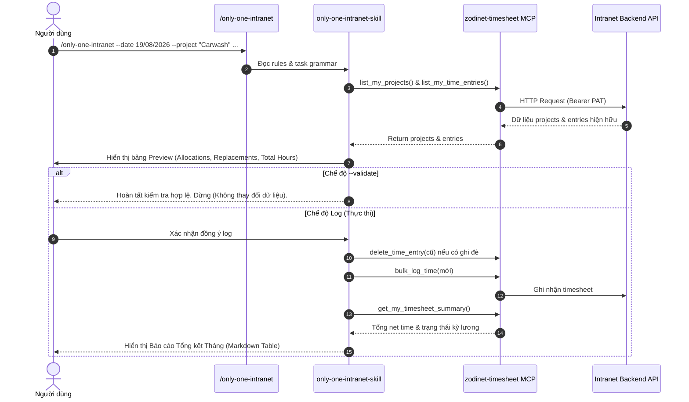

# Kế hoạch Triển khai: Workflow & Skill `only-one-intranet` với MCP `zodinet-timesheet`

## Section 1. Hiện trạng (Current State)

### 1. Phân tích Hiện trạng Hệ thống & Codebase
- **Quản lý Agent Workflows**: Hệ thống `only-one-cli` hiện định nghĩa các workflow tự động hóa trong [src/core/templates/agent-workflows.ts](file:///Users/kiem/Sources/Personal/only-one-cli/src/core/templates/agent-workflows.ts). Các workflow như `only-one-clockify`, `only-one-pr-git`, `only-one-ui` được đăng ký qua `AgentWorkflowCommandId`, liên kết với skill và MCP tương ứng.
- **Workflow & Skill Assets**:
  - File workflow mẫu: [assets/workflows/only-one-clockify.md](file:///Users/kiem/Sources/Personal/only-one-cli/assets/workflows/only-one-clockify.md) tiếp nhận tham số `--date`, `--project`, `--tasks-per-day`, `--validate` cùng danh sách task.
  - Skill mẫu: [assets/skills/only-one-clockify-skill/SKILL.md](file:///Users/kiem/Sources/Personal/only-one-cli/assets/skills/only-one-clockify-skill/SKILL.md), [task-format.md](file:///Users/kiem/Sources/Personal/only-one-cli/assets/skills/only-one-clockify-skill/references/task-format.md), [validation-rules.md](file:///Users/kiem/Sources/Personal/only-one-cli/assets/skills/only-one-clockify-skill/references/validation-rules.md).
- **MCP Registry & Combos**:
  - [assets/mcps/index.ts](file:///Users/kiem/Sources/Personal/only-one-cli/assets/mcps/index.ts) định nghĩa các server manifest (`clockify`, `fetch`, `github`, `gitnexus`, `memory`, `notion`, `postgres`, `tavily`).
  - [assets/combos/index.ts](file:///Users/kiem/Sources/Personal/only-one-cli/assets/combos/index.ts) định nghĩa các bộ combo setup (`dev-full-flow`, `git-clockify-flow`).
  - [assets/skills/index.ts](file:///Users/kiem/Sources/Personal/only-one-cli/assets/skills/index.ts) & [assets/workflows/index.ts](file:///Users/kiem/Sources/Personal/only-one-cli/assets/workflows/index.ts) quản lý danh mục khai báo static của skills và workflows.

### 2. Hạn chế & Vấn đề Cần giải quyết
- Chưa có workflow chuẩn cho hệ thống **Timesheet Intranet nội bộ** (`zodinet-timesheet` MCP server).
- Các công cụ đặc thù của `zodinet-timesheet` (`list_my_time_entries`, `get_my_timesheet_summary`, `list_my_projects`, `bulk_log_time`, `log_time`, `update_time_entry`, `delete_time_entry`) chưa được tích hợp vào luồng thao tác tự động của AI Agent.
- Người dùng chưa có tính năng tự động xuất báo cáo tổng kết tháng (Net time, giờ lũy kế, trạng thái chốt kỳ lương) ngay sau khi log giờ hoàn tất.

### 3. Danh sách Hành vi Hiện tại Bắt buộc Giữ nguyên (Regression Guard)
- Toàn bộ hành vi của `only-one-clockify`, `only-one-pr-git`, `only-one-ui` và các workflow core (`only-one-idea`, `only-one-plan`, `only-one-apply`, `only-one-debug`, `only-one-review`).
- Cơ chế khởi tạo MCP command adapters cho Cursor, Antigravity, Claude Code, Codex.
- Bộ test suite hiện có của `test/core/agent-workflows.test.ts`, `test/core/workflow-registry.test.ts`, `test/core/skill-registry.test.ts`.

---

## Section 2. Thiết kế chi tiết (Detailed Design)

### 1. Luồng Hoạt động Cốt lõi của `only-one-intranet`
Workflow `/only-one-intranet` và skill `only-one-intranet-skill` được thiết kế theo 5 bước tuần tự:

```text
[1. Parse & Validate] ──> [2. Query MCP Server] ──> [3. Preview & Confirm] ──> [4. Safe Replace & Log] ──> [5. Post-Log Summary]
   - Parse args:           - list_my_projects          - Render markdown table   - Snapshot old entries     - get_my_timesheet_summary
     --date, --project,      - list_my_time_entries      - In --validate mode:     - delete_time_entry        - Render summary table:
     --tasks-per-day,        - Detect conflicts /          stop cleanly            - bulk_log_time /            * Hours logged
     --validate                replacements            - In log mode:                log_time                 * Month net time
   - Parse tasks:                                        Wait user confirm       - Rollback on failure        * Payroll period status
     [Tag] Desc | Slot
```

### 2. Quy tắc Xử lý Nghiệp vụ & Edge Cases
- **Xác thực Project**: Tra cứu danh sách project được phân công qua `list_my_projects`. Nếu không khớp chính xác, gợi ý danh sách gần đúng và dừng thao tác.
- **Phân bổ Ngày làm việc**: Bắt đầu từ `--date`. Bỏ qua thứ Bảy & Chủ Nhật (tự động tịnh tiến sang thứ Hai kế tiếp và thông báo rõ ngày gốc vs ngày điều chỉnh). Tối đa `tasks-per-day` (mặc định: 2) tasks/ngày.
- **Xử lý Trùng lặp & Ghi đè An toàn (Safe Atomic Replacement)**:
  - Tra cứu các entry cũ trùng ngày & khung giờ (slot) qua `list_my_time_entries`.
  - Lưu snapshot bộ nhớ của các entry cũ trước khi xóa.
  - Xóa các entry cũ (`delete_time_entry`), sau đó ghi các entry mới qua `bulk_log_time` (hoặc `log_time`).
  - Nếu quá trình ghi mới gặp lỗi, lập tức kích hoạt cơ chế khôi phục (restore) lại các entry cũ từ snapshot và báo cáo chi tiết.
- **Báo cáo Tổng kết Sau khi Log (Post-Log Summary Report)**:
  - Sau khi ghi nhận thành công, skill tự động gọi `get_my_timesheet_summary`.
  - Hiển thị bảng Markdown tổng hợp: Số giờ vừa log, tổng số giờ net time lũy kế trong tháng/kỳ, tỉ lệ hoàn thành, và trạng thái kỳ tính lương (Open/Finalized).

### 3. Đánh giá Rủi ro & Biện pháp Phòng ngừa (Red-Team Sanity Check)
- `CLAIM`: Dùng `mcp-remote` làm bridge cho MCP `zodinet-timesheet` trong manifest.
  - `DOUBT`: Liệu `mcp-remote` có hoạt động ổn định trên cả Claude Desktop, Codex và Antigravity không?
  - `RECONCILE`: Cấu hình MCP manifest dạng chuẩn stdio với `npx -y mcp-remote https://intranet-api.vn02.zodinet.tech/api/mcp --header Authorization:Bearer ${TIMESHEET_PAT}`. Đồng thời tài liệu hướng dẫn nêu rõ cách cấu hình Native Streamable HTTP cho các IDE hỗ trợ trực tiếp (như Antigravity/Cursor). Token `TIMESHEET_PAT` được giữ trong `env`, không bao giờ hardcode vào repo hay in ra log.

---

## Section 3. Kiến trúc Triển khai (Implementation Architecture)

### 1. Cấu trúc Thư mục & Files Thay đổi

```text
only-one-cli/
├── assets/
│   ├── combos/
│   │   └── index.ts                                        [MODIFY] Thêm only-one-intranet vào combo
│   ├── mcps/
│   │   └── index.ts                                        [MODIFY] Đăng ký zodinet-timesheet manifest
│   ├── skills/
│   │   ├── index.ts                                        [MODIFY] Khai báo only-one-intranet-skill
│   │   └── only-one-intranet-skill/
│   │       ├── references/
│   │       │   ├── task-format.md                          [NEW] Quy chuẩn định dạng task & slot
│   │       │   └── validation-rules.md                     [NEW] Quy tắc kiểm tra, phân bổ, replace & report
│   │       └── SKILL.md                                    [NEW] Skill definition cho intranet timesheet
│   └── workflows/
│       ├── index.ts                                        [MODIFY] Khai báo only-one-intranet workflow
│       └── only-one-intranet.md                            [NEW] Workflow command markdown
├── src/
│   └── core/
│       └── templates/
│           └── agent-workflows.ts                          [MODIFY] Thêm AgentWorkflowCommandId.Intranet & builder
└── test/
    └── core/
        └── agent-workflows.test.ts                         [MODIFY] Thêm test contract cho only-one-intranet
```

### 2. Sequence Diagram: Tương tác Hệ thống



---

## Section 4. Code Mẫu Minh họa (Implementation Code Examples)

### 1. `[NEW]` [assets/workflows/only-one-intranet.md](file:///Users/kiem/Sources/Personal/only-one-cli/assets/workflows/only-one-intranet.md)
*Mục đích*: Định nghĩa workflow `/only-one-intranet` tiếp nhận input và điều phối `only-one-intranet-skill`.

```markdown
---
description: Validate, log Intranet timesheet entries, and output monthly summary using only-one-intranet-skill and zodinet-timesheet MCP.
---

Use skill `only-one-intranet-skill` to validate, preview, log work entries, and review timesheet status through the configured `zodinet-timesheet` MCP server.

## Input

```text
/only-one-intranet --date <DD/MM/YYYY> --project <project-name> [--tasks-per-day <number>] [--validate]

[Carwash API] Implement task description | 9-13h
[Carwash Portal] Implement task description | 13-17h
```

- `--date` is required and MUST use `DD/MM/YYYY`.
- `--project` is required and MUST match an assigned Intranet project name.
- `--tasks-per-day` is optional. Default: `2`.
- `--validate` is optional and MUST prevent every mutation.
- Remaining non-empty lines after options are the task list.

## Required behavior

1. Load and follow skill `only-one-intranet-skill`.
2. Validate required options and task format before mutating timesheet entries.
3. Preview project, adjusted dates, slots, descriptions, replacements, skipped tasks, and total hours.
4. In `--validate` mode, stop after preview and validation result.
5. In log mode, wait for explicit user confirmation before deleting or creating entries.
6. After logging completes, query `get_my_timesheet_summary` and render the post-log summary report.

If skill `only-one-intranet-skill` or MCP `zodinet-timesheet` is unavailable, stop and tell the user to run `only-one init` or `only-one init mcp zodinet-timesheet`.
```

---

### 2. `[NEW]` [assets/skills/only-one-intranet-skill/SKILL.md](file:///Users/kiem/Sources/Personal/only-one-cli/assets/skills/only-one-intranet-skill/SKILL.md)
*Mục đích*: Định nghĩa skill thực thi chi tiết cho Intranet Timesheet.

```markdown
---
name: only-one-intranet-skill
description: Validate, log Intranet timesheet entries, and generate monthly summary reports using zodinet-timesheet MCP. Use when running only-one-intranet workflow.
---

Use the `zodinet-timesheet` MCP to validate, preview, optionally log task time entries, and render post-logging balance summaries. Never mutate timesheet in `--validate` mode.

## Inputs

- `date`: required, format `DD/MM/YYYY`.
- `project`: required, assigned Intranet project name.
- `tasks-per-day`: optional positive integer. Default `2`.
- `validate`: optional boolean. When true, preview only.
- Task list: remaining non-empty lines after command options.

## Required references

Read these before processing tasks:
- `references/task-format.md`
- `references/validation-rules.md`

## Workflow

1. Validate command options and task list shape.
2. Resolve Intranet project by querying `list_my_projects`.
3. Query existing entries via `list_my_time_entries` for the target date range.
4. Parse task lines and allocate to weekdays starting from `date` (shift weekends to Monday).
5. Show preview (project, dates, tasks to log, entries to replace, total hours).
6. In `--validate` mode, stop after preview.
7. In log mode, ask for explicit confirmation once.
8. Snapshot old entries, delete matching old entries via `delete_time_entry`, then execute `bulk_log_time` (or `log_time`).
9. If logging fails after deletion, restore old entries immediately and report recovery status.
10. Query `get_my_timesheet_summary` and display the formatted Post-Logging Summary Report table.
```

---

### 3. `[NEW]` [assets/skills/only-one-intranet-skill/references/task-format.md](file:///Users/kiem/Sources/Personal/only-one-cli/assets/skills/only-one-intranet-skill/references/task-format.md) & [validation-rules.md](file:///Users/kiem/Sources/Personal/only-one-cli/assets/skills/only-one-intranet-skill/references/validation-rules.md)
*Mục đích*: Quy chuẩn định dạng slot `9-13h` (09:00 - 13:00) múi giờ GMT+7 `Asia/Ho_Chi_Minh`, quy tắc không overlap, bảng format summary report.

---

### 4. `[MODIFY]` [assets/mcps/index.ts](file:///Users/kiem/Sources/Personal/only-one-cli/assets/mcps/index.ts)
*Mục đích*: Khai báo manifest cho `zodinet-timesheet`.

```typescript
    {
        id: 'zodinet-timesheet',
        server: {
            command: 'npx',
            args: [
                '-y',
                'mcp-remote',
                'https://intranet-api.vn02.zodinet.tech/api/mcp',
                '--header',
                'Authorization:Bearer ${TIMESHEET_PAT}',
            ],
            env: {
                TIMESHEET_PAT: '',
            },
        },
    },
```

---

### 5. `[MODIFY]` [src/core/templates/agent-workflows.ts](file:///Users/kiem/Sources/Personal/only-one-cli/src/core/templates/agent-workflows.ts)
*Mục đích*: Bổ sung enum, builder, dependencies và export cho workflow Intranet.

```typescript
export enum AgentWorkflowCommandId {
    Ui = 'only-one-ui',
    Clockify = 'only-one-clockify',
    Intranet = 'only-one-intranet',
    PrGit = 'only-one-pr-git',
}

export const INTRANET_SKILL_NAME = 'only-one-intranet-skill';
export const INTRANET_DEFAULT_TASKS_PER_DAY = 2;

// Trong AGENT_WORKFLOW_DEPENDENCIES:
[AgentWorkflowCommandId.Intranet]: {
    mcps: ['zodinet-timesheet'],
    skills: [INTRANET_SKILL_NAME],
},

// Builder function:
export const buildIntranetCommandContent = (): CommandContent => ({ ... });
```

---

### 6. `[MODIFY]` [assets/combos/index.ts](file:///Users/kiem/Sources/Personal/only-one-cli/assets/combos/index.ts), [assets/skills/index.ts](file:///Users/kiem/Sources/Personal/only-one-cli/assets/skills/index.ts), [assets/workflows/index.ts](file:///Users/kiem/Sources/Personal/only-one-cli/assets/workflows/index.ts)
*Mục đích*: Cập nhật danh mục khai báo và các combo tương ứng.

---

## Section 5. Kịch bản Kiểm thử (Test Cases)

### Test Case 1: Unit Test - Workflow Command Content & Contract
- **Mục tiêu**: Kiểm tra nội dung command `only-one-intranet` sinh ra đầy đủ các tham số bắt buộc, tag, dependency, và template hướng dẫn.
- **Tiền điều kiện**: Gọi hàm `buildIntranetCommandContent()`.
- **Hành động**: Kiểm tra `id`, `body` chứa `--date`, `--project`, `--tasks-per-day`, `--validate`, `only-one-intranet-skill`, `zodinet-timesheet`, và lệnh tổng kết report.
- **Kết quả kỳ vọng**: Trả về đúng cấu trúc `CommandContent` chuẩn.
- **File test đề xuất**: [test/core/agent-workflows.test.ts](file:///Users/kiem/Sources/Personal/only-one-cli/test/core/agent-workflows.test.ts)

### Test Case 2: Unit Test - MCP Manifest Registration
- **Mục tiêu**: Đảm bảo `zodinet-timesheet` có mặt trong danh sách `MCPS` với id chính xác và cấu hình env `TIMESHEET_PAT`.
- **Tiền điều kiện**: Import `MCPS` từ `assets/mcps/index.ts`.
- **Hành động**: Tìm item có `id === 'zodinet-timesheet'`.
- **Kết quả kỳ vọng**: Tồn tại manifest với args chứa URL `https://intranet-api.vn02.zodinet.tech/api/mcp` và env `TIMESHEET_PAT`.
- **File test đề xuất**: [test/core/agent/resolve-tools.test.ts](file:///Users/kiem/Sources/Personal/only-one-cli/test/core/agent/resolve-tools.test.ts) / [test/commands/doctor/doctor.test.ts](file:///Users/kiem/Sources/Personal/only-one-cli/test/commands/doctor/doctor.test.ts)

### Test Case 3: Unit Test - Skills & Workflows Index Registry
- **Mục tiêu**: Đảm bảo `only-one-intranet` và `only-one-intranet-skill` được đăng ký vào `WORKFLOWS` và `SKILLS`.
- **File test đề xuất**: [test/core/workflow-registry.test.ts](file:///Users/kiem/Sources/Personal/only-one-cli/test/core/workflow-registry.test.ts) & [test/core/skill-registry.test.ts](file:///Users/kiem/Sources/Personal/only-one-cli/test/core/skill-registry.test.ts)

### Lệnh Kiểm tra Toàn bộ Codebase
```bash
npm test
npm run format:check
npm run build
```

---

## 6. Review Gate & Next Steps

1. Kế hoạch đã hoàn thành và sẵn sàng để người dùng xem xét.
2. Không thực hiện sửa đổi mã nguồn cho đến khi nhận được xác nhận từ người dùng.
3. Sau khi kế hoạch được phê duyệt, chạy lệnh sau để bắt đầu triển khai:
   ```bash
   /only-one-apply only-one/tasks/20260819-150535-workflow-only-one-intranet/plan.md
   ```
