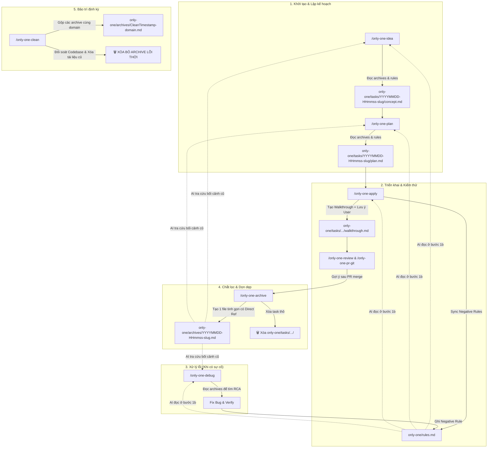

# Technical Proposal: Task Lifecycle Management, Archive Distillation & Maintenance (`/only-one-archive` & `/only-one-clean`)

## 1. Problem Statement & Core Concept

- **Core Business Problem**: 
  - Sau khi các task hoàn thành (`/only-one-idea` $\rightarrow$ `/only-one-plan` $\rightarrow$ `/only-one-apply`), các thư mục task thô (`concept.md`, `plan.md`, `walkthrough.md`) bị tồn đọng tại `only-one/tasks/`, gây lộn xộn workspace.
  - Nếu chỉ di chuyển nguyên thư mục thô sang lưu trữ, `archives/` sẽ nhanh chóng trở thành bãi rác tài liệu phân mảnh, chứa code diffs tạm thời đã có trên Git.
  - Theo thời gian, codebase thay đổi khiến nhiều tài liệu archive bị **lỗi thời, logic không còn đúng (Outdated / Stale / Incorrect Logic)**, gây nhiễu cho AI và Developer khi tra cứu.
  - Các workflows hiện tại (`/only-one-idea`, `/only-one-plan`, `/only-one-apply`, `/only-one-debug`, `/only-one-pr-git`) đang tham chiếu đến đường dẫn cũ `only-one/rules/rules.md` và **chưa tận dụng được tri thức từ `only-one/archives/`** để tăng tốc tra cứu kiến trúc, RCA debug và tự động hóa chu trình dọn dẹp.

- **Core Value & Target Audience**:
  - **Developer & AI Agent**: 
    - `only-one/tasks/`: Luôn sạch bóng, chỉ chứa các task đang làm.
    - `only-one/rules.md`: 1 file duy nhất chứa toàn bộ điều cấm kỵ/lưu ý mà AI luôn đọc ở bước 1b của tất cả workflows.
    - `only-one/archives/`: Bộ nhớ kiến trúc tinh gọn, không phân mảnh, loại bỏ triệt để các tài liệu cũ không còn đúng, giúp AI các workflows cũ tra cứu kiến trúc và debug cực nhanh.

- **Success Metrics (Definition of Done)**:
  - **Cập nhật đồng bộ toàn bộ Workflows hiện hữu**:
    - Chuẩn hóa đường dẫn đọc rule sang 1 file duy nhất `only-one/rules.md`.
    - Thêm bước đọc `only-one/archives/` vào `/only-one-idea`, `/only-one-plan`, `/only-one-debug` để kế thừa kiến trúc và RCA.
    - Cải tiến `walkthrough.md` trong `/only-one-apply` để chắt lọc lưu ý của User và gợi ý chạy `/only-one-archive`.
    - `/only-one-pr-git`: Gợi ý chạy `/only-one-archive` sau khi PR hoàn tất.
  - **Tạo 2 Workflows mới**: `/only-one-archive` và `/only-one-clean`.
  - **Đăng ký Manifest**: Cập nhật `assets/workflows/index.ts`.

---

## 2. Ma trận tác động & Chỉnh sửa cho tất cả Workflows cũ

| Workflow cũ | Vị trí thay đổi | Chi tiết điều chỉnh cụ thể |
| :--- | :--- | :--- |
| **`/only-one-idea`** | **Step 2 (Codebase Survey)** & **Step 6 (Next Steps)** | - Quét `only-one/archives/*.md` và `only-one/rules.md` để nắm các quyết định kiến trúc/lưu ý cũ của module liên quan.<br/>- Bổ sung hướng dẫn chu trình: `/only-one-plan` $\rightarrow$ `/only-one-apply` $\rightarrow$ `/only-one-archive`. |
| **`/only-one-plan`** | **Step 1b (Load Rules & Context)** | - Cập nhật đường dẫn đọc rule: `only-one/rules.md` (1 file duy nhất ở root).<br/>- Quét `only-one/archives/*.md` để kế thừa các pattern/contract đã thiết kế ở các task trước. |
| **`/only-one-apply`** | **Step 1b**, **Step 7 (Walkthrough)**, **Step 7b**, **Step 8** | - Đọc `only-one/rules.md` ở Step 1b.<br/>- Bổ sung mục **"4. User Constraints & Lessons Learned"** vào `walkthrough.md`.<br/>- Tự động sync các quy tắc `[NEVER]`, `[AVOID]` vào `only-one/rules.md`.<br/>- Step 8: Hiển thị gợi ý: *"Run `/only-one-archive` to distill and clean up task folder."* |
| **`/only-one-debug`** | **Step 1 (Observe & Trace)** & **Step 4 (Lessons Learned)** | - Đọc `only-one/archives/*.md` của module bị lỗi để tìm nguyên nhân gốc rễ (RCA) dựa trên lịch sử thay đổi.<br/>- Đọc và ghi nhận bài học sau khi fix bug vào `only-one/rules.md`. |
| **`/only-one-pr-git`** | **Step 1** & **Step 4 (Completion)** | - Kiểm tra tuân thủ negative rules trong `only-one/rules.md`.<br/>- Sau khi tạo PR thành công, gợi ý người dùng chạy `/only-one-archive` để dọn dẹp task sau khi merge. |

---

## 3. Proposed Solution Architecture

### 3.1. Cấu trúc thư mục chuẩn `only-one/`

```text
only-one/
├── rules.md                   # 📄 1 FILE DUY NHẤT: Bộ luật cấm kỵ [NEVER]/[AVOID] của dự án
├── tasks/                     # 📁 CHỈ CHỨA TASK ĐANG LÀM (concept.md, plan.md, walkthrough.md)
│   └── 20260820-100000-new-feature/
│       ├── concept.md
│       ├── plan.md
│       └── walkthrough.md
└── archives/                  # 📁 CHỨA CÁC BẢN GHI ĐANG ACTIVE & CHÍNH XÁC (Mỗi domain = 1 file .md)
    ├── 20260819-150535-workflow-only-one-intranet.md
    └── 20260820-094500-task-archive-lifecycle.md
```

---

### 3.2. Sơ đồ tương tác liên hoàn giữa TẤT CẢ các Workflows



---

### 3.3. Chi tiết 2 Workflow mới

#### 1. Workflow `/only-one-archive` (`assets/workflows/only-one-archive.md`)
- **Input**: `/only-one-archive [<task-folder> | <slug> | --all]`
- **Quy trình**:
  1. Quét tìm task `status: done` trong `only-one/tasks/`.
  2. Đọc *User Constraints & Lessons Learned* từ `walkthrough.md`, sync vào `only-one/rules.md`.
  3. Quét `only-one/archives/` tìm liên kết tham chiếu và ghi `references: [...]` vào frontmatter.
  4. Tạo 1 file chắt lọc duy nhất tại `only-one/archives/<timestamp>-<slug>.md`.
  5. Xóa thư mục task thô `only-one/tasks/<folder>/`.

#### 2. Workflow `/only-one-clean` (`assets/workflows/only-one-clean.md`)
- **Input**: `/only-one-clean [--dry-run]`
- **Quy trình**:
  1. **Bước 1 (Gộp)**: Nhóm các archive cùng domain/capability thành 1 file duy nhất `only-one/archives/<Clean-Timestamp>-<domain>.md`.
  2. **Bước 2 (Đối soát sâu & Thanh lọc)**:
     - Quét kiểm tra code thực tế xem file, hàm, contract, logic luồng có còn đúng không.
     - ❌ **Xóa bỏ hoàn toàn** các archive đã quá cũ, logic không còn đúng hoặc tính năng đã bị gỡ.
     - 🔄 **Cập nhật đồng bộ** nội dung file gộp cho khớp 100% với Codebase.
  3. **Bước 3 (Dọn dẹp)**: Xóa các file phân mảnh cũ đã gộp, xuất báo cáo tổng kết.

---

## 4. Next Steps

1. User xác nhận bản đề xuất kỹ thuật toàn diện trong `concept.md`.
2. Chạy `/only-one-plan only-one/tasks/20260820-094500-workflow-only-one-archive-and-task-lifecycle` để lập kế hoạch chi tiết triển khai (gồm sửa đổi 5 workflows cũ, tạo 2 workflows mới và cập nhật manifest).
