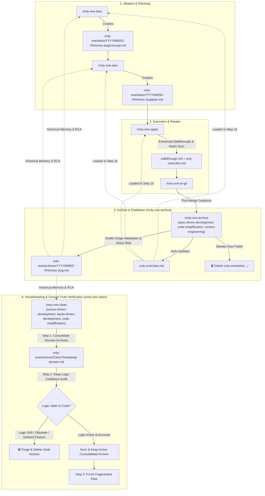

# Implementation Plan: Task Lifecycle Management, Archive Distillation & Maintenance (`/only-one-archive` & `/only-one-clean`)

## Section 1. Current State

### 1.1. Current Execution Flow & Ground Truth Analysis
In the current repository workflow system:
- [`assets/workflows/index.ts`](file:///Users/kiem/Sources/Personal/only-one-cli/assets/workflows/index.ts): Registers 8 workflows (`only-one-idea`, `only-one-plan`, `only-one-apply`, `only-one-debug`, `only-one-review`, `only-one-clockify`, `only-one-intranet`, `only-one-pr-git`).
- [`assets/workflows/only-one-idea.md`](file:///Users/kiem/Sources/Personal/only-one-cli/assets/workflows/only-one-idea.md): Creates raw task folders under `only-one/tasks/<YYYYMMDD-HHmmss>-<slug>/concept.md`. Step 2 surveys current codebase but does not reference historical architecture from `only-one/archives/`.
- [`assets/workflows/only-one-plan.md`](file:///Users/kiem/Sources/Personal/only-one-cli/assets/workflows/only-one-plan.md): Reads `concept.md` and generates `plan.md` in the same task folder. Step 1b loads rules from outdated path `only-one/rules/rules.md` instead of a single root file `only-one/rules.md`.
- [`assets/workflows/only-one-apply.md`](file:///Users/kiem/Sources/Personal/only-one-cli/assets/workflows/only-one-apply.md): Implements the plan, marks `status: done` in `plan.md`, generates `walkthrough.md` with only verification logs and diffs. Step 7b attempts to record negative rules into `only-one/rules/rules.md` without capturing the user's specific feedback or constraints during the interaction.
- [`assets/workflows/only-one-debug.md`](file:///Users/kiem/Sources/Personal/only-one-cli/assets/workflows/only-one-debug.md): Step 1 inspects errors and source code without consulting historical assumptions in `only-one/archives/`. Step 4 records negative rules to `only-one/rules/rules.md`.
- [`assets/workflows/only-one-pr-git.md`](file:///Users/kiem/Sources/Personal/only-one-cli/assets/workflows/only-one-pr-git.md): Pre-review quality gate and PR creation without recommending post-merge archiving or cleanup.

### 1.2. Core Problems & Bottlenecks
1. **Unbounded Task Folder Accumulation**: Completed task directories remain indefinitely in `only-one/tasks/`, polluting active task lists.
2. **Missing Knowledge Distillation**: Transient implementation diffs are preserved while high-level decisions, user constraints, and lessons learned are not consolidated into permanent living documents.
3. **Stale/Outdated Archives over Time**: As codebase evolves, archived descriptions become inaccurate (logic drift) with no automated mechanism to verify and purge obsolete documents.
4. **Scattered Rules Path**: Workflows point to `only-one/rules/rules.md` rather than a unified single root file `only-one/rules.md`.

### 1.3. Explicit Invariants (Behaviors that MUST remain unchanged)
- Existing workflow command CLI execution via [`src/commands/workflow/command.ts`](file:///Users/kiem/Sources/Personal/only-one-cli/src/commands/workflow/command.ts) must continue to copy and sync selected workflows into `.agents/workflows/`, `.opencode/workflows/`, or `.claude/workflows/`.
- The format of task folders during active development (`only-one/tasks/<YYYYMMDD-HHmmss>-<slug>/`) must remain compatible with `/only-one-idea`, `/only-one-plan`, and `/only-one-apply`.
- All CLI tests in `test/commands/workflow.test.ts` must pass.

---

## Section 2. Detailed Design

### 2.1. Architectural Overview & Component Mechanics
We introduce two new agent workflows powered by `addyosmani/agent-skills` and update all 5 existing workflows:



### 2.2. Skills Integration & Explicit Skills Catalog Structure

Every workflow file **MUST** contain a dedicated **`## 1. Skills Catalog`** table mapping trigger conditions and core purpose:

#### Skills Catalog for `/only-one-archive`:
| Skill | Trigger condition (Use When) | Core Purpose (What It Does) |
| :--- | :--- | :--- |
| **`spec-driven-development`** | Step 4 (Authoring archive markdown) | Consolidates Problem Statement, Architecture Decisions, and Test Evidence into a structured single-file specification (`only-one/archives/<timestamp>-<slug>.md`). |
| **`code-simplification`** | Step 4 (Distillation) | Prunes transient code diffs and keeps document concise (< 50-100 lines) for optimal agent token efficiency. |
| **`context-engineering`** | Step 2 (Distilling rules) | Formats negative constraints and lessons learned into high-signal `[NEVER]` / `[AVOID]` rules inside `only-one/rules.md`. |

#### Skills Catalog for `/only-one-clean`:
| Skill | Trigger condition (Use When) | Core Purpose (What It Does) |
| :--- | :--- | :--- |
| **`code-simplification`** | Step 1 (Consolidation) | Merges multiple related archive records of the same capability/domain into one clean file, eliminating duplicate context. |
| **`source-driven-development`** | Step 2 (Codebase Audit) | Inspects active source code (controllers, services, entities, contracts) to ground all documented logic against actual codebase truth. |
| **`doubt-driven-development`** | Step 2 (Sanity Check & Purging) | Applies adversarial Red-Team inquiry to identify stale/outdated logic or deleted features and commands immediate deletion of dead documentation. |

### 2.3. Detailed Workflow Execution Protocols

#### A. `/only-one-archive [<task-folder> | <slug> | --all]`
1. **Step 1 — Task Resolution & Validation**: Locate target task(s) under `only-one/tasks/` where `plan.md` has `status: done`.
2. **Step 2 — Extract User Feedback & Distill Rules (`context-engineering`)**: Extract user constraints, warnings, and negative rules from `walkthrough.md` Section 4 into `only-one/rules.md` under `[NEVER]` / `[AVOID]` tags.
3. **Step 3 — Direct Reference Linking**: Scan `only-one/archives/*.md` to identify related historical archives and populate `references: [...]` in YAML frontmatter.
4. **Step 4 — Author Single Distilled Archive (`spec-driven-development`, `code-simplification`)**: Create `only-one/archives/<timestamp>-<slug>.md` containing:
   - Frontmatter (`id`, `title`, `archived_at`, `status: active`, `references`, `affected_modules`).
   - Problem Statement & Core Value.
   - Key Architecture Decisions & Diagrams.
   - Summary of Changes & Verification Evidence.
5. **Step 5 — Raw Task Purging**: Remove the directory `only-one/tasks/<folder>/`.
6. **Step 6 — Display Archive Summary**.

#### B. `/only-one-clean [--dry-run]`
1. **Step 1 — Consolidation First (`code-simplification`)**: Group archives belonging to the same domain/capability into a single unified document `only-one/archives/<Clean-Timestamp>-<domain>.md`.
2. **Step 2 — Deep Logic Codebase Verification (`source-driven-development`, `doubt-driven-development`)**:
   - Inspect source code to verify that file paths, exported contracts, function signatures, schema models, and operational flows mentioned in the consolidated document actually exist and behave as described.
   - **Purge / Delete**: If the feature/module has been deleted or if the logic is completely outdated/stale, delete the archive file completely.
   - **Sync**: If the logic has minor deviations from current code, update the text to achieve 100% ground-truth consistency.
3. **Step 3 — De-fragmentation**: Delete the older fragmented individual archive files that were consolidated.
4. **Step 4 — Completion Report**: Output purged vs consolidated vs active archives.

---

## Section 3. Implementation Architecture

### 3.1. Target Directory Tree & Planned File Changes

```text
assets/
└── workflows/
    ├── index.ts                      # [MODIFY] Register only-one-archive and only-one-clean with requiredSkills
    ├── only-one-idea.md              # [MODIFY] Reference only-one/archives/ and only-one/rules.md
    ├── only-one-plan.md              # [MODIFY] Update rule path to only-one/rules.md and read archives
    ├── only-one-apply.md             # [MODIFY] Update rule path, enhance walkthrough.md, recommend archive
    ├── only-one-debug.md             # [MODIFY] Update rule path and check archives for RCA
    ├── only-one-pr-git.md            # [MODIFY] Update rule path and recommend /only-one-archive
    ├── only-one-archive.md           # [NEW] Archive & distillation workflow with Skills Catalog table
    └── only-one-clean.md             # [NEW] Consolidation & deep logic verification workflow with Skills Catalog table
test/
└── commands/
    └── workflow.test.ts              # [MODIFY] Unit tests verifying archive and clean workflow registration
```

### 3.2. File Responsibilities

| File Path | Action | Responsibility |
| :--- | :--- | :--- |
| [`assets/workflows/index.ts`](file:///Users/kiem/Sources/Personal/only-one-cli/assets/workflows/index.ts) | `[MODIFY]` | Export `only-one-archive` and `only-one-clean` manifests in `WORKFLOWS` with assigned skills. |
| [`assets/workflows/only-one-archive.md`](file:///Users/kiem/Sources/Personal/only-one-cli/assets/workflows/only-one-archive.md) | `[NEW]` | Protocol for distilling completed tasks, syncing `only-one/rules.md`, and purging raw task directories with complete Skills Catalog. |
| [`assets/workflows/only-one-clean.md`](file:///Users/kiem/Sources/Personal/only-one-cli/assets/workflows/only-one-clean.md) | `[NEW]` | Protocol for consolidating domain archives, deep logic codebase verification, and purging obsolete files with complete Skills Catalog. |
| [`assets/workflows/only-one-idea.md`](file:///Users/kiem/Sources/Personal/only-one-cli/assets/workflows/only-one-idea.md) | `[MODIFY]` | Add archive discovery in Step 2 and update task lifecycle guidance in Step 6. |
| [`assets/workflows/only-one-plan.md`](file:///Users/kiem/Sources/Personal/only-one-cli/assets/workflows/only-one-plan.md) | `[MODIFY]` | Standardize rules path to `only-one/rules.md` and load archives in Step 1b. |
| [`assets/workflows/only-one-apply.md`](file:///Users/kiem/Sources/Personal/only-one-cli/assets/workflows/only-one-apply.md) | `[MODIFY]` | Standardize rules path, add Section 4 (User Constraints & Lessons Learned) to `walkthrough.md`, and suggest `/only-one-archive` in Step 8. |
| [`assets/workflows/only-one-debug.md`](file:///Users/kiem/Sources/Personal/only-one-cli/assets/workflows/only-one-debug.md) | `[MODIFY]` | Read `only-one/archives/*.md` during Step 1 RCA and write negative rules to `only-one/rules.md`. |
| [`assets/workflows/only-one-pr-git.md`](file:///Users/kiem/Sources/Personal/only-one-cli/assets/workflows/only-one-pr-git.md) | `[MODIFY]` | Standardize rules path and suggest `/only-one-archive` after PR creation. |
| [`test/commands/workflow.test.ts`](file:///Users/kiem/Sources/Personal/only-one-cli/test/commands/workflow.test.ts) | `[MODIFY]` | Assert that `only-one-archive` and `only-one-clean` can be installed and synced by CLI with valid skills. |

---

## Section 4. Implementation Code Examples

### 4.1. `[MODIFY]` [`assets/workflows/index.ts`](file:///Users/kiem/Sources/Personal/only-one-cli/assets/workflows/index.ts)
*Summary*: Add `only-one-archive` and `only-one-clean` with their required skills from `addyosmani/agent-skills`.

```typescript
export const WORKFLOWS: WorkflowManifest[] = [
    // ... existing workflows
    {
        name: 'only-one-archive',
        description: 'Distill completed tasks into concise single-file archives, sync rules, and clean task folders.',
        requiredSkills: ['spec-driven-development', 'code-simplification', 'context-engineering'],
    },
    {
        name: 'only-one-clean',
        description: 'Consolidate related archives, verify deep logic against codebase, and purge stale documents.',
        requiredSkills: ['source-driven-development', 'doubt-driven-development', 'code-simplification'],
    },
];
```

### 4.2. `[NEW]` [`assets/workflows/only-one-archive.md`](file:///Users/kiem/Sources/Personal/only-one-cli/assets/workflows/only-one-archive.md)
*Summary*: Detailed step-by-step agent protocol including the mandatory Skills Catalog table.

```markdown
---
description: "Distill completed tasks into concise single-file archives, sync rules, and clean task folders."
---

## Input
/only-one-archive [<task-folder> | <slug> | --all]

## 1. Skills Catalog

Activate and apply these skills throughout the archiving workflow:

| Skill | Trigger condition (Use When) | Core Purpose (What It Does) |
| :--- | :--- | :--- |
| **`spec-driven-development`** | Step 4 (Authoring archive markdown) | Consolidates Problem Statement, Architecture Decisions, and Test Evidence into a structured single-file specification. |
| **`code-simplification`** | Step 4 (Distillation) | Prunes transient code diffs and keeps document concise (< 50-100 lines) for optimal agent token efficiency. |
| **`context-engineering`** | Step 2 (Distilling rules) | Formats negative constraints and lessons learned into high-signal [NEVER] / [AVOID] rules inside only-one/rules.md. |

## 2. Step-by-Step Execution Protocol
...
```

### 4.3. `[NEW]` [`assets/workflows/only-one-clean.md`](file:///Users/kiem/Sources/Personal/only-one-cli/assets/workflows/only-one-clean.md)
*Summary*: Detailed step-by-step agent protocol including the mandatory Skills Catalog table.

```markdown
---
description: "Consolidate related archives, verify deep logic against codebase, and purge stale documents."
---

## Input
/only-one-clean [--dry-run]

## 1. Skills Catalog

Activate and apply these skills throughout the clean workflow:

| Skill | Trigger condition (Use When) | Core Purpose (What It Does) |
| :--- | :--- | :--- |
| **`code-simplification`** | Step 1 (Consolidation) | Merges multiple related archive records of the same domain into one clean file, eliminating duplicate context. |
| **`source-driven-development`** | Step 2 (Codebase Audit) | Inspects active source code to ground all documented logic against actual codebase truth. |
| **`doubt-driven-development`** | Step 2 (Sanity Check & Purging) | Applies adversarial inquiry to identify stale logic and commands immediate deletion of dead documentation. |

## 2. Step-by-Step Execution Protocol
...
```

### 4.4. `[MODIFY]` [`assets/workflows/only-one-apply.md`](file:///Users/kiem/Sources/Personal/only-one-cli/assets/workflows/only-one-apply.md)
*Summary*: Standardize rule paths to `only-one/rules.md`, enhance `walkthrough.md` with Section 4 (User Constraints & Lessons Learned), and recommend `/only-one-archive` at completion.

### 4.5. `[MODIFY]` [`assets/workflows/only-one-plan.md`](file:///Users/kiem/Sources/Personal/only-one-cli/assets/workflows/only-one-plan.md), [`only-one-idea.md`](file:///Users/kiem/Sources/Personal/only-one-cli/assets/workflows/only-one-idea.md), [`only-one-debug.md`](file:///Users/kiem/Sources/Personal/only-one-cli/assets/workflows/only-one-debug.md), [`only-one-pr-git.md`](file:///Users/kiem/Sources/Personal/only-one-cli/assets/workflows/only-one-pr-git.md)
*Summary*: Update all references from `only-one/rules/rules.md` to `only-one/rules.md`, add archive lookup steps in idea/plan/debug, and add archive recommendation in pr-git.

---

## Section 5. Test Cases

### 5.1. Unit & Integration Test Cases

#### Test Case 1: Manifest Registration & Skills Verification
- **Objective**: Verify that `only-one-archive` and `only-one-clean` are registered in `WORKFLOWS` manifest with exact requiredSkills.
- **Precondition**: `assets/workflows/index.ts` is updated.
- **Action**: Run `npm test`.
- **Expected result**: `WORKFLOWS` array contains 10 workflows with correct requiredSkills.
- **Proposed test file**: `test/commands/workflow.test.ts`

#### Test Case 2: Workflow Synchronization via CLI
- **Objective**: Verify that `only-one workflow` CLI command correctly copies `only-one-archive.md` and `only-one-clean.md` into target tool paths (e.g. `.agents/workflows/`).
- **Precondition**: Temporary test directory initialized.
- **Action**: Execute `cmd.parseAsync(['node', 'test', testProjectDir, 'only-one-archive,only-one-clean'])`.
- **Expected result**: Both markdown files exist in `testProjectDir/.agents/workflows/`.
- **Proposed test file**: `test/commands/workflow.test.ts`

#### Test Case 3: Rule Path Consistency Across All Workflows
- **Objective**: Verify that no workflow references the outdated path `only-one/rules/rules.md`.
- **Precondition**: All workflow files updated.
- **Action**: Grep search `only-one/rules/rules.md` across `assets/workflows/*.md`.
- **Expected result**: Zero matches found; all workflows reference `only-one/rules.md`.
- **Proposed test file**: `test/commands/workflow.test.ts`

### 5.2. Verification Commands
```bash
npm run build
npm test
npm run lint
```
