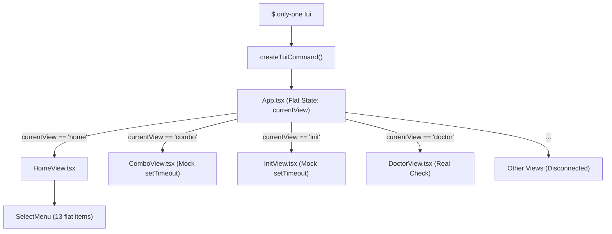
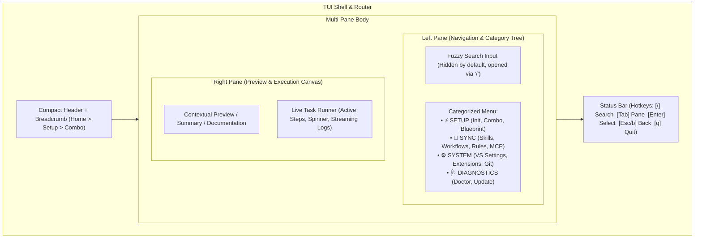
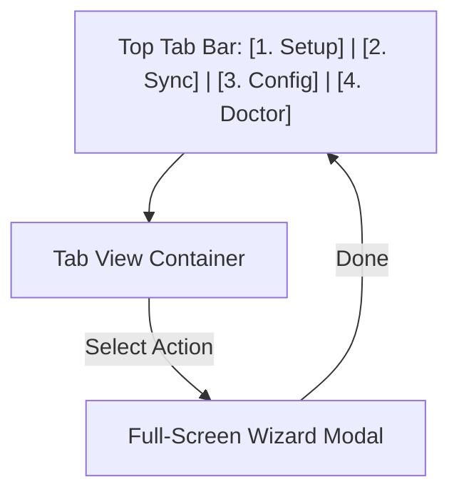

# Technical Proposal: Modernizing Only-One CLI Terminal User Interface (TUI)

## 1. Problem Statement & Core Concept

- **Core Business Problem**: 
  The current TUI in `only-one-cli` suffers from a flat, cluttered 13-item main menu, unorganized navigation, conflicting keyboard event handlers (`useInput` race conditions causing instant view dismissals), lack of visual feedback/search, and disconnected mock `setTimeout` stubs instead of real execution pipelines. This makes the tool feel sluggish, unintuitive, and difficult to use for both regular and power users.
- **Core Value & Target Audience**: 
  - **Target Audience**: Developers, DevOps engineers, and AI agent developers who want a fast, beautiful, and intuitive terminal dashboard to inspect, initialize, sync, and diagnose workspace environments.
  - **Core Value**: Transforms the TUI into a world-class, multi-pane terminal experience (Master-Detail layout, instant fuzzy filtering, live task execution streaming, and category-grouped workflows) that eliminates terminal fatigue.
- **Success Metrics (Definition of Done)**:
  - **Information Density & Clarity**: Main menu organized into 4 distinct functional categories (`Workspace Setup`, `Agent & Rules Sync`, `Editor & Environment`, `Diagnostics & Utilities`) with live right-pane details and quick stats.
  - **Fuzzy Search & Quick Navigation**: Support `/` to filter any menu or list instantly with arrow navigation and tabbed pane switching.
  - **Zero Input Conflict**: Deterministic key handling with a centralized navigation router; no simultaneous Enter/Back collision bugs.
  - **Real Task Execution**: Interactive views wire directly into actual core action executors (`executeInitStep`, `syncSkillsStep`, `runDoctorChecksStep`, `syncVsSettingsStep`, etc.) with live spinners and real-time step streaming.
  - **Responsive Terminal Adaptation**: Graceful rendering on standard 80x24 terminals up to ultra-wide displays.
- **Scope Boundaries**:
  - **In-Scope**:
    - Centralized Router & Navigation Stack (`useRouter` hook, history stack, breadcrumb trail).
    - Multi-Pane Master-Detail Layout (`Sidebar Navigation` + `Content/Preview Pane` + `Compact Header` + `Interactive Status Footer`).
    - Fuzzy Search & Filter bar component.
    - Category-based Main Dashboard.
    - Live Task Runner component with streaming output, progress indicator, and execution status.
    - Full migration of all 11 TUI views to real core actions with graceful fallback.
    - Comprehensive unit & component tests for TUI navigation and view rendering.
  - **Explicit Out-of-Scope**:
    - Replacing Ink with raw ANSI or Blessed/ncurses libraries.
    - Adding graphical web/Electron UI (TUI remains strictly terminal-based).
    - Changing underlying CLI flags or breaking non-interactive CLI commands.

---

## 2. Current Business Logic (As-is Analysis)

### Current Flow
The current TUI entry point is [createTuiCommand](file:///Users/kiem/Sources/Personal/only-one-cli/src/commands/tui/command.ts#L8-L23), which mounts [App.tsx](file:///Users/kiem/Sources/Personal/only-one-cli/src/tui/App.tsx#L22-L112).



### Identified Bottlenecks & Flaws
1. **Flat 13-Item List ([MAIN_MENU_ITEMS](file:///Users/kiem/Sources/Personal/only-one-cli/src/tui/constants/menu.ts#L3-L83))**:
   Users are overwhelmed by a long list without visual grouping. Scrolling through all items causes visual jumping as description boxes expand/collapse in-place.
2. **Keyboard Conflict in Views ([ComboView.tsx](file:///Users/kiem/Sources/Personal/only-one-cli/src/tui/views/ComboView.tsx#L19-L26))**:
   Child components ([SelectMenu.tsx](file:///Users/kiem/Sources/Personal/only-one-cli/src/tui/components/SelectMenu.tsx#L13-L23)) and parent views both bind `useInput(..., { return: true })`. Pressing Enter to select an item instantly executes the parent's `onBack()`, kicking the user back to Home before the action can even run.
3. **Mock Stubs vs Real Commands**:
   Views like `InitView`, `ComboView`, `SkillView`, `WorkflowView`, `RuleView` use hardcoded `setTimeout(() => setStep('done'), 1200)` stubs instead of delegating to core action pipelines in `src/commands/*/actions/`.
4. **Wasted Screen Space**:
   A single vertical column leaves ~60% of terminal width empty while pushing the footer off-screen on smaller terminals.

---

## 3. Proposed Solution Alternatives

### Option 1 (Recommended): Multi-Pane Master-Detail Dashboard with Navigation Router & Live Task Runner

- **Solution Overview**:
  - **2-Pane Layout**: Left pane (35% width) contains categorized navigation tree + quick search; Right pane (65% width) contains active preview / contextual details / live execution logs.
  - **Category Grouping**: Menu items grouped into 4 intuitive sections with badge indicators (`⚡ Setup`, `🔄 Sync`, `🛠️ System`, `🩺 Diagnostics`).
  - **Navigation Router Context**: A lightweight React context managing route history (`stack: ViewState[]`, `push`, `pop`, `replace`) and active focus pane (`sidebar` vs `content` vs `search`).
  - **Live Task Runner**: Reusable component executing real core command actions asynchronously with a progress spinner, step counter, output buffer, and exit code summary.



- **Pros**:
  - Extremely modern, clean, and intuitive.
  - High information density without visual clutter.
  - Fixes all keyboard bubbling issues with strict focus routing.
  - Direct bridge to all real CLI capabilities.
- **Cons**:
  - Requires structured component refactoring and responsive layout handling for small terminal windows.
- **Complexity & Risks**:
  - Moderate complexity. Handled cleanly with pure React/Ink state hooks and existing flexbox primitives.

---

### Option 2 (Alternative): Tabbed Linear Wizard with Full-Screen Modals

- **Solution Overview**:
  - Replace the main menu with a top Tab bar (`[1. Setup]  [2. Sync]  [3. Config]  [4. Doctor]`).
  - Left/Right arrows switch tabs; Up/Down selects actions within the active tab.
  - Selecting an action opens a full-screen wizard modal.



- **Pros**:
  - Very simple mental model for beginners.
  - Easy to implement step-by-step wizards.
- **Cons**:
  - Less scannable (user cannot see all capabilities at a glance).
  - Requires more keystrokes to switch between unrelated features (e.g. Doctor to Skill Sync).
  - Modal transitions can feel disjointed in terminal environments.
- **Complexity & Risks**:
  - Low-to-moderate complexity. Lower information density.

---

### Comparison Matrix & Recommendation

| Criteria | Option 1: Multi-Pane Master-Detail (Recommended) | Option 2: Tabbed Linear Wizard |
| :--- | :--- | :--- |
| **User Experience & Flow** | ⭐⭐⭐⭐⭐ (Seamless preview, high discoverability) | ⭐⭐⭐ (Requires manual tab switching) |
| **Information Density** | ⭐⭐⭐⭐⭐ (Full utilization of terminal width) | ⭐⭐⭐ (Single column per tab) |
| **Searchability** | ⭐⭐⭐⭐⭐ (Instant fuzzy search across all items) | ⭐⭐⭐ (Tab-scoped search only) |
| **Extensibility** | ⭐⭐⭐⭐⭐ (Easy to add new categories & views) | ⭐⭐⭐⭐ (Tabs become crowded if > 5) |
| **Implementation Effort** | Moderate (Structured Router + Ink Box flex layout) | Moderate |
| **Risk Level** | Low | Low |

- **Conclusion**: 
  **Recommend Option 1**. It delivers the exact premium, smooth, and modern dashboard experience requested, eliminating the long list problem while giving live visual previews and robust task execution.

---

## 4. Key Failure Modes & Security Boundaries

- **Terminal Dimensions (Small Windows)**:
  - If terminal columns `< 80` or rows `< 20`, automatically collapse the 2-pane layout into a single-pane vertical stack to prevent text clipping and ANSI wrap distortions.
- **Input Conflict / Event Bubbling**:
  - Active input focus is strictly managed by `RouterContext`. When a child view or modal is active, the global sidebar key handlers are disabled.
- **Task Error Handling & Long-Running Process Safeguards**:
  - Core actions run asynchronously in `try...catch` blocks inside `TaskRunnerView`. Stdout/stderr errors are highlighted in red with an explicit retry or copy-details option, preventing unhandled crashes in the Ink render loop.

---

## 5. High-Level Technical Specifications

### Architecture & Directory Structure
```text
src/tui/
├── router/
│   ├── RouterContext.tsx       # Navigation stack, focus manager, active route
│   └── routes.ts               # Route registry, category definitions, metadata
├── components/
│   ├── Header.tsx              # Compact brand header + breadcrumbs + stats
│   ├── Footer.tsx              # Responsive context-aware shortcut bar
│   ├── MasterDetailLayout.tsx  # 2-Pane split container with responsive collapse
│   ├── CategoryMenu.tsx        # Grouped collapsible list with badge indicators
│   ├── SearchFilter.tsx        # Fuzzy search bar with auto-highlight
│   ├── TaskRunnerView.tsx      # Real-time task runner with spinner & streaming logs
│   ├── KeyHint.tsx             # Styled keyboard badge component
│   └── PreviewCard.tsx         # Live documentation/summary card for selected item
├── views/
│   ├── HomeDashboardView.tsx   # Modern 2-Pane home dashboard
│   ├── InitView.tsx            # Real workspace init orchestrator
│   ├── ComboView.tsx           # Real combo application with stack preview
│   ├── SkillView.tsx           # Remote/local skill manager
│   ├── WorkflowView.tsx        # Workflow template sync
│   ├── RuleView.tsx            # Agent rule injector
│   ├── McpView.tsx             # MCP server configuration runner
│   ├── SettingsView.tsx        # VS Code / Cursor / Antigravity sync
│   ├── GitView.tsx             # Shell & git profile sync
│   ├── StructureView.tsx       # Blueprint scaffold runner
│   ├── DoctorView.tsx          # Real-time health diagnostic dashboard
│   └── UpdateView.tsx          # Skill & template updater
└── theme/
    ├── colors.ts               # Curated terminal color palette (cyan, violet, emerald, amber)
    └── styles.ts               # Shared borders, badges, and layout constants
```

---

## 6. Next Steps

- User confirms the proposal in `concept.md`.
- Proceed with `/only-one-plan only-one/tasks/20260824-103830-tui-modernization` to create the detailed 5-section execution plan `plan.md`.
