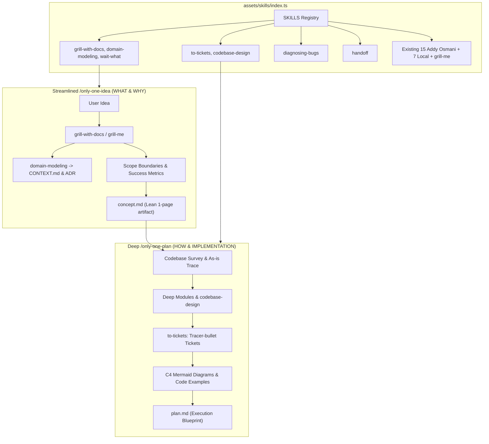

# Implementation Plan: Integrate 7 Workflow-Enhancing Skills & Streamline `/only-one-idea`

## Section 1. Current State

### Verified Current Behavior directly from Codebase
- **Skill Manifest Definition**:
  In [assets/skills/index.ts](file:///Users/kiem/Sources/Personal/only-one-cli/assets/skills/index.ts), skills are declared in the `SKILLS` array of type [SkillManifest](file:///Users/kiem/Sources/Personal/only-one-cli/assets/types.ts#L49-L55). Currently, the manifest contains:
  - 15 skills from `addyosmani/agent-skills` (`sourceType: 'github'`).
  - 1 skill from `mattpocock/skills` (`grill-me`, `skills/productivity/grill-me/SKILL.md`).
  - 7 local skills (`c4-diagrams`, `gherkin-authoring`, `only-one-nestjs-development`, `only-one-nextjs-development`, `only-one-clockify-skill`, `only-one-intranet-skill`, `only-one-pr-git-skill`).
- **Bloated `/only-one-idea` Protocol**:
  In [assets/workflows/only-one-idea.md](file:///Users/kiem/Sources/Personal/only-one-cli/assets/workflows/only-one-idea.md) and [.agents/workflows/only-one-idea.md](file:///Users/kiem/Sources/Personal/only-one-cli/.agents/workflows/only-one-idea.md), `/only-one-idea` currently performs 4 heavy steps:
  1. Discovery & Interview
  2. Codebase Survey & As-is Logic Analysis (inspecting controllers, services, DTOs)
  3. Solution Alternatives & Mermaid Diagrams (generating 2–3 full architecture options with diagrams and matrices)
  4. Authoring a heavy 7-section `concept.md` (containing As-is traces, multiple diagrams, failure modes, and contract/model specs).
  This heavily overlaps with `/only-one-plan`, causing developers to do codebase analysis and architectural drafting twice.
- **Remote GitHub Fetcher**:
  [src/core/skill/remote/github-fetcher.ts](file:///Users/kiem/Sources/Personal/only-one-cli/src/core/skill/remote/github-fetcher.ts#L9-L30) fetches skill markdown from `https://raw.githubusercontent.com/${source}/${branch}/${skillPath}`.
- **Workflow Mappings**:
  [assets/workflows/index.ts](file:///Users/kiem/Sources/Personal/only-one-cli/assets/workflows/index.ts) lists workflow metadata and `requiredSkills`.

### Explicit List of Behaviors That Must Remain Unchanged
- All 15 existing Addy Osmani skills must maintain their exact names, descriptions, and remote paths.
- All 7 existing local skills must retain their current directory structure in `assets/skills/`.
- Existing `grill-me` skill must be preserved for zero-footprint fast grilling.
- The CLI commands `only-one skill` and `only-one doctor` must operate without breaking changes.
- Existing tests in [test/core/skill-registry.test.ts](file:///Users/kiem/Sources/Personal/only-one-cli/test/core/skill-registry.test.ts) must pass.

---

## Section 2. Detailed Design

### 1. Targeted Catalog: 7 Workflow-Enhancing Skills
We register **exactly 7 new skills** from `mattpocock/skills` specifically tailored to upgrade our workflows:

```
mattpocock/skills (Targeted 7 Skills)
├── For /only-one-idea
│   ├── grill-with-docs (skills/engineering/grill-with-docs/SKILL.md)  - Grilling with inline CONTEXT.md & ADR generation
│   ├── domain-modeling (skills/engineering/domain-modeling/SKILL.md)  - DDD domain glossary & ADR maintenance
│   └── wait-what (skills/productivity/wait-what/SKILL.md)             - Real-time communication realignment
├── For /only-one-plan
│   ├── to-tickets (skills/engineering/to-tickets/SKILL.md)            - Tracer-bullet tickets with blocking edges
│   └── codebase-design (skills/engineering/codebase-design/SKILL.md)  - Deep Module architecture at clean seams
├── For /only-one-debug
│   └── diagnosing-bugs (skills/engineering/diagnosing-bugs/SKILL.md)  - Disciplined minimal reproduction feedback loop
└── For /only-one-archive
    └── handoff (skills/productivity/handoff/SKILL.md)                 - Lossless session state compaction
```

### 2. Streamlining `/only-one-idea.md` (Enforcing WHAT & WHY)
We refactor [assets/workflows/only-one-idea.md](file:///Users/kiem/Sources/Personal/only-one-cli/assets/workflows/only-one-idea.md) and [.agents/workflows/only-one-idea.md](file:///Users/kiem/Sources/Personal/only-one-cli/.agents/workflows/only-one-idea.md) into a lean, fast protocol:
- **Cắt bỏ hoàn toàn**:
  - ❌ Bỏ Step 2 cũ (Codebase Survey & As-is Logic Analysis $\rightarrow$ chuyển hẳn sang `/only-one-plan`).
  - ❌ Bỏ Step 3 cũ (2-3 Solution Alternatives with Mermaid diagrams $\rightarrow$ chuyển hẳn sang `/only-one-plan`).
  - ❌ Bỏ Section 2, 3, 4, 5 cũ trong `concept.md` (As-is trace, Option diagrams, Failure modes, Contract/Model specs).
- **Tập trung vào 2 bước tinh gọn**:
  - **Step 1 — Discovery, Grilling & Domain Modeling**:
    - Sử dụng `grill-with-docs` hoặc `grill-me` để phỏng vấn tìm **Root Need** (One-question-at-a-time).
    - Thiết lập **In-Scope vs. Explicit Out-of-Scope** ranh giới chống phình phạm vi (Scope Creep).
    - Xác định **Success Metrics (Definition of Done)** có thể đo lường được.
    - Duy trì **Domain Glossary (`CONTEXT.md`) & ADRs** qua `domain-modeling`.
    - Hỗ trợ lệnh cứu cánh **`/wait-what`** khi Agent giải thích khó hiểu.
  - **Step 2 — Author Lean `concept.md` (1 trang ngắn gọn)**:
    - Section 1: Problem Statement & Root Need
    - Section 2: Scope Boundaries (In-Scope vs Out-of-Scope)
    - Section 3: Success Metrics (Definition of Done)
    - Section 4: Proposed High-Level Approach (1-2 đoạn văn khái niệm)
    - Section 5: Technical English Key Patterns

### 3. Updating `assets/workflows/index.ts` Required Skills
Update `WORKFLOWS` entry for `only-one-idea`, `only-one-plan`, `only-one-debug`, `only-one-archive` to declare their respective new skills:
- `only-one-idea`: `['grill-with-docs', 'domain-modeling', 'interview-me', 'idea-refine', 'wait-what']`
- `only-one-plan`: `['to-tickets', 'codebase-design', 'c4-diagrams', 'api-and-interface-design', 'frontend-ui-engineering', 'source-driven-development', 'doubt-driven-development', 'gherkin-authoring']`
- `only-one-debug`: `['diagnosing-bugs', 'debugging-and-error-recovery', 'doubt-driven-development', 'test-driven-development', 'code-simplification']`
- `only-one-archive`: `['handoff', 'spec-driven-development', 'code-simplification', 'context-engineering']`

---

## Section 3. Implementation Architecture

### Target Directory Tree & File Responsibilities

```text
only-one-cli/
├── assets/
│   ├── skills/
│   │   └── index.ts               [MODIFY] Add 7 Matt Pocock workflow-enhancing skill manifests
│   └── workflows/
│       ├── index.ts               [MODIFY] Update requiredSkills references for idea, plan, debug, archive
│       └── only-one-idea.md       [MODIFY] Streamline idea workflow protocol to eliminate planning overlap
├── .agents/
│   └── workflows/
│       └── only-one-idea.md       [MODIFY] Mirror streamlined idea workflow protocol
└── test/
    └── core/
        └── skill-registry.test.ts [MODIFY] Add assertions verifying the 7 workflow-enhancing skills
```

### Architecture Flow Diagram



---

## Section 4. Implementation Code Examples

### 1. `[MODIFY] assets/skills/index.ts`
Add the 7 targeted Matt Pocock skill manifests into `assets/skills/index.ts`:

```typescript
    // --- 5. Matt Pocock Workflow-Enhancing Skills ---
    {
        name: 'grill-with-docs',
        description: 'Grilling session that sharpens domain terminology and records CONTEXT.md and ADRs inline.',
        source: 'mattpocock/skills',
        sourceType: 'github',
        skillPath: 'skills/engineering/grill-with-docs/SKILL.md',
    },
    {
        name: 'domain-modeling',
        description: 'Actively build and sharpen domain models, challenge glossary terms, and update CONTEXT.md and ADRs.',
        source: 'mattpocock/skills',
        sourceType: 'github',
        skillPath: 'skills/engineering/domain-modeling/SKILL.md',
    },
    {
        name: 'wait-what',
        description: 'Re-pitch complex or unclear explanations in plain English using project domain glossary.',
        source: 'mattpocock/skills',
        sourceType: 'github',
        skillPath: 'skills/productivity/wait-what/SKILL.md',
    },
    {
        name: 'to-tickets',
        description: 'Break any plan or spec into a set of tracer-bullet tickets with explicit blocking edges.',
        source: 'mattpocock/skills',
        sourceType: 'github',
        skillPath: 'skills/engineering/to-tickets/SKILL.md',
    },
    {
        name: 'codebase-design',
        description: 'Design deep modules with small interfaces at clean seams, testable through that interface.',
        source: 'mattpocock/skills',
        sourceType: 'github',
        skillPath: 'skills/engineering/codebase-design/SKILL.md',
    },
    {
        name: 'diagnosing-bugs',
        description: 'Disciplined diagnosis loop for hard bugs: build red feedback loop, minimize, hypothesize, instrument, and fix.',
        source: 'mattpocock/skills',
        sourceType: 'github',
        skillPath: 'skills/engineering/diagnosing-bugs/SKILL.md',
    },
    {
        name: 'handoff',
        description: 'Compact current conversation into a handoff document so another agent can continue seamlessly.',
        source: 'mattpocock/skills',
        sourceType: 'github',
        skillPath: 'skills/productivity/handoff/SKILL.md',
    },
```

### 2. `[MODIFY] assets/workflows/only-one-idea.md` & `.agents/workflows/only-one-idea.md`
Replace the bloated 4-step protocol with the streamlined 2-step protocol:

```markdown
---
description: 'Clarify business problems, define strict scope boundaries, build domain models, and produce a lean concept.md specification.'
---

## Input

```text
/only-one-idea <rough concept, business problem, or feature idea>
```

If input does not describe the idea or problem, ask a focused question before proceeding.

## Role

You are a **Product & Solution Scoper**. Your core responsibilities:

- Guide the user from a vague concept or business problem to a lean, well-bounded concept document (`concept.md`).
- Focus strictly on **WHAT and WHY** (Problem, Scope Boundaries, Success Metrics, and Domain Terminology).
- Activate and follow the Define skills (`grill-with-docs`, `domain-modeling`, `interview-me`, `idea-refine`, `wait-what`).
- Foster continuous technical English learning (`conversational-english-coaching`).
- **Do not perform deep codebase tracing, detailed module design, multi-diagram alternatives, or code snippets in this workflow** (those strictly belong to `/only-one-plan`).

---

## 1. Skills Catalog (Define — Clarify what to build)

| Skill | Trigger condition (Use When) | Core Purpose (What It Does) |
| :--- | :--- | :--- |
| **`grill-with-docs`** | User wants an intensive design grilling session with permanent docs | Conduct an interview that sharpens domain terminology and records `CONTEXT.md` and ADRs inline. |
| **`grill-me`** | User requests fast brainstorming without creating files on disk | Conduct a relentless interview to uncover hidden assumptions with zero file footprint. |
| **`domain-modeling`** | Ambiguous domain terms arise | Challenge fuzzy terms, establish project glossary (`CONTEXT.md`), and record ADRs for hard-to-reverse decisions. |
| **`interview-me`** | Requirements are underspecified or ambiguous | Conduct a **one-question-at-a-time interview** extracting root needs vs prescribed solutions until **~95% confidence**. |
| **`idea-refine`** | A rough concept needs scoping and stress-testing | Define measurable success metrics and establish strict `In-Scope` vs `Explicit Out-of-Scope` boundaries. |
| **`wait-what`** | Agent explanation is unclear or drifting | Stop immediately and re-pitch the explanation in plain, concise English using domain vocabulary. |
| **`conversational-english-coaching`** | Interactive Q&A turns | Rephrase user thoughts into natural, professional technical English. |

---

## 2. Step-by-Step Execution Protocol

### Step 1 — Discovery, Grilling & Domain Modeling

1. **Conduct One-Question-At-A-Time Grilling**:
   - Extract the **Root Need** (Why are we building this?).
   - Establish strict **`In-Scope` vs `Explicit Out-of-Scope`** boundaries to eliminate scope creep.
   - Define **Measurable Success Metrics / Definition of Done** (e.g., latency < 200ms, 100% test pass).
   - Capture domain terms into `CONTEXT.md` and record ADRs when trade-offs are hard to reverse (`domain-modeling`).
2. **English Expression Coaching**: Include `💬 English Expression Coaching` at the footer of each turn.
3. **Exit Gate**: Stop interviewing immediately upon reaching **~95% confidence** on problem and scope.

---

### Step 2 — Author & Save Lean `concept.md`

Consolidate the findings into `only-one/tasks/<YYYYMMDD-HHmmss>-<kebab-case-slug>/concept.md` using the lean template below:

```markdown
# Concept: <Idea / Problem Title>

## 1. Problem Statement & Root Need
- **Core Business Problem**: Description of the pain point and why existing solutions are insufficient.
- **Target Audience & Core Value**: Beneficiaries and business impact.

## 2. Scope Boundaries
- **In-Scope**: Features, behaviors, and modules strictly included.
- **Explicit Out-of-Scope**: Non-goals and deferred items.

## 3. Success Metrics (Definition of Done)
- Measurable quantitative criteria for verification.

## 4. Proposed High-Level Approach
- 1–2 paragraphs describing the high-level conceptual solution (no deep code traces or API contracts).

## 5. Technical English Key Patterns
### 1. <Grammar Pattern or Expression>
- **Meaning (VI)**: <Giải nghĩa tiếng Việt>
- **Grammar / Usage**: `<Syntax breakdown>`
- **Engineering Example**: *"<Example sentence>"*
```

---

## Guardrails

- Do not perform deep codebase tracing or line-by-line file inspections in `/only-one-idea`.
- Do not create multi-option Mermaid diagrams or API contracts in `concept.md` (that belongs to `/only-one-plan`).
- Always save `concept.md` inside its dedicated task folder (`only-one/tasks/<YYYYMMDD-HHmmss>-<slug>/concept.md`).
```

### 3. `[MODIFY] assets/workflows/index.ts`
Update `requiredSkills` in workflow manifests:

```typescript
    {
        name: 'only-one-idea',
        description: 'Clarify business problems, define strict scope boundaries, build domain models, and produce a lean concept.md specification.',
        requiredSkills: ['grill-with-docs', 'domain-modeling', 'interview-me', 'idea-refine', 'wait-what'],
    },
    {
        name: 'only-one-plan',
        description:
            'Research current code and create a focused implementation plan with design options, architecture, code examples, and test cases.',
        requiredSkills: [
            'to-tickets',
            'codebase-design',
            'c4-diagrams',
            'api-and-interface-design',
            'frontend-ui-engineering',
            'source-driven-development',
            'doubt-driven-development',
            'gherkin-authoring',
        ],
    },
    {
        name: 'only-one-debug',
        description: 'Perform systematic Root Cause Analysis (RCA) and deliver a minimal verified fix for a bug.',
        requiredSkills: [
            'diagnosing-bugs',
            'debugging-and-error-recovery',
            'doubt-driven-development',
            'test-driven-development',
            'code-simplification',
        ],
    },
    {
        name: 'only-one-archive',
        description: 'Distill completed tasks into concise single-file archives, sync rules, and clean task folders.',
        requiredSkills: ['handoff', 'spec-driven-development', 'code-simplification', 'context-engineering'],
    },
```

### 4. `[MODIFY] test/core/skill-registry.test.ts`
Add unit tests verifying the 7 workflow-enhancing skills:

```typescript
    it('registers the 8 curated mattpocock/skills (7 new + grill-me) with valid paths', () => {
        const mattSkills = SKILLS.filter((s) => s.source === 'mattpocock/skills');
        expect(mattSkills).toHaveLength(8);

        const expectedNames = [
            'grill-me',
            'grill-with-docs',
            'domain-modeling',
            'wait-what',
            'to-tickets',
            'codebase-design',
            'diagnosing-bugs',
            'handoff',
        ];

        const mattSkillNames = mattSkills.map((s) => s.name);
        expect(mattSkillNames.sort()).toEqual(expectedNames.sort());

        for (const skill of mattSkills) {
            expect(skill.sourceType).toBe('github');
            expect(skill.skillPath).toMatch(/^skills\/(engineering|productivity)\/[a-z-]+\/SKILL\.md$/);
        }
    });
```

---

## Section 5. Test Cases

### Test Case 1: Manifest Integrity & Targeted Skills Registration
- **Objective**: Ensure the registry contains exactly 30 skills (15 Addy Osmani + 8 Matt Pocock + 7 Local) with unique names and valid metadata.
- **Precondition / Setup**: `assets/skills/index.ts` updated with 7 new skills.
- **Action**: Run `npm test -- test/core/skill-registry.test.ts`.
- **Expected Result**: All tests pass with 0 errors; 8 skills belong to `mattpocock/skills`.
- **Proposed Test File**: `test/core/skill-registry.test.ts`.

### Test Case 2: Workflow Asset Integrity & Schema Validation
- **Objective**: Ensure `assets/workflows/index.ts` and `assets/workflows/only-one-idea.md` pass registry integrity checks.
- **Precondition / Setup**: Workflow files updated.
- **Action**: Run `npm test -- test/core/workflow-registry.test.ts`.
- **Expected Result**: All workflows match description regex and ship markdown assets.
- **Proposed Test File**: `test/core/workflow-registry.test.ts`.

### Test Case 3: CLI Skill Sync Test
- **Objective**: Verify that `only-one skill` CLI interactive prompt and direct invocation can sync any of the 7 new skills without 404 errors.
- **Precondition / Setup**: Run `npm test -- test/commands/skill/skill.test.ts`.
- **Action**: Execute mocked skill synchronization.
- **Expected Result**: `SKILLS SYNC REPORT` is emitted and skill directory is created.
- **Proposed Test File**: `test/commands/skill/skill.test.ts`.

### Verified Repository Commands
```bash
npm run format:check
npm test
npm run build
```

---

## Section 6. Technical English Key Patterns

### 1. Lean scoping / Scope boundary enforcement
- **Meaning (VI)**: Tinh giản việc lấy yêu cầu và siết chặt ranh giới phạm vi để ngăn chặn scope creep.
- **Grammar / Usage**: `<Adjective + Noun phrase>` — thuật ngữ quản trị dự án phần mềm.
- **Engineering Example**:
  > *"Refactoring the idea workflow enforces lean scoping, allowing the team to align on boundaries in minutes without premature code tracing."*

### 2. Lossless session handoff
- **Meaning (VI)**: Bàn giao phiên làm việc không làm thất thoát ngữ cảnh hoặc thông tin quan trọng giữa các agent.
- **Grammar / Usage**: `Lossless + <Handoff/Transition>` — thuật ngữ vay mượn từ nén dữ liệu (không mất mát).
- **Engineering Example**:
  > *"The handoff skill generates a structured session state document enabling lossless session handoffs across agent boundaries."*

### 3. Tracer-bullet tickets
- **Meaning (VI)**: Các task mỏng xuyên suốt mọi tầng kiến trúc để kiểm chứng giả định kỹ thuật nhanh nhất.
- **Grammar / Usage**: `Tracer-bullet + <Task/Ticket>` — ẩn dụ kỹ thuật từ The Pragmatic Programmer.
- **Engineering Example**:
  > *"The to-tickets skill decomposes the plan into tracer-bullet tickets declaring explicit blocking edges."*
