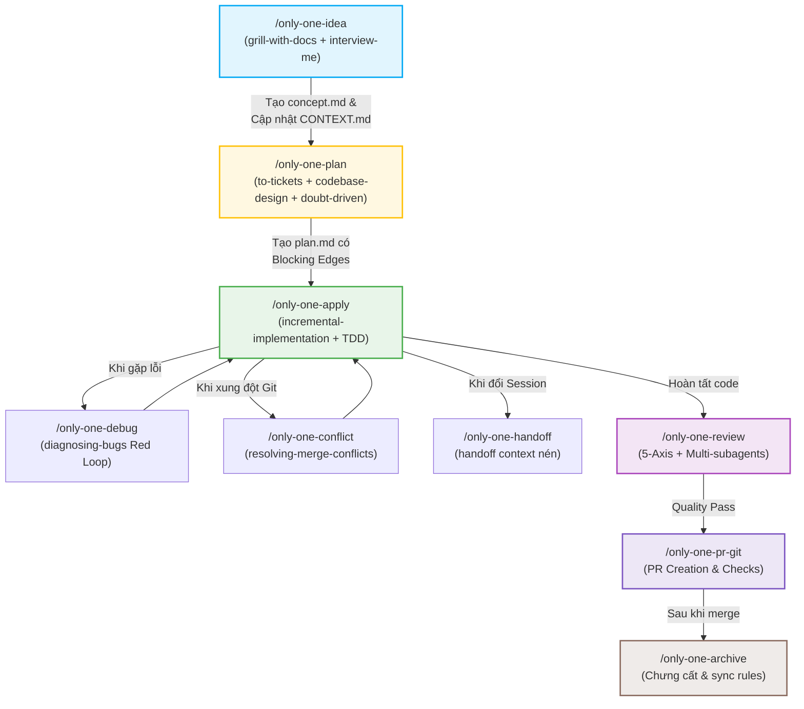

# Plan: Tối ưu hóa và Tinh gọn Hệ thống Workflows & Skills Catalog

## Section 1. Current State (Hiện trạng & Phân tích)

### 1.1 Hiện trạng thực tế trong Codebase
- **Tập trung hóa Skills ([assets/skills/index.ts](file:///Users/kiem/Sources/Personal/only-one-cli/assets/skills/index.ts))**:
  - Đang khai báo 24 skills từ `addyosmani/agent-skills`, `mattpocock/skills` và `local`.
  - Chưa phân cấp rõ ràng giữa các kỹ năng cốt lõi (Primary) và chuyên sâu (Specialist), khiến Agent dễ bị phân vân khi gặp các skill có chức năng tương đồng.
  - `grill-me` và `grill-with-docs` là hai kỹ năng phỏng vấn cốt lõi của Matt Pocock cần được làm nổi bật và phân định rõ ràng cách sử dụng.
  - Còn thiếu 4 kỹ năng thực chiến giá trị: `resolving-merge-conflicts`, `handoff`, `prototype`, `wizard`.
  - Kỹ năng `spec-driven-development` bị trùng lặp chức năng với cặp tài liệu `concept.md` và `plan.md`.
- **Hệ thống Workflows ([assets/workflows/](file:///Users/kiem/Sources/Personal/only-one-cli/assets/workflows))**:
  - `/only-one-idea`: Đang chỉ tạo `concept.md` cục bộ mà chưa có cơ chế đồng bộ Living Domain Glossary (`CONTEXT.md`) và ADRs dùng chung cho toàn dự án.
  - `/only-one-plan`: Thiếu cơ chế **Task Graph & Blocking Edges** (từ `to-tickets` của Matt Pocock) và cổng phản biện đối kháng độc lập (`doubt-driven-development`).
  - `/only-one-apply`: Cần chuẩn hóa chặt chẽ hơn vòng lặp TDD (Beyoncé Rule) và RCA 5 bước có kiểm thử đỏ (`diagnosing-bugs`).
  - `/only-one-review`: Review tuần tự trên cùng một context; chưa tối ưu hóa bằng mô hình Sub-agents song song (Spec Auditor vs Code Quality & Security Auditor).

### 1.2 Những hành vi bắt buộc giữ nguyên (Invariants)
- Giữ nguyên toàn bộ cấu trúc lệnh và slash commands (`/only-one-idea`, `/only-one-plan`, `/only-one-apply`, `/only-one-review`, `/only-one-pr-git`, `/only-one-archive`, `/only-one-clean`, `/only-one-debug`, `/only-one-clockify`, `/only-one-intranet`).
- Giữ nguyên slash command `/grill-me` độc lập.
- Giữ nguyên cấu trúc thư mục lưu trữ task: `only-one/tasks/<YYYYMMDD-HHmmss>-<slug>/`.
- Tương thích 100% với hệ thống phân phối CLI của `only-one-cli`.

---

## Section 2. Detailed Design (Thiết kế chi tiết)

### 2.1 Ma trận Phân tầng Skills Tinh gọn (Tiered Skills Model)

```text
+-----------------------------------------------------------------------------------+
| 1. DEFINE & DISCOVERY (Clarify, Grilling & Domain Modeling)                       |
|    - [Interactive] grill-with-docs: Phỏng vấn sâu + cập nhật CONTEXT.md & ADRs   |
|    - [Interactive] grill-me: Phỏng vấn phản biện nhanh (zero file footprint)      |
|    - [Clarify]     interview-me: Khảo sát từng câu một đạt ~95% confidence        |
|    - [Boundary]    idea-refine: Bóc tách In-Scope vs Explicit Out-of-Scope        |
|    - [Glossary]    domain-modeling: Duy trì từ điển nghiệp vụ (CONTEXT.md)        |
|    - [Support]     wait-what: Tái diễn giải thuật ngữ khi bị lệch ngữ cảnh       |
+-----------------------------------------------------------------------------------+
| 2. PLAN & ARCHITECTURE (Structure, Contracts & Task Graph)                        |
|    - [Primary] to-tickets: Tracer bullets & graph phụ thuộc (blocking edges)       |
|    - [Design]  codebase-design: Thiết kế Deep Modules & Clean Seams               |
|    - [API]     api-and-interface-design: DTOs, Boundary validation, Hyrum's Law    |
|    - [Gate]    doubt-driven-development: Phản biện đối kháng CLAIM -> DOUBT       |
|    - [Visual]  c4-diagrams, ui-ux-pro-max, gherkin-authoring                      |
+-----------------------------------------------------------------------------------+
| 3. BUILD & EXECUTE (Implementation & Safety)                                      |
|    - [Primary] incremental-implementation: Lát cắt mỏng, safe defaults, rollback  |
|    - [Primary] test-driven-development: Red-Green-Refactor, Beyoncé Rule, DAMP    |
|    - [Context] context-engineering: Nạp đúng Negative Rules & Project Tech Skills  |
|    - [Tool]    prototype, wizard: Dựng prototype nhanh & script cho thao tác người|
+-----------------------------------------------------------------------------------+
| 4. VERIFY & DEBUG (RCA & Recovery)                                                |
|    - [Primary] diagnosing-bugs: Red feedback loop, minimize, hypothesize, fix     |
|    - [Browser] browser-testing-with-devtools: Chrome DevTools MCP live audit      |
|    - [Git]     resolving-merge-conflicts: Xử lý conflict theo ý định gốc          |
+-----------------------------------------------------------------------------------+
| 5. REVIEW & SHIP (Quality Gates & PR)                                             |
|    - [Primary] code-review-and-quality: 5-Axis Review & change sizing (~100 dòng) |
|    - [Clean]   code-simplification: Chesterton's Fence, Rule of 500, dead code    |
|    - [Sec]     security-and-hardening: OWASP Top 10, 3-tier boundary validation  |
|    - [Perf]    performance-optimization: Core Web Vitals, N+1 query detection      |
|    - [Ship]    only-one-pr-git-skill, only-one-clockify-skill, handoff             |
+-----------------------------------------------------------------------------------+
```

### 2.2 Quy trình Đồng bộ Living Domain Glossary (`CONTEXT.md`) & ADRs
- Trong `/only-one-idea`: Khi phỏng vấn người dùng, mọi danh từ nghiệp vụ mới được ghi nhận vào `only-one/CONTEXT.md` (hoặc cập nhật nếu đã có).
- Các quyết định khó đảo ngược (ví dụ: chọn ORM, kiến trúc state) được ghi vào `only-one/adrs/<YYYYMMDD>-<decision>.md`.

### 2.3 Cơ chế Blocking Edges & Task Graph trong `/only-one-plan`
- Mỗi file thay đổi trong Section 3 của `plan.md` sẽ có metadata:
  - `Order`: Thứ tự thực thi.
  - `Depends on`: File/Task bắt buộc phải hoàn thành trước.
  - `Verification`: Tiêu chí pass trước khi chuyển sang file kế tiếp.

---

## Section 3. Implementation Architecture

### 3.1 Danh sách các file thay đổi theo Task Graph & Thứ tự thực thi

```text
[MODIFY] assets/skills/index.ts
         - Responsibility: Phân tầng 5 giai đoạn, tối ưu hóa grill-me & grill-with-docs, thêm 4 skill mới, loại bỏ spec-driven-development.
         - Depends on: None (Order 1)

[MODIFY] assets/workflows/only-one-idea.md
         - Responsibility: Nâng cấp luồng idea tích hợp grill-with-docs, grill-me, interview-me và đồng bộ CONTEXT.md.
         - Depends on: assets/skills/index.ts (Order 2)

[MODIFY] assets/workflows/only-one-plan.md
         - Responsibility: Nâng cấp luồng plan tích hợp to-tickets (blocking edges), codebase-design, doubt-driven-development.
         - Depends on: assets/skills/index.ts (Order 3)

[MODIFY] assets/workflows/only-one-apply.md
         - Responsibility: Tối ưu hóa luồng apply tuân thủ task graph, Beyoncé rule và RCA.
         - Depends on: assets/workflows/only-one-plan.md (Order 4)

[MODIFY] assets/workflows/only-one-debug.md
         - Responsibility: Tích hợp quy tắc Red Feedback Loop từ diagnosing-bugs.
         - Depends on: assets/skills/index.ts (Order 5)

[MODIFY] assets/workflows/only-one-review.md
         - Responsibility: Cấu trúc lại 5 trục review và mô hình Subagents song song.
         - Depends on: assets/skills/index.ts (Order 6)

[NEW]    assets/workflows/only-one-handoff.md
         - Responsibility: Workflow nén context và bàn giao phiên làm việc.
         - Depends on: assets/skills/index.ts (Order 7)

[NEW]    assets/workflows/only-one-conflict.md
         - Responsibility: Workflow xử lý conflict merge git theo ý định.
         - Depends on: assets/skills/index.ts (Order 8)

[MODIFY] assets/workflows/index.ts
         - Responsibility: Cập nhật danh mục xuất bản workflows của CLI.
         - Depends on: assets/workflows/only-one-handoff.md, assets/workflows/only-one-conflict.md (Order 9)
```

### 3.2 Luồng tương tác giữa các Workflows



---

## Section 4. Implementation Code Examples

### 4.1 `[MODIFY]` `assets/skills/index.ts`
*Tổ chức danh mục kỹ năng theo 5 tầng phân cấp rõ ràng, giữ nguyên và làm nổi bật `grill-with-docs` & `grill-me`, bổ sung các kỹ năng mới.*

```typescript
import type { SkillManifest } from '../types.js';

export const SKILLS: SkillManifest[] = [
    // --- 1. Define Phase: Discovery, Grilling & Domain Modeling ---
    {
        name: 'grill-with-docs',
        description: 'Conduct a grilling session that sharpens domain terminology and updates CONTEXT.md and ADRs inline.',
        source: 'mattpocock/skills',
        sourceType: 'github',
        skillPath: 'skills/engineering/grill-with-docs/SKILL.md',
    },
    {
        name: 'grill-me',
        description: 'Interview the user relentlessly about a plan or design until reaching shared understanding (zero file footprint).',
        source: 'mattpocock/skills',
        sourceType: 'github',
        skillPath: 'skills/productivity/grill-me/SKILL.md',
    },
    {
        name: 'interview-me',
        description: 'Conduct a one-question-at-a-time interview extracting root needs until ~95% confidence.',
        source: 'addyosmani/agent-skills',
        sourceType: 'github',
        skillPath: 'skills/interview-me/SKILL.md',
    },
    {
        name: 'idea-refine',
        description: 'Refine rough ideas and establish strict In-Scope vs Explicit Out-of-Scope boundaries.',
        source: 'addyosmani/agent-skills',
        sourceType: 'github',
        skillPath: 'skills/idea-refine/SKILL.md',
    },
    {
        name: 'domain-modeling',
        description: 'Actively build and sharpen domain models, challenge glossary terms, and maintain CONTEXT.md.',
        source: 'mattpocock/skills',
        sourceType: 'github',
        skillPath: 'skills/engineering/domain-modeling/SKILL.md',
    },
    {
        name: 'wait-what',
        description: 'Re-pitch complex explanations in plain English using the project domain glossary.',
        source: 'mattpocock/skills',
        sourceType: 'github',
        skillPath: 'skills/productivity/wait-what/SKILL.md',
    },

    // --- 2. Plan Phase: Architecture, Contracts & Task Graph ---
    {
        name: 'to-tickets',
        description: 'Break plan into tracer-bullet tickets with explicit dependency blocking edges.',
        source: 'mattpocock/skills',
        sourceType: 'github',
        skillPath: 'skills/engineering/to-tickets/SKILL.md',
    },
    {
        name: 'codebase-design',
        description: 'Design deep modules with small interfaces at clean seams, testable through that interface.',
        source: 'mattpocock/skills',
        sourceType: 'github',
        skillPath: 'skills/engineering/codebase-design/SKILL.md',
    },
    {
        name: 'api-and-interface-design',
        description: 'Contract-first design, Hyrum\'s Law, error semantics, and boundary validation.',
        source: 'addyosmani/agent-skills',
        sourceType: 'github',
        skillPath: 'skills/api-and-interface-design/SKILL.md',
    },
    {
        name: 'doubt-driven-development',
        description: 'Stress-test high-stakes design choices via CLAIM -> DOUBT -> RECONCILE loops.',
        source: 'addyosmani/agent-skills',
        sourceType: 'github',
        skillPath: 'skills/doubt-driven-development/SKILL.md',
    },
    {
        name: 'c4-diagrams',
        description: 'Architecture diagrams in C4/Mermaid.',
        sourceType: 'local',
    },
    {
        name: 'gherkin-authoring',
        description: 'Draft BDD Gherkin acceptance scenarios for success metrics verification.',
        sourceType: 'local',
    },

    // --- 3. Build Phase: Incremental Implementation & Safety ---
    {
        name: 'incremental-implementation',
        description: 'Implement thin vertical slices with safe defaults and rollback-friendly commits.',
        source: 'addyosmani/agent-skills',
        sourceType: 'github',
        skillPath: 'skills/incremental-implementation/SKILL.md',
    },
    {
        name: 'test-driven-development',
        description: 'Beyoncé Rule, Red-Green-Refactor loop, DAMP tests, and regression guards.',
        source: 'addyosmani/agent-skills',
        sourceType: 'github',
        skillPath: 'skills/test-driven-development/SKILL.md',
    },
    {
        name: 'context-engineering',
        description: 'Feed agents high-signal minimal context, negative rules, and tech skills.',
        source: 'addyosmani/agent-skills',
        sourceType: 'github',
        skillPath: 'skills/context-engineering/SKILL.md',
    },
    {
        name: 'prototype',
        description: 'Build a throwaway prototype to answer an uncertain design or UI question.',
        source: 'mattpocock/skills',
        sourceType: 'github',
        skillPath: 'skills/engineering/prototype/SKILL.md',
    },
    {
        name: 'wizard',
        description: 'Generate interactive bash wizard for steps only humans can perform.',
        source: 'mattpocock/skills',
        sourceType: 'github',
        skillPath: 'skills/engineering/wizard/SKILL.md',
    },

    // --- 4. Verify & Debug Phase: RCA & Recovery ---
    {
        name: 'diagnosing-bugs',
        description: 'Disciplined diagnosis loop: build red test loop -> minimize -> hypothesize -> fix.',
        source: 'mattpocock/skills',
        sourceType: 'github',
        skillPath: 'skills/engineering/diagnosing-bugs/SKILL.md',
    },
    {
        name: 'resolving-merge-conflicts',
        description: 'Resolve git merge/rebase conflicts hunk by hunk based on intent.',
        source: 'mattpocock/skills',
        sourceType: 'github',
        skillPath: 'skills/engineering/resolving-merge-conflicts/SKILL.md',
    },
    {
        name: 'handoff',
        description: 'Compact current conversation state into a seamless handoff document.',
        source: 'mattpocock/skills',
        sourceType: 'github',
        skillPath: 'skills/productivity/handoff/SKILL.md',
    },

    // --- 5. Review & Quality Gates Phase ---
    {
        name: 'code-review-and-quality',
        description: '5-axis code review, change sizing (~100 lines), and PR quality gating.',
        source: 'addyosmani/agent-skills',
        sourceType: 'github',
        skillPath: 'skills/code-review-and-quality/SKILL.md',
    },
    {
        name: 'code-simplification',
        description: 'Chesterton\'s Fence, Rule of 500, eliminate dead code and speculative wrappers.',
        source: 'addyosmani/agent-skills',
        sourceType: 'github',
        skillPath: 'skills/code-simplification/SKILL.md',
    },
    {
        name: 'security-and-hardening',
        description: 'OWASP Top 10 prevention, auth guards, secrets audit, and 3-tier boundary validation.',
        source: 'addyosmani/agent-skills',
        sourceType: 'github',
        skillPath: 'skills/security-and-hardening/SKILL.md',
    },
    {
        name: 'performance-optimization',
        description: 'Core Web Vitals, N+1 database queries, bundle budgets, and memoization.',
        source: 'addyosmani/agent-skills',
        sourceType: 'github',
        skillPath: 'skills/performance-optimization/SKILL.md',
    },

    // --- 6. Local Project Specific Skills ---
    {
        name: 'only-one-nestjs-development',
        description: 'Use for NestJS development with selectively loaded architecture references.',
        sourceType: 'local',
    },
    {
        name: 'only-one-nextjs-development',
        description: 'Use for Next.js and React development with selectively loaded references.',
        sourceType: 'local',
    },
    {
        name: 'only-one-clockify-skill',
        description: 'Validate and log Clockify time entries from task lines.',
        sourceType: 'local',
    },
    {
        name: 'only-one-intranet-skill',
        description: 'Validate and log Intranet timesheet entries from task lines using zodinet-timesheet MCP.',
        sourceType: 'local',
    },
    {
        name: 'only-one-pr-git-skill',
        description: 'Create or update a GitHub Pull Request from current branch.',
        sourceType: 'local',
    },
];
```

---

## Section 5. Test Cases (Kịch bản kiểm thử)

### Test Suite: Workflows & Skills Integrity
1. **TC1: Typecheck & Build Validation**
   - **Objective**: Đảm bảo TypeScript biên dịch thành công không có lỗi type.
   - **Action**: Chạy `npm run build` tại thư mục gốc `only-one-cli`.
   - **Expected**: Exit code 0, không có lỗi linter/typechecker.

2. **TC2: Khả năng phân giải và mapping Skills**
   - **Objective**: Kiểm tra hàm lấy danh mục skill trả về đầy đủ các trường bắt buộc và phân giải chính xác `grill-me`, `grill-with-docs`, `to-tickets`, `diagnosing-bugs`.
   - **Expected**: Tất cả các skills đều có schema hợp lệ.

3. **TC3: Kiểm tra tính liền mạch giữa các Workflows**
   - **Objective**: Rà soát các workflow file Markdown đảm bảo đường dẫn tham chiếu và role tương thích lẫn nhau.
   - **Expected**: Không có liên kết file bị hỏng hoặc mâu thuẫn chỉ thị giữa các bước.

---

## Section 6. Technical English Key Patterns

### 1. Seam-driven architecture
- **Meaning (VI)**: Kiến trúc phân ranh giới rõ ràng; chia tách hệ thống tại các điểm nối tự nhiên để dễ kiểm thử và thay thế.
- **Grammar / Usage**: `[Adjective]-driven [Noun]` $\rightarrow$ Mô hình thiết kế lấy ranh giới/đường nối làm trọng tâm.
- **Engineering Example**:
  > *"By placing the database adapter behind a clean interface, we created an easily testable seam-driven architecture."*

### 2. High-signal minimal context
- **Meaning (VI)**: Ngữ cảnh tối thiểu nhưng chứa lượng thông tin giá trị cao; loại bỏ mọi chi tiết thừa gây phân tâm cho AI model.
- **Grammar / Usage**: `High-signal [Noun Phrase]` $\rightarrow$ Dữ liệu chất lượng cao, không bị nhiễu (noise-free).
- **Engineering Example**:
  > *"Context engineering ensures we feed the agent a high-signal minimal context, preventing hallucination during code generation."*

### 3. Red feedback loop
- **Meaning (VI)**: Vòng phản hồi kiểm thử đỏ; quy trình bắt buộc phải viết hoặc chạy kiểm thử thất bại để tái hiện chính xác lỗi trước khi sửa mã nguồn.
- **Grammar / Usage**: `[Adjective] feedback loop` $\rightarrow$ Chu trình lặp kiểm chứng.
- **Engineering Example**:
  > *"Before writing the bug fix, establish a reliable red feedback loop that reliably fails on the reported issue."*
