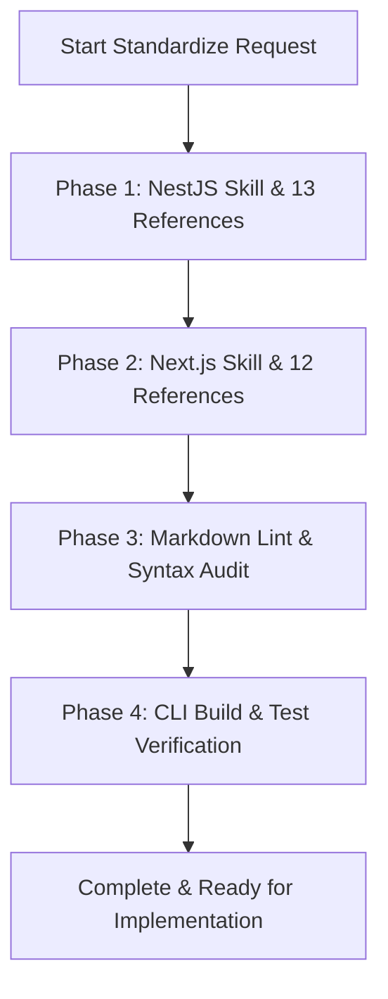

# Concept: Chuẩn hoá Toàn diện Bộ Skill NestJS và Next.js Development sang Tiếng Anh Chuyên Ngành & Cú Pháp Markdown Chuẩn

## 1. Problem Statement & Root Need (Bối cảnh & Vấn đề Cốt lõi)
- **Core Business Problem**: 
  - Hiện tại, 2 bộ skill `only-one-nestjs-development` và `only-one-nextjs-development` trong `assets/skills/` (gồm 2 `SKILL.md` và 25 file `references/*.md`) đang được viết bằng sự pha trộn giữa tiếng Việt và tiếng Anh kỹ thuật, một số chỗ cấu trúc Markdown, bảng tra cứu, codeblock chưa đồng nhất phong cách chuẩn quốc tế.
  - Khi Agent AI (LLM) đọc ngữ cảnh skill, việc viết hoàn toàn bằng **Idiomatic Technical English** giúp tăng độ chính xác trong suy luận, giảm hiểu nhầm ngữ nghĩa (semantic drift) và tương thích hoàn hảo với hệ sinh thái AI Agents (Claude, Gemini, OpenAI).
- **Target Audience & Core Value**:
  - **Đối tượng hưởng lợi**: Toàn bộ hệ thống AI Agent sử dụng `only-one-cli`, các developer tham gia dự án NestJS/Next.js.
  - **Giá trị cốt lõi**: Cung cấp tài liệu chỉ dẫn kiến trúc sắc bén, chuẩn mực quốc tế, tiết kiệm context token nhờ cơ chế Lazy Loading Matrix được trau chuốt tối đa.

## 2. Scope Boundaries (Ranh giới Phạm vi)
- **In-Scope**:
  - **NestJS Skill Suite** (`assets/skills/only-one-nestjs-development/`):
    - `SKILL.md` (Central Coordinator & Anti-Reinvention Invariant)
    - 13 file reference: `controller-architecture.md`, `service-architecture.md`, `entity-architecture.md`, `mikro-orm.md`, `mikro-orm-migration.md`, `request-dto-architecture.md`, `response-dto-architecture.md`, `mapping-profile-architecture.md`, `enum-architecture.md`, `helper-architecture.md`, `test-architecture.md`, `nestjs-architecture.md`, `composition-shared-architecture.md`.
  - **Next.js Skill Suite** (`assets/skills/only-one-nextjs-development/`):
    - `SKILL.md` (Central Coordinator & Anti-Reinvention Invariant)
    - 12 file reference: `page-architecture.md`, `component-architecture.md`, `refine-hooks.md`, `types-and-contracts.md`, `utils-and-helpers.md`, `i18n-and-constants.md`, `app-and-pages-router.md`, `react-state-and-hooks.md`, `ui-ux-guidelines.md`, `next-runtime-dev-loop.md`, `next-cache-and-performance.md`, `code-review-guidelines.md`.
  - **Đồng bộ hóa Workspace**: Đồng bộ các file skill đã chuẩn hóa sang `.agents/skills/` (nếu cần tương thích runtime hiện hành).
  - **Chuẩn hóa Cú pháp**: 
    - Frontmatter YAML chuẩn (`name`, `description`).
    - GitHub alerts chuẩn (`> [!NOTE]`, `> [!IMPORTANT]`, `> [!WARNING]`).
    - Bảng tra cứu điều hướng và định dạng mã nguồn (syntax highlighting `ts`, `tsx`, `json`, `text`).
- **Explicit Out-of-Scope**:
  - Thay đổi logic nghiệp vụ cốt lõi hay các architectural invariant (vẫn giữ nguyên quy tắc return-by-variable, max 200 lines/file, anti-reinvention, lazy-loading matrix).
  - Can thiệp vào các bộ skill khác (`c4-diagrams`, `gherkin-authoring`, `clockify`, v.v.).

## 3. Success Metrics (Thước đo Thành công / Definition of Done)
- **Coverage**: 100% (27/27 files) được chuyển ngữ sang tiếng Anh kỹ thuật tự nhiên, chính xác, không còn sót đoạn tiếng Việt nào.
- **Syntax Quality**: 100% codeblock có language identifier rõ ràng, bảng Markdown căn chỉnh chuẩn, không có broken link giữa các file `references/*.md`.
- **Prebuilt Build Validation**: Lệnh `npm run build` và các test liên quan đến prebuilt/skill registry pass hoàn toàn.

## 4. Proposed Solution & Core Mechanism (Phương pháp Giải quyết & Cơ chế Xử lý)

### 4.1. Explored Options & Trade-off Analysis (Các Phương án Đã Cân Nhắc)
| Option | Hướng tiếp cận | Ưu điểm (Pros) | Nhược điểm (Cons) | Độ phức tạp | Đánh giá |
| :--- | :--- | :--- | :--- | :--- | :--- |
| **Option 1: Direct In-Place Refactor & Standardize** | Chuẩn hóa trực tiếp toàn bộ 27 files trong `assets/skills/` với văn phong tiếng Anh kỹ thuật tinh gọn, sau đó build lại prebuilt bundle | Nhanh, triệt để, đồng bộ trực tiếp source of truth của CLI | Đòi hỏi rà soát kỹ 27 file để đảm bảo không mất mát quy tắc kiến trúc | Medium | **(Khuyến nghị)** Chọn phương án này để đảm bảo tính nhất quán toàn diện |
| **Option 2: Minimal SKILL.md-only Translation** | Chỉ dịch 2 file `SKILL.md`, giữ nguyên nội dung tiếng Việt trong `references/` | Thời gian xử lý nhanh | Trải nghiệm Agent không đồng nhất khi đào sâu vào reference files | Low | Loại (Không đạt yêu cầu chuẩn hóa toàn diện của PM) |
| **Option 3: Modular Restructure & Split** | Tái cấu trúc phân tách thêm các sub-folder trong `references/` | Tổ chức sâu hơn | Gây vỡ đường dẫn tham chiếu trong `SKILL.md` và `assets/skills/index.ts` | High | Loại (Phức tạp không cần thiết) |

- **Chosen Strategy (Phương án Được Chọn)**: **Option 1 (Direct In-Place Refactor & Standardize)**. Chuẩn hóa toàn diện 27 files trong `assets/skills/` giữ nguyên đường dẫn file, trau chuốt từng quy tắc kiến trúc sang chuẩn tiếng Anh chuyên ngành.

### 4.2. Core Processing Flow (Luồng Xử lý / Chuyển trạng thái Chính)
- **Workflow / Logic Flow**:
  1. **Phase 1 (NestJS Suite)**: 
     - Chuẩn hóa `SKILL.md` (Anti-reinvention, Lazy loading matrix, Conflict resolution).
     - Chuẩn hóa 13 file `references/*.md` (Controller, Service, Entity, MikroORM, DTOs, Mapper, Enums, Helpers, Tests, Composition).
  2. **Phase 2 (Next.js Suite)**:
     - Chuẩn hóa `SKILL.md` (Anti-reinvention, Master routing matrix, Debug-friendly return).
     - Chuẩn hóa 12 file `references/*.md` (Pages, Components, Refine Hooks, Types, Utils, i18n, Router, State, UI/UX, Dev Loop, Performance, Review).
  3. **Phase 3 (Verification & Sync)**:
     - Chạy build và test kiểm tra tính toàn vẹn của prebuilt indexers.
     - Cập nhật bản sao tương ứng trong `.agents/skills/`.

### 4.3. Critical Edge Cases & Risk Handling (Kịch bản Biên & Xử lý Rủi ro)
- **Broken Markdown Links**: Đảm bảo tất cả link tương đối `[references/xyz.md](references/xyz.md)` trong `SKILL.md` khớp 100% tên file thực tế.
- **Semantic Loss during Translation**: Các quy chuẩn bất biến (như *Return-by-variable rule*, *Single-responsibility module boundaries*, *MikroORM schema constraints*) phải được dịch với thuật ngữ chính xác tuyệt đối, không làm lỏng lẻo ràng buộc thiết kế.

## 5. Technical English Key Patterns
### 1. Lazy-Loading Reference Matrix
- **Meaning (VI)**: Ma trận điều hướng nạp tài liệu tham khảo theo nhu cầu để tiết kiệm context window.
- **Grammar / Usage**: `Directives for Context Efficiency (Selective / On-Demand Loading)`
- **Engineering Example**: *"The agent MUST NOT load all reference documents simultaneously; instead, it must selectively inspect only the matching reference via lazy loading."*

### 2. Mandatory Anti-Reinvention Invariant
- **Meaning (VI)**: Ràng buộc bất biến bắt buộc: Tái sử dụng trước, chống phát minh lại bánh xe.
- **Grammar / Usage**: `Mandatory Reuse-First Invariant / Strict Anti-Reinvention Rule`
- **Engineering Example**: *"Perform a pre-implementation codebase audit in shared modules to prevent reinventing existing utility functions."*

### 3. Debug-Friendly Return-by-Variable Convention
- **Meaning (VI)**: Quy ước gán giá trị vào biến có nghĩa trước khi return nhằm thuận tiện cho việc debug và đặt breakpoint.
- **Grammar / Usage**: `Assign-to-variable pattern prior to return statement`
- **Engineering Example**: *"Explicitly bind computed JSX elements or data structures to descriptive variables before returning them to streamline breakpoint debugging."*
