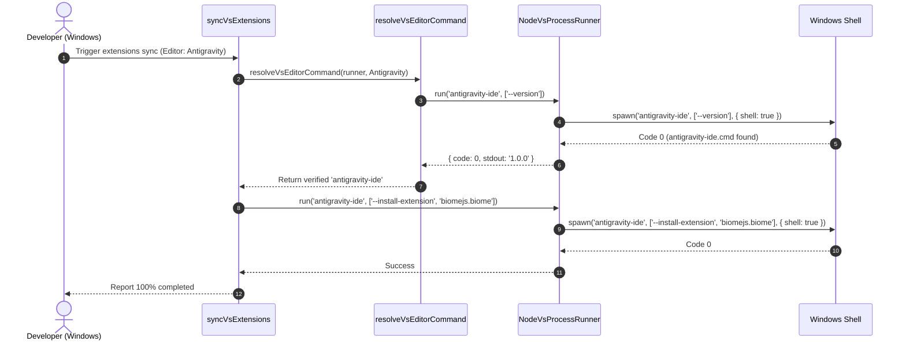

# Plan: Khắc phục lỗi Spawn ENOENT khi đồng bộ VS Extensions cho Antigravity trên Windows

## Section 1. Current State (Hiện trạng & Phân tích Mã nguồn)
- **Hiện trạng luồng thực thi**:
  - Tại [`src/core/vs/runtime.ts:20-36`](file:///d:/Sources/Personal/only-one-cli/src/core/vs/runtime.ts#L20-L36), lớp `NodeVsProcessRunner` khởi tạo tiến trình con qua hàm `spawn(command, args, { shell: false })`.
  - Trên hệ điều hành Windows (`win32`), các CLI của editor như Antigravity IDE (`antigravity-ide.cmd`), VS Code (`code.cmd`), Cursor (`cursor.cmd`) được cài đặt dưới dạng Windows Command Script (`.cmd`). Khi gọi `child_process.spawn('antigravity-ide', ...)` với `shell: false`, Node.js cố gắng tìm trực tiếp file nhị phân `antigravity-ide.exe` và thất bại với mã lỗi `ENOENT` (Error 127).
  - Tại [`src/core/vs/extensions-sync.ts:35-43`](file:///d:/Sources/Personal/only-one-cli/src/core/vs/extensions-sync.ts#L35-L43), hàm `resolveVsEditorCommand` thực hiện probing bằng cách chạy `[candidate] --version`. Khi cả 2 candidate (`antigravity-ide`, `antigravity`) đều trả về lỗi (exit code 127 do `ENOENT`), hàm fallback mù quáng trả về `editor.commandCandidates[0]` (`antigravity-ide`).
  - Khi tiếp tục chạy `syncVsExtensions` tại [`src/core/vs/extensions-sync.ts:135`](file:///d:/Sources/Personal/only-one-cli/src/core/vs/extensions-sync.ts#L135), runner gọi `spawn('antigravity-ide', ['--install-extension', ...])`, gây crash toàn bộ CLI với ngoại lệ:
    ```
    Error: spawn antigravity-ide ENOENT
        at syncVsExtensions (src/core/vs/extensions-sync.ts:99:27)
    ```
- **Invariants (Danh sách hành vi bắt buộc bảo toàn)**:
  1. *Platform Independence*: Luồng thực thi trên macOS/Linux (`darwin`/`linux`) không bị ảnh hưởng và không khởi chạy shell thừa thãi.
  2. *Transactional Rollback*: Nếu quá trình cài đặt extension bị lỗi giữa chừng, `VsSyncTransaction` vẫn thực hiện uninstall các extension vừa cài đặt và dọn dẹp journal file.
  3. *Zero Unnecessary Dependencies*: Không thêm các thư viện cồng kềnh ngoài core runtime nếu có thể giải quyết bằng native Node.js API.

---

## Section 2. Detailed Design (Thiết kế Kỹ thuật Chi tiết)

### 2.1. Kiến trúc & Cơ chế Xử lý (Deep Module & Clean Seams)
1. **Platform-Aware Shell Invocation trong `NodeVsProcessRunner`**:
   - Truyền `{ shell: process.platform === 'win32', windowsHide: true }` vào `child_process.spawn`.
   - Điều này cho phép Windows command interpreter tự động phân giải các file batch script trong `PATH` (`antigravity-ide.cmd`, `code.cmd`, `cursor.cmd`) mà không cần hardcode đuôi mở rộng.
2. **Fail-Fast Candidate Resolution trong `resolveVsEditorCommand`**:
   - Khi lặp qua danh sách `editor.commandCandidates`, nếu candidate trả về `check.code === 0`, trả về candidate đó.
   - Nếu duyệt hết tất cả candidate mà không có lệnh nào chạy thành công, ném ngoại lệ rõ ràng `Error` thay vì trả về candidate hỏng:
     `Executable for "${editor.name}" not found in PATH (${editor.commandCandidates.join(', ')}). Please verify that ${editor.name} is installed and available in your PATH.`
3. **Pre-flight Error Surfacing**:
   - Khi chạy `step-3-select-extensions.ts` hoặc `step-5-execute-and-report.ts`, lỗi không tìm thấy executable sẽ hiển thị thông báo thân thiện tới người dùng thay vì crash raw stack trace.



### 2.2. Phản biện Red-Team (`doubt-driven-development`)
- **DOUBT**: Việc bật `shell: true` trên Windows có gây nguy cơ Command Injection không?
- **RECONCILE**: Không. Các tham số truyền vào `spawn(command, args)` là mảng cố định (`--version`, `--list-extensions`, `--install-extension`, `extensionId`). Extension ID được lấy từ manifest nội bộ (`VS_LIBRARY`) hoặc từ danh sách chuẩn hóa `normalizeExtensionIds` (chỉ chứa ký tự an toàn dạng `publisher.name`), không nhận raw shell script từ bên ngoài.

---

## Section 3. Implementation Architecture & Machine-Readable Task Matrix

### 3.1 Machine-Readable Task Matrix & Dependency Graph

| Order | Status | Action | File Path | Target Symbols / AST Seams | Reused Existing Utilities / Helpers | Depends On | Fast Test Command |
| :---: | :---: | :---: | :--- | :--- | :--- | :--- | :--- |
| **1** | `[x]` | `[MODIFY]` | `src/core/vs/runtime.ts` | `NodeVsProcessRunner.run` | `child_process.spawn` | `None` | `npm test test/core/vs/vs-core.test.ts` |
| **2** | `[x]` | `[MODIFY]` | `src/core/vs/extensions-sync.ts` | `resolveVsEditorCommand` | `findVsEditor` | `Order 1` | `npm test test/core/vs/vs-core.test.ts` |
| **3** | `[x]` | `[MODIFY]` | `test/core/vs/vs-core.test.ts` | `describe('VS core sync helpers')` | `MemoryRunner`, `MemoryFs` | `Order 2` | `npm test test/core/vs/vs-core.test.ts` |

---

## Section 4. Implementation Code Examples (Mẫu Code Triển khai)

### 4.1. `src/core/vs/runtime.ts` (Order 1)
- **Mục đích**: Hỗ trợ thực thi các file batch script `.cmd` trên Windows bằng cách kích hoạt `shell: process.platform === 'win32'`.
- **Reused Abstractions**: Native `node:child_process`.

```typescript
// [TARGET SEAM]: src/core/vs/runtime.ts (NodeVsProcessRunner.run)
// [RATIONALE]: Enable shell execution on Windows to resolve .cmd wrappers in PATH
export class NodeVsProcessRunner implements VsProcessRunner {
    public async run(command: string, args: string[]): Promise<VsProcessResult> {
        return new Promise((resolve) => {
            const isWin = process.platform === 'win32';
            const child = spawn(command, args, {
                shell: isWin,
                windowsHide: true,
            });
            let stderr = '';
            let stdout = '';
            child.stderr?.on('data', (chunk: Buffer) => {
                stderr += chunk.toString();
            });
            child.stdout?.on('data', (chunk: Buffer) => {
                stdout += chunk.toString();
            });
            child.on('error', (error) => resolve({ code: 127, stderr: error.message, stdout }));
            child.on('close', (code) => resolve({ code: code ?? 1, stderr, stdout }));
        });
    }
}
```

### 4.2. `src/core/vs/extensions-sync.ts` (Order 2)
- **Mục đích**: Xác thực executable khả dụng và ném ngoại lệ rõ ràng nếu không tìm thấy command candidate nào hoạt động.
- **Reused Abstractions**: `VsProcessRunner`, `VsEditorDescriptor`.

```typescript
// [TARGET SEAM]: src/core/vs/extensions-sync.ts (resolveVsEditorCommand)
// [RATIONALE]: Fail-fast with actionable error message when no candidate executable is found
export const resolveVsEditorCommand = async (runner: VsProcessRunner, editor: VsEditorDescriptor): Promise<string> => {
    for (const candidate of editor.commandCandidates) {
        const check = await runner.run(candidate, ['--version']);
        if (check.code === 0) {
            return candidate;
        }
    }
    throw new Error(
        `Executable for "${editor.name}" not found in PATH (${editor.commandCandidates.join(', ')}). Please verify that ${editor.name} is installed and available in PATH.`,
    );
};
```

### 4.3. `test/core/vs/vs-core.test.ts` (Order 3)
- **Mục đích**: Bổ sung unit tests kiểm tra `resolveVsEditorCommand` ném lỗi khi không có candidate nào hợp lệ và phân giải thành công candidate đầu tiên thỏa mãn.

```typescript
// [TARGET SEAM]: test/core/vs/vs-core.test.ts
// [RATIONALE]: Unit test candidate resolution logic and failure modes
it('throws an actionable error when no editor command candidates are executable', async () => {
    const runner: VsProcessRunner = {
        run: async () => ({ code: 127, stderr: 'not found', stdout: '' }),
    };
    const editor = vsEditors.find((e) => e.id === VsEditorId.Antigravity)!;
    await expect(resolveVsEditorCommand(runner, editor)).rejects.toThrow(
        /Executable for "Antigravity" not found in PATH/,
    );
});

it('resolves the first available candidate command for an editor', async () => {
    const runner: VsProcessRunner = {
        run: async (command) => {
            if (command === 'antigravity') return { code: 0, stderr: '', stdout: '1.0.0' };
            return { code: 127, stderr: 'not found', stdout: '' };
        },
    };
    const editor = vsEditors.find((e) => e.id === VsEditorId.Antigravity)!;
    const resolved = await resolveVsEditorCommand(runner, editor);
    expect(resolved).toBe('antigravity');
});
```

---

## Section 5. Test Cases (Kịch bản Kiểm thử & Nghiệm thu)

### Scenario 1: Successful Extension Sync on Windows with .cmd Executable (Happy Path)
- **Objective**: Xác nhận runner kích hoạt thành công `antigravity-ide.cmd` trên Windows.
- **Precondition**: `antigravity-ide.cmd` có trong PATH của môi trường Windows.
- **Action**: Thực thi `syncVsExtensions` với `editorIds: [VsEditorId.Antigravity]`.
- **Expected Result**: Lệnh hoàn tất với `installedCount > 0`, không gặp lỗi `spawn ENOENT`.

### Scenario 2: Actionable Error when Editor CLI is Missing (Error Path)
- **Objective**: Đảm bảo ném lỗi rõ ràng khi không có CLI nào của editor trong PATH.
- **Precondition**: Cả `antigravity-ide` và `antigravity` đều trả về exit code khác 0.
- **Action**: Gọi `resolveVsEditorCommand(runner, editor)`.
- **Expected Result**: Ngoại lệ `Executable for "Antigravity" not found in PATH` được ném ra với đầy đủ thông tin danh sách candidate.

### Comprehensive Test Command
```bash
npm test test/core/vs/vs-core.test.ts
```

---

## Section 6. Technical English Key Patterns

### 1. Platform-Agnostic Process Spawning
- **Meaning (VI)**: Kỹ thuật khởi chạy tiến trình độc lập với hệ điều hành, tự thích ứng với sự khác biệt giữa Windows batch scripts và POSIX binaries.
- **Grammar / Usage**: `Enable platform-agnostic process spawning by + [gerund / noun phrase]`
- **Engineering Example**: *"We enable platform-agnostic process spawning by conditionally toggling the shell option on Win32 architectures."*

### 2. Pre-flight Executable Probe
- **Meaning (VI)**: Bước thăm dò kiểm tra tính sẵn sàng của file thực thi trước khi bắt đầu transaction nghiệp vụ.
- **Grammar / Usage**: `Conduct a pre-flight probe to ensure + clause`
- **Engineering Example**: *"The extension sync pipeline conducts a pre-flight probe to ensure the editor binary is reachable before acquiring the transaction lock."*

### 3. Fail-Fast Error Surfacing
- **Meaning (VI)**: Cơ chế đẩy lỗi ra ngoài ngay lập tức kèm ngữ cảnh hướng dẫn thay vì nuốt lỗi hoặc fallback về trạng thái không xác định.
- **Grammar / Usage**: `Subject + surface(s) actionable errors instead of + gerund`
- **Engineering Example**: *"The command resolver surfaces actionable errors instead of silently returning an unresolved candidate binary."*
