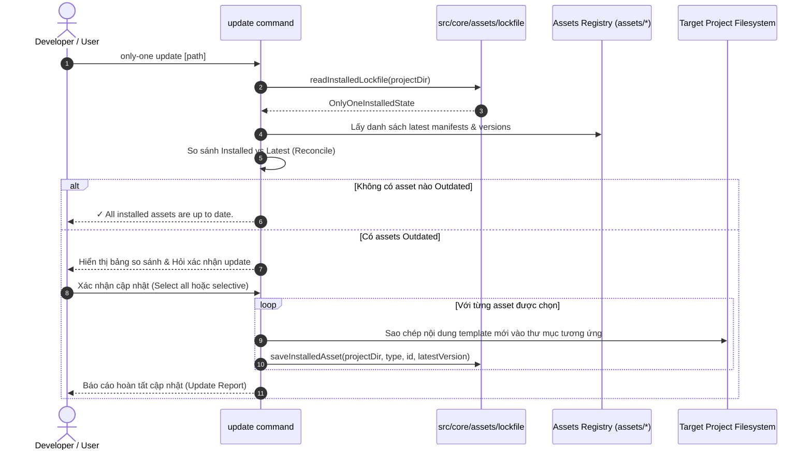

# Plan: Triển khai Quản lý Phiên bản Độc lập (Asset Versioning) & Cơ chế Đồng bộ (Sync/Update) cho Assets

## Section 1. Current State (Hiện trạng & Phân tích Mã nguồn)

### 1.1. Hiện trạng Codebase & Phân tích Luồng Thực thi
- **Manifests Schema thiếu trường `version`**:
  - Tại [assets/types.ts](file:///Users/kiem/Sources/PERSONAL/only-one-cli/assets/types.ts), các interface đại diện cho assets như `RuleManifest`, `PackageManifest`, `McpManifest`, `SkillManifest`, `WorkflowManifest`, `ConfigManifest`, `ComboManifest`, `GitAssetManifest` hoàn toàn không có thuộc tính `version`.
  - Tất cả các file khai báo danh mục asset trong [assets/rules/index.ts](file:///Users/kiem/Sources/PERSONAL/only-one-cli/assets/rules/index.ts), [assets/packages/index.ts](file:///Users/kiem/Sources/PERSONAL/only-one-cli/assets/packages/index.ts), [assets/mcps/index.ts](file:///Users/kiem/Sources/PERSONAL/only-one-cli/assets/mcps/index.ts), [assets/skills/index.ts](file:///Users/kiem/Sources/PERSONAL/only-one-cli/assets/skills/index.ts), [assets/workflows/index.ts](file:///Users/kiem/Sources/PERSONAL/only-one-cli/assets/workflows/index.ts), [assets/combos/index.ts](file:///Users/kiem/Sources/PERSONAL/only-one-cli/assets/combos/index.ts), [assets/git/index.ts](file:///Users/kiem/Sources/PERSONAL/only-one-cli/assets/git/index.ts), [assets/vs/index.ts](file:///Users/kiem/Sources/PERSONAL/only-one-cli/assets/vs/index.ts) đều chỉ định nghĩa metadata tĩnh, không ghi nhận phiên bản.
- **Cơ chế Update hiện tại bị ràng buộc chặt (Tight Coupling) với CLI Version**:
  - Xem xét [src/core/agent/update.ts#L39-L48](file:///Users/kiem/Sources/PERSONAL/only-one-cli/src/core/agent/update.ts#L39-L48), hàm `updateAgentArtifacts` so sánh phiên bản bằng cách trích xuất banner generated version:
    ```ts
    const installedVersion = extractGeneratedByVersion(skillPath);
    if (!installedVersion || installedVersion !== cliVersion) {
        needsUpdate = true;
    }
    ```
  - Logic này chỉ cập nhật cấu trúc workflow/command của agent tools dựa trên phiên bản CLI tổng thể (`cliVersion`). Nếu chỉ một workflow (ví dụ `only-one-idea.md`) hoặc một rule được sửa đổi, CLI không có cách nào biết được chính xác file nào cần update trong dự án người dùng, hoặc ngược lại sẽ buộc người dùng ghi đè toàn bộ ngay cả những thành phần không hề thay đổi.
- **Tiền lệ Lockfile trong Codebase**:
  - Codebase đã có module quản lý lockfile chuyên biệt cho remote skills tại [src/core/skill/remote/lockfile.ts](file:///Users/kiem/Sources/PERSONAL/only-one-cli/src/core/skill/remote/lockfile.ts) với các pattern rất tốt: `resolveSkillsLockfilePathForProject`, `readSkillsLockfile`, fallback an toàn khi file chưa tồn tại hoặc bị lỗi cú pháp JSON, và ghi file atomic. Chúng ta sẽ kế thừa và nhân rộng pattern này sang một module quản lý lockfile asset toàn diện (`src/core/assets/lockfile.ts`).

### 1.2. Invariants (Các Hành vi Bắt buộc Phải Giữ Nguyên)
1. **Backward Compatibility cho Asset Loaders**: Các hàm loader và registry hiện hữu (`WORKFLOWS`, `SKILLS`, `RULES`, `COMBOS`, `MCPS`, `PACKAGES`) tiếp tục trả về đầy đủ các trường cũ, không phá vỡ hợp đồng dữ liệu với các command `init`, `workflow`, `skill`, `rule`, `combo`.
2. **Graceful Fallback khi Lockfile Vắng mặt**: Khi người dùng chạy lệnh trên một project cũ chưa có `.only-one/installed.json` (hoặc `only-one/installed.json`), hệ thống phải không crash và coi toàn bộ assets chưa được cài hoặc cung cấp cơ chế khởi tạo lockfile mượt mà.
3. **Pure Decimal Rollover Invariant**: Mọi phiên bản asset phải tuân thủ nghiêm ngặt định dạng `X.Y.Z` cơ số 10. Không chấp nhận semver vượt ngưỡng `9` ở phần patch hoặc minor (ví dụ `0.0.10` là invalid, phải là `0.1.0`).
4. **Atomic Write & Non-Destructive Fallback**: Khi ghi đè asset trong quá trình update, nếu xảy ra lỗi ghi đĩa, lockfile chỉ cập nhật trạng thái cho những asset đã ghi thành công (không để xảy ra lockfile drift).

---

## Section 2. Detailed Design (Thiết kế Kỹ thuật Chi tiết)

### 2.1. Kiến trúc Module & Phân tách Trách nhiệm (`codebase-design`)
Chúng ta thiết kế 4 module độc lập, chuyên sâu với ranh giới rõ ràng:

1. **`src/core/assets/version.ts` (Version Arithmetic Engine)**:
   - Module thuần túy (pure functions, zero dependencies), đảm nhận:
     - `isValidDecimalVersion(v: string): boolean`: Kiểm tra chuỗi định dạng `/^\d+\.\d+\.\d+$/` và kiểm tra các số không âm.
     - `bumpDecimalVersion(current: string): string`: Thực hiện thuật toán cơ số 10:
       - Tách `[M, m, p]`. Tăng $p = p + 1$.
       - Nếu $p > 9 \rightarrow p = 0, m = m + 1$.
       - Nếu $m > 9 \rightarrow m = 0, M = M + 1$.
       - Trả về `${M}.${m}.${p}`.
     - `compareDecimalVersions(v1: string, v2: string): number`: Trả về `-1` (v1 < v2), `0` (v1 == v2), `1` (v1 > v2).
2. **`src/core/assets/lockfile.ts` (Project State Tracking)**:
   - Quản lý file `.only-one/installed.json` (hoặc `only-one/installed.json`).
   - Khai báo kiểu `InstalledAssetRecord` và `OnlyOneInstalledState`.
   - Cung cấp API `readInstalledLockfile(projectDir)`, `saveInstalledAsset(projectDir, ...)`, `saveInstalledAssetsBatch(projectDir, ...)`.
3. **`src/core/assets/bump.ts` & Script `scripts/bump-asset.ts` (Developer Tooling)**:
   - Cho phép dev chạy `pnpm asset:bump <type> <id>`.
   - Tự động tìm vị trí asset trong `assets/<type>/index.ts`, đọc version hiện tại, áp dụng `bumpDecimalVersion` và cập nhật file mã nguồn trực tiếp.
4. **`src/core/assets/gate.ts` & Test `test/core/assets/version-gate.test.ts` (Quality CI Gate)**:
   - Kiểm tra `git diff` so với `origin/main` (hoặc commit trước).
   - Ánh xạ đường dẫn file bị sửa đổi sang asset tương ứng trong `assets/`.
   - Bắt buộc: Nếu file nội dung của asset thay đổi mà version trong manifest không tăng $\rightarrow$ Báo lỗi chi tiết kèm hướng dẫn chạy lệnh bump.

### 2.2. Sequence Diagram: Luồng Kiểm tra & Cập nhật Asset (`only-one update`)



### 2.3. Red-Team Phản biện Kiến trúc (`doubt-driven-development`)
- **CLAIM**: "Dùng regex để tự động bump version trong file TypeScript `assets/<type>/index.ts` liệu có làm hỏng cú pháp code không?"
- **DOUBT**: Nếu regex match nhầm chuỗi version của asset khác hoặc làm mất comment/formatting thì sao?
- **RECONCILE**: Mỗi asset trong manifest có định dạng cấu trúc định danh duy nhất (`name: '...'` hoặc `id: '...'`). Module `bump.ts` sẽ tìm khối object khớp chính xác với `id`/`name`, sau đó chỉ thay thế thuộc tính `version: '...'` nằm trong khối object đó. Ngoài ra, sau khi bump, test suite `npm run format:check` và `tsc --noEmit` sẽ đảm bảo file không bao giờ bị lỗi cú pháp.

---

## Section 3. Implementation Architecture & Machine-Readable Task Matrix

### 3.1 Machine-Readable Task Matrix & Dependency Graph

| Order | Status | Action | File Path | Target Symbols / AST Seams | Reused Existing Utilities / Helpers | Depends On | Fast Test Command |
| :---: | :---: | :---: | :--- | :--- | :--- | :--- | :--- |
| **1** | `[x]` | `[MODIFY]` | `assets/types.ts` | `RuleManifest`, `PackageManifest`, `McpManifest`, `VsLibraryManifest`, `SkillManifest`, `WorkflowManifest`, `ConfigManifest`, `ComboManifest`, `GitAssetManifest` | None | `None` | `npx vitest run test/core/allowed-targets.test.ts` |
| **2** | `[x]` | `[MODIFY]` | `assets/rules/index.ts` | `RULES` | None | `Order 1` | `npx vitest run test/core/rule-adapters.test.ts` |
| **3** | `[x]` | `[MODIFY]` | `assets/packages/index.ts` | `PACKAGES` | None | `Order 1` | `npx vitest run test/core/package-registry.test.ts` |
| **4** | `[x]` | `[MODIFY]` | `assets/mcps/index.ts` | `MCPS` | None | `Order 1` | `npx vitest run test/core/mcp-adapters.test.ts` |
| **5** | `[x]` | `[MODIFY]` | `assets/vs/index.ts` | `VS_LIBRARY` | None | `Order 1` | `npx vitest run test/core/vs/` |
| **6** | `[x]` | `[MODIFY]` | `assets/skills/index.ts` | `SKILLS` | None | `Order 1` | `npx vitest run test/core/skill-registry.test.ts` |
| **7** | `[x]` | `[MODIFY]` | `assets/workflows/index.ts` | `WORKFLOWS` | None | `Order 1` | `npx vitest run test/core/workflow-registry.test.ts` |
| **8** | `[x]` | `[MODIFY]` | `assets/combos/index.ts` | `COMBOS` | None | `Order 1` | `npx vitest run test/core/combo.test.ts` |
| **9** | `[x]` | `[MODIFY]` | `assets/git/index.ts` | `GIT_MANIFESTS`, `GIT_SNIPPETS` | None | `Order 1` | `npx vitest run test/core/allowed-targets.test.ts` |
| **10** | `[x]` | `[NEW]` | `src/core/assets/version.ts` | `isValidDecimalVersion`, `bumpDecimalVersion`, `compareDecimalVersions` | None | `None` | `npx vitest run test/core/assets/version.test.ts` |
| **11** | `[x]` | `[NEW]` | `src/core/assets/types.ts` | `InstalledAssetRecord`, `OnlyOneInstalledState`, `AssetType` | None | `None` | `npx vitest run test/core/assets/lockfile.test.ts` |
| **12** | `[x]` | `[NEW]` | `src/core/assets/lockfile.ts` | `resolveInstalledLockfilePath`, `readInstalledLockfile`, `recordInstalledAssetsBatch` | Pattern from `src/core/skill/remote/lockfile.ts` | `Order 11` | `npx vitest run test/core/assets/lockfile.test.ts` |
| **13** | `[x]` | `[NEW]` | `src/core/assets/bump.ts` | `bumpAssetManifestVersion`, `resolveAssetManifestFilePath` | `src/core/assets/version.ts` | `Order 10` | `npx vitest run test/core/assets/bump.test.ts` |
| **14** | `[x]` | `[NEW]` | `scripts/bump-asset.ts` | `main` script runner | `src/core/assets/bump.ts` | `Order 13` | `pnpm tsx scripts/bump-asset.ts --help` |
| **15** | `[x]` | `[MODIFY]` | `package.json` | `scripts["asset:bump"]` | None | `Order 14` | `pnpm asset:bump --help` |
| **16** | `[x]` | `[NEW]` | `src/core/assets/gate.ts` | `verifyAssetVersionBumps`, `mapChangedFileToAsset` | `src/core/assets/version.ts` | `Order 10` | `npx vitest run test/core/assets/version-gate.test.ts` |
| **17** | `[x]` | `[NEW]` | `test/core/assets/version.test.ts` | Unit tests for Decimal Rollover arithmetic | Vitest | `Order 10` | `npx vitest run test/core/assets/version.test.ts` |
| **18** | `[x]` | `[NEW]` | `test/core/assets/lockfile.test.ts` | Unit tests for Lockfile read/write/merge | Vitest, `node:fs/promises` | `Order 12` | `npx vitest run test/core/assets/lockfile.test.ts` |
| **19** | `[x]` | `[NEW]` | `test/core/assets/version-gate.test.ts` | Tests for Manifest Version Coverage & CI Gate | `src/core/assets/gate.ts` | `Order 16` | `npx vitest run test/core/assets/version-gate.test.ts` |
| **20** | `[x]` | `[MODIFY]` | `src/core/workflow/index.ts` | `installWorkflows` | `src/core/assets/lockfile.ts (recordInstalledAssetsBatch)` | `Order 7, Order 12` | `npx vitest run test/core/agent-workflows.test.ts` |
| **21** | `[x]` | `[MODIFY]` | `src/core/rule/index.ts` | `installRules` | `src/core/assets/lockfile.ts (recordInstalledAssetsBatch)` | `Order 2, Order 12` | `npx vitest run test/core/rule-adapters.test.ts` |
| **22** | `[x]` | `[MODIFY]` | `src/core/skill/index.ts` | `installSkills` | `src/core/assets/lockfile.ts (recordInstalledAssetsBatch)` | `Order 6, Order 12` | `npx vitest run test/core/skill-registry.test.ts` |
| **23** | `[x]` | `[NEW]` | `src/core/assets/sync.ts` | `inspectAssetUpdates`, `applyAssetUpdates` | `src/core/assets/lockfile.ts`, `src/core/assets/version.ts` | `Order 10, Order 12` | `npx vitest run test/core/assets/sync.test.ts` |
| **24** | `[x]` | `[MODIFY]` | `src/commands/update/actions/step-2-update-artifacts.ts` | `updateArtifactsStep` | `src/core/assets/sync.ts` | `Order 23` | `npx vitest run test/commands/update.test.ts` |

---

## Section 4. Implementation Code Examples (Mẫu Code Triển khai)

### Order 1: [MODIFY] `assets/types.ts`
- **Purpose**: Khai báo thuộc tính bắt buộc `version: string` trong tất cả các manifest interfaces.
- **Depends on**: None

```ts
// [TARGET SEAM] assets/types.ts
export interface RuleManifest {
    id: string;
    version: string; // [NEW] e.g. "0.0.1"
    description?: string;
    sourceFile: string;
    supportedTargets: AllowedToolId[];
    requiredPackages?: string[];
    requiredMcps?: string[];
    requiredSkills?: string[];
}

export interface PackageManifest {
    id: string;
    version: string; // [NEW] e.g. "0.0.1"
    description?: string;
    installer: PackageInstaller;
    requirements?: string[];
}

export interface McpManifest {
    id: string;
    version: string; // [NEW] e.g. "0.0.1"
    server: McpServerConfig;
}

export interface VsLibraryManifest {
    version: string; // [NEW] e.g. "0.0.1"
    extensions: string[];
    settings: Record<string, unknown>;
}

export interface SkillManifest {
    name: string;
    version: string; // [NEW] e.g. "0.0.1"
    description: string;
    source?: string;
    sourceType?: 'github' | 'local';
    skillPath?: string;
}

export interface WorkflowManifest {
    name: string;
    version: string; // [NEW] e.g. "0.0.1"
    description: string;
    requiredSkills?: string[];
    requiredMcps?: string[];
}

export interface ConfigManifest {
    name: string;
    version: string; // [NEW] e.g. "0.0.1"
    description?: string;
    files: ConfigFileEntry[];
}

export interface ComboManifest {
    id: string;
    version: string; // [NEW] e.g. "0.0.1"
    name: string;
    description?: string;
    packages?: string[];
    mcps?: string[];
    skills?: string[];
    rules?: string[];
    configs?: string[];
    workflows?: string[];
}
```

---

### Order 10: [NEW] `src/core/assets/version.ts`
- **Purpose**: Cung cấp bộ tính toán và so sánh phiên bản Decimal Rollover.
- **Depends on**: None

```ts
// [TARGET SEAM] src/core/assets/version.ts
export const DEFAULT_ASSET_VERSION = '0.0.1';

const DECIMAL_VERSION_REGEX = /^(\d+)\.(\d+)\.(\d+)$/;

export function isValidDecimalVersion(version: string): boolean {
    return DECIMAL_VERSION_REGEX.test(version.trim());
}

export function bumpDecimalVersion(currentVersion: string): string {
    const match = currentVersion.trim().match(DECIMAL_VERSION_REGEX);
    if (!match) {
        throw new Error(`Invalid decimal version format: "${currentVersion}". Expected "X.Y.Z" (e.g. 0.0.1).`);
    }

    let major = Number.parseInt(match[1], 10);
    let minor = Number.parseInt(match[2], 10);
    let patch = Number.parseInt(match[3], 10);

    patch += 1;
    if (patch > 9) {
        patch = 0;
        minor += 1;
        if (minor > 9) {
            minor = 0;
            major += 1;
        }
    }

    return `${major}.${minor}.${patch}`;
}

export function compareDecimalVersions(v1: string, v2: string): number {
    const m1 = v1.trim().match(DECIMAL_VERSION_REGEX);
    const m2 = v2.trim().match(DECIMAL_VERSION_REGEX);
    if (!m1 || !m2) {
        throw new Error(`Cannot compare invalid decimal versions: "${v1}" vs "${v2}"`);
    }

    const [maj1, min1, pat1] = [Number(m1[1]), Number(m1[2]), Number(m1[3])];
    const [maj2, min2, pat2] = [Number(m2[1]), Number(m2[2]), Number(m2[3])];

    if (maj1 !== maj2) return maj1 > maj2 ? 1 : -1;
    if (min1 !== min2) return min1 > min2 ? 1 : -1;
    if (pat1 !== pat2) return pat1 > pat2 ? 1 : -1;
    return 0;
}
```

---

### Order 11 & 12: [NEW] `src/core/assets/types.ts` & `src/core/assets/lockfile.ts`
- **Purpose**: Quản lý lưu trữ trạng thái `.only-one/installed.json` trong dự án tiêu dùng.
- **Reused Abstractions**: Tái sử dụng cấu trúc và kỹ thuật resolution từ [src/core/skill/remote/lockfile.ts](file:///Users/kiem/Sources/PERSONAL/only-one-cli/src/core/skill/remote/lockfile.ts).
- **Depends on**: Order 11

```ts
// [TARGET SEAM] src/core/assets/types.ts
export type AssetType = 'workflows' | 'skills' | 'rules' | 'mcps' | 'packages' | 'configs' | 'combos' | 'git' | 'vs';

export interface InstalledAssetRecord {
    version: string;
    installedAt: string;
    updatedAt?: string;
    files?: string[];
}

export interface OnlyOneInstalledState {
    schemaVersion: 1;
    updatedAt: string;
    installed: Record<string, Record<string, InstalledAssetRecord>>;
}
```

```ts
// [TARGET SEAM] src/core/assets/lockfile.ts
import { existsSync } from 'node:fs';
import { mkdir, readFile, writeFile } from 'node:fs/promises';
import { dirname, join } from 'node:path';
import type { AssetType, InstalledAssetRecord, OnlyOneInstalledState } from './types.js';

export const ONLY_ONE_LOCKFILE_NAME = 'installed.json';

export function resolveInstalledLockfilePath(projectDir: string): string {
    const preferred = join(projectDir, '.only-one', ONLY_ONE_LOCKFILE_NAME);
    if (existsSync(preferred)) return preferred;

    const onlyOneDir = join(projectDir, 'only-one', ONLY_ONE_LOCKFILE_NAME);
    if (existsSync(onlyOneDir)) return onlyOneDir;

    return preferred;
}

export async function readInstalledLockfile(projectDir: string): Promise<OnlyOneInstalledState> {
    const lockPath = resolveInstalledLockfilePath(projectDir);
    if (!existsSync(lockPath)) {
        return { schemaVersion: 1, updatedAt: new Date().toISOString(), installed: {} };
    }
    try {
        const raw = await readFile(lockPath, 'utf-8');
        return JSON.parse(raw) as OnlyOneInstalledState;
    } catch {
        return { schemaVersion: 1, updatedAt: new Date().toISOString(), installed: {} };
    }
}

export async function recordInstalledAssetsBatch(
    projectDir: string,
    entries: Array<{ type: AssetType; id: string; version: string; files?: string[] }>,
): Promise<void> {
    const state = await readInstalledLockfile(projectDir);
    const now = new Date().toISOString();

    for (const entry of entries) {
        if (!state.installed[entry.type]) {
            state.installed[entry.type] = {};
        }
        const existing = state.installed[entry.type][entry.id];
        state.installed[entry.type][entry.id] = {
            version: entry.version,
            installedAt: existing?.installedAt || now,
            updatedAt: now,
            files: entry.files || existing?.files,
        };
    }
    state.updatedAt = now;

    const lockPath = resolveInstalledLockfilePath(projectDir);
    await mkdir(dirname(lockPath), { recursive: true });
    await writeFile(lockPath, JSON.stringify(state, null, 2) + '\n', 'utf-8');
}
```

---

### Order 16: [NEW] `src/core/assets/gate.ts`
- **Purpose**: Chặn PR/commit nếu nội dung file trong `assets/` thay đổi mà manifest không được tăng version.
- **Depends on**: Order 10

```ts
// [TARGET SEAM] src/core/assets/gate.ts
import { execSync } from 'node:child_process';
import { compareDecimalVersions } from './version.js';

export interface AssetChangeViolation {
    assetType: string;
    assetId: string;
    modifiedFiles: string[];
    currentVersion: string;
    baseVersion: string;
    error: string;
}

export function detectChangedAssetFiles(baseRef = 'origin/main'): string[] {
    try {
        const stdout = execSync(`git diff --name-only ${baseRef}...HEAD -- assets/`, { encoding: 'utf-8' });
        return stdout.split('\n').map((s) => s.trim()).filter(Boolean);
    } catch {
        // Fallback to checking uncommitted/staged files against HEAD if baseRef not found
        try {
            const stdout = execSync(`git diff --name-only HEAD -- assets/`, { encoding: 'utf-8' });
            return stdout.split('\n').map((s) => s.trim()).filter(Boolean);
        } catch {
            return [];
        }
    }
}
```

---

## Section 5. Test Cases (Kịch bản Kiểm thử & Nghiệm thu)

### Test Case 1: Decimal Rollover Arithmetic Invariant
- **Objective**: Xác minh thuật toán tăng phiên bản cơ số 10 nhảy đúng nấc.
- **Target File**: `test/core/assets/version.test.ts`
- **Gherkin Scenario**:
  ```gherkin
  Scenario Outline: Incrementing version following decimal rollover rules
    Given a current version string "<current>"
    When the bumpDecimalVersion function is invoked
    Then the resulting version should be "<expected>"

    Examples:
      | current | expected |
      | 0.0.1   | 0.0.2    |
      | 0.0.8   | 0.0.9    |
      | 0.0.9   | 0.1.0    |
      | 0.1.9   | 0.2.0    |
      | 0.9.9   | 1.0.0    |
      | 1.9.9   | 2.0.0    |
  ```

### Test Case 2: Manifest Full Version Coverage
- **Objective**: Đảm bảo 100% tất cả các asset trong `assets/` đều có trường `version` hợp lệ.
- **Target File**: `test/core/assets/version-gate.test.ts`
- **Gherkin Scenario**:
  ```gherkin
  Scenario: All registered asset manifests must define a valid decimal version
    Given the assets registry containing workflows, skills, rules, mcps, packages, combos, and git assets
    When every manifest item is inspected
    Then each item must have a defined "version" property
    And the version property must match the decimal pattern "^\\d+\\.\\d+\\.\\d+$"
  ```

### Test Case 3: Lockfile State Recording & Persistence
- **Objective**: Cài đặt workflow/skill/rule ghi nhận chính xác phiên bản vào `.only-one/installed.json`.
- **Target File**: `test/core/assets/lockfile.test.ts`
- **Gherkin Scenario**:
  ```gherkin
  Scenario: Recording installed assets updates lockfile atomically
    Given a clean target project directory
    When recordInstalledAssetsBatch is called with workflow "only-one-idea" at version "0.0.1"
    Then file ".only-one/installed.json" is created
    And the JSON content shows "only-one-idea" with version "0.0.1"
    When recordInstalledAssetsBatch is called with updated version "0.0.2"
    Then the version for "only-one-idea" becomes "0.0.2" without losing other assets
  ```

### Test Case 4: CI Gate Detects Unbumped Asset Modifications
- **Objective**: Chặn commit nếu sửa file template nhưng không bump manifest version.
- **Target File**: `test/core/assets/version-gate.test.ts`
- **Gherkin Scenario**:
  ```gherkin
  Scenario: Blocking PR when asset content changes without version bump
    Given file "assets/workflows/only-one-idea.md" has been modified
    But the manifest version in "assets/workflows/index.ts" remains unchanged
    When the version gate verification runs
    Then it throws a violation error indicating "only-one-idea" version must be bumped
  ```

### Comprehensive Verification Commands
```bash
npm run format:check
npx tsc --noEmit
npm test
```

---

## Section 6. Technical English Key Patterns

### 1. Atomic Per-Component Versioning
- **Meaning (VI)**: Cơ chế định phiên bản độc lập ở cấp độ từng thành phần nguyên tử, ngăn chặn việc tăng version dây chuyền không cần thiết.
- **Grammar / Usage**: `Adjective phrase` bổ nghĩa cho danh từ kiến trúc.
- **Engineering Example**: *"Atomic per-component versioning ensures that hotfixing a single workflow manifest will not inflate the version counters of unrelated rules or packages."*

### 2. Base-10 / Decimal Rollover
- **Meaning (VI)**: Sự cuốn chiếu cơ số 10 (chạm ngưỡng 9 thì reset về 0 và tăng 1 đơn vị ở nấc cao hơn liền kề).
- **Grammar / Usage**: `Subject + rolls over to + Target`.
- **Engineering Example**: *"Once the patch identifier reaches nine, it rolls over to zero and increments the minor version accordingly."*

### 3. State Reconciliation
- **Meaning (VI)**: Quá trình đối chiếu và cân bằng giữa trạng thái mong muốn (desired state) và trạng thái thực tế đã cài đặt (actual installed state).
- **Grammar / Usage**: `Reconcile [Source State] with [Target State]`.
- **Engineering Example**: *"During the update lifecycle, the CLI reconciles the project's lockfile entries with the latest upstream asset definitions to detect outdated artifacts."*

### 4. Zero-Bypass Quality Gate
- **Meaning (VI)**: Cổng kiểm soát chất lượng không thể lách qua, bắt buộc 100% tuân thủ trước khi code được merge.
- **Grammar / Usage**: `Noun phrase` chỉ chốt chặn kiểm thử trong CI/CD pipeline.
- **Engineering Example**: *"The pre-commit test serves as a zero-bypass quality gate that automatically rejects any asset modifications lacking a corresponding version bump."*
