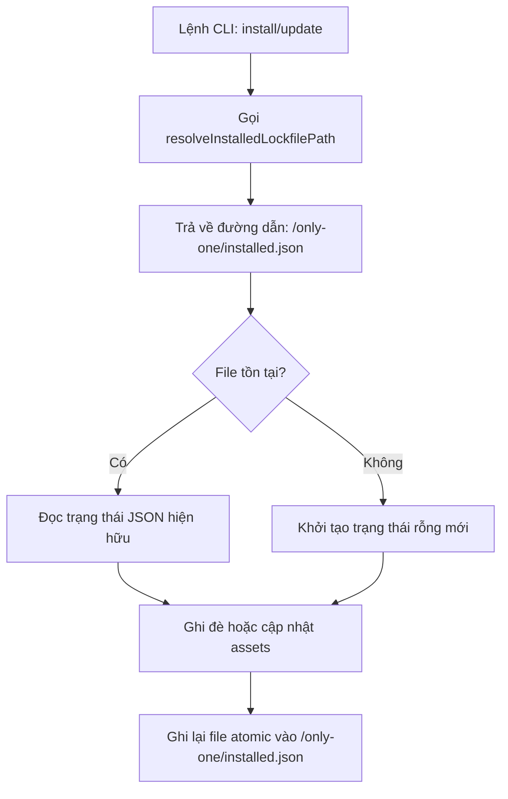

# Concept: Chuyển đổi Thư mục Lưu trữ Lockfile installed.json sang "only-one" (Hard Cutover)

## 1. Problem Statement & Root Need (Bối cảnh & Vấn đề Cốt lõi)
- **Core Business Problem**:
  - Hiện tại, file lockfile `installed.json` ghi nhận trạng thái các assets đã cài đặt trong dự án người dùng đang được lưu tại thư mục ẩn `.only-one/` (`.only-one/installed.json`).
  - Trong khi đó, toàn bộ tài nguyên cấu hình và quản trị của CLI trong một dự án đều được đặt tại thư mục hiển thị chuẩn `only-one/` (như `only-one/rules.md`, `only-one/tasks/`, `only-one/learn/`, `only-one/skills-lock.json`).
  - Việc tồn tại song song cả hai thư mục (`.only-one/` và `only-one/`) gây phân tán tài nguyên quản trị, thiếu tính nhất quán (lack of consistency), và làm người dùng khó quan sát trạng thái cài đặt của dự án.
- **Target Audience & Core Value**:
  - **Target Audience**: Lập trình viên và maintainer sử dụng `only-one-cli` trong các dự án cá nhân và doanh nghiệp.
  - **Core Value**:
    - Thống nhất một điểm lưu trữ tài nguyên duy nhất (Single Source of Truth) dưới thư mục `only-one/`.
    - Trực quan hóa file `only-one/installed.json`, giúp lập trình viên dễ dàng kiểm tra, commit vào Git repository cùng với các quy tắc và task quản lý khác.

---

## 2. Scope Boundaries (Ranh giới Phạm vi)

### In-Scope
- **Cập nhật Hàm Định vị Lockfile (`resolveInstalledLockfilePath`)**:
  - Chuyển đổi đường dẫn đích cố định sang `join(projectDir, 'only-one', 'installed.json')`.
  - Tự động tạo thư mục `only-one/` nếu chưa tồn tại khi ghi lockfile.
- **Hard Cutover Policy**:
  - Ngừng toàn bộ việc kiểm tra hoặc ghi nhận vào thư mục ẩn `.only-one/`.
- **Cập nhật và Bổ sung Test Cases**:
  - Cập nhật các bài kiểm thử trong `test/core/assets/lockfile.test.ts` và `test/core/assets/sync.test.ts` để kiểm tra trực tiếp đường dẫn `only-one/installed.json`.

### Explicit Out-of-Scope
- Không triển khai logic tự động di chuyển (auto-migration) hoặc xóa file cũ `.only-one/installed.json` (người dùng tự quyết định dọn dẹp thư mục cũ trong repo của họ).
- Không tạo cơ chế backward-compatible fallback đọc lại thư mục ẩn `.only-one/` để giữ mã nguồn tối giản và sạch sẽ tuyệt đối (anti-complexity).

---

## 3. Success Metrics (Thước đo Thành công / Definition of Done)
1. **Single Source of Truth**: 100% các lệnh cài đặt (`workflow`, `rule`, `skill`...) và lệnh `update` chỉ tương tác với file `only-one/installed.json`.
2. **Zero Dot-Directory Footprint**: Không có bất kỳ file mới nào được sinh ra trong `.only-one/` từ CLI.
3. **Test Suite 100% Pass**: Toàn bộ unit tests liên quan đến lockfile và synchronization vượt qua kiểm thử với đường dẫn mới `only-one/installed.json`.

---

## 4. Proposed Solution & Core Mechanism (Phương pháp Giải quyết & Cơ chế Xử lý)

### 4.1. Explored Options & Trade-off Analysis (Các Phương án Đã Cân Nhắc)

| Option | Hướng tiếp cận | Ưu điểm (Pros) | Nhược điểm (Cons) | Độ phức tạp | Đánh giá |
| :--- | :--- | :--- | :--- | :--- | :--- |
| **Option 1 (Chosen)** | **Direct Single-Source Hard Cutover** | Cực kỳ gọn gàng, loại bỏ hoàn toàn mã nguồn fallback thừa, đảm bảo tính nhất quán tuyệt đối. | Không tự động nhận diện file cũ ở `.only-one/` (nhưng đúng định hướng chỉ định của PO). | Low | **Lựa chọn chính thức**. |
| **Option 2** | **Dual-Lookup Migration & Cleanup** | Tự động di chuyển file cho các dự án cũ đã có `.only-one/`. | Phức tạp hóa luồng đọc/ghi, tiềm ẩn rủi ro xóa nhầm thư mục nếu có file khác trong `.only-one/`. | Medium | Loại (vi phạm nguyên tắc YAGNI). |

- **Chosen Strategy**: **Option 1 (Hard Cutover)** - Thay đổi hằng số và hàm định vị đường dẫn lockfile thành duy nhất `only-one/installed.json`.

---

### 4.2. Core Processing Flow (Luồng Xử lý / Chuyển trạng thái Chính)

---

### 4.3. Critical Edge Cases & Risk Handling (Kịch bản Biên & Xử lý Rủi ro)
1. **Dự án mới chưa có thư mục `only-one/`**:
   - *Xử lý*: Hàm `recordInstalledAssetsBatch` đã có sẵn lệnh `await mkdir(dirname(lockPath), { recursive: true })` nên thư mục `only-one/` sẽ tự động được khởi tạo an toàn mà không gây lỗi `ENOENT`.
2. **Dự án cũ vẫn còn file `.only-one/installed.json`**:
   - *Xử lý*: Do áp dụng Hard Cutover, CLI sẽ coi dự án chưa có file lockfile mới và tự động tạo `only-one/installed.json` khi chạy install/update, không gây xung đột với thư mục ẩn cũ.

---

## 5. Technical English Key Patterns

### 1. Hard Cutover Strategy
- **Meaning (VI)**: Chiến lược chuyển đổi dứt khoát sang hệ thống hoặc đường dẫn mới, loại bỏ hoàn toàn cơ chế hỗ trợ song song hay tương thích ngược.
- **Grammar / Usage**: `Adjective phrase` hoặc `Verb phrase` (`Execute a hard cutover to [Target]`).
- **Engineering Example**: *"By adopting a hard cutover strategy, we eliminate legacy fallback branches and guarantee a single source of truth for configuration files."*

### 2. Directory Consolidation
- **Meaning (VI)**: Việc gom nhóm hoặc hợp nhất các thư mục phân tán về một thư mục tiêu chuẩn duy nhất.
- **Grammar / Usage**: `Consolidate [Source Directories] into [Target Directory]`.
- **Engineering Example**: *"The directory consolidation unifies all project metadata and lockfiles under the visible 'only-one/' workspace folder."*

### 3. Footprint Minimization
- **Meaning (VI)**: Việc tối giản hóa dấu vết/tệp tin sinh ra trên hệ thống tệp của người dùng.
- **Grammar / Usage**: `Minimize the file system footprint`.
- **Engineering Example**: *"Relocating the lockfile avoids cluttering the project root and minimizes unnecessary hidden directory footprints."*
