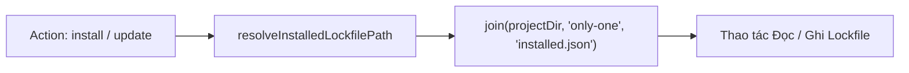

# Plan: Chuyển đổi Thư mục Lưu trữ Lockfile installed.json sang "only-one" (Hard Cutover)

## Section 1. Current State (Hiện trạng & Phân tích Mã nguồn)

### 1.1. Hiện trạng Codebase
- Tại [src/core/assets/lockfile.ts#L15-L27](file:///Users/kiem/Sources/PERSONAL/only-one-cli/src/core/assets/lockfile.ts#L15-L27), hàm `resolveInstalledLockfilePath` đang ưu tiên kiểm tra và mặc định trỏ về `.only-one/installed.json`:
  ```ts
  export function resolveInstalledLockfilePath(projectDir: string): string {
      const dotOnlyOne = join(projectDir, '.only-one', ONLY_ONE_LOCKFILE_NAME);
      if (existsSync(dotOnlyOne)) {
          return dotOnlyOne;
      }
      const onlyOneDir = join(projectDir, 'only-one', ONLY_ONE_LOCKFILE_NAME);
      if (existsSync(onlyOneDir)) {
          return onlyOneDir;
      }
      return dotOnlyOne;
  }
  ```
- Điều này khiến mọi lệnh cài đặt asset (`only-one workflow`, `only-one rule`, `only-one skill`...) và lệnh `only-one update` tạo ra thư mục ẩn `.only-one/` trong dự án người dùng, tách rời khỏi thư mục quản lý hiển thị `only-one/` (nơi đang chứa `rules.md`, `tasks/`, `learn/`, `skills-lock.json`).

### 1.2. Invariants (Các Hành vi Bắt buộc Phải Giữ Nguyên)
1. **Single Source of Truth**: Toàn bộ luồng đọc/ghi trạng thái `installed.json` của assets chỉ tương tác với duy nhất `only-one/installed.json`.
2. **Directory Auto-Creation**: Nếu thư mục `only-one/` chưa tồn tại trong dự án mới, lệnh `mkdir(dirname(lockPath), { recursive: true })` phải tự động khởi tạo thư mục này một cách an toàn.
3. **No Hidden Folder Pollution**: Không tạo bất kỳ file hoặc folder mới nào mang tên `.only-one` trong project người dùng.

---

## Section 2. Detailed Design (Thiết kế Kỹ thuật Chi tiết)

### 2.1. Cấu trúc và Đường dẫn Chuẩn hóa
- Bổ sung hằng số `ONLY_ONE_DIR_NAME = 'only-one'` tại [src/core/assets/lockfile.ts](file:///Users/kiem/Sources/PERSONAL/only-one-cli/src/core/assets/lockfile.ts).
- Cập nhật hàm `resolveInstalledLockfilePath(projectDir: string): string`:
  ```ts
  export function resolveInstalledLockfilePath(projectDir: string): string {
      return join(projectDir, ONLY_ONE_DIR_NAME, ONLY_ONE_LOCKFILE_NAME);
  }
  ```
- Áp dụng triệt để chính sách **Hard Cutover**: Loại bỏ hoàn toàn nhánh kiểm tra `.only-one` để giữ mã nguồn tối giản, tránh code dead branches hoặc logic thừa.

### 2.2. Sơ đồ Luồng Thực thi (Flow Diagram)


---

## Section 3. Implementation Architecture & Machine-Readable Task Matrix

### 3.1 Machine-Readable Task Matrix & Dependency Graph

| Order | Status | Action | File Path | Target Symbols / AST Seams | Reused Existing Utilities / Helpers | Depends On | Fast Test Command |
| :---: | :---: | :---: | :--- | :--- | :--- | :--- | :--- |
| **1** | `[x]` | `[MODIFY]` | `src/core/assets/lockfile.ts` | `ONLY_ONE_DIR_NAME`, `resolveInstalledLockfilePath` | None | `None` | `npx vitest run test/core/assets/lockfile.test.ts` |
| **2** | `[x]` | `[MODIFY]` | `test/core/assets/lockfile.test.ts` | Unit test expectations for `only-one/installed.json` | None | `Order 1` | `npx vitest run test/core/assets/lockfile.test.ts` |

---

## Section 4. Implementation Code Examples (Mẫu Code Triển khai)

### Order 1: [MODIFY] `src/core/assets/lockfile.ts`
- **Purpose**: Đổi hằng số và đơn giản hóa hàm resolve sang `only-one/installed.json`.
- **Depends on**: None

```ts
// [TARGET SEAM] src/core/assets/lockfile.ts
export const ONLY_ONE_DIR_NAME = 'only-one';
export const ONLY_ONE_LOCKFILE_NAME = 'installed.json';

/**
 * Resolves the lockfile path within a target project.
 * Uses only-one/installed.json as the single source of truth.
 */
export function resolveInstalledLockfilePath(projectDir: string): string {
    return join(projectDir, ONLY_ONE_DIR_NAME, ONLY_ONE_LOCKFILE_NAME);
}
```

---

### Order 2: [MODIFY] `test/core/assets/lockfile.test.ts`
- **Purpose**: Cập nhật các assertions kiểm tra đường dẫn `only-one/installed.json`.
- **Depends on**: Order 1

```ts
// [TARGET SEAM] test/core/assets/lockfile.test.ts
it('resolves default lockfile path to only-one/installed.json', () => {
    const dummyDir = '/tmp/test-project';
    expect(resolveInstalledLockfilePath(dummyDir)).toBe(join(dummyDir, 'only-one', ONLY_ONE_LOCKFILE_NAME));
});
```

---

## Section 5. Test Cases (Kịch bản Kiểm thử & Nghiệm thu)

### Test Case 1: Lockfile Path Resolution Invariant
- **Objective**: Đảm bảo hàm `resolveInstalledLockfilePath` luôn trả về `<projectDir>/only-one/installed.json`.
- **Target File**: `test/core/assets/lockfile.test.ts`
- **Gherkin Scenario**:
  ```gherkin
  Scenario: Resolving lockfile path in target project
    Given any project directory path "/path/to/project"
    When resolveInstalledLockfilePath is called
    Then the resulting path should strictly be "/path/to/project/only-one/installed.json"
  ```

### Test Case 2: Atomic State Recording under only-one/
- **Objective**: Xác nhận khi cài đặt asset, file `only-one/installed.json` được tạo thành công và thư mục `only-one/` được tự động sinh ra nếu chưa có.
- **Target File**: `test/core/assets/lockfile.test.ts`
- **Gherkin Scenario**:
  ```gherkin
  Scenario: Recording installed assets in fresh project creates only-one/installed.json
    Given a clean temporary directory with no only-one folder
    When recordInstalledAssetsBatch is called with workflow "only-one-idea"
    Then the file "only-one/installed.json" is created
    And no ".only-one" directory exists
  ```

### Comprehensive Verification Commands
```bash
npm run format:check
npx tsc --noEmit
npm test
```

---

## Section 6. Technical English Key Patterns

### 1. Deterministic Path Resolution
- **Meaning (VI)**: Quá trình phân giải đường dẫn mang tính xác định tuyệt đối (không phụ thuộc vào fallback ngẫu nhiên hoặc các điều kiện phỏng đoán).
- **Grammar / Usage**: `Noun phrase`.
- **Engineering Example**: *"Deterministic path resolution guarantees that all asset installation operations resolve to the exact same 'only-one/installed.json' location."*

### 2. Elimination of Dead Code Paths
- **Meaning (VI)**: Loại bỏ các nhánh mã nguồn không còn dùng hoặc gây phân tán logic.
- **Grammar / Usage**: `Eliminate [Condition] code paths`.
- **Engineering Example**: *"By enforcing a hard cutover, we eliminate obsolete fallback code paths and reduce cognitive load across the module."*
