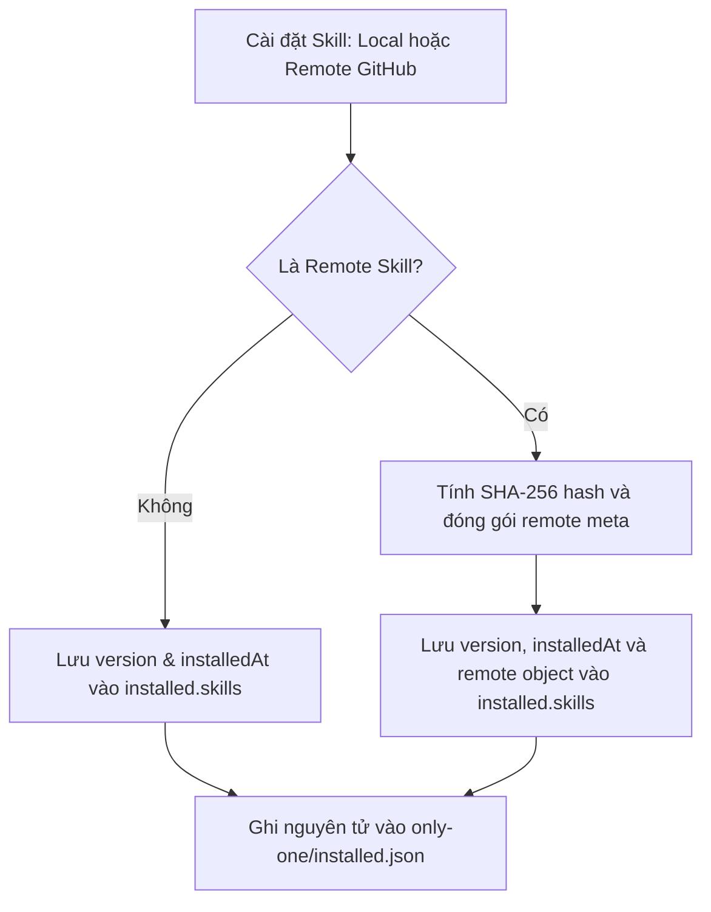

# Concept: Hợp nhất skills-lock.json vào installed.json (Unified Asset Lockfile)

## 1. Problem Statement & Root Need (Bối cảnh & Vấn đề Cốt lõi)
- **Core Business Problem**:
  - Trong dự án người dùng hiện tồn tại đồng thời 2 file quản lý trạng thái:
    1. `only-one/installed.json`: Quản lý danh mục toàn bộ các assets (`workflows`, `rules`, `skills`, `mcps`, `packages`, `combos`, `git`) kèm phiên bản phát hành (`version`).
    2. `only-one/skills-lock.json`: Quản lý riêng các skills tải từ remote GitHub kèm mã kiểm tra toàn vẹn (`computedHash`).
  - Sự tồn tại song song của cả 2 file dẫn đến việc dữ liệu về `skills` bị phân mảnh và trùng lặp (redundancy), gây nhầm lẫn cho lập trình viên và làm tăng chi phí bảo trì luồng đồng bộ dữ liệu.
- **Target Audience & Core Value**:
  - **Lập trình viên & Maintainer**: Chỉ cần quản lý và theo dõi một file duy nhất trong Git repo (`only-one/installed.json`).
  - **Kiến trúc CLI**: Đạt trạng thái **Single Source of Truth (SSOT)** tuyệt đối cho tất cả assets.

---

## 2. Scope Boundaries (Ranh giới Phạm vi)

### In-Scope
- **Mở rộng Schema của `InstalledAssetRecord`**:
  - Bổ sung trường tùy chọn `remote?: RemoteSkillMeta` (hoặc `remote?: { source: string; sourceType: 'github'; branch?: string; skillPath: string; computedHash: string }`) vào cấu trúc của record trong `installed.json`.
- **Hợp nhất Module Quản lý Lockfile**:
  - Tái cấu trúc `src/core/skill/remote/lockfile.ts` để đọc và ghi trực tiếp vào `only-one/installed.json` (tận dụng `src/core/assets/lockfile.ts`).
  - Đảm bảo các hàm hiện hữu như `saveSkillToLockfile`, `readSkillsLockfile` vẫn hoạt động tương thích nhưng trỏ vào nhánh `installed.skills` của `installed.json`.
- **Dọn dẹp File Legacy**:
  - Loại bỏ việc sinh file mới `only-one/skills-lock.json`.
  - Cập nhật các bài kiểm thử `test/core/skill-lockfile.test.ts`, `test/commands/skill/skill.test.ts`.

### Explicit Out-of-Scope
- Không thay đổi thuật toán tính mã băm SHA-256 (`computedHash`) của remote skills.
- Không thay đổi định dạng của các assets khác (`workflows`, `rules`, `mcps`...).

---

## 3. Success Metrics (Thước đo Thành công / Definition of Done)
1. **Single File Footprint**: Sau khi cài đặt cả local assets lẫn remote skills, trong thư mục `only-one/` chỉ xuất hiện duy nhất 1 file lockfile là `installed.json`.
2. **Zero Functional Regression**: Toàn bộ các luồng kiểm tra remote skills (`inspect`, `sync`, `hash check`) tiếp tục hoạt động trơn tru 100%.
3. **100% Test Pass Rate**: Toàn bộ 54+ test files của dự án chạy thành công.

---

## 4. Proposed Solution & Core Mechanism (Phương pháp Giải quyết & Cơ chế Xử lý)

### 4.1. Explored Options & Trade-off Analysis (Các Phương án Đã Cân Nhắc)

| Option | Hướng tiếp cận | Ưu điểm (Pros) | Nhược điểm (Cons) | Độ phức tạp | Đánh giá |
| :--- | :--- | :--- | :--- | :--- | :--- |
| **Option 1 (Chosen)** | **Unified Lockfile (`installed.json`)** | Loại bỏ hoàn toàn sự phân mảnh, chỉ còn 1 lockfile duy nhất trong `only-one/`. Lưu trữ cả version lẫn remote metadata. | Cần cập nhật adapter trong `src/core/skill/remote/`. | Medium | **Lựa chọn tối ưu nhất**. |
| **Option 2** | **Giữ nguyên 2 file tách biệt** | Không cần sửa code của module remote skills. | Tiếp tục gây trùng lặp và khó hiểu cho người dùng. | Low | Bị từ chối. |

- **Chosen Strategy**: **Option 1 (Unified Lockfile)**.

---

### 4.2. Schema Thiết kế Sau khi Hợp nhất (`only-one/installed.json`)

```json
{
  "schemaVersion": 1,
  "updatedAt": "2026-09-03T04:05:00.000Z",
  "installed": {
    "workflows": {
      "only-one-idea": {
        "version": "0.0.1",
        "installedAt": "2026-09-03T03:50:00.000Z"
      }
    },
    "skills": {
      "c4-diagrams": {
        "version": "0.0.1",
        "installedAt": "2026-09-03T03:50:00.000Z"
      },
      "grill-me": {
        "version": "0.0.1",
        "installedAt": "2026-09-03T04:05:00.000Z",
        "remote": {
          "source": "wondelai/skills",
          "sourceType": "github",
          "branch": "main",
          "skillPath": "skills/grill-me/SKILL.md",
          "computedHash": "e3b0c44298fc1c149afbf4c8996fb92427ae41e4649b934ca495991b7852b855"
        }
      }
    }
  }
}
```

---

### 4.3. Core Processing Flow (Luồng Xử lý Hợp nhất)



---

### 4.4. Critical Edge Cases & Risk Handling (Kịch bản Biên & Xử lý Rủi ro)
1. **Dự án cũ đang có cả `skills-lock.json` và `installed.json`**:
   - *Xử lý*: Khi đọc lockfile, nếu `installed.json` chưa có thông tin remote của skill đó nhưng `skills-lock.json` có, CLI có thể tự động nạp chuyển dữ liệu (transparent backfill) hoặc ghi nhận sạch vào `installed.json`.
2. **Xóa Skill (`removeInstalledAsset`)**:
   - *Xử lý*: Khi gỡ bỏ một skill, cả thông tin phiên bản và remote metadata đều được xóa đồng thời trong `installed.json`, ngăn ngừa việc dữ liệu bị mồ côi (orphaned state).

---

## 5. Technical English Key Patterns

### 1. Lockfile Consolidation
- **Meaning (VI)**: Quá trình gộp nhiều tệp tin khóa cấu hình phân tán thành một tệp tin duy nhất, tập trung.
- **Grammar / Usage**: `Consolidate [Source Lockfiles] into [Target Lockfile]`.
- **Engineering Example**: *"Lockfile consolidation eliminates state fragmentation by unifying local asset versions and remote integrity checksums into 'only-one/installed.json'."*

### 2. State Fragmentation
- **Meaning (VI)**: Hiện tượng trạng thái dữ liệu bị phân mảnh ở nhiều nơi khác nhau thay vì được quản lý tập trung.
- **Grammar / Usage**: `Prevent / Eliminate state fragmentation`.
- **Engineering Example**: *"Maintaining separate lockfiles introduces state fragmentation and increases the risk of metadata drift."*

### 3. Transparent Backfill
- **Meaning (VI)**: Cơ chế tự động bổ sung hoặc chuyển tiếp dữ liệu ngầm mà không làm gián đoạn trải nghiệm người dùng.
- **Grammar / Usage**: `Perform a transparent backfill from [Legacy] to [New]`.
- **Engineering Example**: *"The reader performs a transparent backfill to seamlessly ingest legacy remote checksums without requiring manual intervention."*
