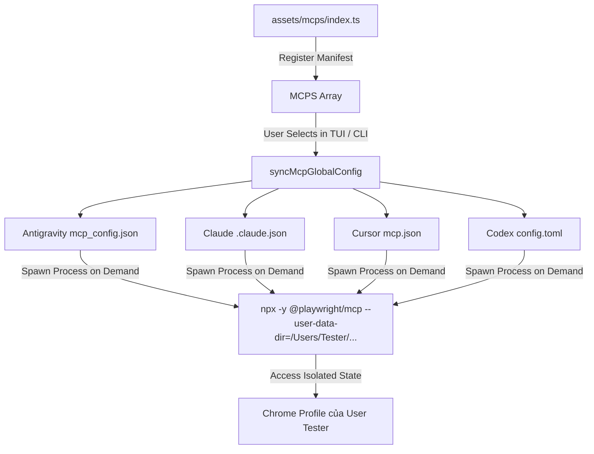

# Concept: Tích hợp Playwright Browser MCP Server vào only-one-cli

## 1. Problem Statement & Root Need (Bối cảnh & Vấn đề Cốt lõi)
- **Core Business Problem**: Các AI Agent trong hệ sinh thái `only-one-cli` (Antigravity, Claude Desktop, Cursor, Codex) hiện tại thiếu công cụ chuẩn hóa để tương tác trực tiếp với giao diện web (browser automation, DOM inspection, accessibility snapshot, UI verification). Khi cần tự động hóa trên các trang web yêu cầu đăng nhập, người dùng phải cấu hình thủ công MCP server và gặp khó khăn trong việc duy trì session đăng nhập liên tục mà không gây xung đột với phiên duyệt web cá nhân.
- **Target Audience & Core Value**:
  - **Đối tượng**: Lập trình viên và AI Coding Agents sử dụng `only-one-cli`.
  - **Giá trị cốt lõi**: Cung cấp cấu hình MCP out-of-the-box (OOTB) cho `@playwright/mcp` (Microsoft), cho phép đồng bộ tự động tới toàn bộ IDE với một thư mục user profile tách biệt (`Tester`), đảm bảo agent có thể duyệt web có trạng thái (stateful session) an toàn.

---

## 2. Scope Boundaries (Ranh giới Phạm vi)
- **In-Scope**:
  - Khai báo MCP manifest với định danh `playwright-browser` trong [assets/mcps/index.ts](file:///Users/kiem/Sources/PERSONAL/only-one-cli/assets/mcps/index.ts).
  - Sử dụng package chính thức của Microsoft: `@playwright/mcp` thông qua lệnh `npx -y @playwright/mcp`.
  - Thiết lập cờ lưu trữ profile người dùng: `--user-data-dir=/Users/Tester/Library/Application Support/Google/Chrome/Default`.
  - Đảm bảo tương thích hoàn toàn với hệ thống `syncMcpGlobalConfig` để tự động phân phối cấu hình vào Claude, Cursor, Antigravity, Codex.
  - Thiết lập điều kiện tiên quyết (Prerequisite): Yêu cầu người dùng tạo user macOS mang tên `Tester`.
- **Explicit Out-of-Scope**:
  - Tự động chạy script `dscl`/`sysadminctl` để tạo user macOS `Tester` trên hệ thống người dùng (thuộc quyền quản trị OS, ngoài phạm vi CLI).
  - Tự động tải hoặc cài đặt trình duyệt Google Chrome / Playwright browser binaries (phụ thuộc vào môi trường máy trạm).
  - Xây dựng giao diện cấu hình đường dẫn động qua interactive prompt (giữ manifest mang tính tiêu chuẩn, đồng nhất).

---

## 3. Success Metrics (Thước đo Thành công / Definition of Done)
- **Manifest Integrity**: Entry `playwright-browser` được định nghĩa đúng chuẩn `McpManifest` TypeScript interface trong [assets/mcps/index.ts](file:///Users/kiem/Sources/PERSONAL/only-one-cli/assets/mcps/index.ts).
- **Zero Regression**: Toàn bộ unit test hiện có của hệ thống assets & combo (`test/core/combo.test.ts`, `assets gate`) đều pass 100%.
- **Seamless IDE Sync**: Chức năng đồng bộ MCP ghi nhận chính xác khối JSON/TOML của `playwright-browser` vào các file cấu hình IDE (`mcp_config.json`, `.claude.json`, `mcp.json`, `config.toml`).
- **Profile Isolation**: Trình duyệt khi khởi động qua MCP trỏ chính xác vào thư mục dữ liệu của user `Tester`, không chiếm dụng `SingletonLock` của tài khoản cá nhân hiện tại.

---

## 4. Proposed Solution & Core Mechanism (Phương pháp Giải quyết & Cơ chế Xử lý)

### 4.1. Explored Options & Trade-off Analysis (Các Phương án Đã Cân Nhắc)
| Option | Hướng tiếp cận | Ưu điểm (Pros) | Nhược điểm (Cons) | Độ phức tạp | Đánh giá |
| :--- | :--- | :--- | :--- | :--- | :--- |
| **Option 1 (Chosen)** | **Direct CLI Flag với User "Tester"**:<br>`args: ['-y', '@playwright/mcp', '--user-data-dir=/Users/Tester/Library/Application Support/Google/Chrome/Default']` | - Đúng chuẩn chỉ đạo của PM.<br>- Cô lập hoàn toàn profile duyệt web của AI Agent với user chính.<br>- Tránh xung đột `SingletonLock` khi user đang mở Chrome ở tài khoản cá nhân. | Yêu cầu máy trạm bắt buộc phải tạo user `Tester` trước. | **Low** | **Được chọn (Approved by PM)** |
| **Option 2** | **Env-Driven Variable (`PLAYWRIGHT_MCP_USER_DATA_DIR`)** | - Tận dụng tính năng đọc env của `@playwright/mcp`.<br>- Dễ override biến môi trường. | Một số MCP Client IDE không truyền hoặc xử lý biến môi trường đồng đều như mảng `args`. | **Low** | Loại (ưu tiên truyền trực tiếp cờ trong `args`) |
| **Option 3** | **Dynamic Placeholder / Template Variable** | Hỗ trợ tự động nhận diện `$HOME` hoặc username hiện tại. | Thêm độ phức tạp cho tầng parse manifest; rủi ro xung đột lockfile nếu trỏ vào tài khoản cá nhân đang mở Chrome. | **Medium** | Loại (không đáp ứng yêu cầu cô lập tài khoản) |

- **Chosen Strategy (Phương án Được Chọn)**: **Option 1**. Khai báo trực tiếp cờ `--user-data-dir` với đường dẫn cố định dành riêng cho user `Tester`.

### 4.2. Core Processing Flow (Luồng Xử lý & Phân phối Cấu hình)
- **Workflow / Logic Flow**:
  1. **Manifest Registration**: Thêm đối tượng `McpManifest` vào `assets/mcps/index.ts`:
     ```typescript
     {
         id: 'playwright-browser',
         version: '0.0.1',
         server: {
             command: 'npx',
             args: [
                 '-y',
                 '@playwright/mcp',
                 '--user-data-dir=/Users/Tester/Library/Application Support/Google/Chrome/Default',
             ],
         },
     }
     ```
  2. **Sync Trigger**: Người dùng chạy lệnh đồng bộ MCP hoặc chọn `playwright-browser` từ màn hình TUI `McpView`.
  3. **Config Distribution**: `syncMcpGlobalConfig` chuyển đổi cấu hình sang adapter tương ứng của từng IDE (JSON / TOML).
  4. **Runtime Activation**: Khi IDE kích hoạt MCP client, tiến trình spawn `npx -y @playwright/mcp` với cờ chỉ định profile.



### 4.3. UI Wireframe / Visual Mockup (Mẫu Phác thảo Giao diện TUI)
Trong màn hình Ink TUI (`McpView`), `playwright-browser` sẽ xuất hiện trong danh sách MCP có thể cấu hình:

```text
+-------------------------------------------------------------------------------+
|  only-one-cli - MCP Server Configuration Manager                              |
+-------------------------------------------------------------------------------+
|  Select an MCP server to configure / sync to IDEs:                            |
|                                                                               |
|    🌐 Sync All MCP Servers                                                    |
|    🌐 clockify                                                                |
|    🌐 fetch                                                                   |
|    🌐 github                                                                  |
|    🌐 memory                                                                  |
|    🌐 postgres                                                                |
|    🌐 tavily                                                                  |
|    🌐 zodinet-timesheet                                                       |
|  > 🌐 playwright-browser   Configure playwright-browser MCP server            |
+-------------------------------------------------------------------------------+
|  [↑/↓] Navigate  |  [Enter] Select  |  [Esc] Back                             |
+-------------------------------------------------------------------------------+
```

- **State Handling Matrix**:
  - **Initial / Populated State**: Hiển thị trong danh sách lựa chọn cùng 7 MCP có sẵn.
  - **Running Task State**: Hiển thị log đồng bộ `Configuring MCP: playwright-browser...`.
  - **Completed State**: Thông báo số lượng IDE global config đã được cập nhật thành công.

### 4.4. Critical Edge Cases & Risk Handling (Kịch bản Biên & Xử lý Rủi ro)
- **User `Tester` chưa được tạo trên macOS**:
  - *Rủi ro*: Hệ điều hành không tìm thấy đường dẫn `/Users/Tester/...`, dẫn đến Playwright báo lỗi `ENOENT` hoặc tự động tạo thư mục fallback nếu có quyền root/sudo.
  - *Xử lý*: Tài liệu và hướng dẫn bắt buộc phải nhấn mạnh bước chuẩn bị tài khoản `Tester` trước khi khởi chạy agent.
- **Quyền truy cập thư mục (File Permission & SIP)**:
  - *Rủi ro*: Nếu user đang đăng nhập (ví dụ `kiem`) không có quyền đọc/ghi vào `/Users/Tester/...`, tiến trình Playwright sẽ bị `Permission Denied` (`EACCES`).
  - *Xử lý*: Cần cấp quyền đọc/ghi thư mục profile cho nhóm người dùng hoặc cấp quyền chia sẻ (chmod 777 hoặc chown thích hợp).
- **Google Chrome chưa từng mở trên user `Tester`**:
  - *Rủi ro*: Thư mục con `Google/Chrome/Default` chưa tồn tại.
  - *Xử lý*: Playwright sẽ tự động tạo cấu trúc thư mục mới khi nhận đường dẫn trong cờ `--user-data-dir`.

---

## 5. Technical English Key Patterns

### 1. Prerequisite Pattern (Điều kiện tiên quyết)
- **Meaning (VI)**: Diễn đạt yêu cầu bắt buộc phải hoàn thành trước khi một tính năng hoặc hệ thống có thể vận hành.
- **Grammar / Usage**: `A dedicated [noun/resource] is a mandatory prerequisite for [action/goal].`
- **Engineering Example**: *"A dedicated macOS user account named 'Tester' is a mandatory prerequisite for isolating the browser runtime profile."*

### 2. Exclusive Lock / Process Collision Pattern
- **Meaning (VI)**: Diễn đạt việc phòng tránh xung đột tiến trình thông qua việc cô lập tài nguyên.
- **Grammar / Usage**: `[Action] effectively circumvents [conflict/issue] by [method].`
- **Engineering Example**: *"Separating user profiles effectively circumvents Chrome's singleton lock collision during concurrent automation sessions."*

### 3. Out-of-the-Box Configuration Pattern
- **Meaning (VI)**: Cung cấp cấu hình mặc định sẵn sàng sử dụng mà không cần người dùng can thiệp thủ công.
- **Grammar / Usage**: `Deliver out-of-the-box support for [technology/tool] with zero boilerplate.`
- **Engineering Example**: *"The CLI delivers out-of-the-box support for Playwright browser automation with zero boilerplate required from the developer."*
