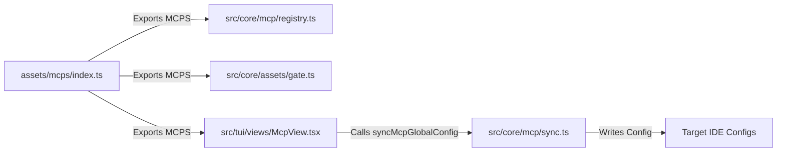

# Plan: Tích hợp Playwright Browser MCP Server vào only-one-cli

## Section 1. Current State (Hiện trạng & Phân tích Mã nguồn)
- **Hiện trạng thực thi**:
  - Danh mục MCP có sẵn của `only-one-cli` được định nghĩa tập trung tại mảng `MCPS` trong [assets/mcps/index.ts](file:///Users/kiem/Sources/PERSONAL/only-one-cli/assets/mcps/index.ts#L3-L81).
  - Hiện tại, mảng `MCPS` gồm 7 MCP servers: `clockify`, `fetch`, `github`, `memory`, `postgres`, `tavily`, và `zodinet-timesheet`.
  - Toàn bộ các MCP này được tiêu thụ bởi:
    - [src/core/mcp/registry.ts](file:///Users/kiem/Sources/PERSONAL/only-one-cli/src/core/mcp/registry.ts#L77): Hàm `readMcpManifests()` trả về danh sách `MCPS` mặc định.
    - [src/core/assets/gate.ts](file:///Users/kiem/Sources/PERSONAL/only-one-cli/src/core/assets/gate.ts#L106): Hàm `verifyAllAssetsHaveValidVersions()` kiểm tra tính hợp lệ của version `X.Y.Z` cho từng manifest.
    - [src/tui/views/McpView.tsx](file:///Users/kiem/Sources/PERSONAL/only-one-cli/src/tui/views/McpView.tsx#L27): TUI render danh sách menu đồng bộ MCP cho người dùng.
    - [src/core/mcp/sync.ts](file:///Users/kiem/Sources/PERSONAL/only-one-cli/src/core/mcp/sync.ts): Đồng bộ cấu hình MCP tới các IDE adapters (Antigravity, Claude, Cursor, Codex).
- **Vấn đề cốt lõi (Core Problem)**:
  - Chưa có MCP server chuyên biệt cho trình duyệt (`browser automation` / `accessibility snapshot` / `DOM inspection`).
  - Người dùng muốn tích hợp `@playwright/mcp` chính thức từ Microsoft và chỉ định profile duyệt web riêng biệt cho user `Tester` (`--user-data-dir=/Users/Tester/Library/Application Support/Google/Chrome/Default`) nhằm tránh xung đột khóa tiến trình `SingletonLock` với tài khoản cá nhân.
- **Danh sách hành vi bắt buộc giữ nguyên (Invariants)**:
  - **Manifest Schema Compliance**: Mục mới phải tuân thủ nghiêm ngặt interface `McpManifest` ([assets/types.ts](file:///Users/kiem/Sources/PERSONAL/only-one-cli/assets/types.ts#L41-L45)).
  - **Decimal Version Rollover (`0.0.1`)**: Khai báo `version: '0.0.1'` thỏa mãn regex phiên bản cơ số 10 trong `gate.ts` (Quy tắc CI Version Gate trong `only-one/rules.md`).
  - **Zero Regression**: 54 test files hiện có và 221 unit tests phải tiếp tục pass 100%.

---

## Section 2. Detailed Design (Thiết kế Kỹ thuật Chi tiết)
- **Cơ chế vận hành chi tiết**:
  - Định nghĩa entry `playwright-browser` trong `assets/mcps/index.ts`.
  - Thiết lập command `npx` với các đối số: `['-y', '@playwright/mcp', '--user-data-dir=/Users/Tester/Library/Application Support/Google/Chrome/Default']`.
  - Khi user chạy tính năng đồng bộ MCP trong CLI hoặc TUI, `syncMcpGlobalConfig` sẽ tự động ghi cấu hình này vào file JSON/TOML tương ứng của từng IDE target.
- **Ranh giới module & Contracts**:
  - `McpManifest` contract giữ nguyên vẹn:
    ```typescript
    export interface McpManifest {
        id: string;
        version: string;
        server: McpServerConfig;
    }
    ```
- **Red-Team Sanity Check (`doubt-driven-development`)**:
  - `CLAIM`: Đường dẫn `--user-data-dir=/Users/Tester/...` giúp cô lập phiên làm việc an toàn.
  - `DOUBT`: Điều gì xảy ra nếu macOS chưa tồn tại tài khoản `Tester` hoặc user hiện tại không có quyền truy cập?
  - `RECONCILE`: `concept.md` đã quy định việc tạo user `Tester` là điều kiện tiên quyết bắt buộc (Prerequisite) của hệ điều hành. Lớp CLI tôn trọng ranh giới này và không can thiệp script quyền root `sudo`.



---

## Section 3. Implementation Architecture & Machine-Readable Task Matrix

### 3.1 Machine-Readable Task Matrix & Dependency Graph

| Order | Status | Action | File Path | Target Symbols / AST Seams | Reused Existing Utilities / Helpers | Depends On | Fast Test Command |
| :---: | :---: | :---: | :--- | :--- | :--- | :--- | :--- |
| **1** | `[x]` | `[MODIFY]` | `assets/mcps/index.ts` | `MCPS` | `assets/types.ts (McpManifest)` | `None` | `npx vitest run test/core/assets/version-gate.test.ts` |
| **2** | `[x]` | `[NEW]` | `test/core/mcp/registry.test.ts` | `MCP Registry & Manifest Tests` | `@assets/mcps/index.js (MCPS)`, `src/core/mcp/registry.ts` | `Order 1` | `npx vitest run test/core/mcp/registry.test.ts` |

---

## Section 4. Implementation Code Examples (Mẫu Code Triển khai)

### Order 1: [MODIFY] `assets/mcps/index.ts`
- **Depends On**: `None`
- **Reused Abstractions**: Interface `McpManifest` từ `../types.js`.
- **Mục đích**: Bổ sung `playwright-browser` manifest vào danh sách `MCPS`.

```typescript
// [TARGET SEAM: assets/mcps/index.ts]
// [RATIONALE: Append playwright-browser MCP manifest with isolated user-data-dir flag]
    {
        id: 'playwright-browser',
        version: '0.0.1',
        server: {
            command: 'npx',
            args: [
                '-y',
                '@playwright/mcp',
                '--user-data-dir=/Users/Tester/Library/Application Support/Google/Chrome/Default',
            ],
        },
    },
```

---

### Order 2: [NEW] `test/core/mcp/registry.test.ts`
- **Depends On**: `Order 1`
- **Reused Abstractions**: `readMcpManifests` từ `@/core/mcp/registry.js`, `MCPS` từ `@assets/mcps/index.js`.
- **Mục đích**: Kiểm thử đơn vị tự động đảm bảo `playwright-browser` xuất hiện đúng cấu hình, kiểm tra arguments và không phá vỡ tính hợp lệ của registry.

```typescript
// [TARGET SEAM: test/core/mcp/registry.test.ts]
import { describe, expect, it } from 'vitest';
import { MCPS } from '@assets/mcps/index.js';
import { readMcpManifests } from '@/core/mcp/registry.js';

describe('MCP Registry & Predefined Manifests', () => {
    it('registers playwright-browser with required command and user-data-dir argument', async () => {
        const { manifests, warnings } = await readMcpManifests();
        expect(warnings).toHaveLength(0);

        const playwright = manifests.find((m) => m.id === 'playwright-browser');
        expect(playwright).toBeDefined();
        expect(playwright?.server.command).toBe('npx');
        expect(playwright?.server.args).toEqual([
            '-y',
            '@playwright/mcp',
            '--user-data-dir=/Users/Tester/Library/Application Support/Google/Chrome/Default',
        ]);
    });

    it('ensures playwright-browser has a valid decimal version in assets manifest', () => {
        const entry = MCPS.find((m) => m.id === 'playwright-browser');
        expect(entry).toBeDefined();
        expect(entry?.version).toBe('0.0.1');
    });
});
```

---

## Section 5. Test Cases (Kịch bản Kiểm thử & Nghiệm thu)

### Test Case 1: Manifest Presence & Schema Validation (Happy Path)
- **Objective**: Đảm bảo `playwright-browser` có mặt trong `MCPS` với đầy đủ cấu hình.
- **Precondition**: File `assets/mcps/index.ts` đã được cập nhật.
- **Action**: Chạy `npx vitest run test/core/mcp/registry.test.ts`.
- **Expected Result**: Cả 2 tests pass, tìm thấy `playwright-browser` với args chính xác.

### Test Case 2: Asset Version Gate Pass (Regression & Invariant Gate)
- **Objective**: Xác nhận `playwright-browser` tuân thủ quy tắc version `X.Y.Z` và không vi phạm gate kiểm định tài nguyên.
- **Precondition**: `version: '0.0.1'` được thiết lập trong manifest.
- **Action**: Chạy `npx vitest run test/core/assets/version-gate.test.ts`.
- **Expected Result**: `verifyAllAssetsHaveValidVersions()` trả về `valid: true` và `errors: []`.

### Test Case 3: Combo Registry Preflight (Completeness Check)
- **Objective**: Đảm bảo việc thêm MCP không ảnh hưởng đến preflight check của combos.
- **Action**: Chạy `npx vitest run test/core/combo.test.ts`.
- **Expected Result**: Toàn bộ tests của `combo.test.ts` pass 100%.

### Test Case 4: Full Test Suite Verification
- **Command**: `npm test`
- **Expected Result**: 55 test files passed, 0 failures.

---

## Section 6. Technical English Key Patterns

### 1. Invariant Preservation Pattern
- **Meaning (VI)**: Diễn tả việc duy trì các bất biến cấu trúc và nguyên tắc kiểm định để tránh suy thoái mã nguồn.
- **Grammar / Usage**: `Ensure that [new addition] strictly adheres to [invariant/rule] without violating [existing constraints].`
- **Engineering Example**: *"Ensure that the newly registered MCP manifest strictly adheres to the semantic decimal versioning invariant without violating asset version gate checks."*

### 2. Isolated Runtime Context Pattern
- **Meaning (VI)**: Phân bổ không gian dữ liệu hoặc tiến trình độc lập để phòng tránh xung đột tài nguyên dùng chung.
- **Grammar / Usage**: `Direct [tool/runtime] to [isolated directory] to avoid [concurrency issue/lock collision].`
- **Engineering Example**: *"Direct the browser process to a dedicated user data directory to avoid profile singleton lock collisions with the developer's primary browser instance."*

### 3. Registry Seam Integration Pattern
- **Meaning (VI)**: Tích hợp thành phần mới vào điểm mở rộng (seam) của hệ thống registry mà không phải sửa đổi tầng logic xử lý nghiệp vụ.
- **Grammar / Usage**: `Register [component] via the existing [registry seam] to achieve seamless discovery across [subsystems].`
- **Engineering Example**: *"Register playwright-browser via the existing manifest array to achieve seamless discovery and configuration distribution across all supported IDE adapters."*
