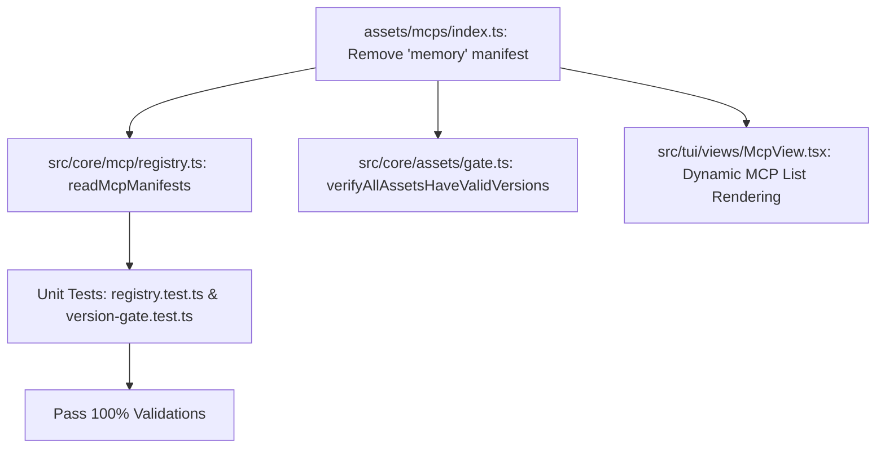

# Plan: Loại Bỏ MCP Server `memory` Khỏi Cấu Hình Built-in

## Section 1. Current State (Hiện trạng & Phân tích Mã nguồn)
- **Hiện trạng thực thi**:
  - Tại [assets/mcps/index.ts:L34-L41](file:///Users/kiem/Sources/PERSONAL/only-one-cli/assets/mcps/index.ts#L34-L41), mảng `MCPS` đang khai báo manifest cho MCP server `memory` (`@modelcontextprotocol/server-memory`):
    ```typescript
    {
        id: 'memory',
        version: '0.0.1',
        server: {
            command: 'npx',
            args: ['-y', '@modelcontextprotocol/server-memory'],
        },
    },
    ```
  - Mảng `MCPS` này được nạp tự động qua [src/core/mcp/registry.ts](file:///Users/kiem/Sources/PERSONAL/only-one-cli/src/core/mcp/registry.ts), [src/core/assets/gate.ts](file:///Users/kiem/Sources/PERSONAL/only-one-cli/src/core/assets/gate.ts), [src/tui/views/McpView.tsx](file:///Users/kiem/Sources/PERSONAL/only-one-cli/src/tui/views/McpView.tsx), và [src/commands/doctor/actions/step-1-run-checks.ts](file:///Users/kiem/Sources/PERSONAL/only-one-cli/src/commands/doctor/actions/step-1-run-checks.ts).
  - Tài liệu hướng dẫn [README.md:L128](file:///Users/kiem/Sources/PERSONAL/only-one-cli/README.md#L128) và danh mục tính năng [BACKLOG.md:L46](file:///Users/kiem/Sources/PERSONAL/only-one-cli/BACKLOG.md#L46) đang liệt kê `memory` như một MCP tích hợp sẵn.
- **Vấn đề kỹ thuật**:
  - `memory` MCP không còn nằm trong danh mục công cụ hoạt động cốt lõi của agent trong hệ thống `only-one-cli`.
  - Việc tiếp tục giữ manifest này làm phình diện tích cấu hình không cần thiết (configuration bloating) và tạo sự không nhất quán giữa tài liệu và nhu cầu thực tế.
- **Danh sách hành vi bắt buộc giữ nguyên (Invariants)**:
  - Tất cả 7 MCP servers còn lại (`clockify`, `fetch`, `github`, `playwright-browser`, `postgres`, `tavily`, `zodinet-timesheet`) phải giữ nguyên 100% cấu hình, parameters, version và schema.
  - Hàm `readMcpManifests()` và `verifyAllAssetsHaveValidVersions()` phải chạy hoàn toàn sạch sẽ, không có warning hay lỗi version gate.

## Section 2. Detailed Design (Thiết kế Kỹ thuật Chi tiết)
- **Cơ chế vận hành & Ranh giới Module**:
  - `only-one-cli` thiết kế registry MCP theo kiến trúc mảng manifest tập trung (`MCPS` trong `assets/mcps/index.ts`). Việc xóa bỏ 1 phần tử manifest là một thao tác cô lập (isolated change) với bán kính ảnh hưởng (blast radius) cực nhỏ.
  - Các module tiêu thụ `MCPS` (`registry.ts`, `gate.ts`, `McpView.tsx`, `step-1-run-checks.ts`) tự động co giãn theo độ dài mảng mà không phụ thuộc cứng (hardcoded dependency) vào `id: 'memory'`.
- **Doubt-Driven Development & Red-Team Assessment**:
  - `CLAIM`: Xóa `memory` khỏi `assets/mcps/index.ts` có thể làm hỏng các bài test hiện tại hoặc các workflow đang chạy.
  - `DOUBT`: Liệu có unit test hoặc workflow nào đang assert số lượng MCP cố định hoặc phụ thuộc vào MCP `memory` không?
  - `RECONCILE`: Kiểm tra codebase cho thấy không có test nào assert số lượng cố định `MCPS.length === 8`. Test [test/core/mcp/registry.test.ts](file:///Users/kiem/Sources/PERSONAL/only-one-cli/test/core/mcp/registry.test.ts) chỉ kiểm tra `playwright-browser`. Workflows chỉ dùng `clockify`, `github`, `playwright-browser`, `postgres`, `tavily`, `zodinet-timesheet`. Do đó loại bỏ `memory` là hoàn toàn an toàn (safe).

## Section 3. Implementation Architecture & Machine-Readable Task Matrix

### 3.1 Machine-Readable Task Matrix & Dependency Graph

| Order | Status | Action | File Path | Target Symbols / AST Seams | Reused Existing Utilities / Helpers | Depends On | Fast Test Command |
| :---: | :---: | :---: | :--- | :--- | :--- | :--- | :--- |
| **1** | `[x]` | `[MODIFY]` | `assets/mcps/index.ts` | `MCPS` | `McpManifest` (`../types.js`) | `None` | `npm run test:unit test/core/mcp/registry.test.ts` |
| **2** | `[x]` | `[MODIFY]` | `test/core/mcp/registry.test.ts` | `describe('MCP Registry & Predefined Manifests')` | `MCPS`, `readMcpManifests` | `Order 1` | `npm run test:unit test/core/mcp/registry.test.ts` |
| **3** | `[x]` | `[MODIFY]` | `README.md` | `### mcp` command examples | N/A | `Order 1` | `npm run build` |
| **4** | `[x]` | `[MODIFY]` | `BACKLOG.md` | `## Đã có — MCP management` | N/A | `Order 1` | `npm run build` |

### 3.2 Luồng xử lý dữ liệu (Data & Logic Flow)


## Section 4. Implementation Code Examples (Mẫu Code Triển khai)

### 1. `assets/mcps/index.ts` (Order 1, Depends On: None)
- **Mục đích**: Loại bỏ entry `id: 'memory'` ra khỏi danh sách export `MCPS`.
- **Reused Abstractions**: Giữ nguyên kiểu dữ liệu `McpManifest` từ `../types.js`.

```typescript
// [TARGET SEAM]: assets/mcps/index.ts
// [RATIONALE]: Drop obsolete memory MCP server from the default manifest registry

import type { McpManifest } from '../types.js';

export const MCPS: McpManifest[] = [
    {
        id: 'clockify',
        version: '0.0.1',
        server: {
            command: 'npx',
            args: ['-y', '@yikizi/clockify-mcp'],
            env: {
                CLOCKIFY_API_KEY: '',
            },
        },
    },
    {
        id: 'fetch',
        version: '0.0.1',
        server: {
            command: 'npx',
            args: ['-y', '@modelcontextprotocol/server-fetch'],
        },
    },
    {
        id: 'github',
        version: '0.0.1',
        server: {
            command: 'npx',
            args: ['-y', '@modelcontextprotocol/server-github'],
            env: {
                GITHUB_PERSONAL_ACCESS_TOKEN: '',
            },
        },
    },
    // REMOVED: memory MCP block
    {
        id: 'playwright-browser',
        version: '0.0.1',
        server: {
            command: 'npx',
            args: [
                '-y',
                '@playwright/mcp',
                '--user-data-dir=/Users/Tester/Library/Application Support/Google/Chrome/Default',
            ],
        },
    },
    {
        id: 'postgres',
        version: '0.0.1',
        server: {
            command: 'npx',
            args: ['-y', '@modelcontextprotocol/server-postgres'],
            env: {
                PG_CONNECTION_STRING: '',
            },
        },
    },
    {
        id: 'tavily',
        version: '0.0.1',
        server: {
            command: 'npx',
            args: ['-y', '@yikizi/tavily-mcp'],
            env: {
                TAVILY_API_KEY: '',
            },
        },
    },
    {
        id: 'zodinet-timesheet',
        version: '0.0.1',
        server: {
            command: 'npx',
            args: [
                '-y',
                'mcp-remote',
                'https://intranet-api.vn02.zodinet.tech/api/mcp',
                '--header',
                'Authorization:Bearer ${TIMESHEET_PAT}',
            ],
            env: {
                TIMESHEET_PAT: '',
            },
        },
    },
];
```

### 2. `test/core/mcp/registry.test.ts` (Order 2, Depends On: Order 1)
- **Mục đích**: Bổ sung unit test khẳng định `memory` MCP đã không còn xuất hiện trong registry và không bị đăng ký ngầm.

```typescript
// [TARGET SEAM]: test/core/mcp/registry.test.ts
// [RATIONALE]: Ensure memory MCP is absent and the active list matches expectation

    it('ensures memory MCP is excluded from active manifests', async () => {
        const { manifests } = await readMcpManifests();
        const memoryMcp = manifests.find((m) => m.id === 'memory');
        expect(memoryMcp).toBeUndefined();
    });
```

### 3. `README.md` & `BACKLOG.md` (Order 3 & 4, Depends On: Order 1)
- **README.md**:
```bash
# [TARGET SEAM]: README.md:L128
- only-one mcp github,clockify,zodinet-timesheet,tavily,fetch,postgres,memory
+ only-one mcp github,clockify,zodinet-timesheet,tavily,fetch,postgres
```

- **BACKLOG.md**:
```markdown
# [TARGET SEAM]: BACKLOG.md:L46
- - [x] **MCP registry** — Cung cấp sẵn manifests: `clockify`, `fetch`, `github`, `memory`, `postgres`, `tavily`, `zodinet-timesheet`.
+ - [x] **MCP registry** — Cung cấp sẵn manifests: `clockify`, `fetch`, `github`, `postgres`, `tavily`, `zodinet-timesheet`.
```

## Section 5. Test Cases (Kịch bản Kiểm thử & Nghiệm thu)

### Test Case 1: Unit Test MCP Registry Without Memory
- **Objective**: Xác nhận `readMcpManifests()` trả về danh sách không chứa `memory` và không sinh ra warning.
- **Precondition**: `assets/mcps/index.ts` đã xóa entry `memory`.
- **Action**: Chạy `npm run test:unit test/core/mcp/registry.test.ts`.
- **Expected Result**: Test pass 100%, `memory` manifest is `undefined`.

### Test Case 2: Asset Version Gate Verification
- **Objective**: Đảm bảo toàn bộ asset manifests còn lại đều tuân thủ chuẩn versioning.
- **Precondition**: File `assets/mcps/index.ts` đã được cập nhật.
- **Action**: Chạy `npm run test:unit test/core/assets/version-gate.test.ts`.
- **Expected Result**: `verifyAllAssetsHaveValidVersions()` trả về `{ valid: true, errors: [] }`.

### Test Case 3: Global Test Suite & Type Check
- **Objective**: Đảm bảo không có bất kỳ regression nào trong toàn bộ dự án.
- **Action**: Chạy `npm test && npm run build`.
- **Expected Result**: Toàn bộ unit tests pass và build artifact thành công.

## Section 6. Technical English Key Patterns
### 1. Prune dead entries from the manifest array
- **Meaning (VI)**: Cắt tỉa/loại bỏ các mục không còn dùng khỏi mảng manifest.
- **Grammar / Usage**: `prune + [redundant/dead items] + from + [data structure]`
- **Engineering Example**: *"We need to prune dead entries from the manifest array to keep the configuration lean."*

### 2. Guard against dangling references
- **Meaning (VI)**: Phòng chống các tham chiếu trỏ vào dữ liệu không còn tồn tại (tham chiếu mồ côi).
- **Grammar / Usage**: `guard against + [noun phrase / gerund]`
- **Engineering Example**: *"Auditing test suites and documentation guards against dangling references after removing an MCP server."*

### 3. Maintain backward compatibility invariants
- **Meaning (VI)**: Duy trì các bất biến tương thích ngược của hệ thống.
- **Grammar / Usage**: `maintain + [noun phrase] + invariants`
- **Engineering Example**: *"Removing the memory MCP maintains backward compatibility invariants because no built-in workflows depend on it."*
