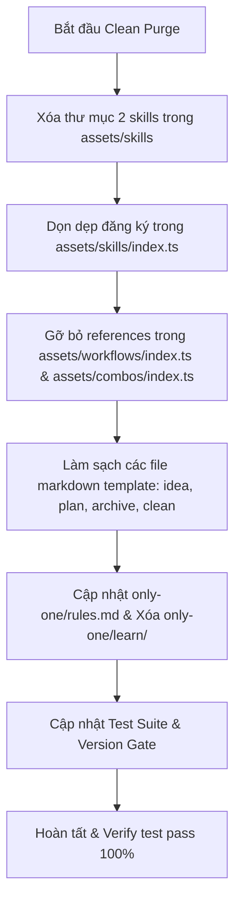

# Concept: Loại Bỏ Hoàn Toàn Flow Học Tiếng Anh (English Learning Purge)

## 1. Problem & Goal (Vấn đề & Mục tiêu)
- **Problem**: CLI hiện đang tích hợp các luồng (flow) và kỹ năng (skills) hỗ trợ học tiếng Anh (`conversational-english-coaching`, `english-learning-extraction`, cùng cơ chế lưu trữ sổ tay tại `only-one/learn/`). Các tính năng này làm loãng trọng tâm kỹ thuật cốt lõi của CLI, tạo overhead trong chat context và workflow templates, đồng thời phân mảnh sự tập trung vào quy trình kỹ thuật chuyên sâu (scaffolding, architecture, automation).
- **Goal**: Loại bỏ triệt để và dứt điểm toàn bộ skills, workflow steps, references trong manifests/combos, thư mục lưu trữ `only-one/learn/`, và tests liên quan; đưa CLI về trạng thái thuần kỹ thuật, tinh gọn và đạt 100% tính nhất quán.

## 2. Scope Boundaries (Ranh giới Phạm vi)
- **In-Scope**:
  - **Xóa Skills**: Xóa 2 thư mục skill tại `assets/skills/conversational-english-coaching/` và `assets/skills/english-learning-extraction/`.
  - **Cập nhật Manifests**:
    - `assets/skills/index.ts`: Xóa khai báo và export của 2 skills.
    - `assets/workflows/index.ts`: Gỡ bỏ 2 skills khỏi mảng `requiredSkills` của các workflows (`only-one-idea`, `only-one-plan`, `only-one-archive`, v.v.).
    - `assets/combos/index.ts`: Gỡ bỏ 2 skills khỏi tất cả combo packages (`core`, `full`, v.v.).
  - **Làm sạch Workflow Templates**:
    - `assets/workflows/only-one-idea.md`: Bỏ dòng coaching tại footer chat, bảng Skills Catalog và references.
    - `assets/workflows/only-one-plan.md`: Bỏ footer coaching chat và references liên quan.
    - `assets/workflows/only-one-archive.md`: Bỏ hoàn toàn `Step 2b — Extract & Distill Technical English Learning` và references đến `only-one/learn/`.
    - `assets/workflows/only-one-clean.md`: Bỏ các chỉ dẫn về việc bảo lưu `only-one/learn/`.
  - **Dọn dẹp Rules & Filesystem**:
    - Cập nhật `only-one/rules.md`: Bỏ rule số 10 về tiêu chí đưa từ vựng vào `only-one/learn/`.
    - Xóa thư mục `only-one/learn/` khỏi repository.
  - **Cập nhật Test Suite & Version Gate**:
    - Cập nhật `test/commands/workflow.test.ts` (bỏ assertion kiểm tra `conversational-english-coaching`).
    - Cập nhật manifest versions trong `assets/` tuân thủ version gate.
    - Đồng bộ mirror sang `.agents/` (nếu có cấu hình đồng bộ).
- **Explicit Out-of-Scope**:
  - Không thay đổi ngôn ngữ viết tài liệu kỹ thuật (tiếp tục tuân thủ quy chuẩn: tài liệu kỹ thuật viết bằng tiếng Anh/thuật ngữ kỹ thuật dev, narrative tiếng Việt).
  - Không chỉnh sửa các skills/workflows kỹ thuật khác (`domain-modeling`, `c4-diagrams`, `task-lifecycle-resolution`, `gherkin-authoring`, v.v.).
  - Không can thiệp vào các logic CLI execution không liên quan đến asset manifests.

## 3. Proposed Solution & Core Mechanism (Giải pháp Đề xuất & Cơ chế)

### So sánh các Phương án Giải pháp (Solution Options)
| Tiêu chí | Option 1: Clean Purge (Khuyên dùng) | Option 2: Soft Deprecation (Giữ stub) |
| :--- | :--- | :--- |
| **Cơ chế** | Xóa sạch thư mục, manifest definitions, workflow steps và tests liên quan. | Giữ lại thư mục rỗng hoặc đánh dấu `@deprecated`, bỏ kích hoạt trong workflow. |
| **Ưu điểm** | Codebase hoàn toàn sạch sẽ, không còn dangling references hay dead code; tiết kiệm token context. | Tránh xung đột nếu có project bên ngoài phụ thuộc (dự án này là CLI cá nhân, không có rủi ro này). |
| **Nhược điểm** | Cần cập nhật đồng bộ các tests và manifests trong 1 lượt. | Tồn đọng technical debt, vi phạm nguyên tắc tinh gọn (clean architecture). |
| **Độ phức tạp** | Thấp (chỉ là thao tác dọn dẹp và đồng bộ manifest). | Thấp nhưng để lại rác logic. |

-> **Quyết định**: Chọn **Option 1 (Clean Purge)**.

### Core Mechanism & Trình tự Thực hiện

## 4. Critical Risks & Edge Cases (Rủi ro & Kịch bản Biên)
1. **Dangling References Crash**: Nếu một combo hoặc workflow vẫn còn ID của skill bị xóa trong mảng `requiredSkills`, hàm resolve dependencies sẽ ném lỗi khi khởi tạo hoặc chạy combo.
   - *Phòng tránh*: Sử dụng grep tìm kiếm toàn diện chuỗi `conversational-english-coaching` và `english-learning-extraction` trên toàn bộ source code trước khi hoàn tất.
2. **Version Gate Rejection**: Thay đổi asset templates có thể vi phạm version gate nếu không cập nhật version manifest.
   - *Phòng tránh*: Tăng patch version cho các asset manifest bị sửa đổi.
3. **Test Regression**: `test/commands/workflow.test.ts` kiểm tra chặt chẽ nội dung workflow file; việc xóa skill sẽ làm fail test nếu test không được cập nhật song song.
   - *Phòng tránh*: Cập nhật test case để kiểm tra các required skills hợp lệ còn lại thay vì skill đã xóa.
