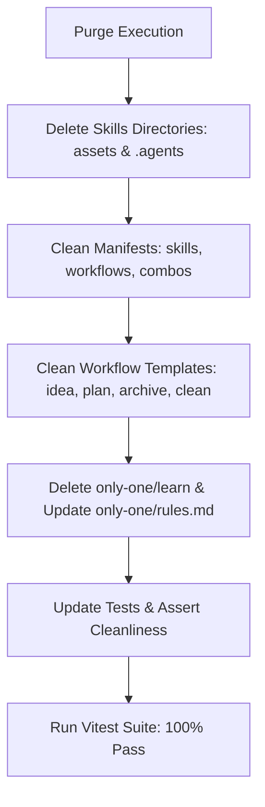

# Plan: Loại Bỏ Hoàn Toàn Flow Học Tiếng Anh (English Learning Purge)

## Section 1. Current State (Hiện trạng & Phân tích Mã nguồn)
- **Hiện trạng**: CLI hiện phân tán các references, files và logic liên quan đến học tiếng Anh tại 3 tầng chính:
  - **Skills layer**: 2 thư mục skills cục bộ (`assets/skills/conversational-english-coaching`, `assets/skills/english-learning-extraction`) cùng bản sao trong `.agents/skills/` và khai báo trong `assets/skills/index.ts`.
  - **Workflows & Combos layer**: Các workflows `only-one-idea`, `only-one-plan`, `only-one-archive`, `only-one-clean` và các gói `COMBOS` (`frontend-flow`, `backend-flow`, `full-sdlc-flow`) đang inject 2 skills này vào `requiredSkills` và `skills` array; đồng thời các file template `.md` yêu cầu sinh footer chat `💬 English Expression Coaching` và trích xuất lưu sổ tay `only-one/learn/`.
  - **Storage & Rules layer**: Thư mục vật lý `only-one/learn/` chứa 5 file ghi chú markdown và rule số 10 trong `only-one/rules.md` ràng buộc quy cách trích xuất tiếng Anh.
- **Invariants bắt buộc giữ nguyên**:
  - Giữ nguyên 100% các skills và workflows kỹ thuật cốt lõi khác (`domain-modeling`, `task-lifecycle-resolution`, `c4-diagrams`, `gherkin-authoring`, `only-one-apply`, `only-one-review`, v.v.).
  - Bảo đảm nguyên tắc **Single Source of Truth** và **Zero Dangling References**: không để sót bất kỳ tham chiếu nào đến 2 skills đã xóa trong `assets/skills/index.ts`, `assets/workflows/index.ts`, `assets/combos/index.ts` hay `.agents/workflows/*.md`.
  - Bảo đảm toàn bộ manifest versions tuân thủ định dạng số thập phân `X.Y.Z` (CI version gate).

## Section 2. Detailed Design (Thiết kế Kỹ thuật Chi tiết)
- **Cơ chế Purge & Đồng bộ**:
  1. **Tẩy xóa Skills vật lý**: Xóa toàn bộ 2 thư mục skill `conversational-english-coaching` và `english-learning-extraction` trong cả `assets/skills/` và `.agents/skills/`.
  2. **Dọn sạch Manifests**:
     - Loại bỏ 2 bản ghi manifest tương ứng trong `assets/skills/index.ts`.
     - Cập nhật `assets/workflows/index.ts`: bỏ 2 skills khỏi `requiredSkills` của `only-one-idea`, `only-one-plan`, `only-one-archive`; bump patch version cho 4 workflows (`idea: 0.0.3`, `plan: 0.0.3`, `archive: 0.0.2`, `clean: 0.0.2`).
     - Cập nhật `assets/combos/index.ts`: bỏ 2 skills khỏi `frontend-flow`, `backend-flow`, `full-sdlc-flow`; bump patch version (`0.0.2`).
  3. **Làm sạch Workflow Markdown Templates**:
     - Rà soát xóa bỏ các chỉ dẫn, bảng mục skills và bước sinh footer coaching trong `assets/workflows/*.md` và `.agents/workflows/*.md`.
     - Loại bỏ Step 2b (Distilling technical English learning) và báo cáo `only-one/learn/` trong `only-one-archive.md` và `only-one-clean.md`.
  4. **Loại bỏ Kho dữ liệu & Ràng buộc**:
     - Xóa vĩnh viễn thư mục `only-one/learn/`.
     - Xóa rule số 10 trong `only-one/rules.md`.
  5. **Bảo vệ Test Suite & Hàng rào Kiểm định**:
     - Cập nhật `test/commands/workflow.test.ts`: đảo ngược assertion từ `toContain` sang `not.toContain('conversational-english-coaching')`.
     - Bổ sung assertion trong `test/core/combo.test.ts` để chặn tái xuất hiện 2 skill IDs này.



## Section 3. Task Matrix & Dependency Graph

| Order | Status | Action | File Path | Target Symbols / AST Seams | Reused Existing Utilities / Helpers | Depends On | Fast Test Command |
| :---: | :---: | :---: | :--- | :--- | :--- | :--- | :--- |
| **1** | `[x]` | `[DELETE]` | `assets/skills/conversational-english-coaching` | Entire Directory | `rm -rf` | `None` | `npm test test/core/combo.test.ts` |
| **2** | `[x]` | `[DELETE]` | `assets/skills/english-learning-extraction` | Entire Directory | `rm -rf` | `None` | `npm test test/core/combo.test.ts` |
| **3** | `[x]` | `[DELETE]` | `.agents/skills/conversational-english-coaching` | Entire Directory | `rm -rf` | `None` | `npm test test/core/combo.test.ts` |
| **4** | `[x]` | `[DELETE]` | `.agents/skills/english-learning-extraction` | Entire Directory | `rm -rf` | `None` | `npm test test/core/combo.test.ts` |
| **5** | `[x]` | `[DELETE]` | `only-one/learn` | Entire Directory | `rm -rf` | `None` | `npm test test/commands/workflow.test.ts` |
| **6** | `[x]` | `[MODIFY]` | `assets/skills/index.ts` | `SKILLS` | In-place array filter | `Order 1, 2` | `npm test test/core/combo.test.ts` |
| **7** | `[x]` | `[MODIFY]` | `assets/workflows/index.ts` | `WORKFLOWS` | In-place array filter | `Order 6` | `npm test test/core/assets/version-gate.test.ts` |
| **8** | `[x]` | `[MODIFY]` | `assets/combos/index.ts` | `COMBOS` | In-place array filter | `Order 6` | `npm test test/core/combo.test.ts` |
| **9** | `[x]` | `[MODIFY]` | `assets/workflows/only-one-idea.md` | Protocol & Skills Catalog | Markdown cleanup | `Order 7` | `npm test test/commands/workflow.test.ts` |
| **10** | `[x]` | `[MODIFY]` | `assets/workflows/only-one-plan.md` | Protocol & Skills Catalog | Markdown cleanup | `Order 7` | `npm test test/commands/workflow.test.ts` |
| **11** | `[x]` | `[MODIFY]` | `assets/workflows/only-one-archive.md` | Step 2b & Summary | Markdown cleanup | `Order 7` | `npm test test/commands/workflow.test.ts` |
| **12** | `[x]` | `[MODIFY]` | `assets/workflows/only-one-clean.md` | Step 0 Auto-Archive | Markdown cleanup | `Order 7` | `npm test test/commands/workflow.test.ts` |
| **13** | `[x]` | `[MODIFY]` | `.agents/workflows/only-one-idea.md` | Protocol & Skills Catalog | Markdown sync | `Order 9` | `npm test test/commands/workflow.test.ts` |
| **14** | `[x]` | `[MODIFY]` | `.agents/workflows/only-one-plan.md` | Protocol & Skills Catalog | Markdown sync | `Order 10` | `npm test test/commands/workflow.test.ts` |
| **15** | `[x]` | `[MODIFY]` | `.agents/workflows/only-one-archive.md` | Step 2b & Summary | Markdown sync | `Order 11` | `npm test test/commands/workflow.test.ts` |
| **16** | `[x]` | `[MODIFY]` | `.agents/workflows/only-one-clean.md` | Step 0 Auto-Archive | Markdown sync | `Order 12` | `npm test test/commands/workflow.test.ts` |
| **17** | `[x]` | `[MODIFY]` | `only-one/rules.md` | Negative Rules | Markdown cleanup | `Order 5` | `npm test test/commands/workflow.test.ts` |
| **18** | `[x]` | `[MODIFY]` | `test/commands/workflow.test.ts` | `workflow.test.ts` assertions | Vitest test case | `Order 9, 10` | `npm test test/commands/workflow.test.ts` |
| **19** | `[x]` | `[MODIFY]` | `test/core/combo.test.ts` | Combo sanity assertions | Vitest test case | `Order 8` | `npm test test/core/combo.test.ts` |

## Section 4. Code Changes (Unified Diff)

### 1-5. `[DELETE]` Obsolete Directories
> **Action**: Xóa bỏ các thư mục skill và kho lưu trữ tiếng Anh đã xác minh không còn cần thiết.
- `assets/skills/conversational-english-coaching`
- `assets/skills/english-learning-extraction`
- `.agents/skills/conversational-english-coaching`
- `.agents/skills/english-learning-extraction`
- `only-one/learn`

---

### 6. `[MODIFY]` `assets/skills/index.ts`
> **Action**: Gỡ bỏ đăng ký manifest của 2 skills khỏi mảng `SKILLS`.

```diff
@@ -247,18 +247,6 @@
         sourceType: 'local',
     },
-    {
-        name: 'conversational-english-coaching',
-        version: '0.0.1',
-        description: 'Rephrase user thoughts into natural, professional technical English during interactive turns.',
-        sourceType: 'local',
-    },
-    {
-        name: 'english-learning-extraction',
-        version: '0.0.1',
-        description: 'Extract technical English patterns, grammar structures, and real-world examples into learn topics.',
-        sourceType: 'local',
-    },
     {
         name: 'task-lifecycle-resolution',
         version: '0.0.1',
```

---

### 7. `[MODIFY]` `assets/workflows/index.ts`
> **Action**: Xóa bỏ 2 skills khỏi `requiredSkills`, cập nhật description và bump patch versions của workflows.

```diff
@@ -5,36 +5,32 @@
     {
         name: 'only-one-idea',
-        version: '0.0.2',
+        version: '0.0.3',
         description:
             'Clarify business problems, define strict scope boundaries, build domain models, update CONTEXT.md & ADRs, and produce a lean concept.md specification.',
         requiredSkills: [
             'grill-with-docs',
             'grill-me',
             'domain-modeling',
             'interview-me',
             'idea-refine',
             'wait-what',
-            'conversational-english-coaching',
-            'english-learning-extraction',
         ],
     },
     {
         name: 'only-one-plan',
-        version: '0.0.2',
+        version: '0.0.3',
         description:
             'Research current code and create a focused, diff-centric implementation plan with Current State, Detailed Design, Task Matrix, Unified Diffs, and Verification.',
         requiredSkills: [
             'to-tickets',
             'codebase-design',
             'grill-me',
             'c4-diagrams',
             'api-and-interface-design',
             'frontend-ui-engineering',
             'source-driven-development',
             'doubt-driven-development',
-            'conversational-english-coaching',
         ],
     },
@@ -112,8 +108,8 @@
     {
         name: 'only-one-archive',
-        version: '0.0.1',
+        version: '0.0.2',
         description:
-            'Distill completed tasks into concise single-file archives, sync rules, extract technical English notes, and clean task folders.',
-        requiredSkills: ['handoff', 'code-simplification', 'context-engineering', 'english-learning-extraction'],
+            'Distill completed tasks into concise single-file archives, sync rules, and clean task folders.',
+        requiredSkills: ['handoff', 'code-simplification', 'context-engineering'],
     },
     {
         name: 'only-one-clean',
-        version: '0.0.1',
+        version: '0.0.2',
         description:
```

---

### 8. `[MODIFY]` `assets/combos/index.ts`
> **Action**: Xóa bỏ 2 skills khỏi các combo package manifests và bump patch versions.

```diff
@@ -5,7 +5,7 @@
     {
         id: 'frontend-flow',
-        version: '0.0.1',
+        version: '0.0.2',
         name: 'Frontend Flow Setup',
         description: 'Next.js and React frontend development toolkit',
         packages: ['ui-ux-pro-max-cli'],
@@ -18,8 +18,6 @@
             'codebase-design',
             'c4-diagrams',
             'gherkin-authoring',
-            'conversational-english-coaching',
-            'english-learning-extraction',
             'only-one-nextjs-development',
             'frontend-ui-engineering',
@@ -47,7 +45,7 @@
     {
         id: 'backend-flow',
-        version: '0.0.1',
+        version: '0.0.2',
         name: 'Backend Flow Setup',
         description: 'NestJS backend development toolkit with architecture design, security audit, and API standards',
         skills: [
@@ -59,8 +57,6 @@
             'codebase-design',
             'c4-diagrams',
             'gherkin-authoring',
-            'conversational-english-coaching',
-            'english-learning-extraction',
             'only-one-nestjs-development',
             'api-and-interface-design',
@@ -88,7 +84,7 @@
     {
         id: 'full-sdlc-flow',
-        version: '0.0.1',
+        version: '0.0.2',
         name: 'Full SDLC Enterprise Flow Setup',
         description: 'Complete end-to-end SDLC toolkit: Ideation, Dual-layer planning, quality gates, security, webperf, and review',
         skills: [
@@ -102,8 +98,6 @@
             'codebase-design',
             'c4-diagrams',
             'gherkin-authoring',
-            'conversational-english-coaching',
-            'english-learning-extraction',
             'only-one-nestjs-development',
             'only-one-nextjs-development',
```

---

### 9 & 13. `[MODIFY]` `assets/workflows/only-one-idea.md` & `.agents/workflows/only-one-idea.md`
> **Action**: Loại bỏ references đến english coaching và extraction trong role, table và protocol.

```diff
@@ -24,3 +24,2 @@
 - Maintain the project's Living Domain Glossary (`CONTEXT.md`) and record Architecture Decision Records (`only-one/adrs/`) for hard-to-reverse decisions.
-- Foster continuous technical English learning by rephrasing user inputs and breaking down response idioms during interactive turns (`conversational-english-coaching`).
 - **Do not perform deep codebase tracing, line-by-line file inspections, or low-level implementation code** (those strictly belong to `/only-one-plan`).
@@ -39,4 +38,2 @@
 | **`wait-what`** | Agent explanation is unclear or drifting | Stop immediately and re-pitch the explanation in plain, concise English using domain vocabulary. |
-| **`conversational-english-coaching`** | Interactive Q&A turns and discussions | Rephrase user thoughts into natural, professional technical English. |
-| **`english-learning-extraction`** | Authoring `concept.md` | Extract 2–4 architectural, scoping, or trade-off English patterns into Section 5 of `concept.md`. |
 
@@ -70,3 +67,2 @@
 4. **Decision Alignment with User (Role: User as PM)**:
    - Present the options and mockups to the user (as PM) for review, discussion, and selection of the final approach.
-5. **English Expression Coaching (`conversational-english-coaching`)**: Include `💬 English Expression Coaching` at the footer of each turn.
```

---

### 10 & 14. `[MODIFY]` `assets/workflows/only-one-plan.md` & `.agents/workflows/only-one-plan.md`
> **Action**: Loại bỏ references đến coaching trong role, table, review gate và guardrails.

```diff
@@ -28,3 +28,2 @@
     - Variable names, classes, interfaces, methods, SQL queries, CLI commands, file paths must be 100% English.
-- Foster continuous technical English learning by rephrasing user inputs and breaking down response idioms during interactive turns (`conversational-english-coaching`) in the chat footer—do NOT pollute `plan.md` files with English extraction sections.
 - Produce a single reviewable `plan.md` artifact at the designated independent task folder (`only-one/tasks/<YYYYMMDD-HHmmss>-<slug>/plan.md`). Do not implement anything or modify project source code during this workflow.
@@ -76,3 +75,2 @@
 | **`source-driven-development`** | Introducing new library APIs or framework methods | Ground all code signatures in verified official documentation in Section 4 to prevent API hallucination. |
-| **`conversational-english-coaching`** | Conversational planning turns and proposal reviews | Rephrase user design feedback into natural technical English in chat responses. |
 
@@ -151,3 +149,2 @@
 1. Create artifact with `RequestFeedback: true` and `UserFacing: true`.
-2. **Activate `conversational-english-coaching`**: At the footer of the review presentation, provide `💬 English Expression Coaching`.
 3. Stop after presenting the plan.
@@ -163,3 +160,2 @@
 - Always include `Fast Test Command` per file in the Task Matrix to shorten verification feedback loops.
-- Do NOT include English learning extraction sections in `plan.md` (keep coaching strictly in chat response footer).
 - Save `plan.md` inside its dedicated task folder (`only-one/tasks/<YYYYMMDD-HHmmss>-<slug>/plan.md`).
```

---

### 11 & 15. `[MODIFY]` `assets/workflows/only-one-archive.md` & `.agents/workflows/only-one-archive.md`
> **Action**: Loại bỏ Step 2b (Distilling technical English learning) và toàn bộ references đến `only-one/learn/`.

```diff
@@ -20,3 +20,2 @@
 - Extract user constraints, warnings, and lessons learned into `only-one/rules.md`.
-- Extract and categorize technical English structures and expressions from Section 6 of `plan.md` into `only-one/learn/<topic>.md`.
 - Ensure clean workspace hygiene by removing temporary raw task directories while preserving permanent architectural context and audit links.
@@ -33,3 +32,2 @@
 | **`context-engineering`** | Step 2 (Distilling rules) | Formats negative constraints and lessons learned into high-signal `[NEVER]` / `[AVOID]` rules inside `only-one/rules.md`. |
-| **`english-learning-extraction`** | Step 2b (Distilling learning notes) | Scans task history, extracts 2–5 high-value technical English expressions, and appends them to thematic topics in `only-one/learn/` with Vietnamese translations. |
 
@@ -60,21 +58,4 @@
 ---
 
-### Step 2b — Extract & Distill Technical English Learning (`english-learning-extraction`)
-1. Read **Section 6. Technical English Key Patterns** from `plan.md` (or Section 5 from `concept.md`).
-2. Identify the matching topic file in `only-one/learn/`:
-   - `architecture-and-design.md`
-   - `debugging-and-troubleshooting.md`
-   - `code-review-and-refactoring.md`
-   - `workflow-and-automation.md`
-   - `general-engineering.md` (fallback)
-3. Check for existing entries to avoid duplication.
-4. Append new entries following the standard schema:
-   ```markdown
-   ### N. <Grammar Pattern or Idiomatic Expression>
-   - **Meaning (VI)**: <Giải nghĩa tiếng Việt ngắn gọn, chính xác>
-   - **Grammar / Usage**: `<Syntax breakdown>`
-   - **Engineering Example**:
-     > *"<Real-world example sentence in software context>"*
-   - **Origin Task**: `<timestamp>-<slug>`
-   ```
-
----
-
@@ -141,3 +121,2 @@
 - **Quy tắc Cập nhật**: `only-one/rules.md` (Đã đồng bộ N quy tắc mới)
-- **Sổ tay Tiếng Anh**: `only-one/learn/<topic>.md` (Đã lưu +N mẫu câu mới)
 - **Dọn dẹp Thư mục Task**: `only-one/tasks/<timestamp>-<slug>/` (Đã xóa)
@@ -152,3 +131,3 @@
 - Ensure distilled archive documents remain concise (< 100 lines).
-- Always preserve `only-one/rules.md` and `only-one/learn/`.
+- Always preserve `only-one/rules.md`.
```

---

### 12 & 16. `[MODIFY]` `assets/workflows/only-one-clean.md` & `.agents/workflows/only-one-clean.md`
> **Action**: Loại bỏ bước trích xuất tiếng Anh trong quy trình Step 0 Pre-Clean Auto-Archive.

```diff
@@ -46,3 +46,2 @@
        1. Append negative rules to `only-one/rules.md`.
-       2. Append English learning patterns to `only-one/learn/<topic>.md`.
        3. Author single distilled record `only-one/archives/<timestamp>-<slug>.md`.
```

---

### 17. `[MODIFY]` `only-one/rules.md`
> **Action**: Loại bỏ rule số 10 về tiêu chí đưa từ vựng vào `only-one/learn/`.

```diff
@@ -9,3 +9,2 @@
 - **[ALWAYS]** Viết toàn bộ tài liệu kỹ thuật (`concept.md`, `plan.md`, `walkthrough.md`) bằng tiếng Anh chuẩn kỹ thuật.
-- **[NEVER]** Không đưa từ vựng thông dụng tầm thường hoặc thiếu giải nghĩa tiếng Việt và ví dụ kỹ thuật thực tế vào `only-one/learn/`. Chỉ chắt lọc các mẫu câu, cấu trúc ngữ pháp và thuật ngữ kỹ thuật có giá trị tái sử dụng cao.
 - **[NEVER]** Không đặt `useInput` toàn cục bắt phím `Enter` ở wrapper cha khi component con cũng có `useInput` mà không qua router/focus lock, để tránh lỗi race condition gây thoát view trước khi action kịp thực thi.
```

---

### 18. `[MODIFY]` `test/commands/workflow.test.ts`
> **Action**: Đổi assertion kiểm tra `conversational-english-coaching` thành phủ định (`not.toContain`).

```diff
@@ -93,8 +93,8 @@
     });
 
-    it('ensures only-one-idea and only-one-plan retain conversational english coaching', async () => {
+    it('ensures only-one-idea and only-one-plan do not retain conversational english coaching', async () => {
         const ideaContent = await fsReadFile(join(process.cwd(), 'assets/workflows/only-one-idea.md'), 'utf-8');
         const planContent = await fsReadFile(join(process.cwd(), 'assets/workflows/only-one-plan.md'), 'utf-8');
 
-        expect(ideaContent).toContain('conversational-english-coaching');
-        expect(planContent).toContain('conversational-english-coaching');
+        expect(ideaContent).not.toContain('conversational-english-coaching');
+        expect(planContent).not.toContain('conversational-english-coaching');
     });
 });
```

---

### 19. `[MODIFY]` `test/core/combo.test.ts`
> **Action**: Bổ sung assertion đảm bảo combo manifest không chứa 2 skill IDs đã xóa.

```diff
@@ -176,4 +176,6 @@
         expect(referencedIds).not.toContain('architecture-stack');
+        expect(referencedIds).not.toContain('conversational-english-coaching');
+        expect(referencedIds).not.toContain('english-learning-extraction');
     });
 });
```

## Section 5. Test Cases & Verification
- **Automated Tests**:
  - `npm test test/commands/workflow.test.ts`
  - `npm test test/core/combo.test.ts`
  - `npm test test/core/assets/version-gate.test.ts`
  - `npm test` (toàn bộ test suite)
  - `npm run format:check`
- **Manual Checks**:
  - Chạy `git grep "conversational-english-coaching"` kiểm tra không còn kết quả sót trong `assets/`, `src/`, `.agents/`.
  - Chạy `git grep "english-learning-extraction"` kiểm tra không còn kết quả sót.
  - Chạy `git grep "only-one/learn"` kiểm tra không còn file nào tham chiếu tới thư mục này.
