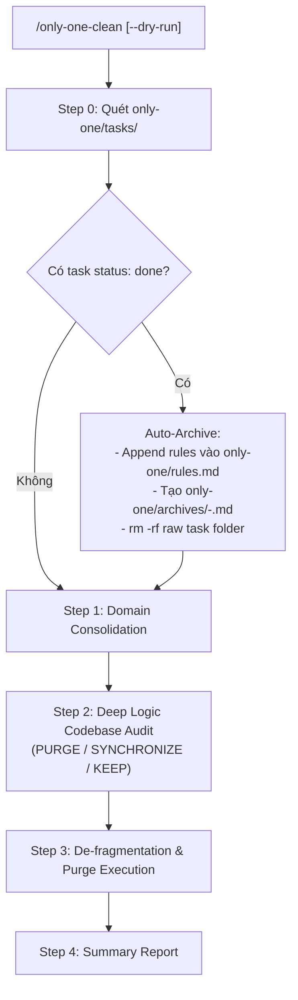

# Concept: Hợp nhất Workflow only-one-archive vào only-one-clean

## 1. Problem & Goal (Vấn đề & Mục tiêu)

### Problem (Vấn đề & Điểm nghẽn Hiện tại)
- **Bối cảnh & Điểm kích hoạt**: Trong quy trình làm việc thường nhật, sau khi hoàn thành task hoặc merge PR, người dùng cần dọn dẹp task và cập nhật kiến thức hệ thống. Hiện tại có 2 workflows riêng biệt: `/only-one-archive` và `/only-one-clean`.
- **Hiện tượng & Khiếm khuyết kỹ thuật**: Người dùng hầu như chỉ kích hoạt `/only-one-clean` vì nó đã bao gồm bước quét task. Sự tồn tại song song của `/only-one-archive` gây dư thừa (*redundant*), tăng *cognitive load* và đòi hỏi bảo trì trùng lặp giữa các workflow files, combo presets, package registry và unit tests.
- **Nguyên nhân cốt lõi (Root Cause)**: `/only-one-clean` vốn đã sở hữu **Step 0 (Pre-Clean Auto-Archive)** xử lý logic chưng cất task đã hoàn thành, khiến `/only-one-archive` trở thành một workflow độc lập không cần thiết.
- **Tác động (Impact / Blast Radius)**: Gây phân mảnh trải nghiệm sử dụng, tăng kích thước bộ template assets, và gây nhầm lẫn về trách nhiệm giữa các lệnh dọn dẹp trong tài liệu.

### Goal (Mục tiêu Kỹ thuật Cần đạt)
- **Mục tiêu cốt lõi**: Loại bỏ hoàn toàn workflow `/only-one-archive`, hợp nhất toàn bộ năng lực chưng cất archive & quy tắc tiêu cực (`rules.md`) vào duy nhất `/only-one-clean`.
- **Tiêu chí nghiệm thu (Acceptance Criteria)**:
  - Workflow `/only-one-clean` bao hàm trọn vẹn đặc tả cấu trúc `only-one/archives/<timestamp>-<slug>.md` và cơ chế trích xuất negative rules (`[NEVER]`, `[AVOID]`) vào `only-one/rules.md`.
  - Xóa bỏ file `assets/workflows/only-one-archive.md` và `.agents/workflows/only-one-archive.md`.
  - Cập nhật danh mục workflow `assets/workflows/index.ts` và loại bỏ khỏi các combos trong `assets/combos/index.ts`.
  - Cập nhật tài liệu tham chiếu chéo trong `assets/workflows/only-one-pr-git.md`, `README.md`, `CHANGELOG.md`, `BACKLOG.md`.
  - Toàn bộ test suites (`test/commands/workflow.test.ts`...) chạy pass 100%.

## 2. Scope Boundaries (Ranh giới Phạm vi)
- **In-Scope**:
  - Tích hợp trọn vẹn đặc tả chưng cất task archive (`code-simplification`) và cập nhật `rules.md` (`context-engineering`) vào Step 0 của `/only-one-clean`.
  - Xóa bỏ triệt để file và các cấu hình liên quan đến `only-one-archive` trên toàn bộ codebase và assets.
  - Cập nhật các references trong tài liệu và unit tests.
- **Explicit Out-of-Scope**:
  - Không thay đổi logic cốt lõi của Step 1 (Domain Consolidation) và Step 2 (Ground-Truth Codebase Audit) trong `/only-one-clean`.
  - Không thay đổi cấu trúc schema của thư mục `only-one/archives/` và `only-one/rules.md`.

## 3. Proposed Solution & Core Mechanism (Giải pháp Đề xuất & Cơ chế)
- **Core Mechanism**: Áp dụng chiến lược **Clean Sweep & Full Absorption**. `/only-one-clean` trở thành đầu mối duy nhất (*Single Source of Truth*) cho toàn bộ vòng đời hậu thực thi (*post-execution lifecycle*):
  1. **Step 0 — Pre-Clean Task Auto-Archive (`task-lifecycle-resolution` & `context-engineering`)**:
     - Quét `only-one/tasks/`. Bỏ qua các task có `status: planned` hoặc `status: in-progress`.
     - Với task có `status: done`: Trích xuất bài học/cảnh báo vào `only-one/rules.md`, chưng cất thành single markdown archive `only-one/archives/<timestamp>-<slug>.md`, và xóa thư mục thô `only-one/tasks/<slug>`.
  2. **Step 1 — Domain Grouping & Consolidation (`code-simplification`)**:
     - Gom nhóm các archives cùng domain thành một tài liệu tổng hợp, loại bỏ ngữ cảnh trùng lặp.
  3. **Step 2 — Ground-Truth Codebase Verification (`source-driven-development` & `doubt-driven-development`)**:
     - Đối soát với source code thực tế để gán nhãn: `PURGE`, `SYNCHRONIZE`, hoặc `KEEP`.
  4. **Step 3 — De-fragmentation & Purge Execution**:
     - Thực thi xóa hoặc cập nhật theo kết quả audit.
  5. **Step 4 — Completion Summary Report**:
     - Báo cáo tổng kết song ngữ chi tiết các tác vụ đã thực hiện.

- **Workflow / Logic Flow**:

## 4. Critical Risks & Edge Cases (Rủi ro & Kịch bản Biên)
- **Bảo vệ Task đang làm dở (Active Work Protection)**: Đảm bảo Step 0 kiểm tra nghiêm ngặt status của task; tuyệt đối không archive hay xóa các task có status `planned` hoặc `in-progress`.
- **Độ toàn vẹn của Rules (`rules.md`)**: Cơ chế chưng cất rules ở Step 0 phải kiểm tra định dạng và tránh append trùng lặp các negative rules đã tồn tại.
- **Dữ liệu tham chiếu chéo (Cross references)**: Đảm bảo không còn sót lại bất kỳ lời gọi hay tài liệu hướng dẫn nào trỏ tới `/only-one-archive` gây lỗi người dùng.
