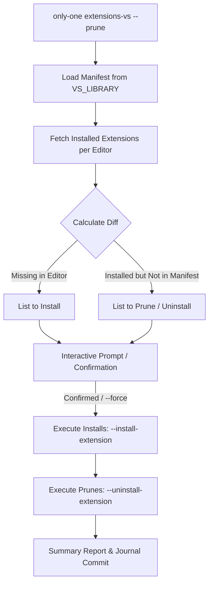

# Concept: Đồng bộ VS Library Manifest từ Antigravity IDE & Bổ sung cơ chế Prune cho VS Extensions

## 1. Problem & Goal (Vấn đề & Mục tiêu)

### Problem (Vấn đề & Điểm nghẽn Hiện tại)
- **Bối cảnh & Điểm kích hoạt**: 
  - File cấu hình chuẩn [`assets/vs/index.ts`](file:///Users/kiem/Sources/PERSONAL/only-one-cli/assets/vs/index.ts) đang bị lệch (drifted) so với môi trường thực tế đang sử dụng trên Antigravity IDE (thiếu extension như `anysphere.cursorpyright`, cấu hình `cSpell.userWords` thiếu `"Paygate"`, `python.languageServer` chưa cập nhật).
  - Lệnh `only-one extensions-vs` hiện tại chỉ hỗ trợ một chiều: cài đặt bổ sung các extension còn thiếu (*additive sync*).
- **Hiện tượng & Khiếm khuyết kỹ thuật**:
  - Khi một extension không còn được sử dụng hoặc bị loại khỏi `VS_LIBRARY`, người dùng chạy `only-one extensions-vs` không thể tự động dọn dẹp các extension thừa trên Editor.
  - Thiếu cờ `--prune` (tương tự như `only-one update --prune` đang áp dụng cho skills/rules/workflows) để đưa danh sách extension trên Editor về đúng trạng thái khai báo trong Manifest (*desired state*).
- **Nguyên nhân cốt lõi (Root Cause)**:
  - `VsExtensionsSyncRequest` và hàm `syncVsExtensions` chỉ tính toán `plans` cho các extension cần cài mới (`--install-extension`), chưa có bước diff ngược để tìm `orphaned extensions` và gọi lệnh uninstall (`--uninstall-extension`).
- **Tác động (Impact / Blast Radius)**:
  - Môi trường phát triển của các editor (Antigravity, Cursor, VS Code) bị phân mảnh, tích tụ rác (extension không dùng tới gây nặng editor hoặc xung đột plugin).
  - Asset mẫu trong CLI không phản ánh đúng cấu hình chuẩn mới nhất của Antigravity IDE.

---

### Goal (Mục tiêu Kỹ thuật Cần đạt)
- **Mục tiêu cốt lõi**:
  1. Đồng bộ và cập nhật lại toàn bộ `VS_LIBRARY` trong [`assets/vs/index.ts`](file:///Users/kiem/Sources/PERSONAL/only-one-cli/assets/vs/index.ts) theo đúng thực tế Antigravity IDE đang hoạt động (version bump lên `0.0.3`, bổ sung extension, tinh chỉnh settings).
  2. Bổ sung option `--prune` vào command `extensions-vs` (và core logic `syncVsExtensions`) để gỡ bỏ các extension đã cài trên Editor nhưng không có trong danh sách Manifest.
- **Tiêu chí nghiệm thu (Acceptance Criteria)**:
  - `assets/vs/index.ts` khớp 100% với danh sách extensions và settings thực tế từ `~/.antigravity-ide/extensions` và `~/Library/Application Support/Antigravity IDE/User/settings.json`.
  - Command `only-one extensions-vs --prune` hiển thị danh sách các extension sắp bị gỡ bỏ, yêu cầu xác nhận (confirmation prompt trong interactive mode) hoặc thực thi ngay khi có `--force`.
  - Rollback transaction an toàn: nếu quá trình prune/install gặp lỗi nghiêm trọng, trạng thái journal / báo cáo lỗi phải rõ ràng.
  - Unit tests và CLI integration tests bao phủ trường hợp sync thường, sync với `--prune`, và `--force --prune`.

---

## 2. Scope Boundaries (Ranh giới Phạm vi)

- **In-Scope**:
  - **Asset Update**: Cập nhật `assets/vs/index.ts` với đầy đủ settings & extensions của Antigravity IDE hiện tại; cập nhật tests liên quan đến snapshot/manifest.
  - **CLI Command Update**: Thêm option `--prune` vào `createExtensionsVsCommand` (`src/commands/extensions-vs/command.ts` và `types.ts`).
  - **Core Logic & Sync Engine**:
    - Nâng cấp `syncVsExtensions` và `ExistingVsExtensionCheck` / `VsExtensionsSyncRequest` để hỗ trợ tính toán danh sách `extensionsToPrune`.
    - Gọi lệnh `<editor-cli> --uninstall-extension <extensionId>` an toàn và ghi nhận kết quả vào `VsExtensionsSyncResponse`.
  - **Interactive UX & Logging**: Hiển thị bảng/danh sách preview các extension sẽ bị remove khi kích hoạt `--prune`.

- **Explicit Out-of-Scope**:
  - Không tự động prune các extension nội bộ/builtin hệ thống (chỉ target extension từ gallery hoặc vsix người dùng quản lý).
  - Không thay đổi hành vi mặc định của `only-one extensions-vs` khi không truyền cờ `--prune` (backward compatible 100%).
  - Tạm thời chưa áp dụng `--prune` cho `setting-vs` (xóa key trong `settings.json`) trừ khi có yêu cầu mở rộng riêng, nhằm giảm thiểu rủi ro mất cấu hình cá nhân đặc thù.

---

## 3. Proposed Solution Options & Comparison (Giải pháp Đề xuất & So sánh)

### Option 1: Direct Extension Pruning in `extensions-vs` (Đề xuất Khuyến nghị ⭐)
- **Mô tả**:
  - Thêm cờ `--prune` trực tiếp vào `extensions-vs`.
  - Core engine lấy danh sách `installedExtensions` từ Editor, thực hiện phép hiệu tập hợp:
    $$\text{Orphaned} = \text{Installed} \setminus \text{TargetManifest}$$
  - Trong Step 4 (Confirm Overwrite / Prune), hiển thị danh sách extension cần cài thêm và extension sẽ bị gỡ bỏ.
  - Trong Step 5 (Execute), gọi song song/tuần tự `--install-extension` cho items thiếu và `--uninstall-extension` cho items thừa.
- **Ưu điểm**:
  - Tự nhiên, nhất quán với hành vi của `only-one update --prune`.
  - Tận dụng tối đa kiến trúc hiện có của `extensions-sync.ts` và transaction logger.
- **Nhược điểm**:
  - Cần xử lý cẩn thận trường hợp CLI của editor không hỗ trợ `--uninstall-extension` (Antigravity fallback).
- **Độ phức tạp**: Thấp - Trung bình (Low - Medium).

---

### Option 2: Full State Reconciliation with Safe-Dry-Run (Nâng cao)
- **Mô tả**:
  - Hỗ trợ thêm cờ `--dry-run` kết hợp với `--prune`.
  - Bổ sung cấu hình `ignorePruneList` (danh sách whitelist các extension không bao giờ bị gỡ tự động).
- **Ưu điểm**:
  - Cực kỳ an toàn cho người dùng thích cài thêm extension thử nghiệm mà không muốn bị prune nhầm.
- **Nhược điểm**:
  - Tăng độ phức tạp cấu hình và giao diện tương tác CLI.
- **Độ phức tạp**: Trung bình - Cao (Medium - High).

---

## 4. Proposed Solution & Core Mechanism (Chi tiết Giải pháp Chọn Lọc)

### 4.1. Core Mechanism


### 4.2. CLI Interactive Flow Wireframe (ASCII)
```text
┌─────────────────────────────────────────────────────────────┐
│  🧩 VS Code Extensions Sync (with --prune)                  │
├─────────────────────────────────────────────────────────────┤
│  Target Editors: Antigravity, Cursor                        │
│                                                             │
│  ➕ To Install (2):                                          │
│     - meta.pyrefly                                          │
│     - anysphere.cursorpyright                               │
│                                                             │
│  🗑️  To Prune / Uninstall (1):                              │
│     - ms-toolsai.jupyter (not in VS_LIBRARY)                │
│                                                             │
│  ? Do you want to proceed with install and prune? (y/N)     │
└─────────────────────────────────────────────────────────────┘
```

---

## 5. Critical Risks & Edge Cases (Rủi ro & Kịch bản Biên)

1. **Editor CLI Resolution trên Antigravity**:
   - *Rủi ro*: Trên một số máy Mac, `antigravity` hoặc `antigravity-ide` có thể chưa được symlink vào `/usr/local/bin` hoặc `PATH`.
   - *Xử lý*: Giữ cơ chế kiểm tra `commandCandidates` trong `editors.ts`, đưa ra thông báo hướng dẫn rõ ràng nếu không tìm thấy executable.
2. **Case Sensitivity trong Extension ID**:
   - *Rủi ro*: ID extension có thể viết hoa/thường khác nhau (ví dụ: `PKief.material-icon-theme` vs `pkief.material-icon-theme`).
   - *Xử lý*: Luôn chuẩn hóa (`toLowerCase()`) khi thực hiện diffing để tránh prune nhầm extension hợp lệ.
3. **Rollback khi Uninstall thất bại**:
   - *Rủi ro*: Gỡ bỏ extension giữa chừng gặp lỗi quyền hạn hoặc process lock.
   - *Xử lý*: Bọc trong try-catch, ghi log chi tiết từng extension thất bại mà không làm gián đoạn toàn bộ tiến trình báo cáo.
