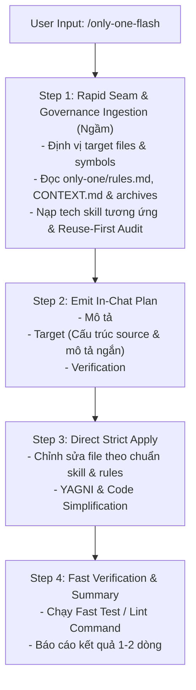

# Concept: Thêm Workflow "only-one-flash" Cho Quick Tasks

## 1. Problem & Goal (Vấn đề & Mục tiêu)

### Problem (Vấn đề & Điểm nghẽn Hiện tại)
- **Bối cảnh & Điểm kích hoạt**: Khi lập trình viên cần thực hiện các thay đổi nhanh (quick tasks, hotfixes, tinh chỉnh UI, cập nhật API endpoint, bổ sung helper/param, sửa logic nghiệp vụ cần xử lý ngay), quy trình chuẩn hiện tại gồm 3 bước riêng biệt (`/only-one-idea` $\rightarrow$ `/only-one-plan` $\rightarrow$ `/only-one-apply`) tạo ra **overhead quá lớn**.
- **Hiện tượng & Khiếm khuyết kỹ thuật**:
  - Việc bắt buộc tạo task folder `only-one/tasks/<YYYYMMDD-HHmmss>-<slug>/` và sinh các file markdown dài (`concept.md`, `plan.md`) gây lãng phí disk footprint, tiêu tốn token không cần thiết và tăng độ trễ (latency).
  - Thiếu một fast-track workflow để vừa giải quyết bài toán tốc độ, vừa giữ vững kỷ luật chất lượng mã nguồn.
- **Nguyên nhân cốt lõi (Root Cause)**: Hệ thống workflows hiện tại chưa có **Fast-Path Lane** cho các tác vụ cần thực thi ngay lập tức mà không cần lưu vết tài liệu planning lên đĩa.
- **Tác động (Impact / Blast Radius)**: Lập trình viên có xu hướng bỏ qua toàn bộ workflow chuẩn và prompt tự do, dẫn tới vi phạm coding rules, bỏ quên test verification và làm giảm tính đồng nhất của codebase.

### Goal (Mục tiêu Kỹ thuật Cần đạt)
- **Mục tiêu cốt lõi**: Xây dựng workflow mới `only-one-flash` kết hợp phần tinh túy của `only-one-plan` và `only-one-apply` vào **1 turn thực thi duy nhất (One-Shot Execution)** với **Zero File Footprint** cho phần planning.
- **Tiêu chí nghiệm thu (Acceptance Criteria)**:
  - **Zero Disk Plan Footprint**: Tuyệt đối không sinh thư mục `only-one/tasks/` hay các file markdown planning trên disk.
  - **Mandatory Only-One Governance Ingestion**: Bắt buộc đọc `only-one/rules.md` (các quy tắc `[NEVER]`, `[ALWAYS]`, `[AVOID]`), tra cứu `only-one/archives/*.md` liên quan đến domain/module cần sửa, và tham chiếu `only-one/CONTEXT.md` (nạp ngầm, không cần in ra chat).
  - **Ultra-Clean & Concise In-Chat Plan**: Trả về kế hoạch ngắn gọn, trực quan trên chat tập trung vào 3 mục thiết yếu:
    - **Mô tả**: Tóm tắt 1-2 câu về giải pháp và mục tiêu thực thi.
    - **Target**: Cấu trúc source (danh sách file kèm seam/symbol và mô tả ngắn gọn vai trò thay đổi của từng file).
    - **Verification**: Fast test / lint / build command.
  - **Strict Quality & Tech Skills Ingestion**: Kế thừa trọn vẹn cơ chế *Target-Driven Skills lookup* (nạp ngầm `SKILL.md` của tech stack liên quan như `nestjs-development`, react hooks...), *Reuse-First Audit*, và chuẩn coding conventions.
  - **Disciplined Execution & Verification**: Kế thừa các nguyên lý từ `only-one-apply` (`incremental-implementation`, `code-simplification`, `diagnosing-bugs`, `test-driven-development` / Beyoncé rule), tự động chạy test verification hoặc typecheck ngay sau khi sửa file.
  - **Không giới hạn cứng số lượng file**: Cho phép chỉnh sửa linh hoạt mọi file liên quan cần thiết để hoàn thành yêu cầu một cách nhanh gọn và chuẩn xác nhất.

---

## 2. Scope Boundaries (Ranh giới Phạm vi)

- **In-Scope**:
  - Tạo file workflow definition `assets/workflows/only-one-flash.md` và đồng bộ vào `.agents/workflows/only-one-flash.md`.
  - Khai báo workflow mới trong `assets/workflows/index.ts` và export metadata đầy đủ.
  - Thiết kế cấu trúc 4 bước thực thi liền mạch:
    1. *Rapid Seam, Only-One Governance & Target Rules Ingestion* (Đọc ngầm `only-one/rules.md`, `only-one/archives/`, tech skills, Reuse-First).
    2. *In-Chat Plan Generation* (Kế hoạch súc tích trong chat: Mô tả, Target cấu trúc source, Verification).
    3. *Direct Strict Apply* (Sửa code chuẩn skill/rule, YAGNI).
    4. *Fast Verification & Walkthrough* (Chạy test command và tổng kết ngắn gọn).
- **Explicit Out-of-Scope**:
  - Không tạo task folder hoặc lưu trữ plan/concept artifacts trên disk cho `only-one-flash`.
  - Không in ra các thông tin thừa (skills loaded, governance docs) trên khung chat.
  - Không ràng buộc cứng số lượng file chỉnh sửa.
  - Không thay đổi hành vi của các workflow hiện có (`only-one-idea`, `only-one-plan`, `only-one-apply`).

---

## 3. Proposed Solution & Core Mechanism (Giải pháp Đề xuất & Cơ chế)

### Core Mechanism
Workflow `only-one-flash` vận hành theo mô hình **Autonomous Fast-Track Pipeline**:



### Chi tiết các bước thực thi trong `only-one-flash.md`

1. **Step 1 — Rapid Seam, Only-One Governance & Target Rules Ingestion (Internal)**:
   - **Target Files & Reuse-First Audit**:
     - Sử dụng `grep_search` / `list_dir` để định vị nhanh file và symbol/seam cần tác động.
     - Quét nhanh `src/utils/`, `src/helpers/`, `src/hooks/` để tái sử dụng logic có sẵn (*Anti-Reinvention*).
   - **Only-One Governance Ingestion**:
     - Đọc `only-one/rules.md` để tuân thủ tuyệt đối các quy tắc cấm/bắt buộc (`[NEVER]`, `[ALWAYS]`, `[AVOID]`).
     - Tra cứu có chọn lọc các file `only-one/archives/*.md` thuộc domain/module tương ứng để nắm các bất biến (invariants) và quyết định kiến trúc trước đây.
     - Đọc `only-one/CONTEXT.md` để chuẩn hóa thuật ngữ nghiệp vụ.
   - **Target-Driven Tech Skills**:
     - Nạp `SKILL.md` và `.agents/rules/` của framework/công nghệ tương ứng (e.g., `nestjs-development`, react hooks, DTO validation...). Tuyệt đối không nạp lan man các skill không liên quan.

2. **Step 2 — Emit In-Chat Plan**:
   - Xuất bản kế hoạch cực ngắn gọn trong chat response, loại bỏ các chi tiết metadata thừa:
     ```markdown
     ⚡ **Flash Plan**:
     - **Mô tả**: <Tóm tắt 1-2 câu về giải pháp và mục tiêu thực thi>
     - **Target**:
       - `<file_path_1>` (`<symbol_or_seam>`): <Mô tả ngắn gọn vai trò / nội dung thay đổi>
       - `<file_path_2>` (`<symbol_or_seam>`): <Mô tả ngắn gọn vai trò / nội dung thay đổi>
     - **Verification**: `<Fast Test / Lint / Build Command>`
     ```

3. **Step 3 — Direct Strict Apply**:
   - Áp dụng các thay đổi bằng `replace_file_content` / `multi_replace_file_content`.
   - Giữ vững các nguyên tắc:
     - Tuân thủ 100% các quy tắc trong `only-one/rules.md` và `SKILL.md`.
     - Không để lại dead code, orphan imports, log debug thừa (YAGNI & code simplification).
     - Bảo toàn pattern và coding style của repository.

4. **Step 4 — Fast Verification & Walkthrough**:
   - Chạy lệnh test tương ứng với file vừa sửa (ví dụ: `npm test -- path/to/file.spec.ts`) hoặc `npm run build` / typecheck.
   - Xuất thông báo hoàn tất súc tích cho người dùng.

---

## 4. Critical Risks & Edge Cases (Rủi ro & Kịch bản Biên)

- **Rủi ro vi phạm các quy tắc đã thiết lập trong `only-one/rules.md` & `archives`**: Dù không in ra chat, agent vẫn bắt buộc phải đọc và tuân thủ các quy tắc này ở Step 1.
- **Rủi ro tác động lan truyền (Ripple Effect)**: Thay đổi ở core function có thể gây lỗi ở các caller khác.
  - *Giải pháp*: Step 4 (Chạy test / build verification) là bắt buộc để phát hiện ngay regression hoặc gãy type ở các file liên quan trước khi kết thúc turn.
