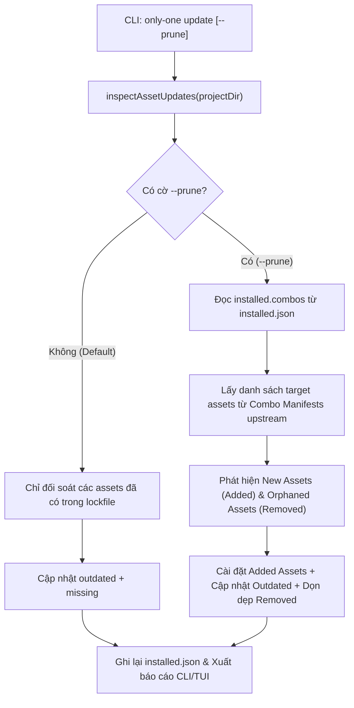

# Concept: Cải tiến Lệnh Update Hỗ trợ Đồng bộ Combo Mới khi Dùng Cờ --prune (Update Combo Reconcile)

## 1. Problem & Goal (Vấn đề & Mục tiêu)

### Problem (Vấn đề & Điểm nghẽn Hiện tại)
- **Bối cảnh & Điểm kích hoạt**:
  - Người dùng khởi tạo hoặc áp dụng cấu hình dự án thông qua Combo (ví dụ: `full-sdlc-flow` bao gồm rules, skills, workflows, MCPs).
  - Khi bản phát hành mới của `only-one` (upstream CLI) bổ sung thêm asset mới vào Combo (ví dụ: thêm workflow `only-one-flash` vào combo `full-sdlc-flow`), người dùng chạy lệnh `only-one update --prune` trong dự án.
- **Hiện tượng & Khiếm khuyết kỹ thuật**:
  - Hiện tại, lệnh `only-one update` chỉ kiểm tra các asset đã tồn tại trong `only-one/installed.json` (`lockfile.installed.workflows`, `skills`, `rules`).
  - Danh sách combo đã cài đặt (`installed.combos`) chưa được lưu vết rõ ràng trong lockfile hoặc chưa được dùng làm căn cứ kiểm tra đối soát (reconcile) trong `inspectAssetUpdates()`.
  - Cờ `--prune` hiện tại chỉ hoạt động 1 chiều là xóa các asset mồ côi (`removed` upstream), hoàn toàn bỏ sót các asset mới được thêm vào combo (`added upstream`).
- **Nguyên nhân cốt lõi (Root Cause)**:
  - `lockfile.ts` chưa chuẩn hoá việc theo dõi combo đã cài (`installed.combos`).
  - `src/core/assets/sync.ts` chỉ duyệt qua các key đã có trong lockfile, không có cơ chế `reconcileComboAssets()` để đối chiếu tập hợp asset mong đợi của combo với trạng thái hiện tại trên disk.
- **Tác động (Impact / Blast Radius)**:
  - Người dùng phải tự tìm hiểu và gõ lại lệnh cài lẻ từng workflow/skill mới, làm giảm trải nghiệm tự động hoá và tính toàn vẹn của mô hình Combo.

### Goal (Mục tiêu Kỹ thuật Cần đạt)
- **Mục tiêu cốt lõi**:
  - Khi người dùng chạy `only-one update --prune`, hệ thống thực hiện cơ chế **Full Two-Way Reconcile**: vừa dọn dẹp các asset thừa/bị gỡ bỏ khỏi upstream/combo (`prune orphaned assets`), vừa tự động phát hiện và cài đặt bổ sung các workflows, skills, rules, mcps mới được thêm vào combo (`install added combo assets`).
  - Khi chạy `only-one update` (không cờ `--prune`), hệ thống giữ nguyên hành vi an toàn mặc định: chỉ cập nhật phiên bản cho các asset đã có, không tự ý cài thêm hay xóa bớt.
- **Tiêu chí nghiệm thu (Acceptance Criteria)**:
  - **AC 1 (Combo Tracking)**: Khi cài combo qua `only-one combo` hoặc `only-one init --combo`, ghi nhận danh sách combo đã cài vào `only-one/installed.json` dưới trường `installed.combos` (bao gồm `id`, `version`, `installedAt`).
  - **AC 2 (Reconcile Detection)**: Khi chạy `only-one update --prune`, `inspectAssetUpdates` phân tích và phát hiện các asset mới thuộc combo đã cài mà chưa có trong project (`missing/added`), đánh dấu trạng thái và tự động cài đặt chúng vào đúng thư mục agent (`.agents`, `.cursor`, `.claude`).
  - **AC 3 (Report & Output)**: CLI hiển thị rõ ràng danh mục `✨ Added New Combo Assets:` bên cạnh `🗑️ Pruned Orphaned Assets:` và `✓ Updated Assets:`.
  - **AC 4 (Idempotency & Non-destructive)**: Không làm mất mát hoặc ghi đè đè bẹp các custom file của người dùng nếu không thuộc phạm vi asset template được quản lý.

---

## 2. Scope Boundaries (Ranh giới Phạm vi)

- **In-Scope**:
  - Lưu vết combo vào `only-one/installed.json` (`AssetType: 'combos'`) khi áp dụng combo.
  - Mở rộng `inspectAssetUpdates()` và `applyAssetUpdates()` trong `src/core/assets/sync.ts` để nạp danh sách asset từ combo manifest khi nhận cờ `options.prune`.
  - Tự động pull và install các workflows, skills, rules mới của combo khi chạy `only-one update --prune`.
  - Cập nhật TUI `UpdateView` và CLI human-readable formatting hiển thị kết quả sync combo assets.
  - Bổ sung unit/integration tests cho luồng `update --prune` với combo mới.
- **Explicit Out-of-Scope**:
  - Không tự động kích hoạt sync combo mới đối với lệnh `only-one update` thông thường (không có cờ `--prune`).
  - Không tự động giải quyết các xung đột merge git phức tạp bên trong workflow markdown nếu người dùng đã tự sửa local (sẽ tuân thủ quy tắc overwrite/backup chuẩn).

---

## 3. Proposed Solution & Core Mechanism (Giải pháp Đề xuất & Cơ chế)

### Core Mechanism (Cơ chế Kỹ thuật)
1. **Combo State Persistence**:
   - Khi chạy `installCombo()`, ghi nhận combo ID vào lockfile:
     ```json
     {
       "schemaVersion": 1,
       "installed": {
         "combos": {
           "full-sdlc-flow": {
             "version": "1.0.3",
             "installedAt": "2026-09-17T10:00:00.000Z"
           }
         },
         "workflows": { ... },
         "skills": { ... },
         "rules": { ... }
       }
     }
     ```
2. **Prune Reconciler Pipeline**:
   - Khi chạy `updateAgentArtifacts` / `inspectAssetUpdates(projectDir, { prune: true })`:
     - Bước 1: Đọc `installed.combos` từ `installed.json`.
     - Bước 2: Nạp Combo Manifests tương ứng từ `@assets/combos`.
     - Bước 3: Thu thập toàn bộ danh sách workflows, skills, rules, mcps mục tiêu mà các combo này yêu cầu.
     - Bước 4: So khớp với disk và lockfile hiện tại:
       - Asset có trong combo nhưng chưa có trong lockfile/disk $\rightarrow$ Phân loại là `added` (New combo asset).
       - Asset có trong lockfile nhưng không còn tồn tại trong upstream $\rightarrow$ Phân loại là `removed` (Orphaned asset).
       - Asset đã có nhưng version cũ $\rightarrow$ Phân loại là `outdated`.
     - Bước 5: Thực hiện đồng thời:
       - Cài đặt các asset `added` + `missing`.
       - Cập nhật các asset `outdated`.
       - Xóa bỏ các asset `removed` (pruning).
       - Cập nhật lại `installed.json`.

### Logic Flow (Mermaid Diagram)



### CLI Output Mockup
```text
==================================================
           ONLY-ONE ARTIFACTS UPDATE
==================================================

Tracked Asset Status:
  [combos] full-sdlc-flow: ✓ Up to date (1.0.3)
  [workflows] only-one-idea: ✓ Up to date (1.0.3)
  [workflows] only-one-plan: ✓ Up to date (1.0.3)
  [workflows] only-one-flash: ✚ New combo asset detected -> Installing...

✓ Updated Assets:
  - [rules] general-clean-code: 1.0.2 -> 1.0.3

✨ Added New Combo Assets:
  - [workflows] only-one-flash (v1.0.3): Installed to .agents/workflows

🗑️ Pruned Orphaned Assets:
  - [skills] deprecated-skill: Removed from disk and lockfile

==================================================
```

---

## 4. Critical Risks & Edge Cases (Rủi ro & Kịch bản Biên)

- **Kịch bản Lockfile cũ (Legacy Projects)**:
  - *Hiện tượng*: Dự án cũ được tạo trước khi có tính năng lưu vết `installed.combos` sẽ không có key `installed.combos` trong `installed.json`.
  - *Giải pháp*: Fallback an toàn; nếu không có `installed.combos`, hệ thống chỉ prune orphan thông thường và gợi ý lệnh `only-one combo <name>` nếu muốn gắn combo.
- **Kịch bản Target Agent Dirs đa dạng (`.agents`, `.cursor`, `.claude`)**:
  - *Hiện tượng*: Người dùng có thể đang dùng nhiều IDE/Agent cùng lúc.
  - *Giải pháp*: Khi sync asset mới của combo, hệ thống tự động phát hiện các thư mục agent directory hiện có trên dự án (qua `getTargetAgentDirs()`) để cài đúng vào các target đó.
- **Tính Idempotent (Chạy nhiều lần không lỗi)**:
  - *Hiện tượng*: Chạy `only-one update --prune` liên tục nhiều lần.
  - *Giải pháp*: Sau lần đầu tiên, toàn bộ asset mới đã được đưa vào `installed.json`, các lần chạy tiếp theo sẽ báo `All tracked assets are already up to date`.
