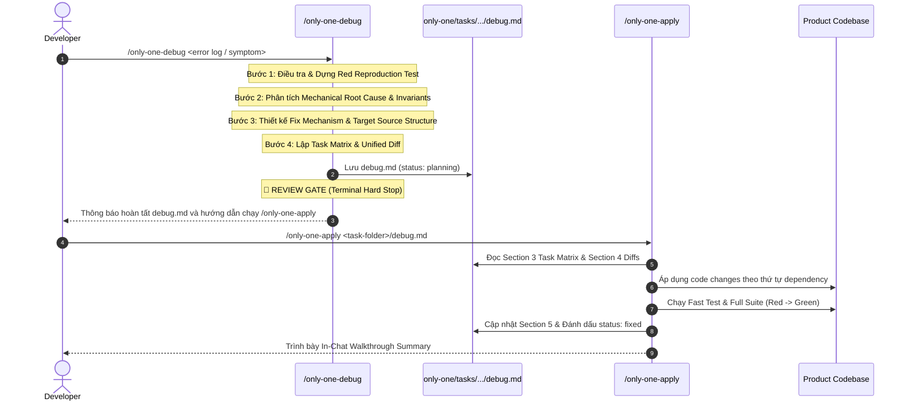

# Concept: Tái cấu trúc Workflow only-one-debug & Quy chuẩn Tài liệu debug.md

## 1. Problem & Goal (Vấn đề & Mục tiêu)

### Problem (Vấn đề & Điểm nghẽn Hiện tại)
- **Bối cảnh & Điểm kích hoạt**: Khi developer chạy lệnh `/only-one-debug` để điều tra và phân tích nguyên nhân gốc rễ (RCA) của một lỗi/bug.
- **Hiện tượng & Khiếm khuyết kỹ thuật**:
  1. Trong quá trình chạy `/only-one-debug`, agent tự động sửa đổi mã nguồn (`source code`) và thực thi bản vá ngay lập tức (Step 4 & Step 5 trong `only-one-debug.md` hiện tại) thay vì chỉ dừng lại ở bước chẩn đoán, dựng Red test loop và lập kế hoạch vá lỗi trong `debug.md`.
  2. Sự vi phạm ranh giới vòng đời (*Lifecycle Boundary Violation*): Khiến developer mất quyền kiểm soát (Review Gate) trước khi áp dụng thay đổi mã nguồn.
  3. Lặp thừa trách nhiệm (*Responsibility Overlap*): Workflow `/only-one-apply` đã được thiết kế sẵn sàng để nạp và thực thi `debug.md`, nhưng `only-one-debug.md` lại tự ý kiêm nhiệm cả khâu thực thi (Apply) và nghiệm thu cuối (Final Verification).
  4. Cấu trúc tài liệu `debug.md` chưa được chuẩn hóa tách bạch các phần: từ chẩn đoán lỗi (Symptom & Red Test), phân tích nguyên nhân cơ học (Mechanical Root Cause & Invariants), kiến trúc giải pháp (Proposed Solution & Target Source Structure), Task Matrix & Unified Diff cho tới handoff sang `/only-one-apply`.
- **Nguyên nhân cốt lõi (Root Cause)**:
  - File định nghĩa workflow `assets/workflows/only-one-debug.md` (và `.agents/workflows/only-one-debug.md`) hiện tại quy định Step 4.6 (*"Apply the surgical patch directly..."*) và Step 5 (*"Guard Against Regressions..."*) nằm bên trong `/only-one-debug`.
  - Thiếu chốt chặn dừng bắt buộc (**Mandatory Terminal / Review Gate**) ở cuối workflow `/only-one-debug` để bàn giao cho `/only-one-apply`.
- **Tác động (Impact / Blast Radius)**:
  - Codebase bị sửa đổi trực tiếp khi chưa qua bước review giải pháp của developer.
  - Phá vỡ tính nhất quán của bộ công cụ `only-one` (trong đó mọi luồng lập kế hoạch `plan.md`/`debug.md` đều phải qua Review Gate trước khi chạy `/only-one-apply`).

### Goal (Mục tiêu Kỹ thuật Cần đạt)
- **Mục tiêu cốt lõi**: Tách bạch dứt điểm 2 giai đoạn:
  1. `/only-one-debug`: Tập trung 100% vào điều tra, dựng Red Feedback Loop (tái hiện lỗi thất bại), phân tích nguyên nhân gốc rễ (RCA), phác thảo cấu trúc file thay đổi (Target Source Structure), lập Machine-Readable Task Matrix và Unified Diff trong `debug.md`, sau đó **DỪNG LẠI TẠI REVIEW GATE (Zero Direct Code Modifications)**.
  2. `/only-one-apply`: Chịu trách nhiệm nạp `debug.md`, áp dụng Unified Diff theo thứ tự phụ thuộc, chạy test chống hồi quy (Green Loop), cập nhật kết quả nghiệm thu vào Section 5 và đánh dấu `status: fixed`.
- **Tiêu chí nghiệm thu (Acceptance Criteria)**:
  - [x] **Strict Lifecycle Isolation**: `/only-one-debug` tuyệt đối không sửa đổi mã nguồn sản phẩm (trừ việc tạo reproduction test hoặc instrumentation tạm thời trong quá trình tái hiện nếu cần, nhưng bản vá chính thức chỉ được thể hiện dưới dạng Unified Diff trong `debug.md`).
  - [x] **Quy chuẩn 5 Section rõ ràng cho `debug.md`**:
    - Section 1: Symptom & Red Feedback Loop (Triệu chứng, stack trace, failing reproduction test, lệnh test).
    - Section 2: Root Cause Analysis & Proposed Solution (2.1 Cơ chế lỗi cơ học & Invariants; 2.2 Kiến trúc giải pháp & Cây thư mục thay đổi).
    - Section 3: Machine-Readable Task Matrix & Dependency Graph (Chuẩn hóa cột như `plan.md`).
    - Section 4: Code Changes (Unified Diff với Git-standard diff blocks).
    - Section 5: Verification & Regression Guard (Checklist nghiệm thu cho `/only-one-apply`).
  - [x] **Handoff mượt mà sang `/only-one-apply`**: Kết thúc `/only-one-debug` với thông báo hướng dẫn developer chạy `/only-one-apply <task-folder>/debug.md`.
  - [x] **Đồng bộ toàn diện**: Cập nhật cả `assets/workflows/only-one-debug.md`, `.agents/workflows/only-one-debug.md`, và rule trong `only-one/rules.md`.

---

## 2. Scope Boundaries (Ranh giới Phạm vi)

- **In-Scope**:
  - Tái cấu trúc quy trình thực thi (Step-by-Step Execution Protocol) trong `assets/workflows/only-one-debug.md` và `.agents/workflows/only-one-debug.md`.
  - Chuẩn hóa template tài liệu `debug.md` đầy đủ 5 Section rõ ràng, chi tiết.
  - Bổ sung quy tắc âm (`[NEVER]`) trong `only-one/rules.md` nghiêm cấm sửa code sản phẩm trực tiếp trong workflow `/only-one-debug`.
  - Rà soát tính tương thích của `/only-one-apply` khi nạp `debug.md`.
- **Explicit Out-of-Scope**:
  - Không thay đổi hành vi cốt lõi của `/only-one-plan` hay `/only-one-apply`.
  - Không thay đổi schema lưu trữ lockfile `only-one/installed.json`.

---

## 3. Proposed Solutions & Trade-offs (Đề xuất Giải pháp & Đánh đổi)

### Lựa chọn 1: Chẩn đoán & Lập kế hoạch Thuần túy (Pure Diagnostic & Diff Blueprint) - [RECOMMENDED]
- **Cơ chế**:
  - `/only-one-debug` hoạt động tương đương như `/only-one-plan` nhưng chuyên biệt hóa cho bug/sự cố:
    1. Nhận input lỗi $\rightarrow$ Tạo thư mục task `only-one/tasks/<YYYYMMDD-HHmmss>-debug-<slug>/debug.md`.
    2. Dựng test tái hiện lỗi (Red test) $\rightarrow$ Ghi nhận vào Section 1.
    3. Phân tích nguyên nhân gốc rễ (RCA) $\rightarrow$ Ghi nhận vào Section 2.1.
    4. Thiết kế cơ chế vá & Target Source Structure $\rightarrow$ Ghi nhận vào Section 2.2.
    5. Khai báo Section 3 Task Matrix & Section 4 Unified Diff.
    6. **Dừng lại (Hard Stop) tại Review Gate**, set `status: planning` (hoặc `diagnosed`).
  - Developer phê duyệt và chạy `/only-one-apply <task-folder>/debug.md` để triển khai code, chạy test chuyển sang Green, và cập nhật Section 5.
- **Ưu điểm**:
  - Đảm bảo 100% tính nhất quán về kiến trúc vòng đời (Idea $\rightarrow$ Plan/Debug $\rightarrow$ Review Gate $\rightarrow$ Apply).
  - Developer luôn kiểm soát hoàn toàn các file bị thay đổi trước khi diff được ghi đè vào source code.
  - Tận dụng tối đa sức mạnh của `only-one-apply` (áp dụng incremental từng file, kiểm tra skill compliance, chạy fast test).
- **Nhược điểm**: Thêm một bước gõ lệnh `/only-one-apply` đối với các bug cực nhỏ (có thể dùng `/only-one-flash` nếu muốn sửa nhanh 1 turn không cần sinh tài liệu).

### Lựa chọn 2: Tự động chạy Apply kèm Confirmation Prompt trong Debug (Interactive In-Place Apply)
- **Cơ chế**: `/only-one-debug` sau khi viết xong `debug.md` sẽ tự động hiển thị prompt hỏi người dùng có muốn áp dụng ngay không. Nếu chọn Có, agent tự chạy logic apply luôn trong cùng phiên.
- **Ưu điểm**: Giảm thao tác gõ lệnh cho người dùng.
- **Nhược điểm**:
  - Làm phình to context window trong 1 phiên (chứa cả log điều tra, diff, và log apply).
  - Dễ gây nhầm lẫn ranh giới trách nhiệm giữa các workflow độc lập.
  - Khó kiểm soát khi agent chạy ngầm trong môi trường headless/CI.

$\rightarrow$ **Quyết định**: Chọn **Lựa chọn 1 (Pure Diagnostic & Diff Blueprint)** nhằm tuân thủ nguyên tắc Single Responsibility, bảo toàn tính kỷ luật của quy trình `only-one`.

---

## 4. Proposed Solution & Core Mechanism (Giải pháp Đề xuất & Cơ chế)

### 4.1 Cấu trúc 5 Section Chuẩn mực của `debug.md`

```markdown
# Debug: <Tên Lỗi / Triệu chứng Ngắn gọn>

---
status: diagnosing | planning | in-progress | fixed | failed
slug: <kebab-case-slug>
started_at: <YYYY-MM-DD HH:mm:ss>
completed_at: ~
reproduction_test: <Lệnh test hoặc file test tái hiện>
---

## Section 1. Symptom & Red Feedback Loop (Triệu chứng & Tái hiện Lỗi)
- **Triệu chứng & Bối cảnh lỗi**: <Mô tả chính xác hành vi sai, log lỗi, hoặc stack trace>.
- **Failing Reproduction Test**: <Vị trí test case hoặc script tái hiện lỗi (Red)>.
- **Lệnh chạy tái hiện**: `<Fast Test Command>` (phải trả về lỗi/Fail trước khi vá).

## Section 2. Root Cause Analysis & Proposed Solution (Phân tích RCA & Đề xuất Giải pháp)
### 2.1 Mechanical Root Cause & Invariants
- **Cơ chế lỗi cơ học (Mechanical Root Cause)**: <Bản chất kỹ thuật sâu bên dưới dẫn đến lỗi>.
- **Bằng chứng & Dữ liệu thực nghiệm (Evidence)**: <Log hoặc assertion chứng minh giả thuyết đúng>.
- **Invariants bị vi phạm**: <Các giả định ngầm hoặc ràng buộc hệ thống bị phá vỡ>.

### 2.2 Proposed Solution & Target Source Structure
- **Cơ chế giải pháp cốt lõi (Core Fix Mechanism)**: <Phương án xử lý triệt để nguyên nhân gốc, tránh vá ngọn>.
- **Cấu trúc tệp thay đổi (Target Source Structure)**:
```text
src/path/to/module/
├── [MODIFY] target.service.ts       # Áp dụng surgical patch: xử lý điều kiện biên và fallback an toàn
├── [NEW]    target-helper.ts        # Helper độc lập phục vụ validate/transform logic
└── [MODIFY] target.service.spec.ts  # Test case tái hiện lỗi ban đầu (Red) và chống hồi quy (Green)
```

## Section 3. Task Matrix & Dependency Graph
| Order | Status | Action | File Path | Target Symbols / AST Seams | Depends On | Fast Test Command |
| :---: | :---: | :---: | :--- | :--- | :--- | :--- |
| **1** | `[ ]` | `[MODIFY]` | `path/to/test.spec.ts` | `describe('reproduction')...` | `None` | `npm test path/to/test.spec.ts` |
| **2** | `[ ]` | `[MODIFY]` | `path/to/target.ts` | `TargetClass.targetMethod` | `Order 1` | `npm test path/to/test.spec.ts` |

## Section 4. Code Changes (Unified Diff & Chi tiết Thay đổi)
Mô tả chi tiết từng file cần can thiệp theo đúng thứ tự trong Section 3:

### 1. `[MODIFY]` `path/to/test.spec.ts`
- **Mục đích thay đổi (Action / Rationale)**: Thêm test case tái hiện lỗi ban đầu (Red Feedback Loop) và làm chốt chặn chống hồi quy (Regression Guard).
- **Điểm can thiệp (AST Seams / Target Symbols)**: `describe('reproduction error')`
- **Chi tiết thay đổi mã nguồn**:
```diff
@@ -10,4 +10,12 @@
 existingTest();
+
+it('should handle edge case correctly without throwing', async () => {
+  // reproduction test proving the bug
+  const result = await service.targetMethod(invalidInput);
+  expect(result).toBeDefined();
+});
```

### 2. `[MODIFY]` `path/to/target.ts`
- **Mục đích thay đổi (Action / Rationale)**: Áp dụng bản vá tối giản (Surgical Minimal Patch) xử lý điều kiện biên theo phân tích RCA ở Section 2.
- **Điểm can thiệp (AST Seams / Target Symbols)**: `TargetClass.targetMethod`
- **Chi tiết thay đổi mã nguồn**:
```diff
@@ -45,6 +45,8 @@
 function targetMethod(input) {
+  if (!input || !input.id) {
+    return fallbackValue;
+  }
   return input.id;
 }
```
*(Đối với file `[NEW]`: hiển thị trọn vẹn source code khởi tạo)*
*(Đối với file `[DELETE]`: nêu rõ lý do xoá và các references đã verify)*

## Section 5. Verification & Regression Guard
*(Phần này được cập nhật khi chạy `/only-one-apply`)*
- **Automated Tests**:
  - `[ ]` `npm test <reproduction-test-path>`: `PENDING -> PASS (Green)`
  - `[ ]` Full Test Suite: `PENDING -> PASS`
  - `[ ]` Lint / Typecheck: `PENDING -> PASS`
- **Bài học kinh nghiệm & Quy tắc phòng ngừa (Lessons Learned)**:
  - <Ghi nhận anti-pattern vào only-one/rules.md nếu có>.
```

### 4.2 Sơ đồ Luồng Vận hành (Workflow Lifecycle)



---

## 5. Critical Risks & Edge Cases (Rủi ro & Kịch bản Biên)

- **Rủi ro tạo test tái hiện làm bẩn git status**:
  - *Giải pháp*: File test tái hiện lỗi (Reproduction test) có thể được thêm mới hoặc sửa trực tiếp vào file test hiện có trong codebase để làm chốt chặn hồi quy (Regression Guard) lâu dài, nhưng code fix của production chỉ được đưa vào Section 4 Unified Diff chứ không sửa trước.
- **Rủi ro không tái hiện được lỗi bằng test tự động (Heisenbugs, Third-party timeouts)**:
  - *Giải pháp*: Trong Section 1, ghi rõ phương pháp giả lập (mocking/instrumentation) hoặc checklist tái hiện thủ công chi tiết nếu không thể viết unit test đơn thuần.

---

## 6. Next Steps

Sau khi tài liệu Concept này được PM phê duyệt, ta sẽ tiến hành lập kế hoạch chi tiết (`/only-one-plan`) để cập nhật:
1. `assets/workflows/only-one-debug.md`
2. `.agents/workflows/only-one-debug.md`
3. `only-one/rules.md` (Bổ sung quy tắc cách ly vòng đời cho `/only-one-debug`)
