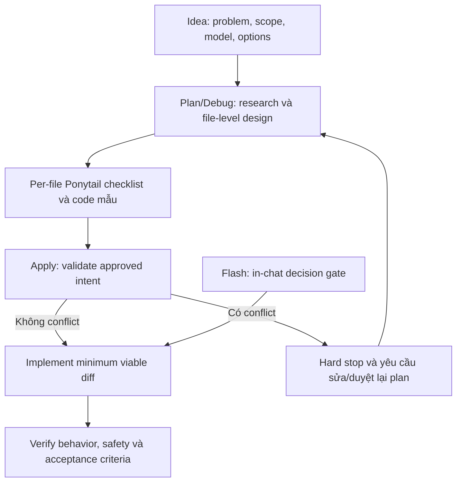

# Concept: Tích hợp Ponytail vào lifecycle workflows

## 1. Problem & Goal (Vấn đề & Mục tiêu)

### Problem (Vấn đề & Điểm nghẽn Hiện tại)
- **Bối cảnh & Điểm kích hoạt**: Các workflow `only-one-idea`, `only-one-plan`, `only-one-debug`, `only-one-apply` và `only-one-flash` điều phối từ định nghĩa ý tưởng đến viết code.
- **Hiện tượng & Khiếm khuyết kỹ thuật**:
  - Agent có thể viết code mới dù codebase, stdlib, native platform hoặc dependency hiện hữu đã hỗ trợ.
  - `concept.md` có nguy cơ chứa implementation hoặc code mẫu quá sớm.
  - `plan.md` và `debug.md` chưa chứng minh quyết định reuse hay viết mới theo từng file.
  - `/only-one-apply` có thể tự diễn giải lại approved plan khi thấy thiết kế over-engineered.
  - `/only-one-flash` không có plan trên disk nên thiếu gate tối giản trước khi viết code.
- **Root Cause**: Chưa có shared decision policy nhất quán theo lifecycle stage; trách nhiệm giữa concept, planning và execution chưa tách rõ.
- **Impact / Blast Radius**: Diff lớn, duplicate logic, abstraction/dependency dư, tài liệu khó audit, tăng token/cost/time và rủi ro implementation lệch plan.

### Goal (Mục tiêu Kỹ thuật Cần đạt)
- **Mục tiêu cốt lõi**: Tích hợp Ponytail theo kiến trúc **Hybrid**: shared skill giữ decision ladder và safety invariants; từng workflow định nghĩa stage-specific behavior.
- **Acceptance Criteria**:
  - `only-one-idea` chỉ mô tả problem, goal, scope, domain model, solution options, core mechanism và risks; không chứa source code, pseudocode, unified diff hoặc file-level implementation.
  - `only-one-plan` và `only-one-debug` tập trung code mẫu chuẩn, file-level changes và quyết định Ponytail.
  - Mỗi file `[MODIFY]`, `[NEW]`, `[DELETE]` trong `plan.md` hoặc `debug.md` có checklist ngay cạnh mô tả code.
  - File source/config/docs dùng checklist đầy đủ; file test dùng checklist rút gọn về reuse fixture/helper, tránh duplicate setup và chỉ bảo vệ behavior thay đổi.
  - Mỗi checklist có `Decision` và `Rejected alternative`, dựa trên codebase research.
  - `only-one-apply` xem approved plan là source of truth; shared skill chỉ làm rõ khoảng trống không đổi intent.
  - Khi plan, code mẫu, checklist hoặc implementation dự kiến xung đột Ponytail policy, `only-one-apply` dừng trước khi sửa code và yêu cầu sửa hoặc duyệt lại plan.
  - `only-one-flash` chạy Ponytail decision ladder trực tiếp trước và trong khi viết code.
  - Không cắt validation, correctness, error handling, security, accessibility, data-loss protection hoặc test cần thiết để giảm LOC.

## 2. Scope Boundaries (Ranh giới Phạm vi)

### In-Scope
- Tạo shared Ponytail skill/policy cho năm workflow.
- Áp dụng decision ladder:
  1. Thay đổi có cần tồn tại không?
  2. Codebase đã có implementation phù hợp không?
  3. Stdlib xử lý được không?
  4. Native platform/framework API xử lý được không?
  5. Dependency hiện có xử lý được không?
  6. Có thể sửa nhỏ trên code hiện hữu không?
  7. Chỉ sau đó mới viết lượng code mới tối thiểu.
- Điều chỉnh contract và template output của năm workflow.
- Bổ sung per-file Ponytail checklist và test-specific checklist.
- Bổ sung Apply Conflict Gate với hard stop và explicit approval.
- Đồng bộ assets/templates liên quan để generated workflows không drift.

### Explicit Out-of-Scope
- Không sửa source code sản phẩm của consumer repositories.
- Không biến mục tiêu thành code golf.
- Không tự động refactor toàn codebase.
- Không thay thế security review, architecture review, acceptance criteria hoặc verification.
- Không cho `/only-one-apply` tự sửa approved plan hay chọn thiết kế khác.
- Không đưa code mẫu trở lại `concept.md`.
- Không tạo abstraction mới chỉ để vận hành policy nếu customization system đã hỗ trợ skill reference.

## 3. Proposed Solution & Core Mechanism (Giải pháp Đề xuất & Cơ chế)

### Các phương án đã đánh giá

| Phương án | Cơ chế | Ưu điểm | Nhược điểm | Kết luận |
|---|---|---|---|---|
| A — Shared policy | Một policy dùng chung | Ít duplication | Thiếu stage-specific guidance | Không chọn |
| B — Inline | Nhúng toàn policy vào từng workflow | Tự chứa | Duplicate, dễ drift | Không chọn |
| **C — Hybrid** | Shared skill giữ invariants; workflow giữ stage gate | Reuse tốt, rõ trách nhiệm | Cần conflict precedence | **Đã chọn** |

### Shared Ponytail Skill
Shared skill cung cấp:
- Decision ladder dùng chung.
- Quy tắc reuse trước viết mới.
- Điều kiện hợp lệ để không reuse: sai domain semantics, không đáp ứng requirement, correctness/security issue, coupling xấu hơn, hoặc sửa code cũ tốn hơn giải pháp mới tối thiểu.
- Safety invariants không được tối giản.
- Checklist templates cho production files và test files.
- Conflict semantics nhất quán.

Shared skill là policy; workflow vẫn sở hữu lifecycle, artifact và approval gate.

### Stage-Specific Behavior

#### `only-one-idea`
- Tập trung problem, business goal, scope, domain model, solution options, trade-offs và risks.
- Cho phép conceptual flow hoặc domain/state model khi cần.
- Cấm source code, pseudocode, unified diff, symbol-level design và file-level implementation.
- Dùng Ponytail để loại scope, feature và abstraction chưa cần; không rút ngắn discovery.

#### `only-one-plan`
- Research codebase trước khi chọn giải pháp.
- Áp dụng ladder vào Detailed Design, Task Matrix và code samples/unified diffs.
- Mỗi file có mô tả code và checklist.
- Code mẫu bám symbol/pattern thật, thể hiện minimum viable diff, không phát minh API.

#### `only-one-debug`
- Root Cause Analysis vẫn dựa trên evidence.
- Patch blueprint và code mẫu dùng per-file checklist như plan.
- Chọn fix nhỏ nhất xử lý root cause; tránh speculative hardening ngoài blast radius.

#### `only-one-apply`
- Approved plan/debug là source of truth.
- Shared skill chỉ hỗ trợ chi tiết chưa rõ khi lựa chọn không đổi intent, acceptance criteria hoặc architecture.
- Không tự tối giản plan nếu làm khác code mẫu/thiết kế đã duyệt.
- Chạy Apply Conflict Gate trước khi sửa file liên quan.

#### `only-one-flash`
- Chạy decision ladder trực tiếp trước khi edit.
- In-chat plan nêu reuse target hoặc lý do viết mới.
- Giữ confirmation gate và verification hiện hữu.

### Per-File Checklist Contract

#### Production/config/documentation file

```markdown
#### [MODIFY] path/to/file

**Code changes**
- <Mô tả thay đổi và symbol/pattern sẽ reuse>.

**Ponytail checklist**
- [x] Thay đổi cần thiết cho acceptance criteria.
- [x] Đã tìm implementation hiện hữu có thể reuse.
- [x] Đã xét stdlib, native platform/framework và dependency hiện có.
- [x] Ưu tiên sửa code hiện hữu thay vì tạo abstraction mới.
- [x] Không duplicate logic hoặc thêm extension point giả định.
- [x] Diff tối thiểu vẫn bảo toàn correctness và safety.
- **Decision**: <Reuse gì hoặc vì sao phải viết mới>.
- **Rejected alternative**: <Phương án over-engineered đã loại bỏ và lý do>.
```

Checklist thích ứng operation. `[DELETE]` chứng minh file không còn consumer/contract cần giữ; `[NEW]` chứng minh không có implementation phù hợp và file mới có nhu cầu thực tế.

#### Test file

```markdown
#### [MODIFY] path/to/file.spec.ts

**Test changes**
- <Behavior/regression được bảo vệ>.

**Test checklist**
- [x] Đã tìm và reuse fixture/helper/test pattern hiện có.
- [x] Không duplicate test setup.
- [x] Chỉ thêm hoặc sửa case bảo vệ behavior thay đổi.
- [x] Không thêm test dependency nếu toolchain hiện có đáp ứng được.
- **Decision**: <Mở rộng suite nào hoặc vì sao cần file test mới>.
- **Rejected alternative**: <Test abstraction/setup dư thừa đã loại bỏ>.
```

### Apply Conflict Gate

Conflict gồm:
- Code mẫu không khớp `Decision` trong checklist.
- Plan yêu cầu dependency/abstraction mới dù có implementation phù hợp để reuse.
- Implementation cần làm khác architecture, acceptance criteria hoặc file-level intent đã duyệt.
- Plan thiếu thông tin đến mức agent phải tự quyết định thiết kế quan trọng.
- Tuân thủ plan gây duplicate logic, correctness/security issue hoặc vi phạm safety invariant.

Khi phát hiện conflict, `/only-one-apply` phải:
1. Xác định task và file bị ảnh hưởng.
2. Nêu policy/checklist bị vi phạm.
3. Trích thiết kế hoặc code mẫu gây conflict.
4. Đề xuất phương án tối giản và ảnh hưởng tới acceptance criteria.
5. Không sửa file source thuộc conflict.
6. Dừng execution để tránh partial implementation không nhất quán.
7. Yêu cầu sửa plan hoặc explicit approval cho plan cập nhật.
8. Chỉ tiếp tục sau khi plan mới được duyệt.

### Workflow / Logic Flow



## 4. Critical Risks & Edge Cases (Rủi ro & Kịch bản Biên)
- **Checklist theater**: Agent tick không evidence. Bắt buộc `Decision`, `Rejected alternative` và symbol/pattern thật.
- **Documentation bloat**: Checklist lặp. Dùng template ngắn theo file và biến thể riêng cho test.
- **Stale plan**: Codebase đổi sau approval. `/only-one-apply` kích hoạt Conflict Gate.
- **Partial apply**: Conflict xuất hiện giữa execution. Dừng, báo file đã đổi, không chạy task phụ thuộc.
- **False reuse**: Code giống hình thức nhưng khác domain semantics. Correctness và semantic fit thắng reuse.
- **Premature abstraction**: Nhiều call site chưa đủ nếu semantics có thể diverge. Đánh giá shared behavior thực tế.
- **Safety regression**: Safety invariants có precedence cao hơn minimization.
- **Workflow drift**: Asset workflow và generated workflow có thể lệch. Implementation plan phải xác định source of truth.
- **Rule conflict**: Approved plan và Ponytail xung đột phải qua human decision.

## 5. Definition of Done
- Có shared Ponytail skill/policy làm source of truth.
- Năm workflow tham chiếu policy và định nghĩa đúng stage responsibility.
- `concept.md` template không còn code-level sections.
- `plan.md`/`debug.md` bắt buộc checklist theo file, gồm biến thể cho test.
- `/only-one-apply` có deterministic Conflict Gate và hard stop.
- `/only-one-flash` có in-chat decision gate.
- Assets/templates và installed workflow representations được kiểm tra chống drift.
- Verification giữ lifecycle gates, security, correctness, accessibility và acceptance criteria.
