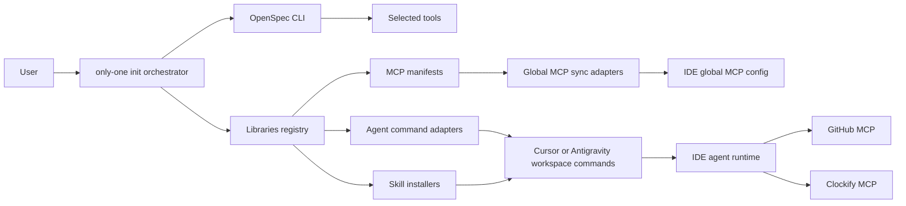

## Context

`only-one init` hiện là orchestrator gọi OpenSpec theo ADR 0001, sau đó đồng bộ custom skills theo tools trong `.openspec.yaml`. Thay đổi mới phải giữ boundary này: OpenSpec tiếp tục sở hữu tool selection, còn `only-one` bổ sung agent workflows, custom skills và MCP global config cho Cursor/Antigravity.

Hai workflow chạy trong IDE agent, không phải Node subcommands gọi MCP trực tiếp. CLI chỉ cài artifacts và config. Secret luôn là placeholder để user sửa thủ công.

Diagram dùng lightweight C4-inspired container view bằng Mermaid. Boundary chính: CLI cài đặt; IDE agent thực thi; MCP servers tích hợp external systems.

## Goals / Non-Goals

**Goals:**
- Cài command `pr-git` và `clockify` theo adapter IDE, mỗi command ủy quyền nghiệp vụ cho skill tương ứng.
- Giữ `SKILL.md` ngắn, tách template và validation/recovery rules sang `references/`.
- Discover MCP manifests riêng lẻ và merge MCP mới vào global config Cursor/Antigravity.
- Không ghi đè MCP đã tồn tại; không thu thập hoặc log secret.
- Cung cấp preview, confirmation, dry validation và failure recovery cho mutation GitHub/Clockify.
- Giữ transaction guarantees hiện có khi ghi nhiều global config files.

**Non-Goals:**
- Node CLI trực tiếp gọi GitHub hoặc Clockify MCP.
- MCP global sync cho IDE ngoài Cursor và Antigravity.
- Tự commit, push, checkout hoặc tạo Git branch.
- Tự điền secret, tự sửa MCP đã tồn tại hoặc cài MCP theo workspace.
- Thêm `--workspace` cho Clockify trong phiên bản đầu.

## Decisions

### 1. Giữ init là orchestrator

`only-one init` tiếp tục lấy tool selection từ OpenSpec rồi thêm MCP selection/dependency handling. Cách này tuân thủ ADR 0001 và tránh tái tạo tool-selection framework. Alternative bị loại: khôi phục custom tool wizard hoàn chỉnh trong `only-one` vì tạo hai nguồn sự thật.

### 2. Command mỏng, skill sở hữu workflow

Command source chỉ khai báo options/input contract và yêu cầu agent tải skill. `ak-pr-git` và `ak-clockify` sở hữu validation, preview, confirmation, MCP sequence và error reporting. Alternative bị loại: nhúng toàn bộ prompt vào command vì lặp nội dung trên adapters và khó test/bảo trì.

### 3. Progressive disclosure cho hai skill

Mỗi `SKILL.md` giữ trigger, input contract, ordered workflow và guardrails. `ak-pr-git/references/pr-template.md` giữ template body. `ak-clockify/references/task-format.md` và `validation-rules.md` giữ grammar, scheduling, replacement và recovery. Agent chỉ đọc reference khi tới bước liên quan, giảm context và drift.

### 4. MCP manifest độc lập, adapter global riêng

`libraries/mcps/<id>.json` chứa một server definition. Registry validate JSON, ID và shape. Cursor/Antigravity adapters sở hữu global path theo OS và root schema. Alternative bị loại: một file tổng hợp vì làm selection, ownership và validation khó hơn.

### 5. Merge theo add-only server ID

Nếu server ID đã tồn tại, sync bỏ qua toàn bộ definition. Nếu chưa có, thêm manifest nguyên vẹn với secret placeholder rỗng. Không có force overwrite. Cách này bảo vệ secret/config thủ công. Unrelated fields và unselected servers luôn được giữ.

### 6. Transaction sync tổng quát

Tách hoặc mở rộng transaction primitive hiện có để journal, backup, atomic write, rollback và recovery áp dụng cho global MCP files. Journal ghi trước mutation đầu tiên; commit sau mọi IDE thành công.

### 7. PR safety contract

`pr-git` yêu cầu clean working tree, source đã push, source khác base và có diff. Skill tạo English body, Vietnamese chat summary, kiểm tra PR trùng, rồi yêu cầu xác nhận trước create/update. Existing PR không bị duplicate; user chọn update hoặc giữ nguyên.

### 8. Clockify deterministic planning

`--date DD/MM/YYYY` và `--project` bắt buộc; `--tasks-per-day` mặc định 2; `--validate` là no-mutation mode. Mỗi dòng có grammar `[Label] Description | start-endh`; phần trước `|` là exact description, phần sau xác định slot. Task được phân tuần tự từ ngày bắt đầu, tự chuyển weekend sang Monday. Replacement match chính xác `workspace/project + date + slot`; create failure kích hoạt restore entry cũ và dừng batch.

## Risks / Trade-offs

- [IDE MCP paths/schema thay đổi] -> Cô lập trong adapters, fixture-test từng OS/IDE và fail unsupported thay vì đoán.
- [Placeholder rỗng khiến MCP chưa chạy] -> Summary/doc liệt kê file và env keys user phải điền; skill preflight phát hiện config thiếu.
- [Agent runtime khác nhau hiểu workflow khác nhau] -> Command ngắn, explicit ordered steps, reference contracts và adapter snapshot tests.
- [Clockify API không hỗ trợ atomic replace] -> Snapshot entry cũ, replace tuần tự, restore ngay khi create lỗi, dừng batch và báo partial state.
- [Global config mutation ảnh hưởng mọi project] -> Add-only merge, confirmation summary, backup/journal và rollback.
- [Nhiều workspace có project trùng tên] -> Prompt chọn workspace; non-interactive mode dừng và liệt kê candidates.

## Migration Plan

1. Thêm manifests, command sources, skills/references và adapters mà chưa đổi default init behavior.
2. Thêm registry validation và unit fixtures.
3. Thêm MCP selection vào init và `init mcp`; giữ OpenSpec tool selection theo ADR 0001.
4. Chạy tests trên temporary global config fixtures cho Cursor/Antigravity macOS/Windows.
5. Cập nhật docs và release.
6. Rollback bằng cách gỡ bước MCP khỏi init; transaction phục hồi file đang ghi dở. MCP entries đã commit là add-only và có thể được user xóa thủ công nếu cần.

## Open Questions

Không còn câu hỏi thiết kế đang mở. ADR 0001 vẫn còn hiệu lực và không cần supersede.
