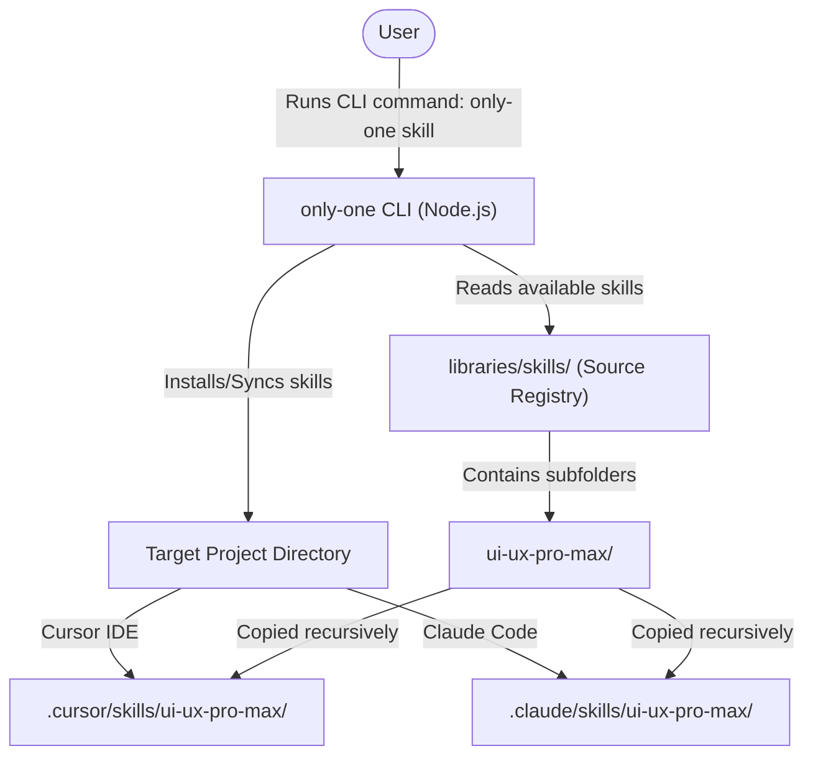

## Context

The user wants to add the `ui-ux-pro-max` skill from the repository `https://github.com/nextlevelbuilder/ui-ux-pro-max-skill` to the `libraries/skills` directory of `only-one-cli`.
This skill contains:
- `SKILL.md` (metadata and instructions)
- `data/` (searchable design database)
- `references/` (design quick references and pro rules)
- `scripts/` (python script for executing design database searches)

These resources are designed to be installed/synced into the developer's agent folders (e.g., `.cursor`, `.claude`) so that AI coding assistants can query UI/UX rules.

### Container Architecture Diagram

## Goals / Non-Goals

**Goals:**
- Copy all files and folders of `ui-ux-pro-max` from the cloned repository to `libraries/skills/ui-ux-pro-max`.
- Verify that `only-one-cli` recognizes `ui-ux-pro-max` as an available skill.
- Ensure the CLI can copy/sync the full folder recursively (not just the `SKILL.md` file) to target project directories.

**Non-Goals:**
- Generating a custom CLI command wrapper for `ui-ux-pro-max` (unlike `ak-pr-git` and `ak-clockify` which have dynamic command generation).
- Modifying how `only-one skill` command itself copies files.

## Decisions

### Decision 1: Direct Recursive Copy of Cloned Skill Folder
Instead of manually recreating the skill layout, we copy the entire folder structure of `ui-ux-pro-max` from `.claude/skills/ui-ux-pro-max` of the cloned repo.
- *Rationale*: Reusing the structure exactly ensures all references and databases are intact.
- *Alternatives considered*: Selective copy of only `SKILL.md` and `references/`. Rejected because the python search scripts and databases are key parts of the UI/UX auditing capability.

## Risks / Trade-offs

- **[Risk]** Larger package/repository size due to local database files in `data/`.
  - *Mitigation*: The size of the database files is small (~few hundred KB) and fits well within a CLI distribution.

## Migration Plan

Not applicable; no database migrations or breaking config changes are introduced.

## Open Questions

None.
